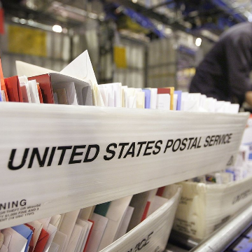

Man Allegedly Used Change Of Address Form To Move UPS Headquarters To His Apartment

Man Allegedly Used Change Of Address Form To Move UPS Headquarters To His Apartment

https://www.npr.org/sections/thetwo-way/2018/05/10/610102872/man-allegedly-used-change-of-address-form-to-move-ups-headquarters-to-his-apartm

Prosecutors say he received thousands of pieces of mail intended for the company, including checks and corporate credit cards. He is now facing federal charges.