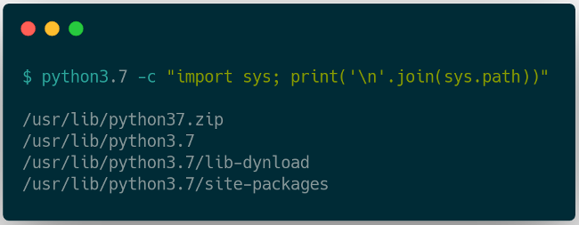
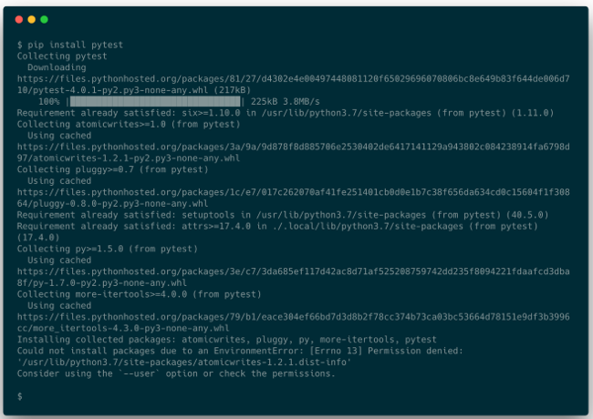
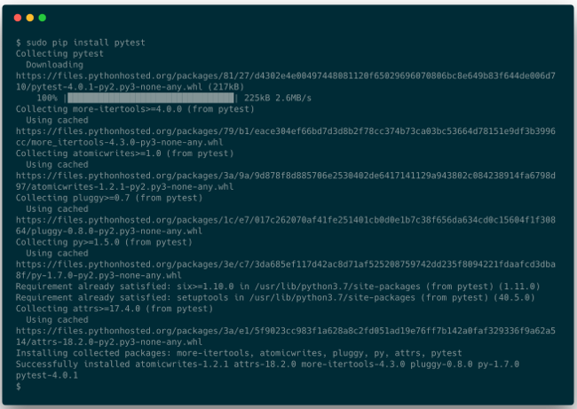
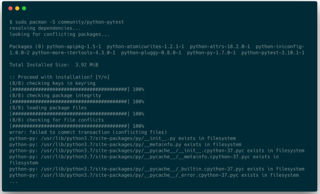
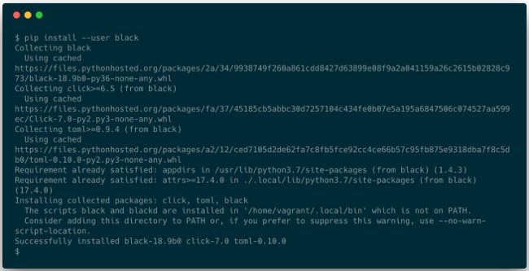
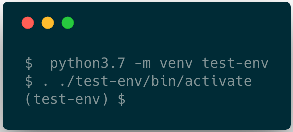
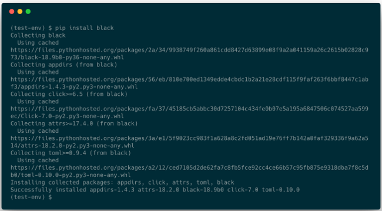
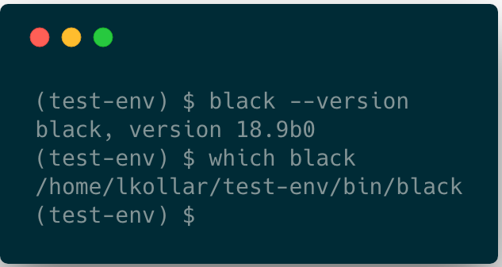

Managing Python packages the right way

# Managing Python packages the right way

## Don't fall victim to the perils of Python package management.

| 04 Apr 2019 | [László Kiss Kollár](https://opensource.com/users/lkollar) [Feed](https://opensource.com/user/276106/feed) |

33

[up](https://opensource.com/article/19/4/managing-python-packages?rate=ARDB982t55jb9OcJPDwtdWRPZ7TXnh-bii3le5n2Q-g)

| [11 comments](https://opensource.com/article/19/4/managing-python-packages#comments) |

Image credits :
Jason van Gumster. CC BY-SA 4.0
.

The Python Package Index (PyPI) indexes an amazing array of libraries and applications covering every use case imaginable. However, when it comes to installing and using these packages, newcomers often find themselves running into issues with missing permissions, incompatible library dependencies, and installations that break in surprising ways.

More Python Resources

- [What is Python?](https://opensource.com/resources/python?intcmp=7016000000127cYAAQ)
- [Top Python IDEs](https://opensource.com/resources/python/ides?intcmp=7016000000127cYAAQ)
- [Top Python GUI frameworks](https://opensource.com/resources/python/gui-frameworks?intcmp=7016000000127cYAAQ)
- [Latest Python content](https://opensource.com/tags/python?intcmp=7016000000127cYAAQ)
- [More developer resources](https://developers.redhat.com/?intcmp=7016000000127cYAAQ)

The Zen of Python states: "There should be one—and preferably only one—obvious way to do it." This is certainly not always the case when it comes to installing Python packages. However, there are some tools and methods that can be considered best practices. Knowing these can help you pick the right tool for the right situation.

## Installing applications system-wide

**pip** is the de facto package manager in the Python world. It can install packages from many sources, but [PyPI](https://pypi.org/) is the primary package source where it's used. When installing packages, **pip** will first resolve the dependencies, check if they are already installed on the system, and, if not, install them. Once all dependencies have been satisfied, it proceeds to install the requested package(s). This all happens globally, by default, installing everything onto the machine in a single, operating system-dependent location.

Python 3.7 looks for packages on an Arch Linux system in the following locations:

## [pythonpackagemanagement_1.png](https://opensource.com/file/428396)

 

One problem with global installations is that only a single version of a package can be installed at one time for a given Python interpreter. This can cause issues when a package is a dependency of multiple libraries or applications, but they require different versions of this dependency. Even if things seem to be working fine, it is possible that upgrading the dependency (even accidentally while installing another package) will break these applications or libraries in the future.

Another potential issue is that most Unix-like distributions manage Python packages with the built-in package manager (**yum**, **apt**, **pacman**, **brew**, etc.), and some of these tools install into a non-user-writeable location.

## [pythonpackagemanagement_2.png](https://opensource.com/file/428401)

 

This fails because we are running **pip install** as a non-root user and we don't have write permission to the **site-packages** directory.

What if we try this as root?

## [pythonpackagemanagement_3.png](https://opensource.com/file/428406)

 

It worked!

However, one problem is that we just installed a bunch of Python packages into a location the Linux distribution's package manager owns, making its internal database and the installation inconsistent. This will likely cause issues anytime we try to install, upgrade, or remove any of these dependencies using the package manager.

As an example, let's try to install **pytest** again, but now using **pacman**:

## [pythonpackagemanagement_4.png](https://opensource.com/file/428411)

 

It could just as well have been one of the dependencies of **pytest** like **py**. The installation would have failed the same way.

Another potential issue is that the operating system (OS) can use Python for system tools and we can easily break these by modifying Python packages outside the system package manager. This can result in an inoperable system, where restoring from a backup or a complete reinstallation is the only way to fix it.

## sudo pip install: A bad idea

There is another reason why running **pip install** as root is a bad idea. To explain this, we first have to look at how Python libraries and applications are packaged.

Most Python libraries and applications today use **setuptools** as their build system. **setuptools** requires a **setup.py** file in the root of the project, which describes package metadata and can contain arbitrary Python code to customize the build process. When a package is installed from the source distribution, this file is executed to perform the installation and execute tasks like inspecting the system, building the package, etc.

Executing **setup.py** with root permissions means we can effectively open up the system to malicious code or bugs. This is a lot more likely than you might think. For example, in 2017, several [packages were uploaded to PyPI](https://github.com/pypa/warehouse/issues/3948) with names resembling popular Python libraries. The uploaded code collected system and user information and uploaded it to a remote server. These packages were pulled shortly thereafter. However, these kinds of "typo-squatting" incidents can happen anytime since anyone can upload packages to PyPI and there is no review process to make sure the code doesn't do any harm.

The Python Software Foundation (PSF) recently announced that, thanks to a monetary gift from Facebook, it will sponsor work to [improve the security of PyPI](http://pyfound.blogspot.com/2018/12/upcoming-pypi-improvements-for-2019.html). This should make it more difficult to carry out attacks such as "[pytosquatting](https://pytosquatting.overtag.dk/)" and hopefully make this less of an issue in the future.

Security issues aside, **sudo pip install** won't solve all the dependency problems: you can still install only a single version of any given library, which means it's still easy to break applications this way.

Let's look at some better alternatives.

## OS package managers

It is very likely that the "native" package manager we use on our OS of choice can also install Python packages. The question is: should we use **pip**, or **apt**, **yum**, **pacman**, etc.?

The answer is: *it depends*.

**pip** is generally used to install packages directly from PyPI, and Python package authors usually upload their packages there. However, most package maintainers will not use PyPI, but instead take the source code from the source distribution (**sdist**) created by the author or a version control system (e.g., GitHub), apply patches if needed, and test and release the package for their respective platforms. Compared to the PyPI distribution model, this has pros and cons:

- Software maintained by native package managers is generally more stable and usually works better on the given platform (although this might not always be the case).
- This also means it takes extra work to package and test upstream Python code:

    1. The package selection is usually much smaller than what PyPI offers.

    2. Updates are slower and package managers will often ship much older versions.

If the package we want to use is available and we don't mind slightly older versions, the package manager offers a convenient and safe way to install Python packages. And, since these packages install system-wide, they are available to all users on the system. This also means that we can use them only if we have the required permissions to install packages on the system.

If we want to use something that is not available in the package manager's selection or is too old, or we simply don't have the necessary permissions to install packages, we can use **pip** instead.

## User scheme installations

**pip** supports the "user scheme" mode introduced in Python 2.6. This allows for packages to be installed into a user-owned location. On Linux, this is typically **~/.local**. Putting **~/.local/bin/** on our **PATH** will make it possible to have Python tools and scripts available at our fingertips and manage them without root privileges.

## [pythonpackagemanagement_5.png](https://opensource.com/file/428416)

 

However, this solution does not solve the issue if and when we need different versions of the same package.

## Enter virtual environments

Virtual environments offer isolated Python package installations that can coexist independently on the same system. This offers the same benefits as user scheme installations, but it also allows the creation of self-contained Python installations where an application does not share dependencies with any other application. **Virtualenv** creates a directory that holds a self-contained Python installation, including the Python binary and essential tools for package management: **setuptools**, **pip**, and **wheel**.

## Creating virtual environments

**virtualenv** is a third-party package, but Python 3.3 added the **venv** package to the standard library. As a result, we don't have to install anything to use virtual environments in modern versions of Python. We can simply use **python3.7 -m venv <env_name>** to create a new virtual environment.

After creating a new virtual environment, we must activate it by sourcing the **activate** script in the **bin** directory of the newly created environment. The activation script creates a new subshell and adds the **bin** directory to the **PATH** environment variable, enabling us to run binaries and scripts from this location. This means that this subshell will use **python**, **pip**, or any other tool installed in this location instead of the ones installed globally on the system.

## [pythonpackagemanagement_6.png](https://opensource.com/file/428421)

 
Creating and activating a new environment under **test-env**.

After this, any command we execute will use the Python installation inside the virtual environment. Let's install some packages.

## [pythonpackagemanagement_7.png](https://opensource.com/file/428426)

 

We can use **black** inside the virtual environment without any manual changes to the environment variables like **PATH** or **PYTHONPATH**.

## [pythonpackagemanagement_8.png](https://opensource.com/file/428431)

 

When we are done with the virtual environment, we can simply deactivate it with the **deactivate** function.

## [pythonpackagemanagement_9.png](https://opensource.com/file/428436)

 

Virtual environments can also be used without the activation script. Scripts installed in a **venv** will have their shebang line rewritten to use the Python interpreter inside the virtual environment. This way, we can execute the script from anywhere on the system using the full path to the script.

## [pythonpackagemanagement_10.png](https://opensource.com/file/428441)

 

We can simply run **~/test-env/bin/black** from anywhere on the system and it will work just fine.

It can be useful to add certain commonly used virtual environments to the **PATH** environment variable so we can quickly and easily use the scripts in them without typing out the full path:

`export PATH=$PATH:~/test-env/bin`

Now when we execute **black**, it will be picked up from the virtual environment (unless it appears somewhere else earlier on the **PATH**). Add this line to your shell's initialization file (e.g., **~/.bashrc**) to have it automatically set in all new shells.

Virtual environments are very commonly used for Python development because each project gets its own environment where all library dependencies can be installed without interfering with the system installation.

I recommend checking out the [virtualenvwrapper](https://virtualenvwrapper.readthedocs.io/) project, which can help simplify common **virtualenv**-based workflows.

## What about Conda?

[Conda](https://conda.io/) is a package management tool that can install packages provided by Anaconda on the [repo.continuum.io](https://repo.continuum.io/) repository. It has become very popular, especially for data science. It offers an easy way to create and manage environments and install packages in them. One drawback compared to **pip** is that the package selection is much smaller.

## A recipe for successful package management

- Never run **sudo pip install**.
- If you want to make a package available to all users of the machine, you have the right permissions, and the package is available, then use your distribution's package manager (**apt**, **yum**, **pacman**, **brew**, etc.).
- If you don't have root permissions or the OS package manager doesn't have the package you need, use **pip install --user** and add the user installation directory to the **PATH** environment variable.
- If you want multiple versions of the same library to coexist, to do Python development, or just to isolate dependencies for any other reason, use virtual environments.

##  Topics :

[Python](https://opensource.com/tags/python)

## About the author

 László Kiss Kollár - László Kiss Kollár is a senior software engineer at Bloomberg, where he works on the Python Infrastructure team. He has close to 15 years of industry experience and has worked on a diverse set of projects, such as optimising code for vector processors, creating a distributed JVM, and generating automatically produced news content.

[• More about me](https://opensource.com/users/lkollar)

- [Learn how you can contribute](https://opensource.com/participate)

.

##  Recommended reading

 [ 100 ways to learn Python and R for data science](https://opensource.com/article/19/5/learn-python-r-data-science?utm_campaign=intrel)

 [ How to analyze log data with Python and Apache Spark](https://opensource.com/article/19/5/visualize-log-data-apache-spark?utm_campaign=intrel)

 [ How to wrangle log data with Python and Apache Spark](https://opensource.com/article/19/5/log-data-apache-spark?utm_campaign=intrel)

 [ Learn Python by teaching in your community](https://opensource.com/article/19/5/learn-python-teaching?utm_campaign=intrel)

 [ Check type annotations in Python with mypy](https://opensource.com/article/19/5/python-mypy?utm_campaign=intrel)

 [ Ensure consistency in your Python code with flake8](https://opensource.com/article/19/5/python-flake8?utm_campaign=intrel)

##  11 Comments

 

 [tj](https://opensource.com/users/tj) on 04 Apr 2019

Could you explain why you did not even mention pipenv?
https://opensource.com/article/18/2/why-python-devs-should-use-pipenv

- [reply](https://opensource.com/comment/reply/53166/174601)

Vote up!
 1

.

 

 [László Kiss Kollár](https://opensource.com/users/lkollar) on 07 Apr 2019

I wanted to focus on the basics of package management in this article and pipenv is more geared towards managing development environments.

- [reply](https://opensource.com/comment/reply/53166/174686)

Vote up!
 3

.

 

 [JJ](https://opensource.com/users/wavesailor) on 08 May 2019

Thanks for this article as it was long overdue. I struggled for such a long time with system libraries vs my libraries in Ubuntu. It was an absolute nightmare which no one seemed to explain.

However I would say that pipenv is what made this much easier for me.

Here is a good article on how to use pipenv: https://realpython.com/pipenv-guide/

- [reply](https://opensource.com/comment/reply/53166/176411)

Vote up!
 0

.

 

 Beat on 04 Apr 2019

Thank you so much for not endorsing the dumpster fire that is pipenv

- [reply](https://opensource.com/comment/reply/53166/174611)

Vote up!
 2

.

 

 Tyghe Vallard on 04 Apr 2019

Pretty awesome that python3.7 supports this now. I personally still would prefer miniconda simply because I can install some packages without requiring make, gcc,...

Also, conda does also come with pip so you can install packages not in the conda repository thus giving the best of both worlds.

- [reply](https://opensource.com/comment/reply/53166/174616)

Vote up!
 0

.

 

 SOURCEdefender on 05 Apr 2019

Hi,

We used pyenv[1] during the development of SOURCEdefender[2] as this enabled us to support all versions of Python on Linux, Windows, and macOS platforms. We even have it running on a Raspberry Pi too!

Also, using something like Dircmd[3] to automatically activate and deactivate a virtual environment as you enter or exit a venv folder is great too!

Thanks,
SOURCEdefender
---
1: https://github.com/pyenv/pyenv-installer
2: https://pypi.org/project/sourcedefender/
3: https://github.com/dircmd/dircmd

- [reply](https://opensource.com/comment/reply/53166/174621)

Vote up!
 0

.

 

 mortenb on 23 Apr 2019

pyenv on windows? please elaborate. Python on windows very soon turns into a mess because when python is upgraded the venvs have different base python. I recreate all venvs from requirements.txt after upgrade.

- [reply](https://opensource.com/comment/reply/53166/175656)

Vote up!
 0

.

 

 Fahmi on 06 Apr 2019

To simplify common venv-based workflows you can use venvtools.

Venvtools made managing development virtual environment easier via series of command.

venvtools command similarly like git command. You just press [tab] twice for commands action (create, list, remove, activate, deactivate, goto) and environments auto completion.

https://gitlab.com/Fahmi.Salleh/venvtools
https://gitlab.com/Fahmi.Salleh/venvtools/wikis/running

Disclaimer: I’m the author of venvtools. Please let me know for any bug or improvements suggestion.

- [reply](https://opensource.com/comment/reply/53166/174676)

Vote up!
 0

.

 

 [Armstrong](https://opensource.com/users/foundjem) on 23 Apr 2019

Interesting indeed! This article is helpful to understand diverse package managers, specifically for the python ecosystem.

Thanks for sharing

- [reply](https://opensource.com/comment/reply/53166/175671)

Vote up!
 0

.

 

 [Mahadi Xion](https://opensource.com/users/mhxion) on 24 Apr 2019

Select a particular version of a package/library to install inside an environment like this:

>> pip install =
i.e., pip install fuzzysearch=0.6.0

- [reply](https://opensource.com/comment/reply/53166/175716)

Vote up!
 0

.

 

 toushi68 on 25 Apr 2019

Why when I use pip to install a package, it will force the installed package (and associated packages) to call system libraries, while using conda, to install the same package, it can also check, and patch up if needed, the local installation?

- [reply](https://opensource.com/comment/reply/53166/175761)

Vote up!
 0

.

##  Comment now

 [Login or Register](https://opensource.com/user/login?destination=node/53166) to earn points for your comments.

 Your name *
 E-mail *
The content of this field is kept private and will not be shown publicly.

 Accept the [Terms of Use](https://opensource.com/legal) to continue. You are licensing your contribution(s) as CC-BY-SA. *

CAPTCHA

This question is for testing whether or not you are a human visitor and to prevent automated spam submissions.

 .