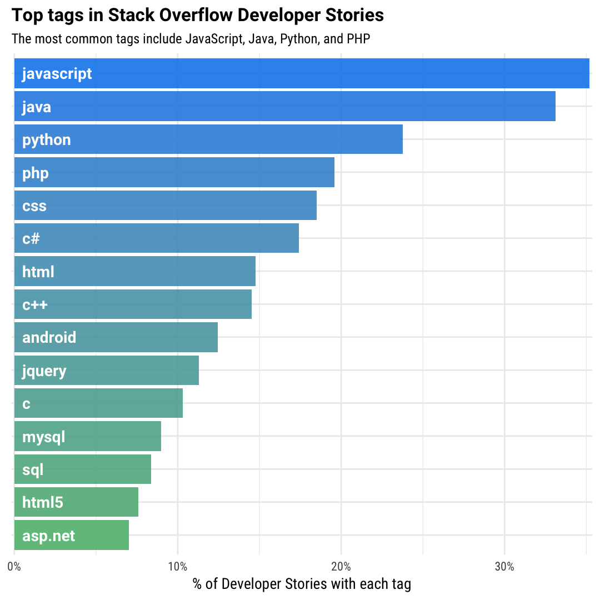
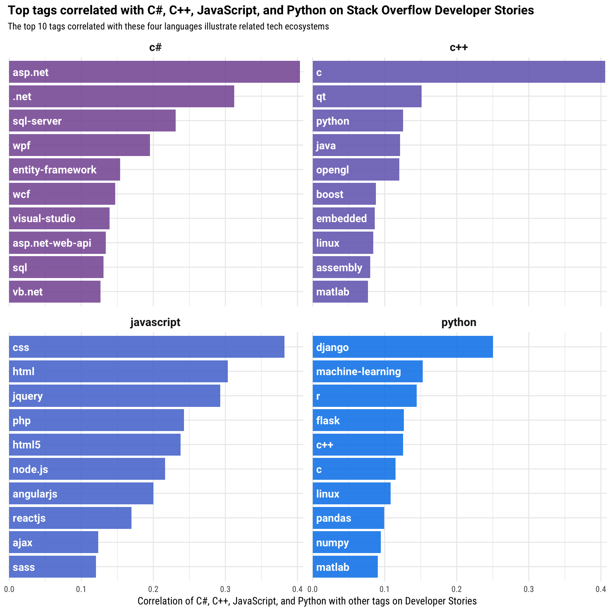

Mapping Ecosystems of Software Development - Stack Overflow Blog

# Mapping Ecosystems of Software Development

[(L)](https://stackoverflow.blog/authors/juliasilge/)by [Julia Silge](https://stackoverflow.blog/authors/juliasilge/) on October 3, 2017

 AddThis Sharing Buttons
[Share to Twitter]()[Share to LinkedIn184]()[Share to Facebook24]()

On the data team here at Stack Overflow, we spend a lot of time and energy thinking about tech ecosystems and how technologies are related to each other. We use these kinds of relationships all over the place, from making the user experience of everyone coming to Stack Overflow better by suggesting relevant content to helping our clients understand how to hire developers. One way to get at this idea of relationships between technologies is **tag correlations**. Correlation between tags measures how often tags appear together relative to how often they appear separately. You can check out [one of the chapters of my book](http://tidytextmining.com/ngrams.html#counting-and-correlating-pairs-of-words-with-the-widyr-package) (written with fellow Stack Overflow data scientist [Dave Robinson](https://stackoverflow.blog/authors/drobinson/)) for more detailed discussion of this.

## Together vs. Apart

We have a number of data sources that we could use to measure tag correlations. For instance, Matt Sherman, an engineering manager here at Stack Overflow, built a [tool that measures how often tags appear together on Stack Overflow questions](https://clipperhouse.github.io/stack-correlation/). We could also use our traffic data, and see how often users visit pairs of tags. For this analysis, I’m going to use a different data set, though; I’m going to use the “liked tags” on [Developer Stories](https://stackoverflow.com/users/story/join) here at Stack Overflow. If you haven’t made your own Developer Story or explored them, feel free to [check out mine](https://stackoverflow.com/story/juliasilge). Notice that I have some Stack Overflow tags that I’ve identified that I want to work with in my professional life; for me, it’s R, dplyr, ggplot2, Shiny, and so forth. You can tell from those tags that I have a specific set of skills and do a certain kind of work (if you’re familiar with those technologies, anyway). There is similar signal in other Developer Stories here on Stack Overflow, and we can use the distribution of these tags and how they are related to learn about how technologies are interrelated. The reason I like using Developer Stories for this kind of tag analysis is that it is high signal-to-noise. I am interested in how technologies are connected and how they are used together, and developers’ own descriptions of their work and careers is a great place to get that.

To start with here, we are just looking at which tags are used most often. We see the usual suspects here, some of the most common languages used by developers today.

Next, let’s count up co-occurrences of tags and find which tags are commonly used together. For example, what are the tags that occur most often with a few important languages like C#, C++, JavaScript, and Python on Developer Stories?

Notice that these are still many of the same common, important languages that we saw in the first plot. Languages like Java, C, and these four important languages are commonly used together by developers on their Developer Stories with these four languages, but they are just the most common technologies in general. To explore tag correlations, we want to ask a slightly different question. We want to find tags that are more likely to occur together than with other tags in this dataset. Which tags are most correlated with these four languages?

We see a different set of technologies now. These are tags that are more likely to be used by a developer on her or his Developer Story *with* these four languages than with other tags, and now we are using the aggregate data of developers here on Stack Overflow to gain insight into how technologies are used together. We see here, for example, [more evidence about how developers are using Python](https://stackoverflow.blog/2017/09/14/python-growing-quickly/) both for data science along with R (another language used for data science), Pandas, and NumPy, as well as for web development with Django and Flask. We are able to find these related technologies because we calculated tag correlations.

## Network of Correlations

We are not restricted to looking at one tag at a time. We can extend this correlation calculation to many more tags, and then build a network of tags based on how they are correlated with each other.

htmlcsshibernatespringrubyruby-on-railsiosswifthtml5cc++asp.netc#objective-cjavascriptjqueryreduxreactjsphpmysqlspring-mvc.netreact-nativespring-bootlesssasshadoopapache-sparksql-serverexpressnode.jsmongodbiphonegithubgitexcelexcel-vbaentity-frameworklinqwcfwpfandroidjavascalaajaxdjangopythonvbaxcodeapachenginxangularjsasp.net-web-apilaravelplsqloraclejsonxmlflaskwordpressjava-eemavenjspbashlinuxangular2typescriptcodeignitertddagiletwitter-bootstrapweb-servicesresttestingseleniumandroid-studioredisjenkinsdockeramazon-web-servicesangularosxmachine-learningqtwindowsubuntuionic-frameworkelasticsearchvue.jsrembeddedgovisual-studiopostgresqlsqlunixeclipsevb.netunity3ddevopsdrupalshellbootstrapxamarinazuremvchaskellapitwitter-bootstrap-3regexperlcloudphotoshoppowershellmatlab

In this interactive network visualization (you can zoom, scroll, and click), the size of each circle represents how often that tag is used; tags with larger circles are used more often. The circles are colored based on their subgroup membership within the network as a whole, which is calculated via [many random walks (a cluster walktrap)](https://stackoverflow.com/questions/9471906/what-are-the-differences-between-community-detection-algorithms-in-igraph/). This network includes tags that are used more than 800 times on Developer Stories and have correlations greater than 0.1 with other tags.

There is so much we can see by exploring this network! One thing we can notice is subgroups within the network that show us tech ecosystems, some of them densely interconnected. We see some groups made up of:

- Front-end web development technologies from HTML to JavaScript to Bootstrap
- Microsoft-related technologies including C#, .NET, and SQL Server
- DevOps technologies like AWS and Docker (Go is in this cluster!)
- Mobile technologies including Android and Objective-C

Where are the technologies that you use, and how are they connected? You can explore this network for yourself; the network data structure is publicly available as a [dataset at Kaggle](https://www.kaggle.com/stackoverflow/stack-overflow-tag-network/). You can check out the [Kaggle kernel I created](https://www.kaggle.com/juliasilge/network-graph/code) to show how to use the network nodes and links to create a network graph.

Another thing we can notice in this network is that some technologies act as bridges between tech ecosystems. Python, one of the most commonly used languages on Developer Stories, connects to the front-end cluster (through Django), to a Linux/systems administration cluster, to a C/C++/embedded cluster, and to R and machine learning. We see time and again [how unique a language Python is becoming](https://stackoverflow.blog/2017/09/06/incredible-growth-python/) in today’s technology landscape. Java, git, and JSON are other “bridge” technologies that connect parts of this network.

This analysis used the liked tags on Developer Stories to explore the rich, complex network of technologies that we work within. When developers share who we are as professionals in ways that we actually care about, like with the technologies we want to use, we can all learn more about the developer community. You can [make your own Developer Story today](https://stackoverflow.com/users/story/join) and highlight your career, interests, and what technologies you want to work with.

## Author

Julia Silge
Data Scientist

[Author Archives](https://stackoverflow.blog/authors/juliasilge/)[Website](http://juliasilge.com/)[Twitter](https://twitter.com/juliasilge)[Github](https://github.com/juliasilge)[Stack Overflow](http://stackoverflow.com/users/5468471/julia-silge)

## Tags

- [Announcements](https://stackoverflow.blog/tags/announcements/)
- [Bulletin](https://stackoverflow.blog/tags/bulletin/)
- [Insights](https://stackoverflow.blog/insights/)

## Related Articles

## [What are the Most Disliked Programming Languages?](https://stackoverflow.blog/2017/10/31/disliked-programming-languages/)

[(L)](https://stackoverflow.blog/authors/drobinson/)by [David Robinson](https://stackoverflow.blog/authors/drobinson/) on October 31, 2017

On Stack Overflow Jobs, you can create your own Developer Story to showcase your achievements and advance your career. One option you have when creating a Developer Story is to...

[Continue reading](https://stackoverflow.blog/2017/10/31/disliked-programming-languages/)

## [Podcast #120 – Halloween Spooktacular with Anil Slash](https://stackoverflow.blog/2017/10/30/podcast-120-halloween-spooktacular-anil-slash/)

[(L)](https://stackoverflow.blog/authors/jpardue/)by [Jess Pardue](https://stackoverflow.blog/authors/jpardue/) on October 30, 2017

Welcome to The Stack Overflow Podcast episode #120 recorded Thursday, October 26, 2017 at our Stack Overflow HQ in NYC. As a special treat (or is it a trick?) your...

[Continue reading](https://stackoverflow.blog/2017/10/30/podcast-120-halloween-spooktacular-anil-slash/)

## [From Power Calculations to P-Values: A/B Testing at Stack Overflow](https://stackoverflow.blog/2017/10/17/power-calculations-p-values-ab-testing-stack-overflow/)

[(L)](https://stackoverflow.blog/authors/juliasilge/)by [Julia Silge](https://stackoverflow.blog/authors/juliasilge/) on October 17, 2017

If you hang out on Meta Stack Overflow, you may have noticed news from time to time about A/B tests of various features here at Stack Overflow. We use A/B...

[Continue reading](https://stackoverflow.blog/2017/10/17/power-calculations-p-values-ab-testing-stack-overflow/)