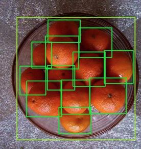
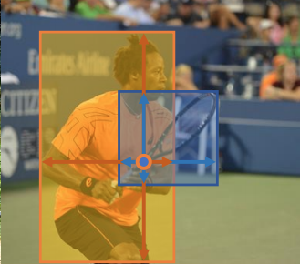
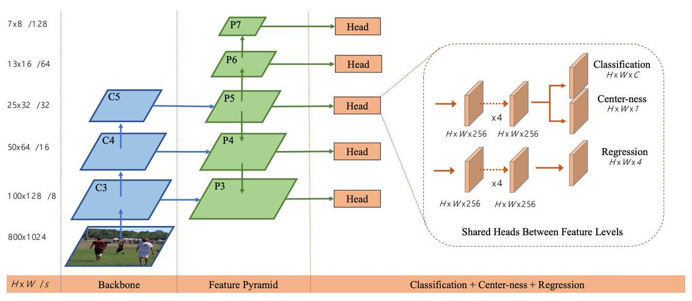
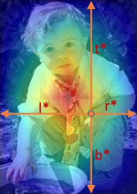
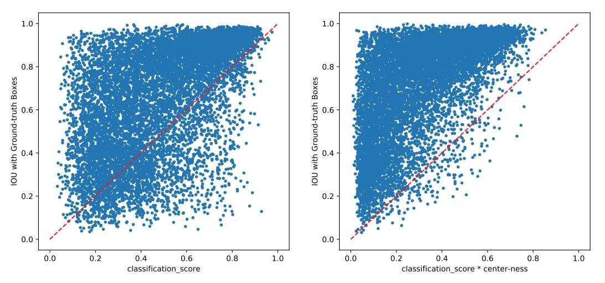
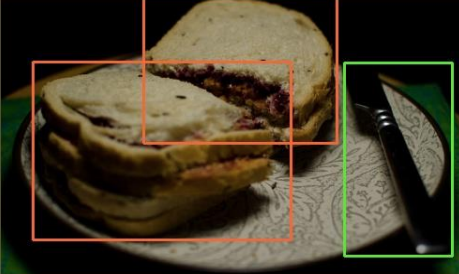
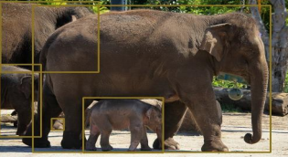
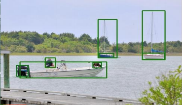
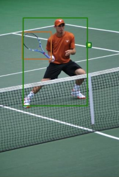

Martin Görner on Twitter

1.

 [    **Martin Görner**‏ @**martin_gorner**](https://twitter.com/martin_gorner)  ·  [Jul 12](https://twitter.com/martin_gorner/status/1149749548471877632)

Great summer read: FCOS (Fully Convolutional One-Stage object detection)[https://arxiv.org/abs/1904.01355 ](https://t.co/KveoUWk15x)Simpler than the already simple RetinaNet architecture, with a couple of neat tricks. Pic below from paper, probably cherry-picked  but still impressive. Every orange is boxed.

 

     4 replies          95 retweets          380 likes

2.

 [    **Martin Görner**‏ @**martin_gorner**](https://twitter.com/martin_gorner)  ·  [Jul 12](https://twitter.com/martin_gorner/status/1149760611519123457)

Neat trick #1: predicts a bounding box for every pixel directly. No more Anchor boxes, no more anchor box to ground truth pairing headaches. But, but, but, a single pixel can be in multiple bounding boxes. You canot predict a bounding box per pixel ?!? (see illust. from paper)

 

     1 reply          3 retweets          15 likes

3.

 [    **Martin Görner**‏ @**martin_gorner**](https://twitter.com/martin_gorner)  ·  [Jul 12](https://twitter.com/martin_gorner/status/1149761769969074176)

Neat trick #2: they specialize each level in the feature pyramid to predict only a given range of bounding box sizes. Now you can predict more than one box per pixel, as long as they have different sizes. Notice the five prediction heads in the architecture diagram from the paper

 

     1 reply          1 retweet          13 likes

4.

 [    **Martin Görner**‏ @**martin_gorner**](https://twitter.com/martin_gorner)  ·  [Jul 12](https://twitter.com/martin_gorner/status/1149762795228954624)

Neat trick #3: in addition to the boxes and classification score, there is an additional head predicting how close a pixel is to the center of an object.

 

     1 reply          1 retweet          12 likes

5.

 [    **Martin Görner**‏ @**martin_gorner**](https://twitter.com/martin_gorner)  ·  [Jul 12](https://twitter.com/martin_gorner/status/1149763504452198402)

This "center-ness" score is multiplied with the classification score in the loss to down-weight the usually low-quality predictions from pixels on the periphery of an object. The effect is clearly visible on this graph representing...

 

     2 replies          2 retweets          6 likes

 [    **Martin Görner**‏ @**martin_gorner**](https://twitter.com/martin_gorner)

A couple more pics from the paper (100% precision and recall on all pics, no cherry-picking, guaranteed ). Jokes aside, this is great.

 

 

 

 

   12:43 PM - 12 Jul 2019

- [**16** Likes]()

-               

     3 replies          0 retweets          16 likes

   Tweet text

Tweet your reply

1.
   New conversation
    1.

 [    **Martin Görner**‏ @**martin_gorner**](https://twitter.com/martin_gorner)  ·  [Jul 12](https://twitter.com/martin_gorner/status/1149768850184916992)

Quote from paper: "ResNet-50 is used as our backbone and the same hyper-parameters [as for] RetinaNet are used. [...] We argue that the performance of our detector can be improved further if the hyper-parameters are optimized for it." This was without hyper-parameter tuning ???

     4 replies          1 retweet          11 likes

    2.

 [    **Martin Görner**‏ @**martin_gorner**](https://twitter.com/martin_gorner)  ·  [Jul 12](https://twitter.com/martin_gorner/status/1149770799982583808)

Please grab a TPU pod and start hp-tuning! I am training a resnet50-based Retinanet in 20 min on a 128-core TPU-pod. With 20-min runs as well as multiple parallel runs on GCP's AI platform, there is a lot tuning that can be done. Disclosure: as most people know, I work for Google

     0 replies          0 retweets          9 likes

 End of conversation

2.
   New conversation
    1.

 [    **Karanbir Chahal**‏ @**karanchahal96**](https://twitter.com/karanchahal96)  ·  [Jul 12](https://twitter.com/karanchahal96/status/1149788555310485506)

Replying to [@**martin_gorner**](https://twitter.com/martin_gorner)

This makes me really excited, do you have open source code for this ?

     1 reply          0 retweets          0 likes

    2.

 [    **Martin Görner**‏ @**martin_gorner**](https://twitter.com/martin_gorner)  ·  [Jul 12](https://twitter.com/martin_gorner/status/1149791544410402816)

Yes, the paper has a link.

     0 replies          0 retweets          0 likes

 End of conversation

3.
   New conversation
    1.

 [    **Srishti  ‍**‏ @**_srishtiyadav**](https://twitter.com/_srishtiyadav)  ·  [Jul 12](https://twitter.com/_srishtiyadav/status/1149769922265808896)

Replying to [@**martin_gorner**](https://twitter.com/martin_gorner)

Yet to read the paper in detail but is it rotation invariant?

     1 reply          0 retweets          0 likes

    2.

 [    **Martin Görner**‏ @**martin_gorner**](https://twitter.com/martin_gorner)  ·  [Jul 12](https://twitter.com/martin_gorner/status/1149772393197363200)

A detection network is rotation-invariant only if you train it to be, by having different rotations of the same obj. in the training dataset. For a better approach, see Geof Hinton's capsule networks, designed specifically to address this shortcoming. See

     1 reply          0 retweets          0 likes

    3.

 [    **Srishti  ‍**‏ @**_srishtiyadav**](https://twitter.com/_srishtiyadav)  ·  [Jul 12](https://twitter.com/_srishtiyadav/status/1149774030406242304)

Interesting!

I always wondered why some of the popular CNNs : ResNet, Yolo, SSD etc. are not rotation invariant. I do occasionally blame the datasets too which usually don't have such training data, especially since it has significant usecase in arial images.

     0 replies          0 retweets          0 likes

 End of conversation

 