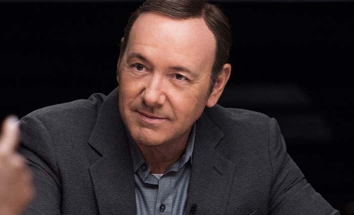
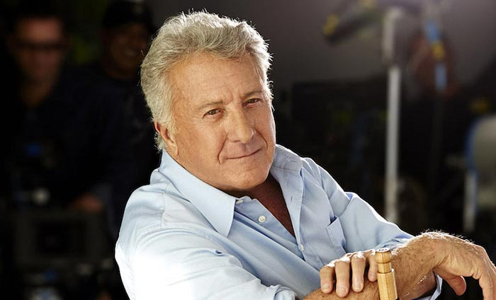
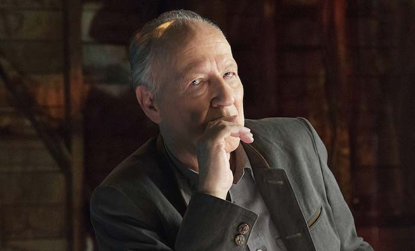
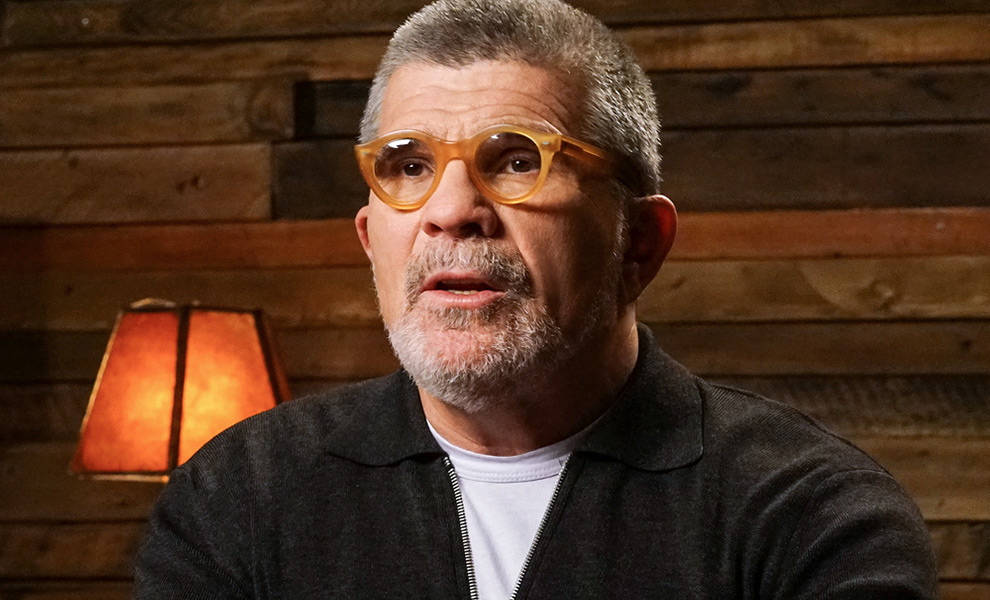
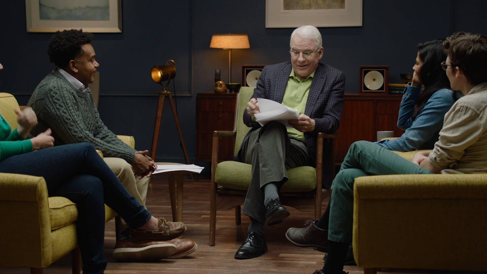

MasterClass | Steve Martin Teaches Comedy

[[Logo wordmark](../_resources/6766ca1312ba740dca006026dd3dd04a.bin)](https://www.masterclass.com/)

- [Log In](https://www.masterclass.com/classes/steve-martin-teaches-comedy#)
- [Watch the Trailer](https://www.masterclass.com/classes/steve-martin-teaches-comedy#)
- [Take the class](https://www.masterclass.com/classes/steve-martin-teaches-comedy#/cart?product_id=24)

-
-

[deadmau5-logo-cc6525d6067d4f0ef94356de2c369a26821995540fbbef6ece0d90f35473b092.svg](../_resources/80b280d607224aa7d5ed712c031400a4.bin)

# Steve Martin

## Teaches Comedy

-

### $90[Lifetime access](../_resources/eb57f0df54d450d325615615d570925c.bin)

    - [Take the class](https://www.masterclass.com/classes/steve-martin-teaches-comedy#/cart?product_id=24)
    - [Give as a Gift](https://www.masterclass.com/classes/steve-martin-teaches-comedy#/cart?product_id=24&gift=true)
- [icon](../_resources/4cad9ecb0e1af35fe11c86caae65eda8.bin)

### 100% EXCLUSIVE

Learn from the legendary comedian in his first-ever online class. Only available through MasterClass.

- [icon](../_resources/bcb3a3a8449c327d1d0cc7834feb1d94.bin)

### 25 Lessons

In 25 video lessons, Steve Martin teaches you everything from finding your comedic voice to nailing your act.

## A comedian walks into a classroom...

One of Steve’s first gigs was at the drive-in movies. When the audience liked a joke, they honked. In this class, Steve shares insights from performing for cars and humans over a 50-year career spanning sold-out arenas and blockbuster films. Learn how to find your voice, gather material, develop an act, and take your comedy to the next level.

[icon-door-dafb2e9872a48684f7ced3975a8473132694ae1366cfad35fbbcdf9039301473.svg](../_resources/e8158fd3a2a3c5c33072c5d4b9898d87.bin)

### 25 Video Lessons

Watch, listen, and learn as Steve Martin shares wisdom from his five decades in comedy.

[ssl-badgev2-328880646ecdefe24646eef7744bbf6eabbeed6dca18c043bd343a216e6420f9.svg](../_resources/efa017a19f255dd548e1be234ed6ad41.bin)

### CLASS WORKBOOK

A downloadable workbook accompanies the class with lesson recaps and supplemental materials.

[icn-play-button-7ba012291cbf0c5ef41a6809bf798ce99aed9a8f76de812b219817cbba41e472.svg](../_resources/f9a45c1878d29b70321ed641f752192a.bin)

### OFFICE HOURS

Upload videos to get feedback from the class. Steve will also critique select student work.

# Lesson Plan

- 01

## Introduction

Meet Steve. He's one of the most accomplished comedians of all time, an acclaimed writer, actor, and musician. And now, he's your instructor.

- 02

## Getting Started in Comedy

No talent? No problem. Steve shares some ways that anyone can jumpstart their comedic journey. He didn't let a lack of talent slow him down and thinks you shouldn't either.

- 03

## Gathering Material

Inspiration is all around you if you know where to look. Steve teaches you how to keep your eyes open and reveals some of the most abundant sources of comedic material.

-
[Show all 25 Lessons]()

    - 04

## Finding Your Comedic Voice

Figuring out what you have to say can be one of the most daunting tasks a comedian faces. Steve provides some effective techniques for identifying your own unique voice and channeling it into comedy.

    - 05

## Developing a Comedic Persona

It's not just what you say, it's how you say it. Steve explains how his own stage persona emerged and teaches you how to cultivate one that will take your material to the next level.

    - 06

## Jokes and Bits

There are a million ways to get someone to laugh. Steve refutes the myth that you need a punchline to be funny and analyzes a number of joke structures that you can use to keep them in stitches.

    - 07

## Delivery

The difference is in the delivery. Steve offers techniques for pacing, physicality, and timing to help you hone those jokes you've written for the stage.

    - 08

## Crafting Your Act

So you've got some jokes - now what? Steve reveals how you can turn your material into a stageworthy act.

    - 09

## Student Session: Workshopping Nalini's First Stand-Up Act

Steve sits down with a group of young comedians and gives Nalini hands-on guidance in the development of her very first stand up bit.

    - 10

## Student Session: Workshopping Tim's Act

Steve examines one of Tim's bits and illustrates how he can heighten the comedy, connect with the audience, and streamline his performance.

    - 11

## Opening and Closing Your Act

A strong opening and closing are the keys to a memorable act. Steve talks about the importance of these moments and shows you how to use them to your advantage.

    - 12

## Profanity and Morality

Steve discusses the questions that face every comedian when it comes to vulgarity and political correctness.

    - 13

## Growing as a Performer

Excellence in comedy requires practice just like everything else. Steve examines how to learn from your mistakes, refine your material, and ensure that you are ready to take the next step.

    - 14

## Nerves, Hecklers, and Bombing

Even Steve Martin has a bad show every now and then. But with his help, you can learn how to avoid common pitfalls, manage your stage fright, and make the most out of bombing.

    - 15

## A Life In the Arts

Failure, rivalry, bad reviews: being a comedian is hard. Steve teaches you how to roll with the punches and advocates for a life of being in the arts.

    - 16

## Creating Characters

Steve shares the processes he's used to create some of his most memorable characters and bring them to life on screen, based on his experience acting in over 50 films from Father of the Bride to Dirty Rotten Scoundrels.

    - 17

## Story Techniques

Steve doesn't let writer's block trip him up, and neither should you. He reveals the storytelling exercises he's employed to write classics like The Jerk and Bowfinger.

    - 18

## Screenwriting Case Study: Roxanne

Steve discusses his experience writing Roxanne, the inspirations behind some of its funniest scenes, and how he adapted a 19th century play into what became one of his most beloved films.

    - 19

## Editing

Steve believes that editing is one of a comedian's most powerful tools. In these lessons, he breaks down his own editing processes and illustrates how it can turn something good into something great.

    - 20

## Editing (cont'd)

With particular emphasis on the life of a written piece once it's in the hands of actors and directors, Steve continues discussing his editing practices. He then puts his critical eye into action to analyze Beth's sketch.

    - 21

## Writing Case Study: Meteor Shower

Steve uses his play, Meteor Shower, as a teaching tool to explain efficient writing, smart exposition, and practical character development.

    - 22

## Steve's Comedic Inspirations

Steve became the best by observing the best. Learn about the comedy legends that inspired him to pursue his passion and the impact they had on his craft.

    - 23

## Steve's Journey

Learn how Steve's love of performing took him from a childhood magic act to selling out arenas. And how he has now, finally, learned to relax.

    - 24

## Final thoughts

Steve concludes his class by offering some parting advice and words of inspiration.

- 25

## Bonus Case Study: Speeches

Featuring exclusive footage of a tribute to Tom Hanks at the Museum of Modern Art, Steve dissects some of his favorite speaking engagements and shares his process for delivering comedy gold in speeches.

Previous

> open-quote> This class gave an insider's perspective on how to do comedy and was very insightful. Highly recommended.> close-quote

**Irene Tu**Irene is a San Francisco Bay Area professional comedian who was recognized as one of KQED's Women to Watch.

> open-quote> Steve Martin explains comedy techniques eloquently and simply, with so many nuggets of wisdom you'll want to take notes and refer to them often.> close-quote

**Lonnie Silberling**Lonnie is a creative director in advertising in Burbank, CA who also produces comedy shows and open mic nights.

> open-quote> This class gave an insider's perspective on how to do comedy and was very insightful. Highly recommended.> close-quote

**Irene Tu**Irene is a San Francisco Bay Area professional comedian who was recognized as one of KQED's Women to Watch.

> open-quote> Steve Martin explains comedy techniques eloquently and simply, with so many nuggets of wisdom you'll want to take notes and refer to them often.> close-quote

**Lonnie Silberling**Lonnie is a creative director in advertising in Burbank, CA who also produces comedy shows and open mic nights.

Next
100%

### Guaranteed

We offer full refunds up to 30 days after purchase.

[1488403440-1479512400-1479347044-1476225377-lessons.svg](../_resources/c1b06f80cf35d334a0dfddd543511cdb.bin)

### Any Browser

Your class will play in any modern browser.

[lifetime-access-5725e5389f550069b399fe179bd87bee5e59476838c9aa3b8278cd56de6b474e.svg](../_resources/9c328de3292d6630c9f58ef806a33595.bin)

### Never Expires

Take the class at your own pace and in your own time.

## Share this class

- [](http://twitter.com/share?text=The%20legendary%20comedian%20teaches%20his%20first-ever%20online%20class&url=http://mstr.cl/steve_teaches)
- [](https://www.masterclass.com/classes/steve-martin-teaches-comedy#)
- [](http://eepurl.com/bquXar)

# Recommended for You

- [(L)](https://www.masterclass.com/classes/aaron-sorkin-teaches-screenwriting)

## Aaron Sorkin

### Teaches Screenwriting

- [(L)](https://www.masterclass.com/classes/james-patterson-teaches-writing)

## James Patterson

### teaches writing

- [(L)](https://www.masterclass.com/classes/kevin-spacey-teaches-acting)

## Kevin Spacey

### teaches acting

- [(L)](https://www.masterclass.com/classes/shonda-rhimes-teaches-writing-for-television)

## Shonda Rhimes

### Teaches Writing for Television

- [(L)](https://www.masterclass.com/classes/dustin-hoffman-teaches-acting)

## Dustin Hoffman

### teaches acting

- [(L)](https://www.masterclass.com/classes/werner-herzog-teaches-filmmaking)

## Werner Herzog

### Teaches Filmmaking

- [(L)](https://www.masterclass.com/classes/gordon-ramsay-teaches-cooking)

## Gordon Ramsay

### Teaches Cooking

- [(L)](https://www.masterclass.com/classes/hans-zimmer-teaches-film-scoring)

## Hans Zimmer

### Teaches Film Scoring

- [(L)](https://www.masterclass.com/classes/usher-teaches-the-art-of-performance)

## Usher

### The Art Of Performance

- [(L)](https://www.masterclass.com/classes/christina-aguilera-teaches-singing)

## Christina Aguilera

### Teaches Singing

- [(L)](https://www.masterclass.com/classes/david-mamet-teaches-dramatic-writing)

## David Mamet

### Teaches Dramatic Writing

- [(L)](https://www.masterclass.com/classes/deadmau5-teaches-electronic-music-production)

## [Deadmau5 logo](../_resources/a18ad9d12170ee4f1aae11ff8a2bb913.bin)

### Teaches Electronic Music Production

- [(L)](https://www.masterclass.com/classes/diane-von-furstenberg-teaches-building-a-fashion-brand)

## Diane von Furstenberg

### Teaches Building a Fashion Brand

- [(L)](https://www.masterclass.com/classes/frank-gehry-teaches-design-and-architecture)

## Frank Gehry

### Teaches Design and Architecture

- [(L)](https://www.masterclass.com/classes/reba-mcentire-teaches-country-music)

## Reba McEntire

### Teaches Country Music

- [(L)](https://www.masterclass.com/classes/serena-williams-teaches-tennis)

## Serena Williams

### Drills, Tips & Techniques

[(L)](https://www.masterclass.com/classes/steve-martin-teaches-comedy#)

# FAQs

###  When does the class start?

Steve's MasterClass is now available! Once you enroll, you have lifetime access to all of the lessons.

###  What does the enrollment fee include?

- Unlimited, lifetime access to every lesson in the class

- A downloadable workbook with lesson recaps, takeaways, and assignments

- Membership in an active community of engaged students (upload your own work, or provide feedback on a classmates'!)

- Access to instructor feedback and answers in Office Hours

- Class-specific tools to help you practice your craft

- You can see more information about what the class includes at masterclass.com/sm

###  What format does the class take?

MasterClass is an immersive online experience. The curriculum for each MasterClass is designed by the instructor. Each class includes extensive pre-recorded video content, a class workbook, interactive assignments, and community activities. The videos are viewable at any time, and they can be paused, fast-forwarded, and re-watched as many times as you'd like. In addition, many students utilize the class discussions below each video to share their thoughts, upload their performances, and provide feedback on others' work.

###  How long is the class?

Steve Martin's Comedy MasterClass has 5+ hours of exclusive video lessons.

###  Is the class live?

Steve's MasterClass has pre-recorded video lessons, which can be watched at anytime. There are live opportunities to connect with your fellow classmates, which are announced as they come.

###  Can I download the videos?

No, the videos are not downloadable - but they are available in your account, ready for viewing (and re-watching) at any time.

###  Does my class expire?

No, once you have enrolled in Steve's MasterClass you have lifetime access to the content. You can return to the videos at any time to watch or review them as much as you'd like.

###  Will Steve see my work?

We do not guarantee critiques from Steve. Periodically, we may have opportunities for students to submit work to him. As those opportunities arise students will be notified and given directions on how to submit their work. MasterClass does not accept unsolicited work.

###  How do I contact MasterClass?

Send us an email at support@masterclass.com and we'll be happy to help.

## Still need help?

Email us at[support@masterclass.com](https://www.masterclass.com/classes/steve-martin-teaches-comedymailto:support@masterclass.com)

Or call us at 1 (855) 981-8208

Monday - Friday: 6 am PST - 6 pm PST (Phone and Email)Saturday - Sunday: 9 am PST - 6 pm PST (Email)

[(L)](https://www.masterclass.com/classes/steve-martin-teaches-comedy#)

# Log In

We won’t post without your permission.
Or
Your email: Enter your password:

[Forgot your password?](https://www.masterclass.com/classes/steve-martin-teaches-comedy#)

Need an account?[Create an account.](https://www.masterclass.com/classes/steve-martin-teaches-comedy#)

[(L)](https://www.masterclass.com/classes/steve-martin-teaches-comedy#)

# Create an Account

We won’t post without your permission.
Or
Your email: Enter your password:

Already have an account?[Sign In.](https://www.masterclass.com/classes/steve-martin-teaches-comedy#)

[(L)](https://www.masterclass.com/classes/steve-martin-teaches-comedy#)

# Reset Your Password

Your email:

Remember your password?[Log In.](https://www.masterclass.com/classes/steve-martin-teaches-comedy#)

[(L)](https://www.masterclass.com/classes/steve-martin-teaches-comedy#)

# Link your facebook

We found an existing MasterClass account associated with this email address. Create a password to link your Facebook.

Password:

[(L)](https://www.masterclass.com/classes/steve-martin-teaches-comedy#)

[[1488421050-1448941125-icons-stats-dh-2.svg](../_resources/f32f946ceb4420c47a05f3f6699608e8.bin)](https://www.masterclass.com/)

-

## Safe & Sound

Your MasterClass purchase is secure. We never share your personal information.

[infinity-fbc67304d07382a652f3e5b3b2520f30e6b2a646b71eaf112979caaee90e3a98.svg](../_resources/0d7287f86bfcd7d35b856efae61ec8c2.bin)

-

## Need Help?

We’re here to answer any questions you have about MasterClass or the classes we offer.

[Get support](https://masterclasshelp.zendesk.com/)

- [Browse Classes](https://www.masterclass.com/#now-available)
- [Help Center](https://masterclasshelp.zendesk.com/hc/en-us)
- [Contact Us](https://masterclasshelp.zendesk.com/hc/en-us/articles/205081248)
- [Privacy](https://www.masterclass.com/privacy)
- [Terms](https://www.masterclass.com/terms)
- [Careers](http://careers.masterclass.com/)

Copyright © 2017 MasterClass

[(L)](https://www.masterclass.com/classes/steve-martin-teaches-comedy#)Window size:  x

Viewport size:  x

1:50

-
-
-

-
    -
    -
    -
    -
    -
    -
    -
-
    -
    -
    -
    -
    -
    -
    -
-

