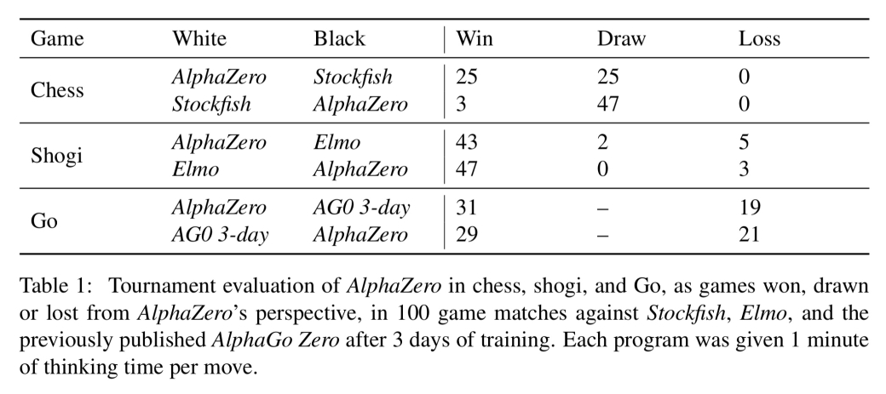
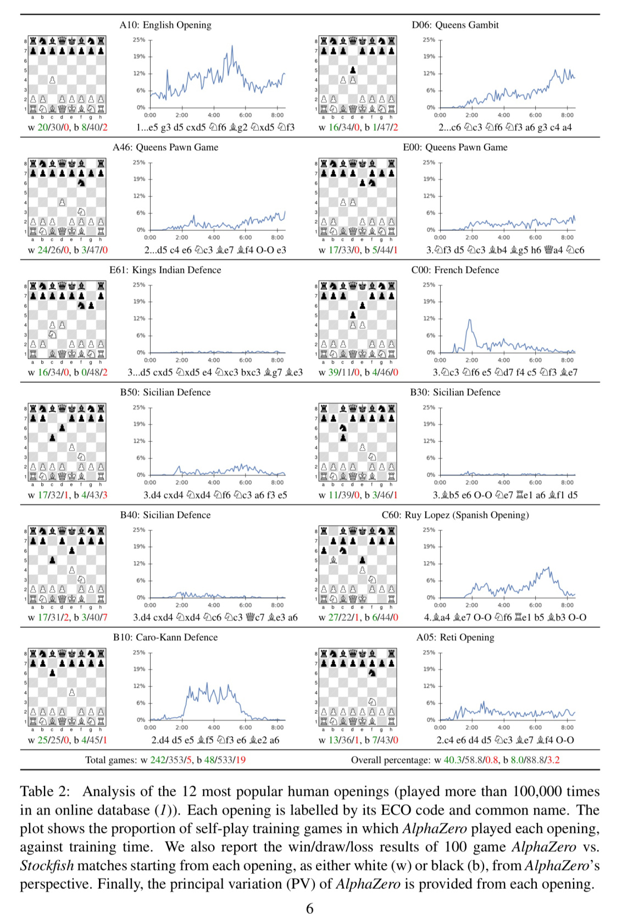
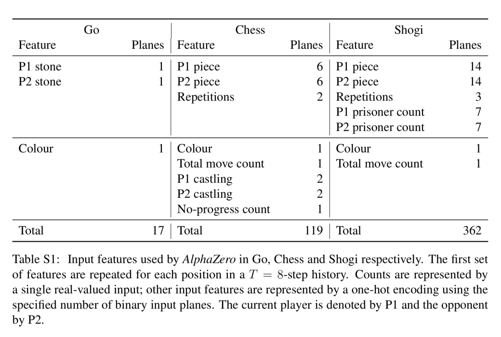

Mastering chess and shogi by self-play with a general reinforcement learning algorithm

# Mastering chess and shogi by self-play with a general reinforcement learning algorithm

January 10, 2018
tags: [Deep Learning](https://blog.acolyer.org/tag/deep-learning/)

.

[Mastering chess and shogi by self-play with a general reinforcement learning algorithm](https://arxiv.org/abs/1712.01815) Silver et al., *arXiv 2017*

We looked at [AlphaGo Zero](https://blog.acolyer.org/2017/11/17/mastering-the-game-of-go-without-human-knowledge/) last year (and the [first generation of AlphaGo](https://blog.acolyer.org/2016/09/20/mastering-the-game-of-go-with-deep-neural-networks-and-tree-search/) before that), but this December 2017 update is still fascinating in its own right. Recall that AlphaGo Zero learned to play Go with only knowledge of the rules and self-play. The obvious question is can you generalise that approach to other games or situations? In this paper, the DeepMind team make another small tweak to their self-play reinforcement learning engine to give us *AlphaZero*, and train it to play chess, shogi, and also Go once more. It’s the chess story that grabs me here – I vividly remember DeepBlue playing Gary Kasparov back in 1997, and my understanding of chess play is much better than my understanding of Go strategies and tactics. So I can have a better appreciation for AlphaZero’s play in this domain.

*> “*

>  The game of chess represented the pinnacle of AI research over several decades. State-of-the-art programs are based on powerful engines that search many millions of positions, leveraging handcrafted domain expertise and sophisticated domain adaptations. AlphaZero is a generic reinforcement learning algorithm — originally devised for the game of Go — that achieved superior results within a few hours, searching a thousand times fewer positions, given no domain knowledge except the rules of chess.

### But isn’t chess old news?

Computers achieved super-human performance in chess 20 years ago, so what’s the big deal about AlphaZero learning to play chess well? As with AlphaGo Zero, AlphaZero taught itself through self-play with only knowledge of the rules – no opening book, no endgame database, no chess specific tactical knowledge etc.. And while the game of Go has a natural match between the structure of convolutional networks and the translation-invariant nature of Go, the fit with chess and shogi is not so clear cut:

*> “*

>  Chess and shogi are, arguably, less innately suited to AlphaGo’s neural network architectures. The rules are position-dependent (e.g., pawns may move two steps forward from the second rank and promote on the eight rank) and asymmetric (e.g., paws only move forward and castling is different on kingside and queenside). The rules include long-range interactions (e.g., the queen may traverse the board in one move, or checkmate the king from the far side of the board..

### AlphaZero playing chess

Trained AlphaZero engines played chess against Stockfish, shogi against Elmo, and Go against the previous version of AlphaGo Zero. In each case 100 game matches were played with one minute per move time limits. AlphaZero used four TPUs, as did AlphaGo Zero, Stockfish and Elmo played at their strongest levels using 64 threads and a 1GB hash size.

*> “*

>  AlphaZero convincingly defeated all opponents, losing zero games to Stockfish and eight games to Elmo, as well as defeating the previous version of AlphaGo Zero.

It took just 4 hours for AlphaZero to outperform Stockfish, and 8 hours to beat AlphaGo Lee. That’s elapsed hours of course. 5000 TPUs were used to generate self-play games, and 64 TPUs were used to train the networks. So perhaps a more accurate statement would be “it took approximately 20,000 TPU-hours” for AlphaZero to outperform Stockfish.

So the headlines are impressive. But it’s the *way* that AlphaZero plays chess that really captures my attention. AlphaZero seems to play in a much more ‘human’ style. It has élan, it has flair. To see what I mean, it’s most instructive to look at some moments from the games.

Here’s IM Daniel Rensch’s commentary on some of the match highlights:

I also really enjoyed agadmator’s analysis of this game where AlphaZero trades a pawn to leave black’s bishop in a weak position, crippling black for much of the game:

Bearing in mind AlphaZero has no openings database, it’s also interesting to see that it rediscovers popular openings all by itself – seeming to end up with a preference for the English Opening and the Queens Gambit.

*> “*

>  Each of these openings is independently discovered and played frequently by AlphaZero during self-play training. When starting from each human opening, AlphaZero convincingly defeated Stockfish, suggesting it has indeed mastered a wide spectrum of chess play.

There’s some evidence to back my assertion that AlphaZero’s play feels more like human play too: AlphaZero uses a Monte-Carlo tree search (MCTS) algorithm which searches 80 thousand positions per second in chess. Granted that’s many more positions than any human! But compared to the 70 million positions per second Stockfish crunches through, it’s tiny. Three orders of magnitude fewer! So AlphaZero must genuinely have (if you’ll excuse the pun), a deeper understanding of the chess positions in order to focus that much more limited energy in the places where it matters the most:

*> “*

>  AlphaZero compensates for the lower number of evaluations by using its deep neural network to focus more selectively on the most promising variations — arguably a more ‘human-like’ approach to search…

### Under the hood: from AlphaGo Zero to AlphaZero

So how does AlphaZero do it? The heart of AlphaZero is very similar to [AlphaGo Zero](https://blog.acolyer.org/2017/11/17/mastering-the-game-of-go-without-human-knowledge/) that we looked at last year, but in an even more general form. There is the same single network structure which outputs both a vector of move probabilities and a scalar estimating the expecting outcome from the current position. And the network is similarly trained from self-play.

*> “*

>  Games are played by selecting moves for both players using Monte-Carlo tree search… At the end of the game, the terminal position is scored according to the rules of the game to compute the game outcome… The neural network parameters >  are updated so as to minimise the error between the predicted outcome and the game outcome, and to maximise the similarity of the policy vector to the search probabilities.

The main differences to AlphaGo Zero are as follows:

- AlphaGo Zero assumes binary win/loss outcomes, AlphaZero also takes draws into account.
- The AlphaGo family exploit Go’s invariance to rotation and reflection, generating 8 symmetries for each position and randomly selecting rotations or reflections before training. AlphaZero cannot do this as chess (and shogi) do not have the same invariance properties.
- AlphaZero continually updates a single neural network during self-play. In contrast AlphaGo Zero moved forward using a batch process whereby the performance of a new player after a training iteration was measured against the previous best and only took over as the new generation source for self-play games if it won by a margin of 55%.
- AlphaGo Zero tuned its hyperparameters using Bayesian optimisation. AlphaZero simply reuses the same hyper-parameters for all games without game-specific tuning.

And of course, AlphaZero needs a board input representation suitable for the games it is playing. For chess, the board is represented by 16 8×8 planes. There are six 8×8 planes representing the position of the white pieces (one for the pawn positions, one for knights, one for bishops, one for rooks, one for the king, and one for the queen), and a similar set to represent the positions of the black pieces. In addition there are a number of constant-value inputs for the player’s colour, total move count, legality of castling, move repetition count (3 repetitions is a draw in chess), and the number of moves without progress (50 moves without progress is a draw).

The policy encodes a probability distribution over 4,672 possible moves in an 8 x 8 x 73 stack of planes.

*> “*

>  Each of the 8 x8 positions identifies the square from which to ‘pick up’ a piece. The first 56 planes encode possible ‘queen moves’ for any piece: a number of squares [1..7] in which the piece will be moved, along one of the eight relative compass directions {N, NE, E, SE, S, SW, W, NW }. The next 8 planes encode possible knight moves for that piece. The final 9 planes encode possible underpromotions for pawn moves or captures in two possible diagonals, to knight, bishop, or rook respectively. Other pawn moves or captures from the seventh rank are promoted to a queen.

Tomorrow we’ll take a look at another impressive application of self-play in reinforcement learning…

### Share this:

- [Twitter](https://blog.acolyer.org/2018/01/10/mastering-chess-and-shogi-by-self-play-with-a-general-reinforcement-learning-algorithm/?share=twitter&nb=1)
- [LinkedIn](https://blog.acolyer.org/2018/01/10/mastering-chess-and-shogi-by-self-play-with-a-general-reinforcement-learning-algorithm/?share=linkedin&nb=1)
- [Email](https://blog.acolyer.org/2018/01/10/mastering-chess-and-shogi-by-self-play-with-a-general-reinforcement-learning-algorithm/?share=email&nb=1)
- [Print](https://blog.acolyer.org/2018/01/10/mastering-chess-and-shogi-by-self-play-with-a-general-reinforcement-learning-algorithm/#print)

-

### *Related*

[Mastering the game of Go without human knowledge](https://blog.acolyer.org/2017/11/17/mastering-the-game-of-go-without-human-knowledge/)In "Deep Learning"

[Mastering the game of Go with deep neural networks and tree search](https://blog.acolyer.org/2016/09/20/mastering-the-game-of-go-with-deep-neural-networks-and-tree-search/)In "Deep Learning"

[Emergent complexity via multi-agent competition](https://blog.acolyer.org/2018/01/11/emergent-complexity-via-multi-agent-competition/)In "Deep Learning"

.
from → [Uncategorized](https://blog.acolyer.org/category/uncategorized/)