Mastering the game of Go with deep neural networks and tree search : Nature : Nature Research

Article preview [View full access options](http://www.nature.com/nature/journal/v529/n7587/full/nature16961.html#access)

*Nature* |Article

- [Print](#)
- [Share/bookmark](#)

[日本語要約](http://www.nature.com/nature/journal/v529/n7587/abs/nature16961_ja.html?lang=ja)

- [(L)](http://www.nature.com/nature/journal/v529/n7587/full/nature16542.html)
- [(L)](http://www.nature.com/nature/journal/v529/n7587/full/nature16526.html)

# Mastering the game of Go with deep neural networks and tree search

- [David Silver](http://www.nature.com/nature/journal/v529/n7587/full/nature16961.html#auth-1),
- [Aja Huang](http://www.nature.com/nature/journal/v529/n7587/full/nature16961.html#auth-2),
- [Chris J. Maddison](http://www.nature.com/nature/journal/v529/n7587/full/nature16961.html#auth-3),
- [Arthur Guez](http://www.nature.com/nature/journal/v529/n7587/full/nature16961.html#auth-4),
- [Laurent Sifre](http://www.nature.com/nature/journal/v529/n7587/full/nature16961.html#auth-5),
- [George van den Driessche](http://www.nature.com/nature/journal/v529/n7587/full/nature16961.html#auth-6),
- [Julian Schrittwieser](http://www.nature.com/nature/journal/v529/n7587/full/nature16961.html#auth-7),
- [Ioannis Antonoglou](http://www.nature.com/nature/journal/v529/n7587/full/nature16961.html#auth-8),
- [Veda Panneershelvam](http://www.nature.com/nature/journal/v529/n7587/full/nature16961.html#auth-9),
- [Marc Lanctot](http://www.nature.com/nature/journal/v529/n7587/full/nature16961.html#auth-10),
- [Sander Dieleman](http://www.nature.com/nature/journal/v529/n7587/full/nature16961.html#auth-11),
- [Dominik Grewe](http://www.nature.com/nature/journal/v529/n7587/full/nature16961.html#auth-12),
- [John Nham](http://www.nature.com/nature/journal/v529/n7587/full/nature16961.html#auth-13),
- [Nal Kalchbrenner](http://www.nature.com/nature/journal/v529/n7587/full/nature16961.html#auth-14),
- [Ilya Sutskever](http://www.nature.com/nature/journal/v529/n7587/full/nature16961.html#auth-15),
- [Timothy Lillicrap](http://www.nature.com/nature/journal/v529/n7587/full/nature16961.html#auth-16),
- [Madeleine Leach](http://www.nature.com/nature/journal/v529/n7587/full/nature16961.html#auth-17),
- [Koray Kavukcuoglu](http://www.nature.com/nature/journal/v529/n7587/full/nature16961.html#auth-18),
- [Thore Graepel](http://www.nature.com/nature/journal/v529/n7587/full/nature16961.html#auth-19)
- & [Demis Hassabis](http://www.nature.com/nature/journal/v529/n7587/full/nature16961.html#auth-20)
- [Affiliations](http://www.nature.com/nature/journal/v529/n7587/full/nature16961.html#affil-auth)
- [Contributions](http://www.nature.com/nature/journal/v529/n7587/full/nature16961.html#contrib-auth)
- [Corresponding authors](http://www.nature.com/nature/journal/v529/n7587/full/nature16961.html#corres-auth)

Nature
529,
484–489
(28 January 2016)
doi:10.1038/nature16961
Received
11 November 2015
Accepted
05 January 2016
Published online
27 January 2016

## Article tools

- [Citation](http://www.nature.com/nature/journal/v529/n7587/ris/nature16961.ris)
- [Reprints](https://s100.copyright.com/AppDispatchServlet?publisherName=NPGR&publication=Nature&title=Mastering+the+game+of+Go+with+deep+neural+networks+and+tree+search&contentID=10.1038%2Fnature16961&volumeNum=529&issueNum=7587&numPages=6&pageNumbers=pp484-489&orderBeanReset=true&publicationDate=2016-01-27&author=David+Silver%2C+Aja+Huang%2C+Chris+J.+Maddison%2C+Arthur+Guez%2C+Laurent+Sifre%2C+George+van+den+Driessche)
- [Rights & permissions](https://s100.copyright.com/AppDispatchServlet?publisherName=NPG&publication=Nature&title=Mastering+the+game+of+Go+with+deep+neural+networks+and+tree+search&contentID=10.1038%2Fnature16961&volumeNum=529&issueNum=7587&numPages=6&pageNumbers=pp484-489&publicationDate=2016-01-27&author=David+Silver%2C+Aja+Huang%2C+Chris+J.+Maddison%2C+Arthur+Guez%2C+Laurent+Sifre%2C+George+van+den+Driessche)
- [Article metrics](http://www.nature.com/nature/journal/v529/n7587/nature16961/metrics)

# Abstract

- Abstract•

- [References](http://www.nature.com/nature/journal/v529/n7587/full/nature16961.html#references)•

- [Author information](http://www.nature.com/nature/journal/v529/n7587/full/nature16961.html#author-information)•

- [Extended data figures and tables](http://www.nature.com/nature/journal/v529/n7587/full/nature16961.html#extended-data)•

- [Supplementary information](http://www.nature.com/nature/journal/v529/n7587/full/nature16961.html#supplementary-information)•

- [Comments](http://www.nature.com/nature/journal/v529/n7587/full/nature16961.html#comments)

The game of Go has long been viewed as the most challenging of classic games for artificial intelligence owing to its enormous search space and the difficulty of evaluating board positions and moves. Here we introduce a new approach to computer Go that uses ‘value networks’ to evaluate board positions and ‘policy networks’ to select moves. These deep neural networks are trained by a novel combination of supervised learning from human expert games, and reinforcement learning from games of self-play. Without any lookahead search, the neural networks play Go at the level of state-of-the-art Monte Carlo tree search programs that simulate thousands of random games of self-play. We also introduce a new search algorithm that combines Monte Carlo simulation with value and policy networks. Using this search algorithm, our program AlphaGo achieved a 99.8% winning rate against other Go programs, and defeated the human European Go champion by 5 games to 0. This is the first time that a computer program has defeated a human professional player in the full-sized game of Go, a feat previously thought to be at least a decade away.

## Subject terms:

- [Computer science](http://www.nature.com/nature/archive/subject.html?code=117)
- [Computational science](http://www.nature.com/nature/archive/subject.html?code=1042)
- [Reward](http://www.nature.com/nature/archive/subject.html?code=1788)

# At a glance

### [Figures](#)

[First](#) | 1-1 of 6 | [Last](#)
[left](#)

1. 

Figure 1

2. [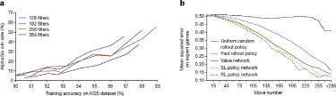](http://www.nature.com/nature/journal/v529/n7587/fig_tab/nature16961_F2.html)

Figure 2

3. [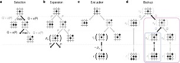](http://www.nature.com/nature/journal/v529/n7587/fig_tab/nature16961_F3.html)

Figure 3

4. [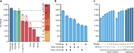](http://www.nature.com/nature/journal/v529/n7587/fig_tab/nature16961_F4.html)

Figure 4

5. [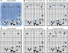](http://www.nature.com/nature/journal/v529/n7587/fig_tab/nature16961_F5.html)

Figure 5

6. [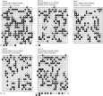](http://www.nature.com/nature/journal/v529/n7587/fig_tab/nature16961_F6.html)

Figure 6
[right](#)

### [Tables](#)

## Read the full article

-

#### Subscribe to *Nature* for full access: $199

[Subscribe](http://www.nature.com/subscribe/nature)
-

#### ReadCube Access*:$4.99 rent$9.99 buy

*printing and sharing restrictions apply[Buy/Rent now](http://www.readcube.com/articles/10.1038%2Fnature16961?r3_referer=nature)

-

#### Purchase article full text and PDF: $32

[Buy now](http://www.nature.com/store/svc/article/cart?action=add&articleId=10.1038/nature16961)

Already a subscriber? [Log in](http://www.nature.com/foxtrot/svc/login) now or [Register](http://www.nature.com/register) for online access.

### Additional access options:

- [[Use a document delivery service](#)](http://www.nature.com/nature/journal/v529/n7587/full/nature16961.html#document-delivery)
- [Rent for $4.00 at DeepDyve](https://www.deepdyve.com/lp/nature/mastering-the-game-of-go-with-deep-neural-networks-and-tree-search-Jnp1aFhmlP?key=nature)
- [Login via OpenAthens](http://www.nature.com/nams/svc/athensout?target=/nature/journal/v529/n7587/abs/nature16961.html)
- [Purchase a site license](http://www.nature.com/libraries/site_licenses/index.html)
- [Institutional access](http://www.nature.com/nams/svc/institutelogin?target=/nature/journal/v529/n7587/abs/nature16961.html)

# [References](#)

- [Abstract](http://www.nature.com/nature/journal/v529/n7587/full/nature16961.html#abstract)•

- References•

- [Author information](http://www.nature.com/nature/journal/v529/n7587/full/nature16961.html#author-information)•

- [Extended data figures and tables](http://www.nature.com/nature/journal/v529/n7587/full/nature16961.html#extended-data)•

- [Supplementary information](http://www.nature.com/nature/journal/v529/n7587/full/nature16961.html#supplementary-information)•

- [Comments](http://www.nature.com/nature/journal/v529/n7587/full/nature16961.html#comments)

1. Allis, L. V.  *Searching for Solutions in Games and Artificial Intelligence.* PhD thesis, Univ. Limburg, Maastricht, The Netherlands (1994)

2. van den Herik, H., Uiterwijk, J. W. & van Rijswijck, J.  Games solved: now and in the future. *Artif. Intell.*  134, 277–311 (2002)

    - [Article](http://dx.doi.org/10.1016/S0004-3702(01)00152-7)

3. Schaeffer, J.  The games computers (and people) play. *Advances in Computers*  52, 189–266 (2000)

4. Campbell, M., Hoane, A. & Hsu, F.  Deep Blue. *Artif. Intell.*  134, 57–83 (2002)

    - [ISI](http://links.isiglobalnet2.com/gateway/Gateway.cgi?amp;GWVersion=2&amp;SrcAuth=Nature&amp;SrcApp=Nature&amp;DestLinkType=FullRecord&amp;KeyUT=000173425200004&amp;DestApp=WOS_CPL)
    - [Article](http://dx.doi.org/10.1016/S0004-3702(01)00129-1)

5. Schaeffer, J.  *et al.*  A world championship caliber checkers program. *Artif. Intell.*  53, 273–289 (1992)

    - [Article](http://dx.doi.org/10.1016/0004-3702(92)90074-8)

6. Buro, M.  From simple features to sophisticated evaluation functions. In *1st International Conference on Computers and Games*, 126–145 (1999)

7. Müller, M.  Computer Go. *Artif. Intell.*  134, 145–179 (2002)

    - [Article](http://dx.doi.org/10.1016/S0004-3702(01)00121-7)

8. Tesauro, G. & Galperin, G.  On-line policy improvement using Monte-Carlo search. In *Advances in Neural Information Processing*, 1068–1074 (1996)

9. Sheppard, B.  World-championship-caliber Scrabble. *Artif. Intell.*  134, 241–275 (2002)

    - [Article](http://dx.doi.org/10.1016/S0004-3702(01)00166-7)

10. Bouzy, B. & Helmstetter, B.  Monte-Carlo Go developments. In *10th International Conference on Advances in Computer Games*, 159–174 (2003)

11. Coulom, R.  Efficient selectivity and backup operators in Monte-Carlo tree search. In *5th International Conference on Computers and Games*, 72–83 (2006)

12. Kocsis, L. & Szepesvári, C.  Bandit based Monte-Carlo planning. In *15th European Conference on Machine Learning*, 282–293 (2006)

13. Coulom, R.  Computing Elo ratings of move patterns in the game of Go. *ICGA J.*  30, 198–208 (2007)

14. Baudiš, P. & Gailly, J.-L.  Pachi: State of the art open source Go program. In *Advances in Computer Games*, 24–38 (Springer, 2012)

15. Müller, M., Enzenberger, M., Arneson, B. & Segal, R.  Fuego – an open-source framework for board games and Go engine based on Monte-Carlo tree search. *IEEE Trans. Comput. Intell. AI in Games*  2, 259–270 (2010)

    - [Article](http://dx.doi.org/10.1109/TCIAIG.2010.2083662)

16. Gelly, S. & Silver, D.  Combining online and offline learning in UCT. In *17th International Conference on Machine Learning*, 273–280 (2007)

17. Krizhevsky, A., Sutskever, I. & Hinton, G.  ImageNet classification with deep convolutional neural networks. In *Advances in Neural Information Processing Systems*, 1097–1105 (2012)

18. Lawrence, S., Giles, C. L., Tsoi, A. C. & Back, A. D.  Face recognition: a convolutional neural-network approach. *IEEE Trans. Neural Netw.*  8, 98–113 (1997)

    - [PubMed](http://www.ncbi.nlm.nih.gov/entrez/query.fcgi?holding=npg&amp;cmd=Retrieve&amp;db=PubMed&amp;list_uids=18255614&amp;dopt=Abstract)
    - [Article](http://dx.doi.org/10.1109/72.554195)

19. Mnih, V.  *et al.*  Human-level control through deep reinforcement learning. *Nature*  518, 529–533 (2015)

    - [CAS](http://chemport.cas.org/cgi-bin/sdcgi?APP=ftslink&action=reflink&origin=npg&version=1.0&coi=1:CAS:528:DC%2BC2MXjsVagur0%3D&pissn=0028-0836&pyear=2016&md5=2ab4a965367651b56282b2820954806b)
    - [ISI](http://links.isiglobalnet2.com/gateway/Gateway.cgi?amp;GWVersion=2&amp;SrcAuth=Nature&amp;SrcApp=Nature&amp;DestLinkType=FullRecord&amp;KeyUT=000350097300045&amp;DestApp=WOS_CPL)
    - [PubMed](http://www.ncbi.nlm.nih.gov/entrez/query.fcgi?holding=npg&amp;cmd=Retrieve&amp;db=PubMed&amp;list_uids=25719670&amp;dopt=Abstract)
    - [Article](http://www.nature.com/doifinder/10.1038/nature14236)

20. LeCun, Y., Bengio, Y. & Hinton, G.  Deep learning. *Nature*  521, 436–444 (2015)

    - [CAS](http://chemport.cas.org/cgi-bin/sdcgi?APP=ftslink&action=reflink&origin=npg&version=1.0&coi=1:CAS:528:DC%2BC2MXht1WlurzP&pissn=0028-0836&pyear=2016&md5=0cea1845816439a34466c8f7ace40efa)
    - [PubMed](http://www.ncbi.nlm.nih.gov/entrez/query.fcgi?holding=npg&amp;cmd=Retrieve&amp;db=PubMed&amp;list_uids=26017442&amp;dopt=Abstract)
    - [Article](http://www.nature.com/doifinder/10.1038/nature14539)

21. Stern, D., Herbrich, R. & Graepel, T.  Bayesian pattern ranking for move prediction in the game of Go. In *International Conference of Machine Learning*, 873–880 (2006)

22. Sutskever, I. & Nair, V.  Mimicking Go experts with convolutional neural networks. In *International Conference on Artificial Neural Networks*, 101–110 (2008)

23. Maddison, C. J., Huang, A., Sutskever, I. & Silver, D.  Move evaluation in Go using deep convolutional neural networks. *3rd International Conference on Learning Representations* (2015)

24. Clark, C. & Storkey, A. J.  Training deep convolutional neural networks to play go. In *32nd International Conference on Machine Learning*, 1766–1774 (2015)

25. Williams, R. J.  Simple statistical gradient-following algorithms for connectionist reinforcement learning. *Mach. Learn.*  8, 229–256 (1992)

    - [ISI](http://links.isiglobalnet2.com/gateway/Gateway.cgi?amp;GWVersion=2&amp;SrcAuth=Nature&amp;SrcApp=Nature&amp;DestLinkType=FullRecord&amp;KeyUT=A1992HV72300002&amp;DestApp=WOS_CPL)
    - [Article](http://dx.doi.org/10.1023/A:1022672621406)

26. Sutton, R., McAllester, D., Singh, S. & Mansour, Y.  Policy gradient methods for reinforcement learning with function approximation. In *Advances in Neural Information Processing Systems*, 1057–1063 (2000)

27. Sutton, R. & Barto, A.  *Reinforcement Learning: an Introduction* (MIT Press, 1998)

28. Schraudolph, N. N., Dayan, P. & Sejnowski, T. J.  Temporal difference learning of position evaluation in the game of Go. *Adv. Neural Inf. Process. Syst.*  6, 817–824 (1994)

29. Enzenberger, M.  Evaluation in Go by a neural network using soft segmentation. In *10th Advances in Computer Games Conference*, 97–108 (2003). 267

30. Silver, D., Sutton, R. & Müller, M.  Temporal-difference search in computer Go. *Mach. Learn.*  87, 183–219 (2012)

    - [Article](http://dx.doi.org/10.1007/s10994-012-5280-0)

31. Levinovitz, A.  The mystery of Go, the ancient game that computers still can’t win. *Wired Magazine* (2014)

32. Mechner, D.  All Systems Go. *The Sciences*  38, 32–37 (1998)

    - [Article](http://dx.doi.org/10.1002/j.2326-1951.1998.tb03356.x)

33. Mandziuk, J.  Computational intelligence in mind games. In *Challenges for Computational Intelligence*, 407–442 (2007)

34. Berliner, H.  A chronology of computer chess and its literature. *Artif. Intell.*  10, 201–214 (1978)

    - [Article](http://dx.doi.org/10.1016/S0004-3702(78)80012-5)

35. Browne, C.  *et al.*  A survey of Monte-Carlo tree search methods. *IEEE Trans. Comput. Intell. AI in Games*  4, 1–43 (2012)

    - [Article](http://dx.doi.org/10.1109/TCIAIG.2012.2186810)

36. Gelly, S.  *et al.*  The grand challenge of computer Go: Monte Carlo tree search and extensions. *Commun. ACM*  55, 106–113 (2012)

    - [Article](http://dx.doi.org/10.1145/2093548.2093574)

37. Coulom, R.  Whole-history rating: A Bayesian rating system for players of time-varying strength. In *International Conference on Computers and Games*, 113–124 (2008)

38. KGS. Rating system math. http://www.gokgs.com/help/rmath.html

39. Littman, M. L.  Markov games as a framework for multi-agent reinforcement learning. In *11th International Conference on Machine Learning*, 157–163 (1994)

40. Knuth, D. E. & Moore, R. W.  An analysis of alpha-beta pruning. *Artif. Intell.*  6, 293–326 (1975)

    - [Article](http://dx.doi.org/10.1016/0004-3702(75)90019-3)

41. Sutton, R.  Learning to predict by the method of temporal differences. *Mach. Learn.*  3, 9–44 (1988)

    - [Article](http://dx.doi.org/10.1023/A:1022633531479)

42. Baxter, J., Tridgell, A. & Weaver, L.  Learning to play chess using temporal differences. *Mach. Learn.*  40, 243–263 (2000)

    - [Article](http://dx.doi.org/10.1023/A:1007634325138)

43. Veness, J., Silver, D., Blair, A. & Uther, W.  Bootstrapping from game tree search. In *Advances in Neural Information Processing Systems* (2009)

44. Samuel, A. L.  Some studies in machine learning using the game of checkers II - recent progress. *IBM J. Res. Develop.*  11, 601–617 (1967)

    - [Article](http://dx.doi.org/10.1147/rd.116.0601)

45. Schaeffer, J., Hlynka, M. & Jussila, V.  Temporal difference learning applied to a high-performance game-playing program. In *17th International Joint Conference on Artificial Intelligence*, 529–534 (2001)

46. Tesauro, G.  TD-gammon, a self-teaching backgammon program, achieves master-level play. *Neural Comput.*  6, 215–219 (1994)

    - [ISI](http://links.isiglobalnet2.com/gateway/Gateway.cgi?amp;GWVersion=2&amp;SrcAuth=Nature&amp;SrcApp=Nature&amp;DestLinkType=FullRecord&amp;KeyUT=A1994PF90800002&amp;DestApp=WOS_CPL)
    - [Article](http://dx.doi.org/10.1162/neco.1994.6.2.215)

47. Dahl, F.  Honte, a Go-playing program using neural nets. In *Machines that learn to play games*, 205–223 (Nova Science, 1999)

48. Rosin, C. D.  Multi-armed bandits with episode context. *Ann. Math. Artif. Intell.*  61, 203–230 (2011)

    - [Article](http://dx.doi.org/10.1007/s10472-011-9258-6)

49. Lanctot, M., Winands, M. H. M., Pepels, T. & Sturtevant, N. R.  Monte Carlo tree search with heuristic evaluations using implicit minimax backups. In *IEEE Conference on Computational Intelligence and Games*, 1–8 (2014)

50. Gelly, S., Wang, Y., Munos, R. & Teytaud, O.  Modification of UCT with patterns in Monte-Carlo Go. *Tech. Rep.*  6062, INRIA (2006)

51. Silver, D. & Tesauro, G.  Monte-Carlo simulation balancing. In *26th International Conference on Machine Learning*, 119 (2009)

52. Huang, S.-C., Coulom, R. & Lin, S.-S.  Monte-Carlo simulation balancing in practice. In *7th International Conference on Computers and Games*, 81–92 (Springer-Verlag, 2011)

53. Baier, H. & Drake, P. D.  The power of forgetting: improving the last-good-reply policy in Monte Carlo Go. *IEEE Trans. Comput. Intell. AI in Games*  2, 303–309 (2010)

    - [Article](http://dx.doi.org/10.1109/TCIAIG.2010.2100396)

54. Huang, S. & Müller, M.  Investigating the limits of Monte-Carlo tree search methods in computer Go. In *8th International Conference on Computers and Games*, 39–48 (2013)

55. Segal, R. B.  On the scalability of parallel UCT. *Computers and Games*  6515, 36–47 (2011)

56. Enzenberger, M. & Müller, M.  A lock-free multithreaded Monte-Carlo tree search algorithm. In *12th Advances in Computer Games Conference*, 14–20 (2009)

57. Huang, S.-C., Coulom, R. & Lin, S.-S.  Time management for Monte-Carlo tree search applied to the game of Go. In *International Conference on Technologies and Applications of Artificial Intelligence*, 462–466 (2010)

58. Gelly, S. & Silver, D.  Monte-Carlo tree search and rapid action value estimation in computer Go. *Artif. Intell.*  175, 1856–1875 (2011)

    - [Article](http://dx.doi.org/10.1016/j.artint.2011.03.007)

59. Baudiš, P.  Balancing MCTS by dynamically adjusting the komi value. *ICGA J.*  34, 131 (2011)

60. Baier, H. & Winands, M. H.  Active opening book application for Monte-Carlo tree search in 19×19 Go. In *Benelux Conference on Artificial Intelligence*, 3–10 (2011)

61. Dean, J.  *et al.*  Large scale distributed deep networks. In *Advances in Neural Information Processing Systems*, 1223–1231 (2012)

62. Go ratings. [http://www.goratings.org](http://www.goratings.org/)

[Download references](http://www.nature.com/nature/journal/v529/n7587/ris/nature16961refs.ris)

# [Author information](#)

- [Abstract](http://www.nature.com/nature/journal/v529/n7587/full/nature16961.html#abstract)•

- [References](http://www.nature.com/nature/journal/v529/n7587/full/nature16961.html#references)•

- Author information•

- [Extended data figures and tables](http://www.nature.com/nature/journal/v529/n7587/full/nature16961.html#extended-data)•

- [Supplementary information](http://www.nature.com/nature/journal/v529/n7587/full/nature16961.html#supplementary-information)•

- [Comments](http://www.nature.com/nature/journal/v529/n7587/full/nature16961.html#comments)

## Author footnotes

1.

### These authors contributed equally to this work.

    - David Silver &
    - Aja Huang

## Affiliations

1.

### Google DeepMind, 5 New Street Square, London EC4A 3TW, UK

    - David Silver,
    - Aja Huang,
    - Chris J. Maddison,
    - Arthur Guez,
    - Laurent Sifre,
    - George van den Driessche,
    - Julian Schrittwieser,
    - Ioannis Antonoglou,
    - Veda Panneershelvam,
    - Marc Lanctot,
    - Sander Dieleman,
    - Dominik Grewe,
    - Nal Kalchbrenner,
    - Timothy Lillicrap,
    - Madeleine Leach,
    - Koray Kavukcuoglu,
    - Thore Graepel &
    - Demis Hassabis

2.

### Google, 1600 Amphitheatre Parkway, Mountain View, California 94043, USA

    - John Nham &
    - Ilya Sutskever

## Contributions

A.H., G.v.d.D., J.S., I.A., M.La., A.G., T.G. and D.S. designed and implemented the search in AlphaGo. C.J.M., A.G., L.S., A.H., I.A., V.P., S.D., D.G., N.K., I.S., K.K. and D.S. designed and trained the neural networks in AlphaGo. J.S., J.N., A.H. and D.S. designed and implemented the evaluation framework for AlphaGo. D.S., M.Le., T.L., T.G., K.K. and D.H. managed and advised on the project. D.S., T.G., A.G. and D.H. wrote the paper.

## Competing financial interests

The authors declare no competing financial interests.

## Corresponding authors

Correspondence to:

- [David Silver](http://www.nature.com/nature/foxtrot/svc/authoremailform?doi=10.1038/nature16961&file=/nature/journal/v529/n7587/full/nature16961.html&title=Mastering+the+game+of+Go+with+deep+neural+networks+and+tree+search&author=David+Silver) or
- [Demis Hassabis](http://www.nature.com/nature/foxtrot/svc/authoremailform?doi=10.1038/nature16961&file=/nature/journal/v529/n7587/full/nature16961.html&title=Mastering+the+game+of+Go+with+deep+neural+networks+and+tree+search&author=Demis+Hassabis)

# [Extended data figures and tables](#)

- [Abstract](http://www.nature.com/nature/journal/v529/n7587/full/nature16961.html#abstract)•

- [References](http://www.nature.com/nature/journal/v529/n7587/full/nature16961.html#references)•

- [Author information](http://www.nature.com/nature/journal/v529/n7587/full/nature16961.html#author-information)•

- Extended data figures and tables•

- [Supplementary information](http://www.nature.com/nature/journal/v529/n7587/full/nature16961.html#supplementary-information)•

- [Comments](http://www.nature.com/nature/journal/v529/n7587/full/nature16961.html#comments)

## Extended Data Tables

1. [Extended Data Table 1: Details of match between AlphaGo and Fan Hui (194 KB)](http://www.nature.com/nature/journal/v529/n7587/fig_tab/nature16961_ST1.html)

2. [Extended Data Table 2: Input features for neural networks (156 KB)](http://www.nature.com/nature/journal/v529/n7587/fig_tab/nature16961_ST2.html)

3. [Extended Data Table 3: Supervised learning results for the policy network (109 KB)](http://www.nature.com/nature/journal/v529/n7587/fig_tab/nature16961_ST3.html)

4. [Extended Data Table 4: Input features for rollout and tree policy (132 KB)](http://www.nature.com/nature/journal/v529/n7587/fig_tab/nature16961_ST4.html)

5. [Extended Data Table 5: Parameters used by AlphaGo (71 KB)](http://www.nature.com/nature/journal/v529/n7587/fig_tab/nature16961_ST5.html)

6. [Extended Data Table 6: Results of a tournament between different Go programs (108 KB)](http://www.nature.com/nature/journal/v529/n7587/fig_tab/nature16961_ST6.html)

7. [Extended Data Table 7: Results of a tournament between different variants of AlphaGo (62 KB)](http://www.nature.com/nature/journal/v529/n7587/fig_tab/nature16961_ST7.html)

8. [Extended Data Table 8: Results of a tournament between AlphaGo and distributed AlphaGo, testing scalability with hardware (103 KB)](http://www.nature.com/nature/journal/v529/n7587/fig_tab/nature16961_ST8.html)

9. [Extended Data Table 9: Cross-table of win rates in per cent between programs (192 KB)](http://www.nature.com/nature/journal/v529/n7587/fig_tab/nature16961_ST9.html)

10. [Extended Data Table 10: Cross-table of win rates in per cent between programs in the single-machine scalability study (153 KB)](http://www.nature.com/nature/journal/v529/n7587/fig_tab/nature16961_ST10.html)

11. [Extended Data Table 11: Cross-table of win rates in per cent between programs in the distributed scalability study (117 KB)](http://www.nature.com/nature/journal/v529/n7587/fig_tab/nature16961_ST11.html)

# [Supplementary information](#)

- [Abstract](http://www.nature.com/nature/journal/v529/n7587/full/nature16961.html#abstract)•

- [References](http://www.nature.com/nature/journal/v529/n7587/full/nature16961.html#references)•

- [Author information](http://www.nature.com/nature/journal/v529/n7587/full/nature16961.html#author-information)•

- [Extended data figures and tables](http://www.nature.com/nature/journal/v529/n7587/full/nature16961.html#extended-data)•

- Supplementary information•

- [Comments](http://www.nature.com/nature/journal/v529/n7587/full/nature16961.html#comments)

## Zip files

1. [Supplementary Information (3.4 KB)](http://www.nature.com/nature/journal/v529/n7587/extref/nature16961-s1.zip)

This zipped file contains game records for the 5 formal match games played between AlphaGo and Fan Hui.

# [Comments](#)

- [Abstract](http://www.nature.com/nature/journal/v529/n7587/full/nature16961.html#abstract)•

- [References](http://www.nature.com/nature/journal/v529/n7587/full/nature16961.html#references)•

- [Author information](http://www.nature.com/nature/journal/v529/n7587/full/nature16961.html#author-information)•

- [Extended data figures and tables](http://www.nature.com/nature/journal/v529/n7587/full/nature16961.html#extended-data)•

- [Supplementary information](http://www.nature.com/nature/journal/v529/n7587/full/nature16961.html#supplementary-information)•

- Comments

1. 2016-01-29 10:09 AM

[Report this comment](http://www.nature.com/nature/report/index.html?comment=67597&doi=10.1038/nature16961)  [#67597](http://www.nature.com/nature/journal/v529/n7587/full/nature16961.html#comment-67597)

Justin Brown said:

Can someone explain the process of expanding in more detail? I have a lot of questions that might be stemming from some more fundamental misunderstanding. An example like figure 3 that starts from a blank board and goes forward a few steps in more detail would be helpful.

*Here's what I know so far: *

    - s is a configuration of the board and a node of the search tree. s' is a possible configuration of the board(but not yet a node in the search tree) that gets determined by f(s,a), where a is the action taken to produce s'. s' gets produced and added to the tree when (s,a) has been visited more than 40 times.
    - The policy network takes in s, and outputs the probability of an action being taken next, for all legal actions in s
    - The value network takes in s and outputs the chance of the player winning that game

**Questions:**
Starting from a blank board, how does (s,a) get added to the tree?

What counts as a visit to (s,a)? The algorithm only selects nodes with the highest Q and new nodes(s') only get added to the tree if (s,a) has been visited 40 times. Does that mean the node with the highest Q has to be selected 40 times before it can produce s'?

How do these two quotes make sense?

    - *'The leaf node may be expanded; *the new node is processed once by the policy network p'* and the output probabilities are stored as prior probabilities P for each action.'*
    - *'When the traversal reaches a leaf node s~L~ at step L, the leaf node may be expanded. *The leaf position sL is processed just once by the SL policy network p'.*'*

It seems it's saying the leaf node, s~L~, and the new expanded node, s', both get processed by the policy network. In the second quote, did the leaf node change to become s'? Does that mean step L changed?

When a new node, s', gets created, it's prior probability gets initialized by the policy network p~?~^?^(-|s'). Is this any different than inputting s into the policy network and getting the probability that action a will be taken?

2. 2016-03-15 08:14 AM

[Report this comment](http://www.nature.com/nature/report/index.html?comment=67727&doi=10.1038/nature16961)  [#67727](http://www.nature.com/nature/journal/v529/n7587/full/nature16961.html#comment-67727)

Tet Yoon Lee said:

Looking at extended data table 8 or figure 4, was wondering about the big jump in Elo rating with the increase from 1 GPU to 2 GPUs. The improvement in Elo rating after an increase to 4 or 8 GPUs, or even to the distributed config are a lot more modest.There are a lot of possible reasons for this & I think I came up with a few of them myself before I wondered if I was missing the obvious.

As also shown in figure 4 and clearer in extended data table 7, it seems with the 8 GPU config you are using 2 GPUs for the policy network and 6 GPUs for the value network with rollouts and a mixing constant of 0.5 as it gives the best results. Considering the 8 GPUs and the distributed configs may have been where you concentrated most of your efforts; is the problem with 1 GPU that you are forced to limit it to value network only, or the sole GPU is dedicated to either the value or policy network, or if it is shared between both networks, perhaps your code isn't well optimised for this?

In any case, congratulations on your excellent research and success!
[Subscribe to comments](http://www.nature.com/rss/feed?doi=10.1038/nature16961)

# Additional data

- Extended Data Table 1: Details of match between AlphaGo and Fan Hui

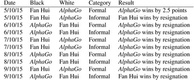

The match consisted of five formal games with longer time controls, and five informal games with shorter time controls. Time controls and playing conditions were chosen by Fan Hui in advance of the match.

[Full size table](http://www.nature.com/nature/journal/v529/n7587/fig_tab/nature16961_ST1.html)

[Enable zoom](http://www.nature.com/nature/journal/v529/n7587/full/nature16961.html#)

- Extended Data Table 2: Input features for neural networks

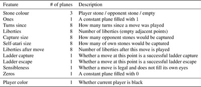

Feature planes used by the policy network (all but last feature) and value network (all features).

[Full size table](http://www.nature.com/nature/journal/v529/n7587/fig_tab/nature16961_ST2.html)

[Enable zoom](http://www.nature.com/nature/journal/v529/n7587/full/nature16961.html#)

- Extended Data Table 3: Supervised learning results for the policy network

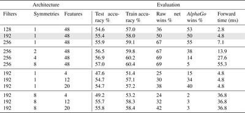

The policy network architecture consists of 128, 192 or 256 filters in convolutional layers; an explicit symmetry ensemble over 2, 4 or 8 symmetries; using only the first 4, 12 or 20 input feature planes listed in [Extended Data Table 1](http://www.nature.com/nature/journal/v529/n7587/fig_tab/nature16961_ST1.html). The results consist of the test and train accuracy on the KGS data set; and the percentage of games won by given policy network against AlphaGo’s policy network (highlighted row 2): using the policy networks to select moves directly (raw wins); or using AlphaGo’s search to select moves (AlphaGo wins); and finally the computation time for a single evaluation of the policy network.

[Full size table](http://www.nature.com/nature/journal/v529/n7587/fig_tab/nature16961_ST3.html)

[Enable zoom](http://www.nature.com/nature/journal/v529/n7587/full/nature16961.html#)

- Extended Data Table 4: Input features for rollout and tree policy

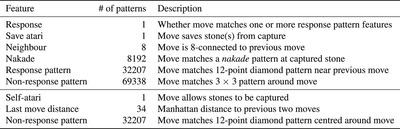

Features used by the rollout policy (first set) and tree policy (first and second set). Patterns are based on stone colour (black/white/empty) and liberties (1, 2, ≥3) at each intersection of the pattern.

[Full size table](http://www.nature.com/nature/journal/v529/n7587/fig_tab/nature16961_ST4.html)

[Enable zoom](http://www.nature.com/nature/journal/v529/n7587/full/nature16961.html#)

- Extended Data Table 5: Parameters used by AlphaGo

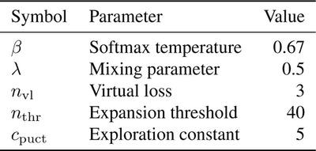

[Full size table](http://www.nature.com/nature/journal/v529/n7587/fig_tab/nature16961_ST5.html)

[Enable zoom](http://www.nature.com/nature/journal/v529/n7587/full/nature16961.html#)

- Extended Data Table 6: Results of a tournament between different Go programs

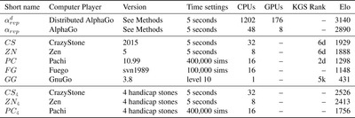

Each program played with a maximum of 5 s thinking time per move; the games against Fan Hui were conducted using longer time controls, as described in Methods. *CN*4, *ZN*4 and *PC*4 were given 4 handicap stones; *komi* was 7.5 in all games. Elo ratings were computed by BayesElo.

[Full size table](http://www.nature.com/nature/journal/v529/n7587/fig_tab/nature16961_ST6.html)

[Enable zoom](http://www.nature.com/nature/journal/v529/n7587/full/nature16961.html#)

- Extended Data Table 7: Results of a tournament between different variants of AlphaGo

Evaluating positions using rollouts only (*α**rp*, *α**r*), value nets only (*α**vp*, *α**v*), or mixing both (*α**rvp*, *α**rv*); either using the policy network *p**σ*(*α**rvp*, *α**vp*, *α**rp*), or no policy network (*α**rvp*, *α**vp*, *α**rp*), that is, instead using the placeholder probabilities from the tree policy *p**τ* throughout. Each program used 5 s per move on a single machine with 48 CPUs and 8 GPUs. Elo ratings were computed by BayesElo.

[Full size table](http://www.nature.com/nature/journal/v529/n7587/fig_tab/nature16961_ST7.html)

[Enable zoom](http://www.nature.com/nature/journal/v529/n7587/full/nature16961.html#)

- Extended Data Table 8: Results of a tournament between AlphaGo and distributed AlphaGo, testing scalability with hardware

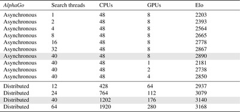

Each program played with a maximum of 2 s thinking time per move. Elo ratings were computed by BayesElo.

[Full size table](http://www.nature.com/nature/journal/v529/n7587/fig_tab/nature16961_ST8.html)

[Enable zoom](http://www.nature.com/nature/journal/v529/n7587/full/nature16961.html#)

- Extended Data Table 9: Cross-table of win rates in per cent between programs

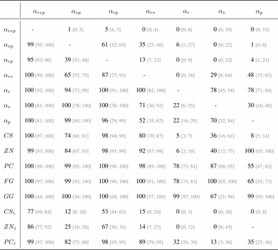

95% Agresti–Coull confidence intervals in grey. Each program played with a maximum of 5 s thinking time per move. *CN*4, *ZN*4 and *PC*4 were given 4 handicap stones; *komi* was 7.5 in all games. Distributed AlphaGo scored 77% [70; 82] against *α**rvp* and 100% against all other programs (no handicap games were played).

[Full size table](http://www.nature.com/nature/journal/v529/n7587/fig_tab/nature16961_ST9.html)

[Enable zoom](http://www.nature.com/nature/journal/v529/n7587/full/nature16961.html#)

- Extended Data Table 10: Cross-table of win rates in per cent between programs in the single-machine scalability study

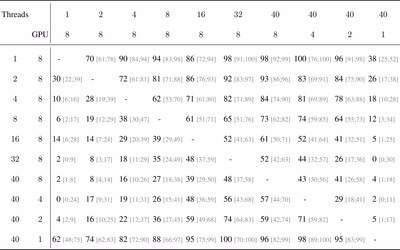

95% Agresti–Coull confidence intervals in grey. Each program played with 2 s per move; *komi* was 7.5 in all games.

[Full size table](http://www.nature.com/nature/journal/v529/n7587/fig_tab/nature16961_ST10.html)

[Enable zoom](http://www.nature.com/nature/journal/v529/n7587/full/nature16961.html#)

- Extended Data Table 11: Cross-table of win rates in per cent between programs in the distributed scalability study

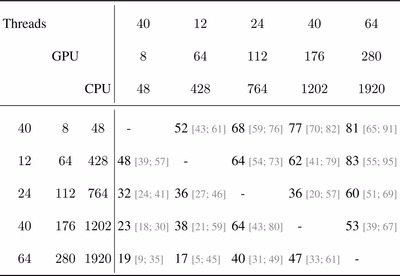

95% Agresti–Coull confidence intervals in grey. Each program played with 2 s per move; *komi* was 7.5 in all games.

[Full size table](http://www.nature.com/nature/journal/v529/n7587/fig_tab/nature16961_ST11.html)

[Enable zoom](http://www.nature.com/nature/journal/v529/n7587/full/nature16961.html#)