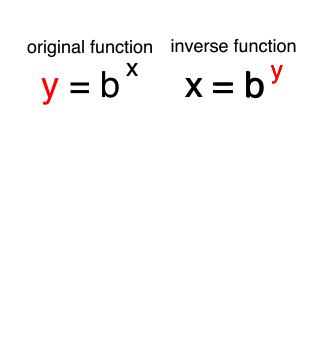

Math Book on Solving Logarithms for Beginners | Explaining Logarithms

Math Book on Solving Logarithms for Beginners | Explaining Logarithms

http://www.mathlogarithms.com/?utm_medium=email&utm_source=other&utm_campaign=opencourse.GdeNrll1EeSROyIACtiVvg.announcements~opencourse.GdeNrll1EeSROyIACtiVvg.oJRNR6dhEeiFUA70FkCTgA

Logarithms book for beginners and high school students on solving logarithms. Explaining Logarithms by Dan Umbarger. ISBN 978-0-983373-1-1 (color) ISBN 978-0-9833973-0-4 (b & w)