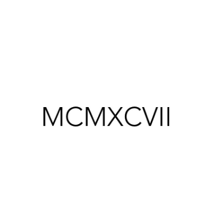

Math and Analogies – BetterExplained

Math and Analogies – BetterExplained

https://betterexplained.com/articles/math-and-analogies/

Menu Home All Articles Popular Calculus Guide Contact Feedback Newsletter About BetterExplained Books for Kindle and Print Concrete math lessons that slice through the jargon. Math, Better Explained on Amazon Calculus, Better Explained on Amazon Math and Analogies Home › Math › Math and Analogies Here's a talk on "Math And Analogies" I did for the Center on Contemporary Art (CoCA) in Seattle. Transcript: What's this? Well, it's a number. Probably written down a few thousand years ago. Great. And people, I suppose, could have read it back then if they spent enough time. And if we want, we can figure it out by spending time on it too (sigh).