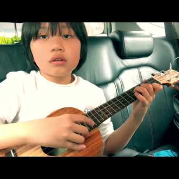

Meet Feng E, an 11-Year-Old Taiwanese Ukelele Prodigy

Meet Feng E, an 11-Year-Old Taiwanese Ukelele Prodigy

https://kottke.org/18/09/meet-feng-e-an-11-year-old-taiwanese-ukelele-prodigy?utm_source=nextdraft&utm_medium=email

Feng E started playing the ukelele when he was just five years old. His father pushed him into it by saying that he wouldn't play