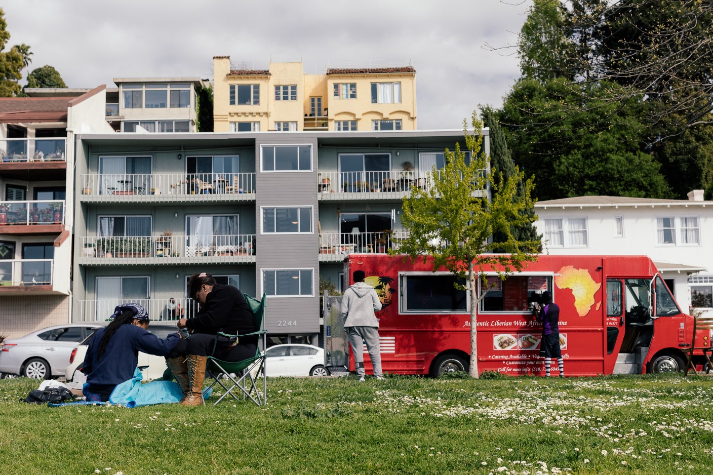
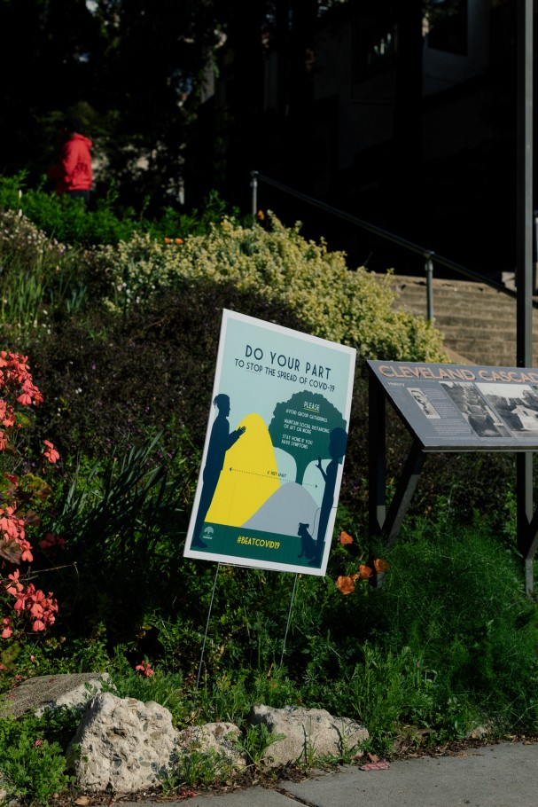
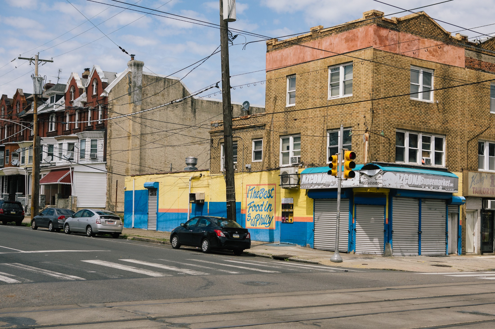
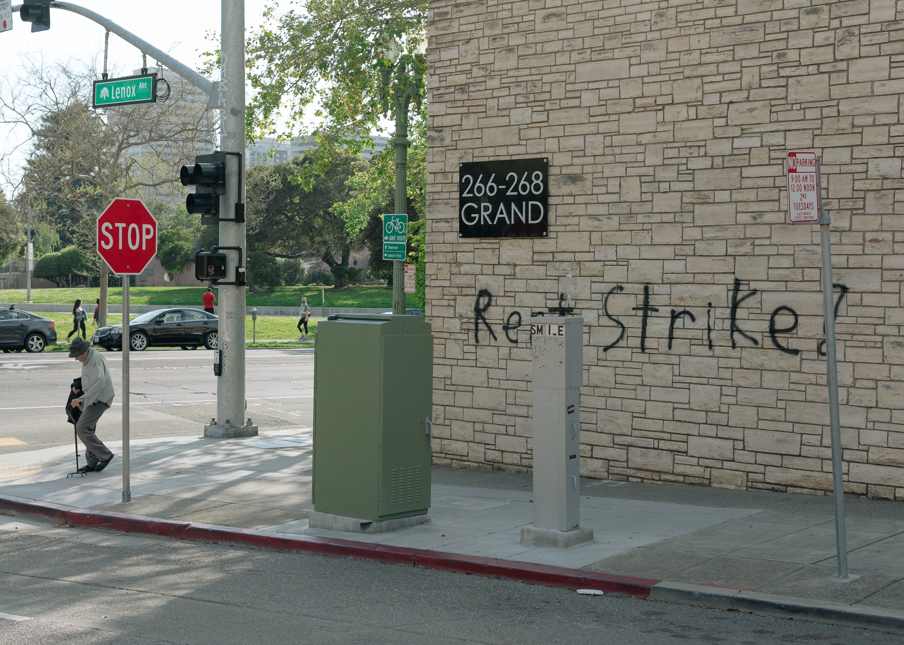

Meet the Tenants Who Refuse to Pay Rent - GEN

#### Top highlight

Shani Robin on the porch of her building in West Philadelphia, Pennsylvania. She has been organizing a rent strike with fellow tenants. Photo: [Michelle Gustafson](http://www.michellegustafsonphoto.com/)

# Meet the Tenants Who Refuse to Pay Rent

## The rent was due on April 1 and these tenants have no intention of paying it — not now, not ever

[Bryce Covert](https://gen.medium.com/@brycecovert?source=post_page-----e03ddd3d6f49----------------------)

[Apr 20](https://gen.medium.com/meet-the-rent-strikers-of-the-pandemic-recession-e03ddd3d6f49?source=post_page-----e03ddd3d6f49----------------------) · 10 min read

Terra Thomas, a 35-year-old florist in Oakland, knew things were going to get ugly. On March 11, California Gov. Gavin Newsom [banned gatherings of 250 people](https://www.mercurynews.com/2020/03/12/coronavirus-gov-newsom-says-cancel-gatherings-over-250-statewide/), and a wedding she was doing floral arrangements for downsized to 50 guests, which meant half her team had to be taken off the project and she had to toss most of the flowers at her own expense. The following week, counties in her area [issued](https://www.sfchronicle.com/local-politics/article/Bay-Area-must-shelter-in-place-Only-15135014.php) shelter-in-place orders, and a few days later, Newsom [issued](https://www.kqed.org/science/1959566/california-gov-gavin-newsom-orders-state-to-shelter-in-place) a statewide order. “As soon as that happened, we lost everything for months,” Thomas said.

It couldn’t have come at a worse time. Thomas was beginning to emerge from the slow season; she saves up during the rest of the year to make it through January and February. The week of the shelter-in-place order would have been her first full week of work this year, and she had been booked solid through the summer. “I had work almost seven days a week,” she said. Now all of her events are canceled until at least July. “I feel like I planned ahead, I’d gotten through everything,” she said. “And then it’s all gone.”

With no money coming in, Thomas was afraid to spend what she did have on her $833 rent for her studio apartment. And she only has enough for April. “When I look at my budget for the next three months, I absolutely don’t have enough money for rent,” she said.

Her landlord, California real estate firm Mosser Companies, didn’t seem interested in helping her out. On March 24, the company posted a letter in her building: While it is “happy to work with our tenants who voice to us they are under financial hardship due to the current pandemic,” tenants would have to provide a “supporting document” that they weren’t able to work in order to qualify for a payment plan or deferral. But, it added, “we are unable to waive rent.” The company followed up by emailing her a letter saying, “If you are not currently facing a COVID-19 related hardship, please continue to pay rent as usual.” (Mosser didn’t respond to a request for comment.)

Terra Thomas is worried she’ll face repercussions not just for going on strike but for talking about it publicly. Photo: [Peter Prato](http://www.peterprato.com/)

As Thomas contemplated what to do, a friend mentioned they were going on rent strike. She knew she wasn’t the only one experiencing hardship and worrying about April 1. So her friend got her in touch with a Bay Area rent strike group that provided her with resources about how to join the wave of rent strikes. She decided to organize the rest of her building, reaching out to her neighbors to explain what she wanted to do, and they met in the backyard, where everyone wore masks and stood six feet apart, discussing the pros and cons. Some of her neighbors had lost their gig work already; others who have salaries and are working from home were worried they’ll lose their jobs in the ensuing recession. No one opposed the strike, Thomas says, although some were too afraid to risk it.

Rather than mailing a rent check on April 1, Thomas and the residents of three other apartments sent Mosser a letter informing the company they were going on a rent strike. Another two tenants sent solidarity letters, promising to join the strike next month if nothing changed. As of mid-April, they hadn’t received a response.

* * *

*...*

Thomas is not alone. At the end of March, tenants across the country banded together with their neighbors and refused to pay rent for the month of April in the face of a viral pandemic that forced at least [22 million people](https://www.cnn.com/2020/04/16/economy/unemployment-benefits-coronavirus/index.html) to file for unemployment. Hundreds of people are on strike in the Bay Area alone; according to the National Multifamily Housing Council, [31% of renters](https://www.wsj.com/articles/nearly-a-third-of-u-s-renters-didnt-pay-april-rent-11586340000) across the country didn’t pay on April 1. Nearly 10 million people were already struggling to afford rent before the crisis, and the National Low Income Housing Coalition [estimates at least 1.5 million](https://nlihc.org/sites/default/files/Need-for-Rental-Assistance-During-the-COVID-19-and-Economic-Crisis.pdf?ct=t%28update_040720%29) will now be in the same boat.

[ ## The Social Distancing Backlash Is Here   ### A growing array of people on the left and the right are questioning how policies meant to stop the virus are being…    #### gen.medium.com](https://gen.medium.com/the-social-distancing-backlash-is-here-a97ba08bd5c6)

Thomas was familiar with the concept of a rent strike but had never withheld rent before, always paying it on time. But she has little in savings, and what she does have she needs for necessities like food or her health car premium on California’s Affordable Care Act exchange.

Rent strikers face an uneven legal landscape. Under normal circumstances, there’s nothing preventing a landlord from evicting someone who refuses to pay rent. But some cities and states have [issued eviction moratoriums](https://www.thenation.com/article/society/coronavirus-housing-evictions-economy/)—so has the [federal government](https://www.urban.org/urban-wire/cares-act-eviction-moratorium-covers-all-federally-financed-rentals-thats-one-four-us-rental-units) for any properties it finances—and strikers are shielded from being kicked out, for now. There’s also power in numbers. In a pandemic, if a landlord evicts the entire building, they will likely have a hard time filling those units with people who are willing, and able, to pay.

The tactic has worked before. A [rent strike](https://jwa.org/thisweek/dec/26/1907/pauline-newman) in New York City, which involved 10,000 families in 1907, led to 2,000 tenants getting their rents reduced, paving the way for rent control in the state. Another [wave of New York rent strikes](https://www.jstor.org/stable/40604898)in the 1960s erupted over poor maintenance of public and private housing. Those strikers succeeded in legalizing tenants’ power to withhold rent over shoddy conditions, but their buildings mostly remained decrepit.

Top: In Oakland and across the Bay Area, hundreds of people are refusing to pay their rent. Bottom: 52nd Street and Chester Avenue in West Philadelphia. Photos: [Peter Prato](http://www.peterprato.com/) (top), [Michelle Gustafson](http://www.michellegustafsonphoto.com/) (bottom)

Thomas’ rent strike isn’t a reaction to her cash flow. “If it just affected me and I had lost my job independently, I certainly wouldn’t go on a rent strike,” she said. Instead, it made sense to her because if tenants have lost their incomes en masse due to circumstances beyond their control, she doesn’t think landlords have a right to squeeze rent out of them to protect their own bottom lines. “I don’t know why their needs for income or profit supersede ours,” she said. Landlords, as with other mortgage holders, can currently seek a reduction or suspension in their payments for a year.

Some landlords, like [Mario Salerno](https://www.nytimes.com/2020/04/03/nyregion/coronavirus-nyc-landlord-mario-salerno.html), who owns 18 buildings in Brooklyn, have reacted to the current crisis by waiving rent voluntarily. But others insist on getting paid. The National Real Estate Investors Association, an industry trade group, has urged its members to reach out to tenants and figure out alternative plans. But COO Charles Tassell said, “It’s not that rent goes away. … Saying something just disappears or goes away is economically naive.” The organization is urging Congress to include rental assistance in its next relief package, but he pushed back on the idea a rent strike could bring landlords and tenants together to lobby for such a solution. “A rent strike doesn’t really benefit anyone, and I don’t think it puts anybody in a position of leverage,” he said. “Somebody who says, ‘I’m going to go on rent strike,’ is going to end up evicted.”

Thomas stresses her building’s strike isn’t “an attack on landlords. This is an attack on the system that got us here.” The financial pain of this recession is deep and widespread, but there is little aid flowing to renters. “Tenants historically have had very little voice compared with larger landlords and corporations and businesses,” Thomas said. A rent strike, however, could grab some attention and put pressure on the government to intervene. “If this is the way we need to make sure we’re heard, then this is how we have to do it.”

* * *

*...*

Not everyone on a rent strike is doing so because of a severe drop in income. Mary O’Leary**, **32, is still able to do her administrative assistant job from her apartment in the Crown Heights neighborhood of Brooklyn, but she knows “the other shoe hasn’t dropped yet.” Her employment could still be affected in the months to come. She has a neighbor who worked in food service and another who was a bartender, both of whom have no money coming in to pay rent.

When about half of the tenants in her building let her know they were going on strike, she decided to join them out of a sense of solidarity, and in case, her own economic situation changed. “One of our strike catchphrases is ‘Strike for your neighbors today and yourself tomorrow,’” she said. Currently, two-thirds of the 36 units are on strike. Others who had already paid April’s rent have said they may join in next month.

Their strike comes with demands: The landlord, Pacific Management, must reduce rents by 50% for all units and wipe it out completely for those who have lost their employment. This would give O’Leary and her fellow tenants more money to save for what’s coming. “In typical New York fashion, I’m living paycheck to paycheck,” she said. The tenants hope by striking, they can bring their landlord to the table to negotiate, but so far, they haven’t heard anything. She knows the company is aware, though. The strikers staged an action in which they all put out banners saying “cancel rent.” The landlord had the superintendent take them all down. (Pacific didn’t respond to a request for comment.)

O’Leary and her neighbors are also hoping their strike puts enough pressure on their landlord that the company, in turn, pressures the state government for more relief. She wants New York lawmakers to pass a pending bill that would [waive rent payments](https://gothamist.com/news/state-lawmakers-pushing-coronavirus-rent-cancellation-say-cuomo-mia) throughout the state for the next three months.

Shani Robin had already been withholding rent due to dangerous conditions in her apartment. Photo: [Michelle Gustafson](http://www.michellegustafsonphoto.com/)

Until such relief comes through, a rent strike for other tenants in New York is about sheer survival. Moreom Perven, 43**,** lives with her sister and her sister’s two children in Jamaica, Queens; she had already been looking for a job for a month when the city shut down businesses to stem the spread of the coronavirus. Her sister worked in a restaurant but has been unemployed since the shutdown. Paying the $1,042 rent “is totally impossible for me at this moment,” Perven said. It’s not like she had saved up for this scenario. Whatever savings she does have, she said, has to go to basics like food.

Perven is also incredibly scared. People in her building have already been hospitalized with Covid-19; one has died. An Uber driver on her floor is stuck in his apartment sick with the virus. She’s too afraid to leave her apartment to get food, even though they’re running low, so there’s no chance she can go out to find a job. Other people in her building are dealing with similar circumstances: Out of 185 units, about 50 can’t pay the rent because they’re locked down inside and can’t work. Most were hourly workers who aren’t able to work at home and keep getting paid. Perven can’t sleep most nights; she’ll fall asleep for a couple of hours and then wake up, her mind racing, worried about how she’s going to get by and whether she can keep her housing. “They’re saying this is going to go maybe until July. I don’t know how I’m going to survive.”

Shani Robin, a 36-year-old labor organizer in Philadelphia, has also lost her income in the pandemic shut down. All of her corporate contracts have been halted, and her grants are also not getting paid out. “We have no money coming in,” she said.

Robin and her partner were already withholding the $900 monthly rent from their landlord before the crisis to get dangerous conditions fixed in their apartment, where she is raising a toddler. A cabinet fell on her head, she says, and there’s a mouse infestation. “Then the pandemic hits, and we’re like, ‘Damn, now we really can’t pay rent,’” she said with a chuckle. “There’s literally nothing to give to the landlord.” By not paying rent, they at least have some money to buy food and pay some of their other, smaller bills. “The rent strike is the last straw,” she said. “With nothing else in our toolbox, this is the last thing.”

To get the whole building on board, Robin slid flyers under her neighbors’ doors saying she was organizing a rent strike. Everyone in the six-unit building eventually joined in. They sent an email to their landlord which said, in the face of the pandemic, they weren’t able to pay rent and thanking him for being flexible. In response, the landlord sent them a letter. “If you are not currently facing a Covid-19 related hardship, please continue to pay your rent as usual. If you are experiencing Covid-19 related financial challenges that will affect your ability to pay your rent on time, please contact the office,” it reads. “When this crisis becomes stable you must come current with your rent.”

Weeks after the rent was due, Terra Thomas is worried she’ll face repercussions not just for going on strike but also for talking about it so publicly. Even if her landlord can’t evict her during Oakland’s [eviction moratorium](https://www.oaklandca.gov/resources/oaklands-moratorium-on-residential-and-commercial-evictions), she still thinks she could be targeted for harassment or even blacklisted from other apartments in the future. But she also knows there are others in worse situations who can’t afford to do what she’s doing. “The potential cost of this right now, the benefits far outweigh that,” she said.

