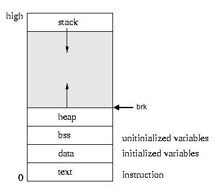

Memory Allocators 101 - Write a simple memory allocator

Memory Allocators 101 - Write a simple memory allocator

https://arjunsreedharan.org/post/148675821737/memory-allocators-101-write-a-simple-memory

Code related to this article: github.com/arjun024/memalloc This article is about writing a simple memory allocator in C. We will implement malloc(), calloc(), realloc() and free(). This is a beginner...