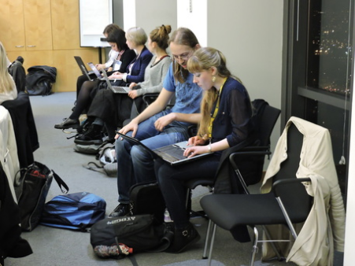

Mentors

# Mentors

## **WANTED**: Instructors for CF:G courses around the UK & Ireland!

We have a lot of community courses planned for this year! All of our community courses are run for free, and we do this with the help of our amazing volunteer instructors.

Our instructors come from a variety of coding background, and include computer science/technical post graduates, company based professionals with programming experience, freelance developers and university lecturers. All instructors work on a voluntary basis.

We host courses at various different universities and company locations including: **Cambridge,** **Oxford, Warwick, Edinburgh, Manchester, Southampton, Bristol, St Andrews, Durham, UCL, Imperial, LSE and at Level 39, Twitter and ThoughtWorks, The Guardian and many more!**

**What do I need to do?**

Your role will be help young, ambitious women learn to code. The level 1 courses we run are Beginners Introduction to Web development, including HTML, CSS, Bootstrap, Javascript and JQuery, with Level 2 courses running in Python or Ruby. We also run one off [Masterclasses](http://www.codefirstgirls.org.uk/masterclasses.html) in things like iOS app development, UX/UI and API's.

**What sort of time commitment is this?**

You will be needed once a week (usually in the evenings) over 8 weeks, for two hours per session . Additionally there will be a small amount of preparation required ahead of the course start and in between lessons.

Instructors are not required to mark any homework, but we do ask that they allow students to contact then if they have any questions about the courses, and instructors also play a role in the student screening process.

**Why would I do this?**

We select bright and ambitious young women to take part on our courses, and you have the chance to change their lives. You will be giving these girls the invaluable skills that are becoming increasingly necessary. By giving up a few hours of your time a week you will open the doors for these women to an industry with endless opportunities. Moreover, you will help to build confidence in a set of women wanting to enter the industry.

What else do instructors gain from the experience:

- An opportunity to be part of a vibrant national network of  programming and ComSci professionals, where we pass on any opps to speak, teach, jobs etc. to our instructors.
- A great way to build confidence, and learn to present to people in a supported way.
- Preferential selection for our paid freelance instructor jobs on our paid corporate and professionals courses.
- An invitation to our annual Summer Party.
- An invitation to our annual conference (held in the autumn).
- An opportunity to develop your presenting and teaching skills.
- ​We are happy to provide references.

You can [hear a bit more from some of our instructors here](http://www.codefirstgirls.org.uk/meet-the-instructors.html)!

**Other helpful bit and bobs...**

- All lesson plans and teaching material are provided.
- We have a buddy scheme for new instructors, and aim to link all new instructors to current CF:G instructors for support and advice via email and our dedicated Facebook group.
- We prefer instructors to commit to a minimum of two semesters – reason being this allow time to settle, and also helps handover/continuity of knowledge and experience.
- We usually have a minimum of two instructors (dependent on class size), one who is more experienced in teaching to take a lead, and the other to support (usually where the instructor is new, or less experienced in teaching). Whilst the lead instructor usually does more teaching, both instructors should feel comfortable with running a class if required.
- Popular languages and skills we cover in our courses include CSS, HTML, Ruby, Python, JavaScript, JQuery, Github.

## Drop us a line here:

* Indicates required field

|     |     |
| --- | --- |
| Name * Email * Location * Comment * |  |

[Submit]()