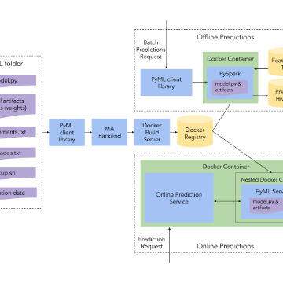

Michelangelo PyML: Introducing Uber's Platform for Rapid Python ML Model Development

Michelangelo PyML: Introducing Uber's Platform for Rapid Python ML Model Development

https://eng.uber.com/michelangelo-pyml/

Uber developed Michelangelo PyML to run identical copies of machine learning models locally in both real time experiments and large-scale offline prediction jobs.