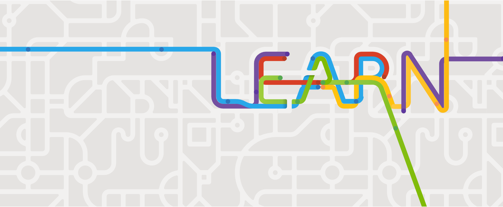
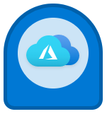
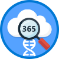
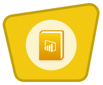
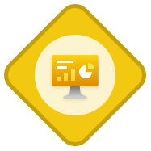
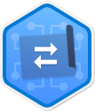
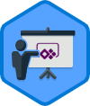

Microsoft Learn | Microsoft Docs

Welcome to Microsoft Learn

# Discover your path

Whether you're just starting or an experienced professional, our hands-on approach helps you arrive at your goals faster, with more confidence and at your own pace.

[Browse all paths](https://docs.microsoft.com/en-us/learn/browse/)

Learning Paths

## Learn on your own schedule

Explore a topic in-depth through guided paths or learn how to accomplish a specific task through individual modules.

[Browse all learning options](https://docs.microsoft.com/en-us/learn/browse/)

Certifications

## Become Microsoft certified

Jump-start your career and demonstrate your achievements through industry-recognized Microsoft certifications.

[Explore Certifications](https://docs.microsoft.com/en-us/learn/certifications/)

Docs

## Get the details

Discover comprehensive documentation for consumers, developers, and IT administrators through tutorials and code examples.

[Find your solutions](https://docs.microsoft.com/)

## Popular learning paths and modules

-

Learning Path

[### Azure fundamentals](https://docs.microsoft.com/learn/paths/azure-fundamentals/)

    - 9 hr 48 min

    -

    - Azure
    - Developer
    - Beginner

-

Module

[### What is Microsoft 365?](https://docs.microsoft.com/learn/modules/what-is-m365/)

    - 11 min

    -
ＶＶＶＶＶ4.7 (10,593)

    - Microsoft 365
    - Administrator
    - Beginner

-

Module

[### Introduction to Microsoft 365 core services and features](https://docs.microsoft.com/learn/modules/intro-to-m365-core-services/)

    - 25 min

    -
ＶＶＶＶＶ4.7 (9,562)

    - Microsoft 365
    - Administrator
    - Beginner

-

Module

[### Introduction to teamwork in Microsoft 365](https://docs.microsoft.com/learn/modules/intro-to-teamwork-in-m365/)

    - 49 min

    -
ＶＶＶＶＶ4.7 (10,108)

    - Microsoft 365
    - Administrator
    - Beginner

-

Module

[### Introduction to Azure virtual machines](https://docs.microsoft.com/learn/modules/intro-to-azure-virtual-machines/)

    - 1 hr 7 min

    -
ＶＶＶＶＶ4.7 (6,605)

    - Azure
    - Administrator
    - Beginner

-

Module

[### Get started building with Power BI](https://docs.microsoft.com/learn/modules/get-started-with-power-bi/)

    - 47 min

    -
ＶＶＶＶＶ4.7 (10,436)

    - Power Platform
    - Business User
    - Beginner

-

Module

[### Introduction to PowerApps](https://docs.microsoft.com/learn/modules/introduction-power-apps/)

    - 18 min

    -
ＶＶＶＶＶ4.7 (1,463)

    - Power Platform
    - Business Analyst
    - Beginner

-

Module

[### Introduction to Microsoft 365 unified endpoint management](https://docs.microsoft.com/learn/modules/intro-to-m365-unified-endpoint-management/)

    - 15 min

    -
ＶＶＶＶＶ4.7 (4,059)

    - Microsoft 365
    - Administrator
    - Beginner

-

Module

[### Get data with Power BI Desktop](https://docs.microsoft.com/learn/modules/get-data-power-bi/)

    - 1 hr 15 min

    -
ＶＶＶＶＶ4.7 (7,066)

    - Power Platform
    - Business Analyst
    - Intermediate

[See what others are learningＴ](https://docs.microsoft.com/en-us/learn/browse/)

## Our current favorites

-

Learning Path

[### Architect migration, business continuity, and disaster recovery in Azure](https://docs.microsoft.com/learn/paths/architect-migration-bcdr/)

    - 6 hr 36 min
    - Intermediate

    - Solutions Architect

    - Azure

-

Learning Path

[### Upgrade Microsoft Office for IT at scale](https://docs.microsoft.com/learn/paths/m365-office-for-it/)

    - 1 hr 46 min
    - Intermediate

    - Administrator

    - Microsoft 365

-

Learning Path

[### Learn the basics of Power BI Desktop, Power Automate, and Power Apps](https://docs.microsoft.com/learn/paths/power-platform-introduction/)

    - 3 hr 14 min
    - Intermediate

    - Business User

    - Power Platform

