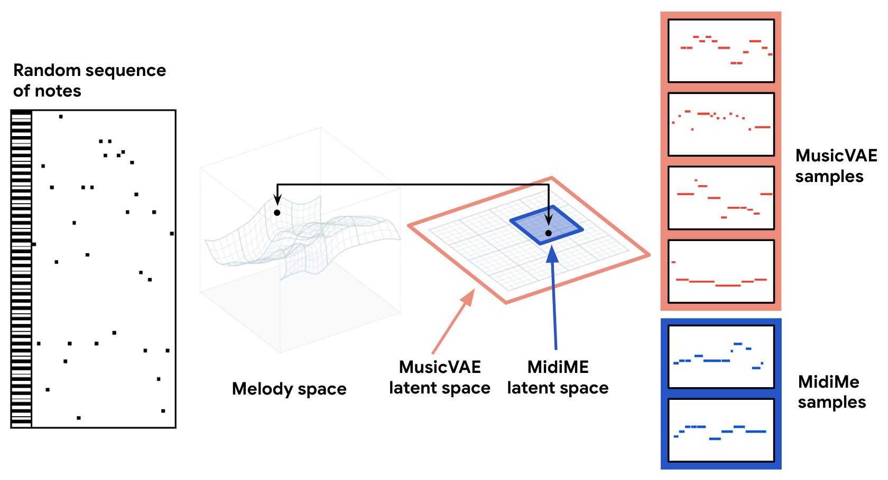
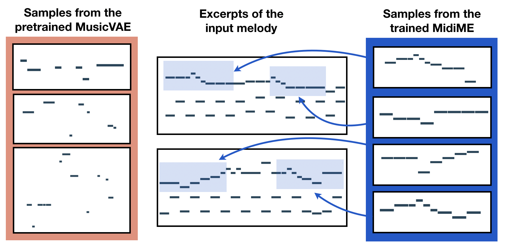
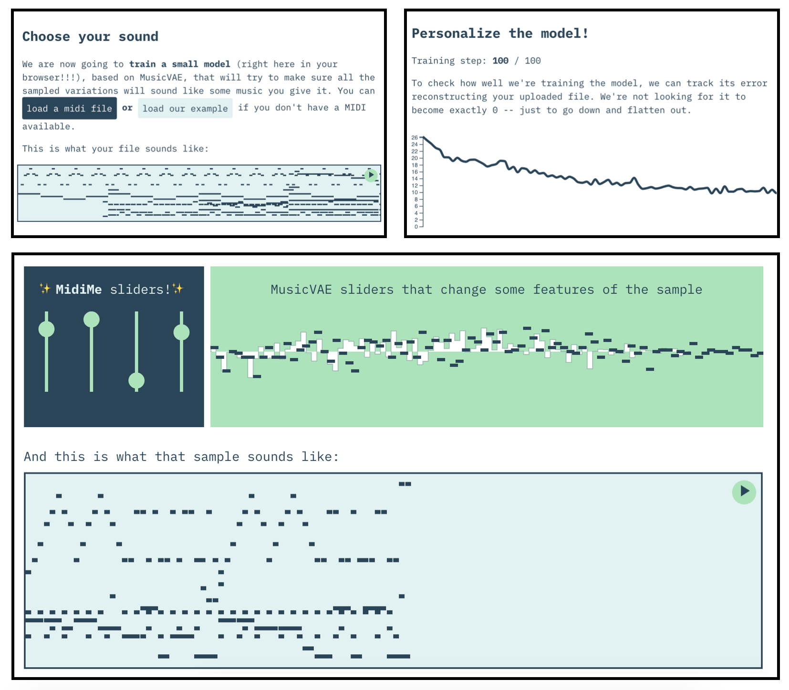
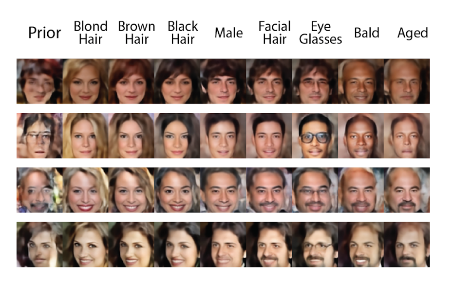
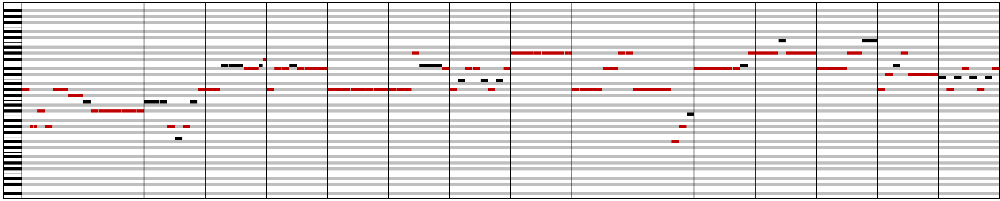
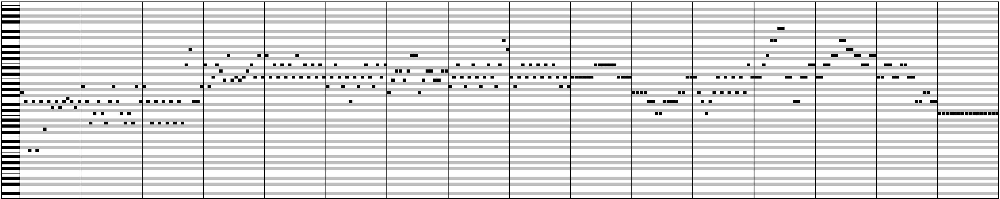
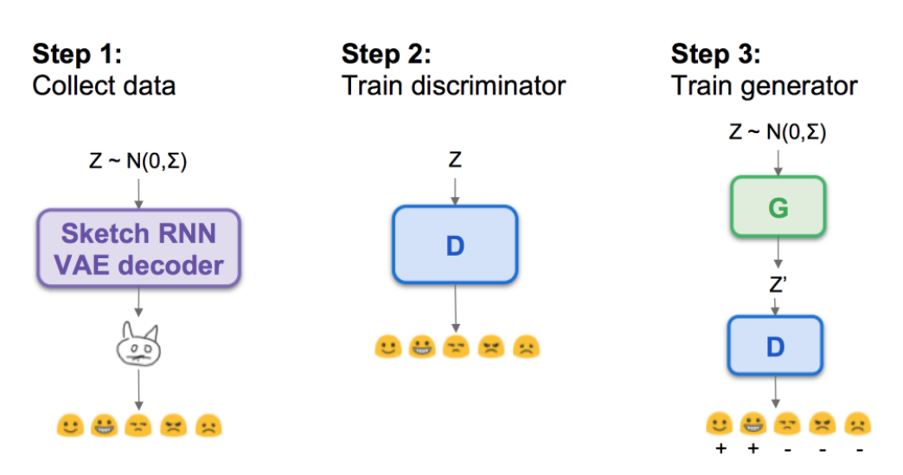
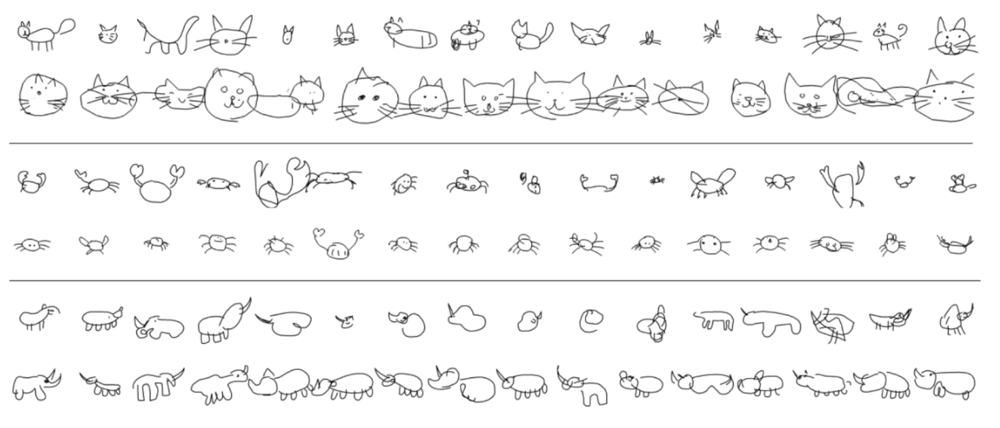
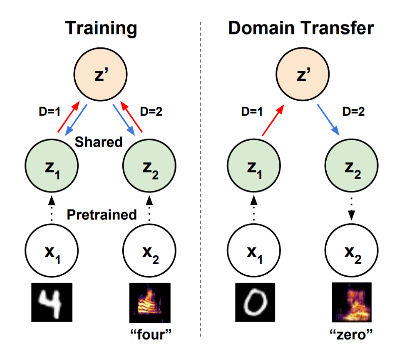
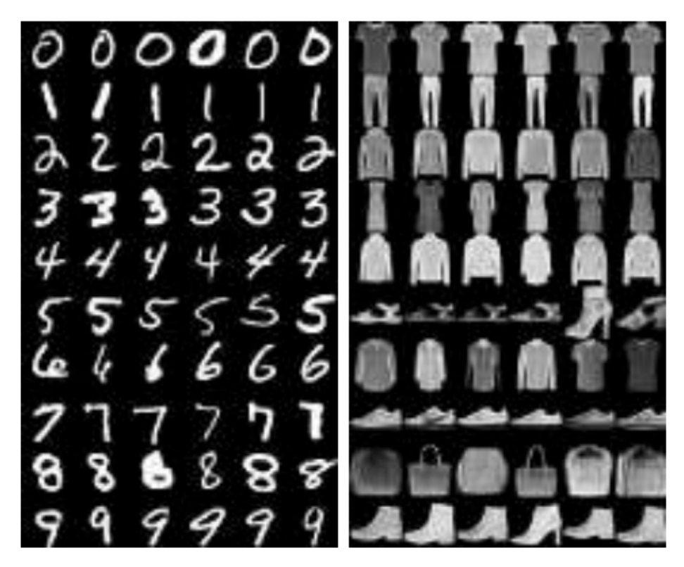

MidiMe: Personalizing MusicVAE

# MidiMe: Personalizing MusicVAE

 Jul 23, 2019

 [Monica Dinculescu](https://meowni.ca/)  [![](data:image/svg+xml,%3csvg xmlns='http://www.w3.org/2000/svg' viewBox='0 0 16 16' data-evernote-id='69' class='js-evernote-checked'%3e%3cpath d='M7.999%2c0.431c-4.285%2c0-7.76%2c3.474-7.76%2c7.761 c0%2c3.428%2c2.223%2c6.337%2c5.307%2c7.363c0.388%2c0.071%2c0.53-0.168%2c0.53-0.374c0-0.184-0.007-0.672-0.01-1.32 c-2.159%2c0.469-2.614-1.04-2.614-1.04c-0.353-0.896-0.862-1.135-0.862-1.135c-0.705-0.481%2c0.053-0.472%2c0.053-0.472 c0.779%2c0.055%2c1.189%2c0.8%2c1.189%2c0.8c0.692%2c1.186%2c1.816%2c0.843%2c2.258%2c0.645c0.071-0.502%2c0.271-0.843%2c0.493-1.037 C4.86%2c11.425%2c3.049%2c10.76%2c3.049%2c7.786c0-0.847%2c0.302-1.54%2c0.799-2.082C3.768%2c5.507%2c3.501%2c4.718%2c3.924%2c3.65 c0%2c0%2c0.652-0.209%2c2.134%2c0.796C6.677%2c4.273%2c7.34%2c4.187%2c8%2c4.184c0.659%2c0.003%2c1.323%2c0.089%2c1.943%2c0.261 c1.482-1.004%2c2.132-0.796%2c2.132-0.796c0.423%2c1.068%2c0.157%2c1.857%2c0.077%2c2.054c0.497%2c0.542%2c0.798%2c1.235%2c0.798%2c2.082 c0%2c2.981-1.814%2c3.637-3.543%2c3.829c0.279%2c0.24%2c0.527%2c0.713%2c0.527%2c1.437c0%2c1.037-0.01%2c1.874-0.01%2c2.129 c0%2c0.208%2c0.14%2c0.449%2c0.534%2c0.373c3.081-1.028%2c5.302-3.935%2c5.302-7.362C15.76%2c3.906%2c12.285%2c0.431%2c7.999%2c0.431z' data-evernote-id='70' class='js-evernote-checked'%3e%3c/path%3e%3c/svg%3e)notwaldorf](https://github.com/notwaldorf)  [![](data:image/svg+xml,%3csvg xmlns='http://www.w3.org/2000/svg' viewBox='0 0 16 16' data-evernote-id='74' class='js-evernote-checked'%3e%3cpath d='M15.969%2c3.058c-0.586%2c0.26-1.217%2c0.436-1.878%2c0.515c0.675-0.405%2c1.194-1.045%2c1.438-1.809c-0.632%2c0.375-1.332%2c0.647-2.076%2c0.793c-0.596-0.636-1.446-1.033-2.387-1.033c-1.806%2c0-3.27%2c1.464-3.27%2c3.27 c0%2c0.256%2c0.029%2c0.506%2c0.085%2c0.745C5.163%2c5.404%2c2.753%2c4.102%2c1.14%2c2.124C0.859%2c2.607%2c0.698%2c3.168%2c0.698%2c3.767 c0%2c1.134%2c0.577%2c2.135%2c1.455%2c2.722C1.616%2c6.472%2c1.112%2c6.325%2c0.671%2c6.08c0%2c0.014%2c0%2c0.027%2c0%2c0.041c0%2c1.584%2c1.127%2c2.906%2c2.623%2c3.206 C3.02%2c9.402%2c2.731%2c9.442%2c2.433%2c9.442c-0.211%2c0-0.416-0.021-0.615-0.059c0.416%2c1.299%2c1.624%2c2.245%2c3.055%2c2.271 c-1.119%2c0.877-2.529%2c1.4-4.061%2c1.4c-0.264%2c0-0.524-0.015-0.78-0.046c1.447%2c0.928%2c3.166%2c1.469%2c5.013%2c1.469 c6.015%2c0%2c9.304-4.983%2c9.304-9.304c0-0.142-0.003-0.283-0.009-0.423C14.976%2c4.29%2c15.531%2c3.714%2c15.969%2c3.058z' data-evernote-id='75' class='js-evernote-checked'%3e%3c/path%3e%3c/svg%3e)notwaldorf](https://twitter.com/notwaldorf)

 [Jesse Engel](https://g.co/magenta/jesse_engel)  [![](data:image/svg+xml,%3csvg xmlns='http://www.w3.org/2000/svg' viewBox='0 0 16 16' data-evernote-id='81' class='js-evernote-checked'%3e%3cpath d='M7.999%2c0.431c-4.285%2c0-7.76%2c3.474-7.76%2c7.761 c0%2c3.428%2c2.223%2c6.337%2c5.307%2c7.363c0.388%2c0.071%2c0.53-0.168%2c0.53-0.374c0-0.184-0.007-0.672-0.01-1.32 c-2.159%2c0.469-2.614-1.04-2.614-1.04c-0.353-0.896-0.862-1.135-0.862-1.135c-0.705-0.481%2c0.053-0.472%2c0.053-0.472 c0.779%2c0.055%2c1.189%2c0.8%2c1.189%2c0.8c0.692%2c1.186%2c1.816%2c0.843%2c2.258%2c0.645c0.071-0.502%2c0.271-0.843%2c0.493-1.037 C4.86%2c11.425%2c3.049%2c10.76%2c3.049%2c7.786c0-0.847%2c0.302-1.54%2c0.799-2.082C3.768%2c5.507%2c3.501%2c4.718%2c3.924%2c3.65 c0%2c0%2c0.652-0.209%2c2.134%2c0.796C6.677%2c4.273%2c7.34%2c4.187%2c8%2c4.184c0.659%2c0.003%2c1.323%2c0.089%2c1.943%2c0.261 c1.482-1.004%2c2.132-0.796%2c2.132-0.796c0.423%2c1.068%2c0.157%2c1.857%2c0.077%2c2.054c0.497%2c0.542%2c0.798%2c1.235%2c0.798%2c2.082 c0%2c2.981-1.814%2c3.637-3.543%2c3.829c0.279%2c0.24%2c0.527%2c0.713%2c0.527%2c1.437c0%2c1.037-0.01%2c1.874-0.01%2c2.129 c0%2c0.208%2c0.14%2c0.449%2c0.534%2c0.373c3.081-1.028%2c5.302-3.935%2c5.302-7.362C15.76%2c3.906%2c12.285%2c0.431%2c7.999%2c0.431z' data-evernote-id='82' class='js-evernote-checked'%3e%3c/path%3e%3c/svg%3e)jesseengel](https://github.com/jesseengel)  [![](data:image/svg+xml,%3csvg xmlns='http://www.w3.org/2000/svg' viewBox='0 0 16 16' data-evernote-id='86' class='js-evernote-checked'%3e%3cpath d='M15.969%2c3.058c-0.586%2c0.26-1.217%2c0.436-1.878%2c0.515c0.675-0.405%2c1.194-1.045%2c1.438-1.809c-0.632%2c0.375-1.332%2c0.647-2.076%2c0.793c-0.596-0.636-1.446-1.033-2.387-1.033c-1.806%2c0-3.27%2c1.464-3.27%2c3.27 c0%2c0.256%2c0.029%2c0.506%2c0.085%2c0.745C5.163%2c5.404%2c2.753%2c4.102%2c1.14%2c2.124C0.859%2c2.607%2c0.698%2c3.168%2c0.698%2c3.767 c0%2c1.134%2c0.577%2c2.135%2c1.455%2c2.722C1.616%2c6.472%2c1.112%2c6.325%2c0.671%2c6.08c0%2c0.014%2c0%2c0.027%2c0%2c0.041c0%2c1.584%2c1.127%2c2.906%2c2.623%2c3.206 C3.02%2c9.402%2c2.731%2c9.442%2c2.433%2c9.442c-0.211%2c0-0.416-0.021-0.615-0.059c0.416%2c1.299%2c1.624%2c2.245%2c3.055%2c2.271 c-1.119%2c0.877-2.529%2c1.4-4.061%2c1.4c-0.264%2c0-0.524-0.015-0.78-0.046c1.447%2c0.928%2c3.166%2c1.469%2c5.013%2c1.469 c6.015%2c0%2c9.304-4.983%2c9.304-9.304c0-0.142-0.003-0.283-0.009-0.423C14.976%2c4.29%2c15.531%2c3.714%2c15.969%2c3.058z' data-evernote-id='87' class='js-evernote-checked'%3e%3c/path%3e%3c/svg%3e)jesseengel](https://twitter.com/jesseengel)

 [Adam Roberts](https://g.co/magenta/adam_roberts)  [![](data:image/svg+xml,%3csvg xmlns='http://www.w3.org/2000/svg' viewBox='0 0 16 16' data-evernote-id='93' class='js-evernote-checked'%3e%3cpath d='M7.999%2c0.431c-4.285%2c0-7.76%2c3.474-7.76%2c7.761 c0%2c3.428%2c2.223%2c6.337%2c5.307%2c7.363c0.388%2c0.071%2c0.53-0.168%2c0.53-0.374c0-0.184-0.007-0.672-0.01-1.32 c-2.159%2c0.469-2.614-1.04-2.614-1.04c-0.353-0.896-0.862-1.135-0.862-1.135c-0.705-0.481%2c0.053-0.472%2c0.053-0.472 c0.779%2c0.055%2c1.189%2c0.8%2c1.189%2c0.8c0.692%2c1.186%2c1.816%2c0.843%2c2.258%2c0.645c0.071-0.502%2c0.271-0.843%2c0.493-1.037 C4.86%2c11.425%2c3.049%2c10.76%2c3.049%2c7.786c0-0.847%2c0.302-1.54%2c0.799-2.082C3.768%2c5.507%2c3.501%2c4.718%2c3.924%2c3.65 c0%2c0%2c0.652-0.209%2c2.134%2c0.796C6.677%2c4.273%2c7.34%2c4.187%2c8%2c4.184c0.659%2c0.003%2c1.323%2c0.089%2c1.943%2c0.261 c1.482-1.004%2c2.132-0.796%2c2.132-0.796c0.423%2c1.068%2c0.157%2c1.857%2c0.077%2c2.054c0.497%2c0.542%2c0.798%2c1.235%2c0.798%2c2.082 c0%2c2.981-1.814%2c3.637-3.543%2c3.829c0.279%2c0.24%2c0.527%2c0.713%2c0.527%2c1.437c0%2c1.037-0.01%2c1.874-0.01%2c2.129 c0%2c0.208%2c0.14%2c0.449%2c0.534%2c0.373c3.081-1.028%2c5.302-3.935%2c5.302-7.362C15.76%2c3.906%2c12.285%2c0.431%2c7.999%2c0.431z' data-evernote-id='94' class='js-evernote-checked'%3e%3c/path%3e%3c/svg%3e)adarob](https://github.com/adarob)  [![](data:image/svg+xml,%3csvg xmlns='http://www.w3.org/2000/svg' viewBox='0 0 16 16' data-evernote-id='98' class='js-evernote-checked'%3e%3cpath d='M15.969%2c3.058c-0.586%2c0.26-1.217%2c0.436-1.878%2c0.515c0.675-0.405%2c1.194-1.045%2c1.438-1.809c-0.632%2c0.375-1.332%2c0.647-2.076%2c0.793c-0.596-0.636-1.446-1.033-2.387-1.033c-1.806%2c0-3.27%2c1.464-3.27%2c3.27 c0%2c0.256%2c0.029%2c0.506%2c0.085%2c0.745C5.163%2c5.404%2c2.753%2c4.102%2c1.14%2c2.124C0.859%2c2.607%2c0.698%2c3.168%2c0.698%2c3.767 c0%2c1.134%2c0.577%2c2.135%2c1.455%2c2.722C1.616%2c6.472%2c1.112%2c6.325%2c0.671%2c6.08c0%2c0.014%2c0%2c0.027%2c0%2c0.041c0%2c1.584%2c1.127%2c2.906%2c2.623%2c3.206 C3.02%2c9.402%2c2.731%2c9.442%2c2.433%2c9.442c-0.211%2c0-0.416-0.021-0.615-0.059c0.416%2c1.299%2c1.624%2c2.245%2c3.055%2c2.271 c-1.119%2c0.877-2.529%2c1.4-4.061%2c1.4c-0.264%2c0-0.524-0.015-0.78-0.046c1.447%2c0.928%2c3.166%2c1.469%2c5.013%2c1.469 c6.015%2c0%2c9.304-4.983%2c9.304-9.304c0-0.142-0.003-0.283-0.009-0.423C14.976%2c4.29%2c15.531%2c3.714%2c15.969%2c3.058z' data-evernote-id='99' class='js-evernote-checked'%3e%3c/path%3e%3c/svg%3e)ada_rob](https://twitter.com/ada_rob)

One of the areas of interest for the Magenta project is to empower individual expression. But how do you personalize a machine learning model and make it your own?

Training your own model like Music Transformer, MusicVAE or SketchRNN from scratch requires lots of data (millions of data points), lots of compute power (on specialized hardware like GPUs/TPUs), and hyperparameter sorcery. What if you only have a laptop with a couple minutes of training data?

Without a lot of data, a model just memorizes the training data and doesn’t generalize to produce varied outputs – it would be like trying to learn all of music theory from a single song. Fine-tuning on a smaller dataset is a popular approach, but this still requires a lot of computation to modify the full network. However, since models like MusicVAE and SketchRNN learn a latent space, we can overcome this by training a separate “personalized” model to only generate from the parts of latent space we want.

Here, we introduce this approach to quickly train a small personalized model to control a larger pretrained latent variable model, based on prior work by [Engel et al](https://arxiv.org/abs/1711.05772). To show its application for creative interactions, we implement this in TensorFlow.js as a [standalone application](https://midi-me.glitch.me/), so that the model training happens in real-time, in a browser, closest to the end user. The model is also available in[Magenta.js](https://tensorflow.github.io/magenta-js/music/classes/_music_vae_midi_me_.midime.html).

 [(L)](https://midi-me.glitch.me/)

Using the **MidiMe** web demo, you can upload a MIDI file and sample songs that sound like variations of your original.

# Constraining MusicVAE samples

[MusicVAE](https://magenta.tensorflow.org/music-vae) is a hierarchical variational autoencoder that learns a summarized representation of musical qualities as a latent space. It encodes a musical sequence into a latent vector, which can then later be decoded back into a musical sequence. Because the latent vectors are regularized to be similar to a standard normal distribution, it is also possible to sample from the distribution of sequences, generating realistic music based on a random combination of qualities.

However, even though MusicVAE’s latent space is significantly smaller than the space of all possible note sequences, it was still trained to approximate many different melodies. This means that without knowing exactly which latent space a particular style or genre is encoded to, conditional sampling is not exactly possible. Even if you could encode a particular style to a latent vector, it’s hard to determine how to further modify each of the 256 dimensions to sample more melodies in that style.

To solve this, we train a *smaller* VAE on MusicVAE’s latent space. This smaller VAE (which we called “MidiMe”) learns a much smaller latent representation of the already encoded latent vectors. The intuition is that if 256 dimensions were enough to summarize the musical features of all training set melodies, then a much smaller number (like 4) can be enough to summarize the summarized musical feature of a particular melody. Visually, it looks like this:

 

**MidiMe** is a Variational Autoencoder trained on the latent space of MusicVAE.

The MidiMe model needs a batch of MusicVAE latent vectors for training – in practice, this can be done by taking an existing MIDI file, splitting it up in chunks of the same size, and using these chunks as the batch. Since MidiMe learns a subset of an existing MusicVAE model, its reconstruction or generative qualities depend a lot on the kind of MusicVAE model you start with.

 

Unlike the pretrained MusicVAE which has no knowledge of the input, samples from MidiMe resemble the structure of the input melody, without actually memorizing it.

For example, a *monophonic* MusicVAE model might be very good at reconstructing the melody of an input. As a result, a MidiMe model trained on the latent vectors from that MusicVAE will also learn to reconstruct the training data very well, and most of its generated samples will sound very close to the training data. In the examples below, even though the input itself isn’t monophonic, since the MusicVAE latent vectors only encode the melody, the MidiMe model does a good job at summarizing those melody features. Each sample below is repeated twice, so that you can hear the difference more easily.

|     |
| --- |
| **Monophonic samples from MusicVAE** |
|     |
| **Single instrument, polyphonic MIDI melody (A traditional [Christmas song](https://commons.wikimedia.org/wiki/File:Picking_Lasst_uns_froh_und_munter_sein_-_einfach.mid))** |
|     |
| **Monophonic samples from MidiMe (trained on that song)** |
|     |

In contrast, a *polyphonic* model like the MusicVAE trios model is optimized to generate very plausible samples, but not provide good reconstructions – the MidiMe model trained on this will generate samples that don’t sound identical to the training data, but have more motifs and musical patterns than the MusicVAE samples.

|     |
| --- |
| **Trio samples from MusicVAE** |
|     |
| **Polyphonic MIDI ("Deserve to be Loved" by [Tanner Helland](http://www.tannerhelland.com/12/deserve-to-be-loved/))** |
|     |
| **Trio samples from MidiMe (unlike the MusicVAE samples, the repetitive input melody line is preserved!)** |
|     |

To see what this looks like yourself, we’ve built an [app](https://midi-me.glitch.me/) that lets you upload your own midi and train your own MidiMe model, in your browser:

 

[Top left] The user can upload a MIDI file, visualize its features and listen to it. At this point (not shown), the user can also generate samples from the pre-trained model, and explore its latent space similarly to the bottom figure. [Top right] After uploading the input, the user can train the personalized MidiMe model directly in the browser. [Bottom] After training the MidiMe model, the user can control a much smaller latent space (4 dimensions instead of MusicVAE's 256). The generated samples at this point will preserve the features of the input (in this example, you can see the peaks of the original melody combined with non-memorized measures).

# Prior Work

### Latent Constraints

Personalization of generative models has always been a core interest of Magenta. In other words, we’re much more interested in letting an artist’s vision come through with custom machine learning tools than just imitating art and music that have already been made.

As we saw above, latent variable models offer one particular approach to customization. It is not the only way to customize a model (other approaches involve metalearning, fine-tuning, etc.), but it is uniquely data and compute efficient. This approach of learning to generate from a custom region of latent space can be thought of as applying a custom constraint to the latent space, or a *Latent Constraint*.

Latent Constraints were first introduced in the work of Engel et al. ([Paper](https://arxiv.org/abs/1711.05772), [Colab Notebook](https://colab.research.google.com/notebooks/latent_constraints/latentconstraints.ipynb)), by constraining the latent space of a VAE with a separate Generative Adversarial Network (GAN) trained in latent space. This is sometimes referred to as a LC-GAN. For example, you could take an unconditional sample of a VAE trained on the CelebA dataset, and constrain it to generate faces with certain attributes.

 
**Latent Constraints** can generate samples with certain attributes.

One cool aspect of this approach is that constraints could be applied without providing any data/labels, but only rules on the output. In the example below, you can see how the LC-GAN constrains a MusicVAE to only output music in a certain key (red notes are out of key) and with a certain density. The general contour of the original sample is maintained because the LC-GAN is trained to pick the closest point in latent space that satisfies the constraint.

|     |
| --- |
| **Prior sample** |
|   |
| C Major Constraint |
|   |
| C Major + High Note Density Constraint |
|   |

Keep in mind this happens with a quick training (~100 iterations) after the main training, so anyone could provide their own rules for the model to follow.

### Social Awareness

Jaques et al. ([Paper](https://arxiv.org/abs/1802.04877)) followed up on this work by incorporating implicit feedback preferences from users. They first showed a bunch of prior samples from SketchRNN to people to see which samples caused people to smile or laugh the most. Using those labels they then trained an LC-GAN to constrain generation to those regions of latent space and found the resulting samples also caused people to have more positive affective responses.

 

Training an **LC-GAN** to constrain the generated samples to a region of the latent space.

We can see this LC-GAN in practice, using the SketchRNN drawings. The first row of each section below is the prior, and the second row is the LC-GAN output. Notice how the model is biased towards drawing cats with big cute cat faces, crabs with tiny cute bodies, and just all-around better looking rhinos.

 
Generating better looking drawing using an **LC-GAN**

### Latent Translation

LC-GAN is what we call an *implicit* latent constraint, because the model learns to implictly sample from the desired section of latent space without explicitly modeling the full density of that region of space. Using a VAE (LC-VAE) instead of a GAN would then be an *explicit* latent constraint. Tian et al. ([Paper](https://arxiv.org/abs/1902.08261)) applied this approach to learn to translate between the latent spaces of two different pretrained models. As shown below, by training a single shared LC-VAE on two pretrained models (in this case a MNIST VAE, and a spoken digit GAN), you can then transfer features between very different domains.

 

Domain transfer of features using an LC-VAE.

In the example below for transferring MNIST digits into Fashion-MNIST images, you can see that local similarities are preserved during the transfer process.

 
Transferring MNIST digits into Fashion-MNIST images.

### MidiMe

In the context of all that prior work, we can now see that MidiMe is just an LC-VAE applied to MusicVAE and trained on embeddings of data provided by you, to make your own custom MusicVAE.

## Future Work

Latent constraints are just one approach to personalization, and indeed, many really interesting models don’t have latent variables to constrain (for example, [Music Transformer](https://magenta.tensorflow.org/music-transformer)). We’re excited by the future possibilities of enabling easy custom generative models, so stay tuned!