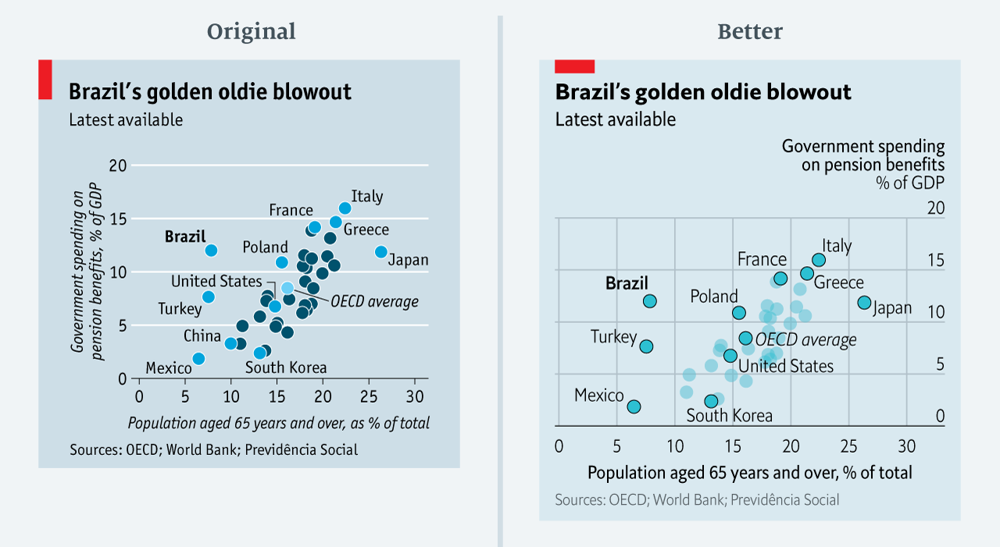
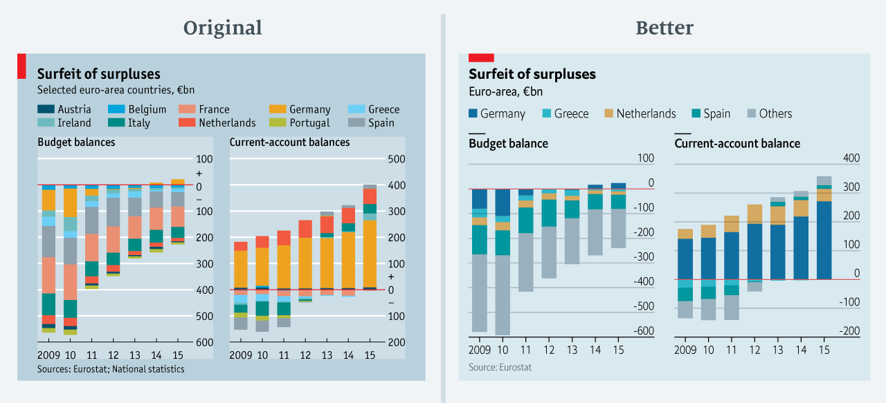
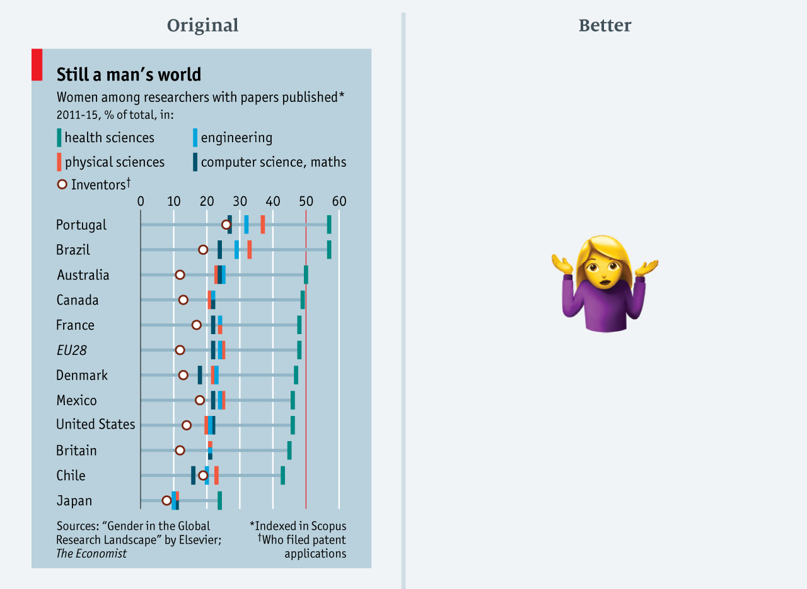

Mistakes, we’ve drawn a few – The Economist

# Mistakes, we’ve drawn a few

## Learning from our errors in data visualisation

[Sarah Leo](https://medium.economist.com/@sarahleo_59097)
Mar 27·8 min read

At *The Economist*, we take data visualisation seriously. Every week we publish around 40 charts across print, the website and our apps. With every single one, we try our best to visualise the numbers accurately and in a way that best supports the story. But sometimes we get it wrong. We can do better in future if we learn from our mistakes — and other people may be able to learn from them, too.

After a deep dive into our archive, I found several instructive examples. I grouped our crimes against data visualisation into three categories: charts that are (1) misleading, (2) confusing and (3) failing to make a point. For each, I suggest an improved version that requires a similar amount of space — an important consideration when drawing charts to be published in print.

*(A short disclaimer: Most of the “original” charts were published before our chart redesign. The improved charts are drawn to fit our new specs. The data are the same.)*

* * *

*...*

### Misleading charts

Let’s start with the worst of crimes in data visualisation: presenting data in a misleading way. We ***never*** do this on purpose! But it does happen every now and then. Let’s look at the three examples from our archive.

***> Mistake: Truncating the scale***

A bit left-field

[This chart](https://www.economist.com/britain/2016/08/13/the-metamorphosis) shows the average number of Facebook likes on posts by pages of the political left. The point of this chart was to show the disparity between Mr Corbyn’s posts and others.

The original chart not only downplays the number of Mr Corbyn’s likes but also exaggerates those on other posts. In the redesigned version, we show Mr Corbyn’s bar in its entirety. All other bars remain visible. *(Avid followers of this blog will have seen *[*another example*](https://medium.economist.com/the-challenges-of-charting-regional-inequality-a9376718348)* of this bad practice.)*

Another odd thing is the choice of colour. In an attempt to emulate Labour’s colour scheme, we used three shades of orange/red to distinguish between Jeremy Corbyn, other MPs and parties/groups. We don’t explain this. While the logic behind the colours might be obvious to a lot of readers, it perhaps makes little sense for those less familiar with British politics.

[*Download chart data*](http://infographics.economist.com/databank/Economist_corbyn.csv)

***> Mistake: Forcing a relationship by cherry-picking scales***

*A rare perfect correlation? Not really.*

The chart above accompanied a [story on the decline of dog weights](https://www.economist.com/britain/2016/08/13/subwoofers). On first glance, it appears that the weight and neck sizes of dogs are perfectly correlated. But is this true? Only to some extent.

In the original chart, both scales decrease by three units (from 21 to 18 on the left; from 45 to 42 on the right). In percentage terms, the left scale decreases by 14% while the right goes down by 7%. In the redesigned chart, I retained the double scale but adjusted their ranges to reflect a comparable proportional change.

Considering the jolly topic of this chart, this mistake may seem relatively minor. The message of the chart, after all, is the same in both versions. But the takeaway is important: if two series follow each other too closely, it is probably a good idea to have a closer look at the scales.

[*Download chart data*](http://infographics.economist.com/databank/Economist_dogs.csv)

***> Mistake: Choosing the wrong visualisation method***

*Views on Brexit almost as erratic as its negotiations*

We published this polling chart in Espresso, our daily news app. It shows attitudes to the outcome of the EU referendum, plotted as a line chart. Looking at the data, it appears as if respondents had a rather erratic view of the referendum result — increasing and decreasing by a couple of percentage points from one week to the next.

Instead of plotting the individual polls with a smoothed curve to show the trend, we connected the actual values of each individual poll. This happened, primarily, because our in-house charting tool does not plot smoothed lines. Until fairly recently, we were less comfortable with statistical software (like R) that allows more sophisticated visualisations. Today, all of us are able to plot a polling chart like the redesigned one above.

Another thing to note in this chart is the way in which the scale was broken. The original chart spreads the data wider than it should. In the redesigned version, I have left some more space between the start of the scale and the smallest data point. [Francis Gagnon](https://www.chezvoila.com/blog/yaxis) has put together a nice formula for this: aim for leaving at least 33% of the plot area free under a line chart that doesn’t start at zero.

[*Download chart data*](http://infographics.economist.com/databank/Economist_brexit.csv)

* * *

*...*

### Confusing charts

Not quite as criminal as a misleading chart, charts that are difficult to read are a sign of a visualisation job done badly.

***> Mistake: Taking the “mind-stretch” a little too far***

… what?

At *The Economist*, we’re encouraged to produce “mind-stretching” journalism. But, sometimes, we take this too far. [The chart above](https://www.economist.com/briefing/2017/01/21/peter-navarro-is-about-to-become-one-of-the-worlds-most-powerful-economists) shows the United States’ trade deficit in goods and the number of people employed in manufacturing.

The chart is incredibly difficult to read. It has two main problems. First, the values of one data series (trade deficit) are entirely negative, while the others (manufacturing employment) are all positive. It is challenging to combine such disparities in one chart without flattening either data series. The apparent “solution” to this leads to the second problem: the two data series don’t share a common baseline. The baseline of the trade deficit is at the top of the chart (highlighted by a red line drawn across half of the chart body). The baseline of the right scale is at the bottom.

The redesigned chart shows that there wasn’t any need to combine the two data series. The relationship between the trade deficit and manufacturing employment remains clear and only takes a minimal amount of extra space.

[*Download chart data*](http://infographics.economist.com/databank/Economist_us-trade-manufacturing.csv)

***> Mistake: Confusing use of colour***

50 Shades of Blue

[This chart](https://www.economist.com/the-americas/2017/02/25/reducing-brazils-pension-burden) compares government spending on pension benefits with the share of people aged 65+ for a selection of countries, with a particular focus on Brazil. To keep the chart small, the visualiser only labelled a selection of countries and highlighted those in electric blue. The OECD average is highlighted in pale blue.

The visualiser (me!) ignored the fact that a change of colour often implies a categorical change. On first glance, this seems to be the case in this chart too — all electric blue colours seem to belong to a different grouping to the dark blue ones. This is not the case. The only thing they have in common is that they were chosen to be labelled.

In the redesigned version, the colour of the circles remains the same for all countries. I have changed the opacity of those that aren’t labelled to make the others stand out. Typography does the rest: Brazil, the focus country, is written in bold text, and the OECD average in italics.

[*Download chart data*](http://infographics.economist.com/databank/Economist_pensions.csv)

* * *

*...*

### Charts that conceal their point

The mistakes in this final category are less obvious. Charts like these are not misleading, nor are they very confusing. They merely fail to justify their existence — often because they have been visualised incorrectly or because we tried to cram too much in too little space.

***> Mistake: Including too much detail***

*“The more colours the better!” — No good data visualiser, ever*

What a rainbow! We published [this chart](https://www.economist.com/finance-and-economics/2016/09/03/more-spend-less-thrift) in a column on Germany’s budget surplus. It shows the budget balances and current-account balances for ten euro-area countries. With so many colours — some of which are quite difficult to distinguish or even see because the values are so small — the chart’s message is impossible to make out. It almost tempts you to glaze over and move on. And, more importantly, since we are not plotting all euro-area countries it doesn’t make any sense to stack the data.

I revisited the story to see if there was a way to simplify this chart a little. The column mentions Germany, Greece, the Netherlands, Spain and the euro-area total. In the redesigned version of the chart, I decided to only highlight those. To resolve the problem of stacking only a selection of countries, I added another category (“Others”) that includes all other euro-area countries. *(The total current-account balance in the redesigned chart is lower than in the original chart. This is because of a data revision from Eurostat.)*

[*Download chart data*](http://infographics.economist.com/databank/Economist_eu-balance.csv)

***> Mistake: Lots of data, not enough space***

*I give up.*

Confined by the limited space on a page, we are often tempted to force all the data we have into a slot that’s way too small. Although this saves valuable space on the page, it has consequences — as shown in this chart, from [March 2017](https://www.economist.com/science-and-technology/2017/03/11/science-remains-male-dominated). The story is about how scientific publishing is dominated by men. All data points are equally interesting and relevant to the story. But by presenting such a lot of data — four research-field categories as well as the share of inventors — the information is hard to take in.

After giving it quite a lot of thought, I decided not to redesign this chart. If I were to keep all the data, the chart would have become way too big to go with a concise story. In cases like this, it would be better to cut something. Alternatively, we could show some sort of average measure, e.g. the average share of publications by women across all fields. *(Please let me know if you have any ideas on how to visualise this in a tight space! I’d love to hear your ideas.)*

[*Download chart data*](http://infographics.economist.com/databank/Economist_women-research.csv)

* * *

*...*

Best practices in data visualisation are evolving fast: what may be acceptable today can be frowned upon tomorrow. New and better techniques are emerging all the time. Have you ever committed a chart crime that could have been fixed easily? Let us know!

*Sarah Leo is a visual data journalist at The Economist*.