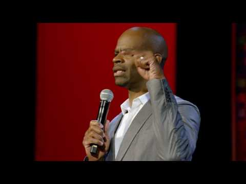

More than funny | Michael Jr. | TEDxUniversityofNevada - YouTube

More than funny | Michael Jr. | TEDxUniversityofNevada
https://www.youtube.com/watch?v=twSvd5bQLDw
[TEDx Talks](https://www.youtube.com/channel/UCsT0YIqwnpJCM-mx7-gSA4Q)
520,672 views views
Published on Feb 14, 2017

|     |
| --- |
| [(L)](https://www.youtube.com/watch?v=twSvd5bQLDw) |

Description

With comedy, you not only laugh but you also gain understanding in a unique way. Comedy has a setup and then a punch line. The setup moves the audience in one direction-toward what is expected. The punch line occurs when you change direction and take the audience to the unexpected. This same process can be applied to life. Comedian Michael Jr. shows how to take your life's setups and then change direction in a way that brings fulfillment, revelation, and joy not only to you but also to those around you.

Once in a generation, a comedian comes along who speaks to everyone. Today, that comedian is known simply as Michael Jr.

Watch him onstage and you’ll see a man at ease…with himself, his audience, and his message. Listen to his voice and you’ll detect a comfortable, conversational style that hides a sly sense of mischief. Hear his words and you’ll laugh at the universal themes that connect us all.

This talk was given at a TEDx event using the TED conference format but independently organized by a local community. Learn more at [http://ted.com/tedx](https://www.youtube.com/redirect?q=http%3A%2F%2Fted.com%2Ftedx&redir_token=3nuFKYG2OIeZ2RvUwKT65HKgEc18MTUxNzcwODgyOEAxNTE3NjIyNDI4&v=twSvd5bQLDw&event=video_description)