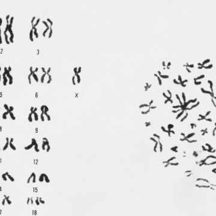

Most White Americans’ DNA Can Be Identified Through Genealogy Databases

Most White Americans’ DNA Can Be Identified Through Genealogy Databases

https://www.nytimes.com/2018/10/11/science/science-genetic-genealogy-study.html?emc=edit_ne_20181015&nl=evening-briefing&nlid=7298217820181015&te=1

A study found that it will soon be possible to identify the DNA of 90 percent of European Americans through cousins in genealogy databases.