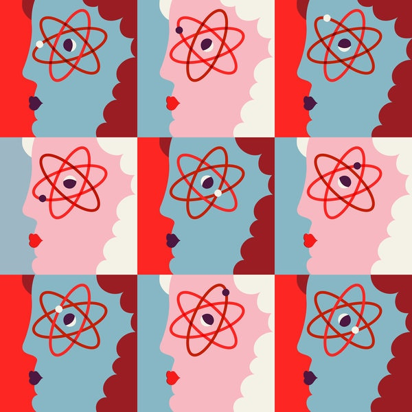
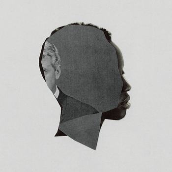
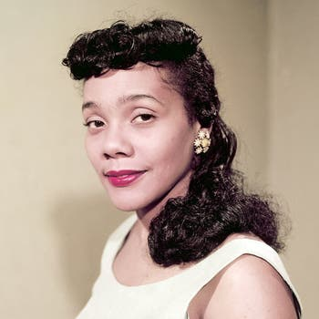
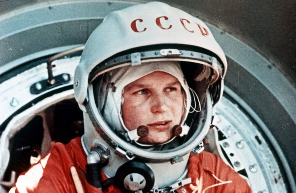

Most Wikipedia Profiles Are of Men. This Scientist Is Changing That.

In her words

# Most Wikipedia Profiles Are of Men. This Scientist Is Changing That.Most Wikipedia Profiles Are of Men. This Scientist Is Changing That.

Jessica Wade has added nearly 700 Wikipedia biographies for important female and minority scientists in less than two years.

CreditAmrita Marino

Image

CreditCreditAmrita Marino

By [Maya Salam](https://www.nytimes.com/by/maya-salam)

- July 19, 2019

-

    - 
    - 
    - [](https://www.nytimes.com/2019/07/19/science/jess-wade-wikipedia-science-women.htmlmailto:?subject=NYTimes.com%3A%20Most%20Wikipedia%20Profiles%20Are%20of%20Men.%20This%20Scientist%20Is%20Changing%20That.&body=From%20The%20New%20York%20Times%3A%0A%0AMost%20Wikipedia%20Profiles%20Are%20of%20Men.%20This%20Scientist%20Is%20Changing%20That.%0A%0AJessica%20Wade%20has%20added%20nearly%20700%20Wikipedia%20biographies%20for%20important%20female%20and%20minority%20scientists%20in%20less%20than%20two%20years.%0A%0Ahttps%3A%2F%2Fwww.nytimes.com%2F2019%2F07%2F19%2Fscience%2Fjess-wade-wikipedia-science-women.html)

    -
    -
    -
*You’re reading In Her Words, where women rule the headlines. *

[*Sign up*](https://www.nytimes.com/newsletters/in-her-words?module=inline)* here to get it delivered to your inbox. *

*Let me know what you think at *[*dearmaya@nytimes.com*](https://www.nytimes.com/2019/07/19/science/jess-wade-wikipedia-science-women.htmlmailto:dearmaya@nytimes.com).

* * *

***“Our science can only benefit the whole of society if it’s done by the whole of society.”***

*— ****Dr.****  ****Jessica Wade****,** a physicist who adds biographies of female and minority scientists to Wikipedia daily*

* * *

Fewer than [20 percent](https://www.thelily.com/wikipedia-has-15-million-biographies-in-english-only-17-percent-are-about-women/) of biographies on Wikipedia in English are of women, according to [Women in Red](https://en.wikipedia.org/wiki/Women_in_Red), Wikipedia’s gender gap-bridging project. Jessica Wade, a British physicist troubled by that number, made it her mission to help change it.

In late 2017, she started writing biographies of women and other minorities in science and engineering. Her first addition was Kim Cobb, an American climate scientist who studies cave stalagmites and corals.

Dr. Wade’s favorite entries include the mathematician Gladys West, who was inducted into the Air Force Space and Missile Pioneers Hall of Fame; the physicist June Lindsey, who was influential in the discovery of DNA; and Ijeoma Uchegbu, known for her research in pharmaceutical nanoscience.

All in all, she has added 670 profiles so far.

I asked Dr. Wade, who researches light-emitting diodes, or LEDs, and works at the Blackett Laboratory at Imperial College London, about her motivation for tipping the scale.

______

**Women are underrepresented in so many aspects of society. Why focus on Wikipedia? **

English Wikipedia gets 32 million page views a day, and the majority of content on Wikipedia, about 90 percent, is created by white men in North America. That really impacts the quality and kind of quantity of bios about women, people of color particularly.

## Editors’ Picks

[  ### I Wanted to Know What White Men Thought About Their Privilege. So I Asked.](https://www.nytimes.com/2019/07/17/magazine/white-men-privilege.html?fallback=0&recId=1OKr8DPEDY063XKdVgqtk00ZNQz&locked=0&geoContinent=EU&geoRegion=CMD&recAlloc=story&geoCountry=GB&blockId=home-featured&imp_id=987899740&action=click&module=editorContent&pgtype=Article&region=CompanionColumn&contentCollection=Trending)

[  ### A Last Look at Ebony’s Archives, Before They’re Sold](https://www.nytimes.com/2019/07/16/us/ebony-magazine-photographs-auction.html?fallback=0&recId=1OKr8DPEDY063XKdVgqtk00ZNQz&locked=0&geoContinent=EU&geoRegion=CMD&recAlloc=story&geoCountry=GB&blockId=home-featured&imp_id=834178387&action=click&module=editorContent&pgtype=Article&region=CompanionColumn&contentCollection=Trending)

We don’t make as many encyclopedia books anymore, or as many textbooks. Wikipedia is really the only peer-reviewed, crowdsourced, democratized access to information for every single person in the world to be able to read and contribute to.

If you put content on there, people don’t only read it, it changes their perception about who they think does science and what they think science is.

______
**And what is that perception?**

I’ve always done a lot of work to try to get young people — particularly girls and children from lower socioeconomic backgrounds and people of color — to think about studying physics at high school, because physics is still very much that kind of elitist, white boy subject.

Our science can only benefit the whole of society if it’s done by the whole of society. And that’s not currently the case.

______
**Tell me about your process.**

The process is finding people first — usually it’s an award holder, someone who’s been given a fellowship, someone who’s published a really great paper or somebody who’s done a recent really good talk. Every morning, I go on Twitter and I’ll look.

Then I check if they meet the notability criteria on Wikipedia, which is a set of rules to determine whether someone is important enough to be on the site.*  *

*A*nd then I do a bunch of research, and I write as I go. So I’ll have like 20 tabs open with all different aspects of their career and then start to stitch together a biography from that. It’s really like a journey.

Advertisement

______
**Is this a problem one woman can solve? **

I’ve worked with my heroic friend Maryam Zaringhalam, science communicator and policy fellow at the American Association for the Advancement of Science, to host mass editing sessions (editathons) all over the world. We’ve led editathons at science conferences, high schools and learned societies. We’ve also worked with local Wikipedia chapters to improve coverage about science and scientists in other language Wikipedias.

In general, most people think making the internet better — particularly the content people see and use in education — is a good thing. I’m really excited and inspired by people’s enthusiasm.

[*Sign up here*](http://p.nytimes.com/email/re?location=hdaNaYedr2/IomeWRKt0nffrak8aSGLbQgZx2X6d46Rnob6+v5ooY02ZQ5Ri0WXrxz6gI9YHeRDsnNUeQ0LfWt0I2fIISHuR0CGNbGk8FpP31Kvg8KRznI6mQjqC5fKQQZMRQDihnI2BIy6bzD6PBON8weaz7onH/r6TUaZS9YALOMJqbKXNrrVS5NQPlgNjnI/sUkqH650snN0f2nqYgk5mAFkPI2vMQ7gEY+jK53hDoCkCLGxYFxjlMyyWAkp4lvYhmKM1k+iHaFquK7hcTyzNt7QciXYwdohVtx7AaqKE0VHMD2rKRWHRFXoVqgGyEw7CG0ZHgDmRKuhTLA36To2Lt8y4X4IqGlt8A64t1qE=&campaign_id=0&instance_id=0&segment_id=0&user_id=33c26f16d9ec305b2d275854959f2698&regi_id=0amp;nl=&emc=edit_gn_20180420)* to get future installments of In Her Words delivered to your inbox.*

______

## What else is happening

*Here are five articles from The Times you might have missed.*

Valentina Tereshkova, a Soviet cosmonaut, was the first woman in space. She orbited Earth 48 times on her solo mission in the Vostok 6 capsule, seen here. June 1963.CreditSovfoto/Universal Images Group, via Getty Images

Image

Valentina Tereshkova, a Soviet cosmonaut, was the first woman in space. She orbited Earth 48 times on her solo mission in the Vostok 6 capsule, seen here. June 1963.CreditSovfoto/Universal Images Group, via Getty Images

- **“We cannot allow the first woman in space to be American.” **America may have put the first man on the moon, but the Soviets sent the first woman into space. [[Read the story](https://www.nytimes.com/2019/07/16/us/how-the-soviets-won-the-space-race-for-equality.html)]
- **“The entire deck is stacked against women.”** Chinese women are healthier, wealthier and more educated than ever before. But at the workplace and at home, they face growing discrimination. [[Read the story](https://www.nytimes.com/2019/07/16/world/asia/china-women-discrimination.html)]
- **“75 percent of abortion patients are poor or near-poor.”** If Roe v. Wade were overturned, what would happen across America? [[Read the story](https://www.nytimes.com/interactive/2019/07/18/upshot/roe-v-wade-abortion-maps-planned-parenthood.html)]
- **“I knew my race and gender meant he was wary of me and my questions.”** Claudia Rankine, a professor of poetry at Yale, wanted to know what white men thought about their privilege. So she asked. [[Read the story](https://www.nytimes.com/2019/07/17/magazine/white-men-privilege.html)]
- **“The complete refusal to be reasonable — that’s just been mind-boggling.”** At a Missouri jail, bras set off the metal detector and a heated debate. [[Read the story](https://www.nytimes.com/2019/07/17/us/underwire-bra-x-ray-machine.html)]

______

## From the archives: Why so few women in science?

At the Solvay Conference on Physics in 1927, the only woman in attendance was Marie Curie, front row, third from left.CreditMondadori Portfolio, via Getty Images

Image

At the Solvay Conference on Physics in 1927, the only woman in attendance was Marie Curie, front row, third from left.CreditMondadori Portfolio, via Getty Images

To accompany a 2013 article by Eileen Pollack — one of the first two women to earn a bachelor’s of science degree in physics from Yale (she graduated in 1978) — about [how few women are working at the highest levels in the sciences](https://www.nytimes.com/2013/10/06/magazine/why-are-there-still-so-few-women-in-science.html?ref=magazine&_r=0&module=inline), The New York Times published a photograph from the Fifth Solvay Conference in Physics, which took place in 1927.

Only one woman attended the conference, a periodic, invitation-only gathering of leaders in the field: the chemist and physicist Marie Curie, the first woman to win a Nobel Prize and the first person to receive two Nobel Prizes.

Seated two spots away from Curie, who died in 1934 at age 66, was Albert Einstein. In 2011, the centennial conference, two women were in attendance: Lisa Randall and Eva Silverstein, both American theoretical physicists.

[*Read past In Her Words here*](https://www.nytimes.com/series/in-her-words?module=inline)*.*

[*Sign up here to get this newsletter delivered to your inbox*](https://www.nytimes.com/newsletters/in-her-words?module=inline)*!*

- 
- 
- [](https://www.nytimes.com/2019/07/19/science/jess-wade-wikipedia-science-women.htmlmailto:?subject=NYTimes.com%3A%20Most%20Wikipedia%20Profiles%20Are%20of%20Men.%20This%20Scientist%20Is%20Changing%20That.&body=From%20The%20New%20York%20Times%3A%0A%0AMost%20Wikipedia%20Profiles%20Are%20of%20Men.%20This%20Scientist%20Is%20Changing%20That.%0A%0AJessica%20Wade%20has%20added%20nearly%20700%20Wikipedia%20biographies%20for%20important%20female%20and%20minority%20scientists%20in%20less%20than%20two%20years.%0A%0Ahttps%3A%2F%2Fwww.nytimes.com%2F2019%2F07%2F19%2Fscience%2Fjess-wade-wikipedia-science-women.html)

-

Advertisement