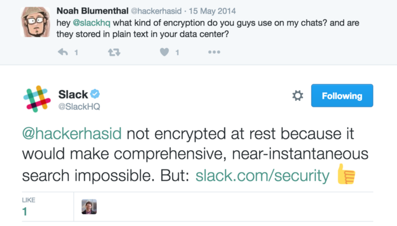

Moving beyond localStorage – Standard Journal

# Moving beyond localStorage

It’s hard to believe that as of 2016, the best method for offline storage in a web app was localStorage, a simple string-only key value store with a 5mb data limit. These kinds of stores are typically meant to store user preferences and basic user information. So if you wanted to build an application that offered end-to-end encryption AND search capability, you couldn’t. For this reason, we have had to make compromises in our privacy, at a cost that is everyday becoming more expensive.

But while we were selling our privacy cheaply and letting companies run amuck with our data, a brave few engineers have been building the future of the web, and we have yet to take full notice.

Search and encryption are one another’s arch enemies. Simply put, you can’t offer convenient search on top of encrypted data. And since most of the heavy lifting and data processing in web apps today are performed server side, servers **require** read access to all data. But if the server could read your data, then practically any engineer of the company could read your data, and if an engineer could read your data, then so could you know who.

Companies have been clutching on to this excuse with great leisure, and we have capitulated to their seemingly well reasoned response. However, in this great again year of 2017 which we find ourselves in today, that answer no longer holds up.

Enter WebCrypto and IndexedDB.

WebCrypto and IndexedDB are the one-two punch to a new era of encrypted, offline, and privacy centric web applications.

Before WebCrypto, practical applications wanting to perform crypto and encryption methods in the browser relied on libraries like CrpytoJS, a painfully slow library without access to proper system resources and lacking, amongst other things, a cryptographically secure random number generator. WebCrypto on the other hand is, to the most accurate description I could think of, a beast. Whereas the performance of a key derivation function like PBKDF2 in CryptoJS clocked in at around 5,000 hashes in 6 seconds, my simple WebCrypto tests had no problem running 1.5 million hashes in less than a second. This is the crypto library that the world of web apps have been so desperately awaiting.

On the other end is IndexedDB: a full, structured, and queriable database with a data capacity limit of 50% of the user’s disk space, available right in the browser. As of 2016, all major browsers support it, including mobile browsers. This means applications like those that center around private user data can now easily encrypt data locally, send encrypted data to the server, and store decrypted data locally in the privacy of the user’s own database.

The excuse not to take advantage of these long awaited set of privacy-fulfilling tools that users are desperately craving is no longer technical, but philosophical and economical. Some companies cherish user data far too much to ever forego not being able to read it themselves. You know which companies I’m referring to. They will continue ignoring user demand for privacy at their own peril.

Web developers: the tools for disruption are now at your command.

* * *

*...*

*We’ve implemented both WebCrypto and IndexedDB into our own web-based notes app, *[*Standard Notes*](https://standardnotes.org/)*, for local encryption and full offline search with surprisingly great ease and little resistance. For more info on Standard Notes, a notes app that focuses on longevity, portability, and privacy, follow *[*@StandardNotes*](https://twitter.com/standardnotes)* on Twitter.*

*More info on *[*WebCrypto*](https://developer.mozilla.org/en-US/docs/Web/API/Web_Crypto_API)* and *[*IndexedDB*](https://developer.mozilla.org/en-US/docs/Web/API/IndexedDB_API)*. The docs for IndexedDB state that it “is powerful, but may seem too complicated for simple cases”, but this absolutely wasn’t the case for us. The API is delightfully high level.*