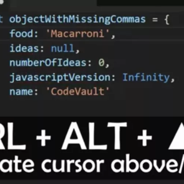

Multi-cursor in Visual Studio Code

Multi-cursor in Visual Studio Code

https://dev.to/codevault/multi-cursor---visual-studio-code-productivity-features---part-1-1gha

Multi-cursor is one of those features that impresses many non-programmers but, ...