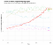
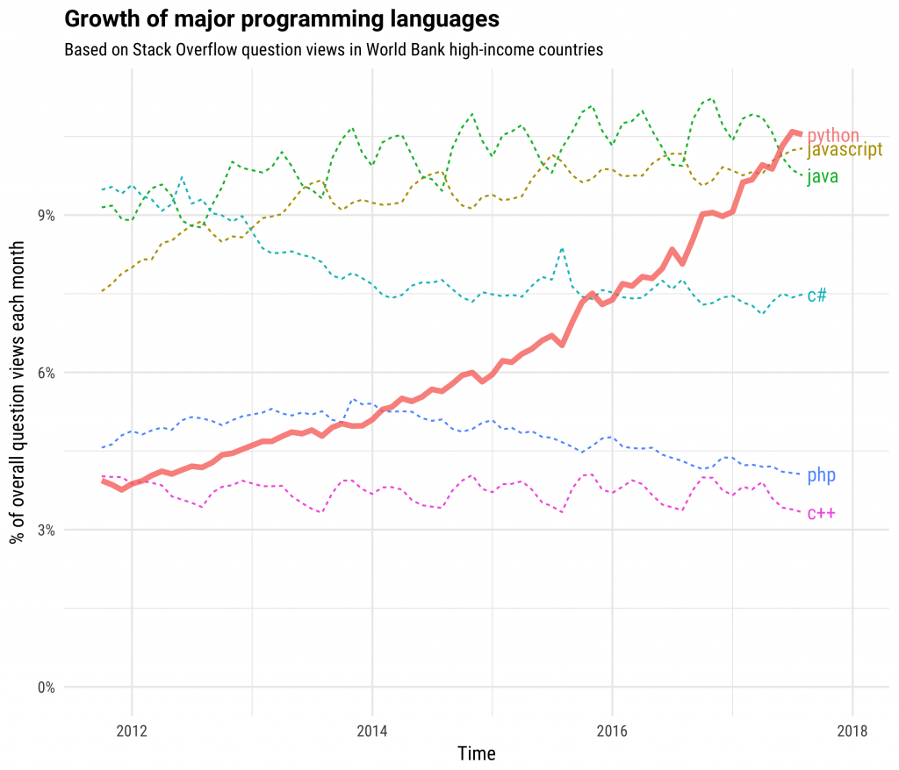
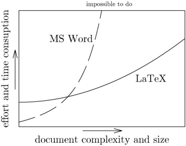

My Journey Into Data Science and Bio-Informatics – Towards Data Science

# My Journey Into Data Science and Bio-Informatics — Part 1: Programming

> “Algorithms are the new drugs, and doctors the new technology prescribers.”*>  — *> [*> Hugh Harvey, radiologist*](https://towardsdatascience.com/@DrHughHarvey?source=post_header_lockup)

According to [IBM,](https://www-01.ibm.com/common/ssi/cgi-bin/ssialias?htmlfid=WRL12345USEN) 2.5 quintillion (10¹⁸) bytes of data, or 2.5 million terabytes, is being generated every day (an average computer holds 1 terabyte). 90 percent of all the data that exists, has been generated in the last two years. Furthermore, it’s expected that this growth will keep on accelerating. This results in a bottleneck where the processing and interpretation of the data lags behind. And it’s not only Twitter, Facebook, Google and Netflix that are faced with these problems. Biomedicine, biology, physics, pharma… are faced with this problem as well.

To illustrate the problem further, a single whole-genome sequencing can be multiple hundred gigabytes in size (exome and RNA is approx. 100 times smaller). It requires a specific set of skills to deal with such a large amount of data. That’s where bio-informatics comes in.

## Background

Exactly one year ago, I had never executed a single line of code. So I’m not by any means an expert data scientist or bio-informatician, but I’m not a complete beginner either.

I got familiar with data science and bio-informatics when I was doing my master’s thesis on whole genome sequencing last year and I was suddenly faced with the problem: I had to open a .csv (comma separated value) file with 3 300 000 rows and 40 columns. Needless to say, Excel was not having a very good time. After some fruitless attempts to make Excel or other programs to work I realised that I’d have to use the command line, something I heard about by friends in other fields. From there on, things naturally evolved to where I am today.

Almost everything I learned is thanks to friends, colleagues, and mentors for suggesting topics to explore. The actual studying was through the help of tutorials, blog posts, massive open online courses (MOOCs) on the internet, or by Googling a specific problem that I had, because I did not have the time to get an additional Master’s degree.

But I was faced with the problem that hundreds of courses exist on nearly every topic. This will be a blog post in 2 or 3 parts, with the first part about programming, focussing on resources and recommended courses that I took (for free or at a very minimal price), with absolute beginners in mind. The second part will be more bio-informatics-oriented (DNA and RNA sequencing), with an emphasis on key journal articles, but with other online resources and frequently used tools as well.

## Bash and Linux

### Installing Linux

If you have a Mac you can open the terminal and run any bash command without any problem. For the Windows users, it is not so easy. You have to install Linux, a different operating system next to Windows. Linux comes in many flavours, of which [Ubuntu](https://www.ubuntu.com/download/desktop) is the most popular distribution.

- A Virtual Machine is recommended for absolute beginners that want to try out Linux. You can’t do really much wrong with a VM, it runs Ubuntu from within Windows. Check out [this guide](https://www.lifewire.com/run-ubuntu-within-windows-virtualbox-2202098) for more information.
- Dual-boot is a little more tricky, where you install Ubuntu next to Windows. Be careful, you can erase all your data this way. Recommended if you know a little more about computers. Check out [this guide](https://www.tecmint.com/install-ubuntu-16-04-alongside-with-windows-10-or-8-in-dual-boot/).
- [Ubuntu on Windows 10](https://www.microsoft.com/en-us/store/p/ubuntu/9nblggh4msv6) is a new feature since about a year or so. It seems to be a more elegant solution compared to a VM or dual-booting, but I haven’t tried it and I don’t know how well it holds up for more advanced work.

### Bash

Once you get Linux up and running and you open the terminal (or open the terminal directly on macOS), you can put in commands in the Bash command language/shell.

The terminal on macOS

Bash is sort of a universal programming language on which basic tasks can be done, to run programs on High-Performance Computing (HPC) clusters. It also makes repetitive tasks so much easier and faster. It’s an essential skill to have as the most tools that are being developed by the bio-informatics community are controlled by the command line only.

- [Introduction to shell for data science on Datacamp](https://www.datacamp.com/courses/introduction-to-shell-for-data-science) starts from zero but has very nice examples on why Bash is so useful. It’s also only 4 hours long. Start with this before reading further.

## Python and R

In bio-informatics, nearly every task can be done with one of two programming languages: R and Python. Python is an all-purpose programming language that has exploded in popularity over the last years:

Source: [stackoverflow blog](https://stackoverflow.blog/2017/09/06/incredible-growth-python/)

The reason for this massive increase is that Python is easy to learn & easy to read but it is very versatile. There is a [great talk on Youtube](https://www.youtube.com/watch?v=DifMYH3iuFw) about why Python is such a popular language by [Jake Vanderplas](https://twitter.com/jakevdp). In short, Python can do everything from basic scripts for task automation, basic and advanced statistics, [advanced plotting](https://seaborn.pydata.org/_images/grouped_violinplots.png) to machine and deep learning & many more. Python is actively [disliked](https://softwareengineering.stackexchange.com/questions/15468/what-are-the-drawbacks-of-python) by some people, but I think that it doesn’t deserve the hate it gets. Especially for a beginner, Python does what it needs to do without making things overly complex.

R is a programming language that is especially built for statistics and data-processing, in contrast to Python which had its data science libraries built on top of it. Through-out the past years, R was adopted by the bio-informatics community as the number one programming language for the release of new packages, partially because of [bioconductor](https://en.wikipedia.org/wiki/Bioconductor) (a collection of mature libraries for next-generation sequencing analysis) and the [ggplot2](http://ggplot2.tidyverse.org/) library for advanced plotting. Some people like to do the data cleaning in Python and do the data manipulation in R, but R can do almost anything that Python can in terms of statistics and even more. My only problem with R is the sometimes — unintuitive syntax. The packages in [Tidyverse](https://rviews.rstudio.com/2017/06/08/what-is-the-tidyverse/) (dplyr, tidyr, ggplot2,…) provide an elegant workflow in R with an explicit focus on data cleaning, exploration and visualisation.

### Python

Because Python is so versatile it’s easy to be overwhelmed when you first get in contact with it. Recommended resources and courses:

- [Python For Everybody on Coursera](https://www.coursera.org/specializations/python) by Charles Severance. Course material is also available at [py4e.com](https://www.py4e.com/) (if you follow [the handbook](http://do1.dr-chuck.com/pythonlearn/EN_us/pythonlearn.pdf) up to chapter 11 you have a solid basis for further what comes next). If you read books on programming, make sure you have your laptop next to you to type and execute the commands that are in the book! I cannot stress this enough, just reading a book is not sufficient. And most important, do exercises. You learn most programming by failing and Googling the solution.
- [Python for Data Analysis](http://wesmckinney.com/pages/book.html) by Wes McKinney is a good reference book, but I personally prefer to study through lectures/videos.
- This lead me to [this blog post](https://medium.freecodecamp.org/i-ranked-all-the-best-data-science-intro-courses-based-on-thousands-of-data-points-db5dc7e3eb8e), recommending [Python for Data Science and Machine Learning Bootcamp](https://www.udemy.com/python-for-data-science-and-machine-learning-bootcamp) by Jose Portilla/Udemy. It’s a fantastic course, I can’t recommend it enough. It has a 4.6 star rating with over 80 000 students. It is basically the book by Wes McKinney packed into 21 hours of video lectures with real world exercises. Don’t pay more than 15 euros, Udemy has frequent (if not always) discounts.
- [Enki](https://play.google.com/store/apps/details?id=com.enki.insights&hl=en) is an app for your smartphone to revise Python and other programming languages for 10–15 minutes a day which helps to keep the most frequent code fresh in your memory.

### R

I made the mistake of trying to learn R as my first programming language. If you have never programmed before, learn Python first and R will make a lot more sense as a programming language.

- [R-programming on Coursera](https://www.coursera.org/learn/r-programming) by Roger Peng was my first course on R and programming in general. A very good course as an introduction. However, after week 2 there is a very steep increase in difficulty which is the main reason why I suggest starting with Python as your first language. This course also does not cover plotting very well and does not have a focus on cleaning data/data science. It is also available as a [good book](https://leanpub.com/rprogramming), which is comparable to the Python For Everybody handbook mentioned before and covers dplyr. Take your time and go through it and you have a solid foundation about what R is and how it works at its core.
- [Swirl](http://swirlstats.com/students.html) is an R package to learn R while running R/R-studio. No video’s, purely text-based. I rediscovered it while writing this blog post. Highly recommended to get basic concepts under your belt and is also part of the R programming Coursera course. Covers almost everything.
- [Data Science and Machine Learning Bootcamp with R](https://www.udemy.com/data-science-and-machine-learning-bootcamp-with-r/learn/v4/overview) is the R version of Jose Portilla’s course on data science. I preferred the Python course as that course covered the subjects in more detail. However, it’s worth taking because it covers ggplot2, dplyr, tidyr and it has a general introduction on how to use R for machine learning. Take it after the Python course and go through the first chapters on 2x speed if you find it too easy (especially if you took the Coursera course).

## LaTeX

How many time have you spent tweaking and adjusting the lay-out of a Word document until it’s just perfect, to notice that you make a minor adjustment and everything is all wrong again? That’s where LaTeX comes in. From the [official documentation](https://www.latex-project.org/about/): “LaTeX is based on the idea that it is better to leave document design to document designers, and to let authors get on with writing documents”.

LaTeX in a nutshell

The drawback is that LaTeX has an almost vertical learning curve. But once you get the basics (which are covered very good on [ShareLaTeX](https://www.sharelatex.com/learn/Learn_LaTeX_in_30_minutes)), it’s actually a lot more enjoyable than writing your documents in Word. I still prefer Word for very short documents, but for anything more than a few pages LaTeX is unbeaten, especially in combination with [JabRef](http://www.jabref.org/) as a reference manager.

A drawback is that a full LaTeX installation with all the packages can get quite complicated and resource-heavy. Collaborative writing with multiple individuals is also not easy. [Overleaf](https://www.overleaf.com/) (and the previously mentioned [ShareLaTeX](https://www.sharelatex.com/)) is a solution to these two drawbacks: it’s a Google Docs-like method of collaborative writing and it runs LaTeX in the cloud, making cross-platform and cross-machine writing a breeze. Multiple journals (bioRxiv!) even support submitting directly through Overleaf. It is freemium with the premium version starting at 12 euro/month (half for students).

While knowledge of LaTeX is not essential for data science nor is it a true programming language, give it a go if you have a few hours to spare. You’ll thank me later.

## Future perspectives

### Reproducible software

I notice that I spent quite some time getting my scripts just right, but that I make minor adjustments here and there. Some changes are hard to keep track of, for example if I want to rerun something from 3 months ago. In the future I want to improve my workflow with an emphasis on reproducibility.

#### Git

Git is a version control system which makes it possible to coordinate files and version changes between multiple people. If you make a mistake and you crash your whole program, it’s very easy to return to a previous version. I’ll be using [this course on Datacamp](https://www.datacamp.com/courses/introduction-to-git-for-data-science) as a guide. See also [Ten Simple Rules for Taking Advantage of Git and GitHub](https://www.ncbi.nlm.nih.gov/pmc/articles/PMC4945047/) in PLoS computational biology for more information on why using git is a good idea.

#### Docker

Docker is another software package that’s quickly gaining success and popularity. It is a method to distribute applications or other programs between computers and servers. It is composed of “containers” which resemble a virtual machine, but with more portability and more lightweight. A container image is a lightweight, stand-alone, executable package of a piece of software that includes everything needed to run it: code, runtime, system tools, system libraries, settings.

Why is this needed or useful to learn? Well, if you want to share the tool or program that you made with a colleague, friend or in your publication you will run into the problem that your program depends on a different program (e.g. a specific Python module) and even a specific version (e.g. Python 3.5.2). Docker bundles your application with the correct dependencies, so that the final user doesn’t need to worry about installing specific software with specific versions, possibly crashing the version that was already on their computer and resulting in a lot of frustration and/or bad adoption of your program. The Docker [official documentation](https://docs.docker.com/) and tutorial on [GitHub](https://github.com/docker/labs/tree/master/beginner) is a good place to start.

#### Pipelines

A pipeline is a specific order in which programs or scripts should be executed, “piping” the output from the first script to the second. In next-generation sequencing (NGS) this consists of downloading the raw data files, quality control, preprocessing, mapping to the reference genome and post-processing, but more on this in part 2 about bio-informatics. To automate this process, a “master script” can be written which combines all these different steps in 1 script. In Bash this is possible, but it doesn’t scale very well for complicated pipelines. Workflow management software can help to make your pipeline reproducible and scalable. The options are endless:

- [Luigi](http://luigi.readthedocs.io/en/stable/), based on Python and [developed by Spotify](https://medium.com/outlier-bio-blog/why-we-chose-luigi-for-our-ngs-pipelines-5298c45a74fc)(!), but is now also adopted by the NGS community (the power of open-source software). [SciLuigi](https://github.com/pharmbio/sciluigi) is a wrapper around Luigi to optimise scientific workflows.
- [Snakemake](https://snakemake.readthedocs.io/en/stable/), also open-source and Python based.
- [Nextflow](https://www.nextflow.io/)
- [WDL](https://software.broadinstitute.org/wdl/), developed by the Broad Institute
- [Ruffus](http://www.ruffus.org.uk/)
- [Bpipe](https://github.com/ssadedin/bpipe)

As you would expect, they all have advantages and drawbacks. Explore the documentation, search around on Google or [Stack Overflow](https://github.com/ssadedin/bpipe) to find the workflow management software that best fits your needs. A thorough review of bash, make Nextflow, snakemake is available [here](https://jmazz.me/blog/NGS-Workflows).

## Recommended software

The software listed below comes down to a personal preference.

#### Text editor and IDE

I prefer Atom, but there are many others (Sublime text, Vim, …). Check out [Hydrogen](https://atom.io/packages/hydrogen), a package for Atom which lets you run Jupyter Notebook from within the text editor — very useful for running blocks of code while testing/debugging. For LaTeX I use [TeXstudio](https://www.texstudio.org/) and for R [Rstudio](https://www.rstudio.com/).

#### Terminal

In MacOS I use iTerm2 with [tmux](http://www.hamvocke.com/blog/a-quick-and-easy-guide-to-tmux/) (see cover picture). Tmux splits your terminal into multiple windows for easy multitasking. [Homebrew](https://brew.sh/) is a package manager for macOS to install programs via the command-line on Mac. In Ubuntu I used the default GNOME terminal.

#### Color Palette & Theme

Me personally, I can’t stand a white terminal with black text. A good color palette for your terminal and text-editor can make scripting so much more enjoyable and efficient. On MacOS I like the [Nord](https://github.com/arcticicestudio/nord) color palette for my applications on macOS. Especially [colored ls](https://apple.stackexchange.com/questions/33677/how-can-i-configure-mac-terminal-to-have-color-ls-output) on macOS or [dircolors](https://github.com/arcticicestudio/nord-dircolors) on Ubuntu is a huge help. On Ubuntu I used the [Arc Darker](https://github.com/horst3180/arc-theme) theme with [Numix Circle Icons](https://github.com/numixproject/numix-icon-theme-circle) to make it visually more appealing, with some [extensions](https://extensions.gnome.org/) to add functionality that the developers left out.

## Conclusion

The content in this relatively short blog post will keep you busy for around 200+ hours. It builds a solid basis for further specialisation in the field of your needs. If you have to do a specific task that is repetitive, there is possible a way to automate it with Python/Bash or R. Start with a quick Google Search and 99% of the time someone tried to do something similar and will have asked about it on Stack Overflow or another forum. With the skills and knowledge from the links on this page, you will be able to comprehend the syntax and modify and debug it according to your requirements. There are also other programming languages like [perl](https://www.perl.org/), which is used by NCBI as a general-purpose language, and [awk](https://en.wikipedia.org/wiki/AWK)/[sed](https://en.wikipedia.org/wiki/Sed) for text processing. However with a Python/R combination you should be set to go and you can explore these later should you really need them.

Keep in mind that next to what is listed here, there are a lot more very good courses on programming and data science (for example [this 67 hour Python course](https://www.datacamp.com/tracks/data-scientist-with-python) on Datacamp looks promising). The ones in the post are just those that I have taken and which I personally like and recommend. Most are also free, just try some out and move to the next one if it doesn’t suit your personal needs.

Good luck!

*I would like to thank everyone that I mentioned in this blog post as well as mentors, friends, colleagues and other people that helped me with this in one way or another.*

*If you enjoyed reading this, it would help a lot if you’d recommend it to your friends and colleagues or share it on Twitter of Facebook.*

*About the author:*

*My name is dr. Ruben Van Paemel and I started as a PhD fellow at Ghent University (Center for Medical Genetics), funded by the Research Foundation Flanders after graduating medical school in 2017. I am also a paediatrics resident at Ghent University Hospital. You can follow me on Twitter: *[*@RubenVanPaemel*](http://www.twitter.com/RubenVanPaemel)

*I work on neuroblastoma, which is a rare but devastating tumor that is most frequent in very young children. Our team tries to understand the underlying genetic alterations to improve the diagnosis, treatment and ultimately survival of children with neuroblastoma. Big data and modern sequencing techniques got me interested in programming, bio-informatics, statistics and artificial intelligence.*