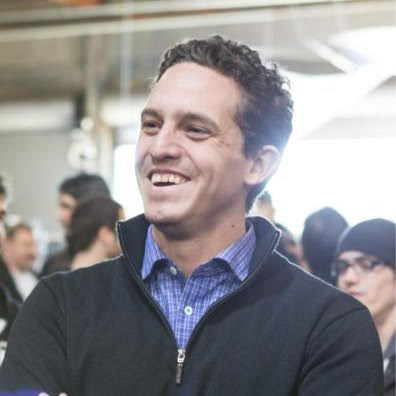
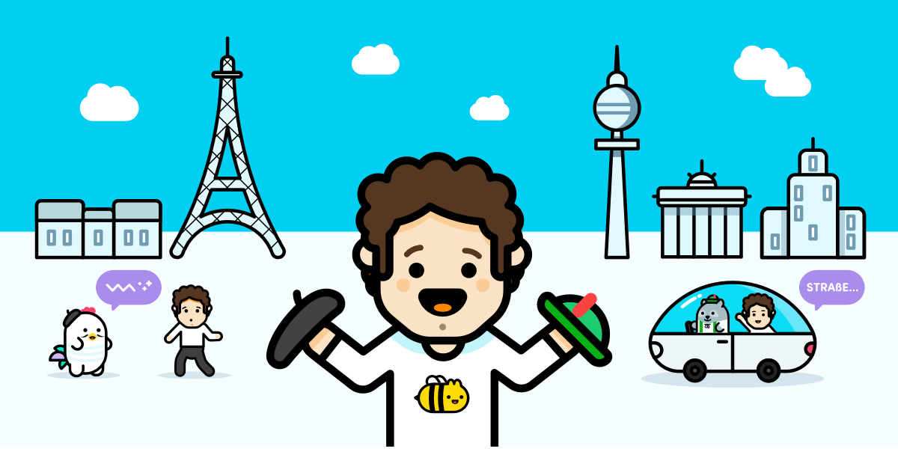

My Journey to a Better Language Learning System

 
Scott Chacon

  October 18, 2017

   [** Stories](https://chatterbug.com/blog/en/stories/)

#  My Journey to a Better Language Learning System

[**Tweet](https://twitter.com/intent/tweet?original_referer=https%3A%2F%2Fchatterbug.com%2Fblog%2Fen%2F2017-10-18-a-better-language-learning-system&ref_src=twsrc%5Etfw&text=My%20Journey%20to%20a%20Better%20Language%20Learning%20System&tw_p=tweetbutton&url=https%3A%2F%2Fchatterbug.com%2Fblog%2Fen%2F2017-10-18-a-better-language-learning-system&via=chatterbugapp)

[(L)](https://www.facebook.com/sharer/sharer.php?kid_directed_site=0&sdk=joey&u=https%3A%2F%2Fchatterbug.com%2Fblog%2Fen%2F2017-10-18-a-better-language-learning-system&display=popup&ref=plugin&src=share_button)

The story of my personal quest to successfully learn a new language and how Chatterbug grew out of that.

 

Today we’re opening [Chatterbug’s first course](https://chatterbug.com/), German, to public signup. This is a really exciting day for me, because it’s been such a long journey from the seeds of the idea that became this product and company. If you’re interested in what would drive someone to start yet another language learning company, here is my story.

>
> Like so many stories, it begins with an American in Paris.

In the spring of 2015, when I was an executive at GitHub, I decided to make a big life change and move to France. We were a highly distributed company and I felt it would be good to make sure the leaders were a little distributed too. Plus I had a daughter who was turning 5 years old and I had learned at university that she was nearing the end of the age range when it is easy to learn a new language - moving her to a non-English speaking country at this point would surely make her an instant polyglot. This is a bit of a myth, but that’s a blog post for another time.

As we prepared to make our move, I decided that I too was going to become fluent in French. I would learn as much as I could before the move with these fun digital learning apps that I had heard made it so easy to learn a language, then hone my great skills on arriving in the country. It seemed like a solid and foolproof plan.

>
> Congratulations, you’re now 72% fluent!

I studied every day with a mobile app that told me I would learn French quickly, got a 100 day streak and was informed that I was now 72% fluent! I couldn’t wait to land in France and impress everyone with how conversational I was while sipping wine in my striped shirt and sneering at tourists.

## Arriving in Paris

It may surprise you to find out that upon arriving in Paris, I was not in fact 72% fluent. I would say that I was pretty close to 0% fluent. I tried ordering things and nobody understood anything I was trying to say. I struggled to catch anything that anyone said to me. It was totally demoralizing.

The problem was obvious in hindsight. I had never actually spoken French to any other human being, certainly not to a French native speaker. Most of my months of practice up until that point had been with computer systems or with slowed and simplified recorded speeches. It was in an environment where nothing was colloquial or mumbled, my speaking was never checked and I had all the time in the world on every problem. In other words, the opposite of any real world interaction that you’ll ever have with a native speaker.

It was as though I had prepared for my first baseball game by playing a video game about baseball for countless hours. You may think you know a lot about the sport at that point, but showing up on the field is a different thing altogether.

So there I was, in Paris with my family, unable to communicate with anyone in French and honestly feeling like I had wasted quite a lot of time and energy.

I started trying other ways of learning the language.

## Other methods

I enrolled in group classes at the highly regarded language school down the street. It got me listening to a real speaker, my teacher, but in a 15 to 1 classroom my own speaking practice was limited. All of my speaking time would be with another student, who was just as bad at French as I was. How is one to improve their pronunciation if your partner has no idea how it’s supposed to sound either? On top of that, if you miss one or two classes, you’re hopelessly behind. There is no flexibility at all.

Next I tried a private tutor. The tutor would meet me in the city and we would walk around and talk about the things around us. This was great, but also had many problems. First, it was incredibly expensive, around €80 per hour. It was hard to schedule regular classes and the commute times meant that each class often took up over 2 hours of my time. I also had no way to take notes or practice what I was failing at after each lesson.

>
> Finally I landed on online tutors.

Online tutors had many of the advantages of private tutors without several of the downsides. I could speak with a real person, it was much less expensive, normally around €20-30 per hour. Scheduling, though not easy to negotiate all the time, was still much easier and more flexible than the other methods.

There were still many downsides though. The learning environment itself was abysmal. In each one I tried, you had to use Skype and upload PDF files (often of pirated content, since most curriculum makers don’t even let you purchase digital versions of their books) and try to coordinate which page you were on and what you were doing. If a tutor went on vacation for a week, so did you. It was such a pain to find a new tutor with the right availability and get them up to speed, or juggle multiple tutors and try to continue with a single learning path, that it just wasn’t worth it.

## How to succeed

So I started asking people who had successfully learned another language after childhood how they had done it, and the answers are surprisingly uniform.

Most Europeans had learned it in school. Not just 2 or 3 years of Spanish, as I had done, which results in what many Americans call “High School Spanish” or A1 Spanish (since Americans don’t have [the CEFR A1-C2 system](https://en.wikipedia.org/wiki/Common_European_Framework_of_Reference_for_Languages), we don’t really know how to talk unambiguously about language skills). Most people who fluently spoke a non-native language had learned it starting early in their school system, on average around 8 years old, giving them nearly a decade of studying and practicing it before leaving secondary school.

The Americans I spoke to had a different story - many had studied it at University and often spent some time abroad in a country that used the target language. Generally living with a host family or dating someone there - some very close connection to patient people who would take the time to help them learn the language fluently.

Finally, some lucky people were able to go to a language school at some point, where they could intensively concentrate on that language for some period of time, normally at least a year.

But none of these were options for me. I found again and again that adults, who were out of school but did not have the flexibility to enroll in a full time intensive group class, nor could move in with a host family, had very few paths to successful language acquisition.

## How the Polyglots Do It

The rare ones that did succeed under these circumstances were often found in the polyglot communities. Nearly everyone I read about ([Benny Lewis](https://www.fluentin3months.com/german-learning-resources/), [Gabriel Wyner](https://lifehacker.com/5903288/i-learned-to-speak-four-languages-in-a-few-years-heres-how), [Luca Lampariello](http://www.thepolyglotdream.com/), [Ashwin Purohit](https://puroh.it/learning-german-a1-to-c2/), etc) cobbled multiple tools together on their own. Even Duolingo’s own CEO, Luis von Ahn, [recommends](https://blog.trello.com/learn-a-new-language) piecing together multiple tools when asked how to actually learn a language.

Not only that, but contrary to enthusiastic advertising and breathless blog posts you may have seen, it takes hundreds of hours of practice speaking with real humans to get to the point where you feel comfortable having normal conversations with native speakers.

>
> Language learning is a marathon.

Like a marathon, if you have a coach and a plan and a team to help you, it’s not impossible and nearly anyone can do it. However, also like a marathon, there is no way to shortcut it. You can’t learn to run a marathon in a week if you don’t normally run. You have to physically change your body (in the case of language, your brain) and it’s not possible to do in less than several hundred hours. Not one of the famous polyglots in the world has ever figured out how to get to real fluency in less than that, and unfortunately you won’t either. If they’re fluent in three months, then invariably it means they’re practicing hard for 8 hours a day, every day.

So what does that mean? If you don’t have a decade to spend on it in school, or you can’t make it your entire life, is it impossible?

## So what do the polyglots do?

First, they plan out and set aside the several hundred hours. They either figure on doing an hour a day for a few years, or many hours a day for several months. They set a specific goal (say, pass a B2 test in 12 months) and figure out what it will take to get there.

As a concrete example, an intensive course at the Alliance Française school in Paris takes 560 hours of classroom time plus several hundred hours of homework over 28 weeks (about 7 months) to go from zero to B2, which is generally considered basic fluency.

Then they put together all their tools. They create a word list of frequently used words and use [spaced repetition](https://en.wikipedia.org/wiki/Spaced_repetition)  [(L)](https://en.wikipedia.org/wiki/Spaced_repetition)to memorize them with the least amount of exposure possible. They scour the internet for graded readings and level appropriate videos and podcasts and get them all lined up and work them into their daily study schedule. They find one or more online tutors through marketplaces, identify a curriculum and start scheduling them every week or every day, starting early on in their course of study. They tell the tutor what they want to work on before every lesson and coordinate with them.

If this all seems really overwhelming to you, I can tell you from having done it, it’s downright *exhausting*. You have to spend a third of your time organizing your language learning process and the rest actually learning the language. Many people get tired of all the research and organizing and just give up.

The upside is that if you stick to it, it often works, but a big problem is that none of these tools communicate with each other. There’s no way for your online tutor to easily know what another tutor has covered. There’s no way for your use of a digital app to guide what your live video lesson is going to cover, or vice versa. There’s no way for your reading practice to inform your tutor what you’re having issues with. All of this communication and coordination is on *you* as a student.

## The Start of Chatterbug

So finally I decided to attempt to simplify all of this. I started a series of language experiments on myself. First, I tried learning Japanese with 3 months of taking video tutoring lessons nearly every day. Then I decided that a blended approach that combined all of the methods that had been recommended would be better and started over again, this time with German. This blended system is what grew into Chatterbug.

My goal was to build a new system that included all of the pieces needed to get from absolute zero in a language to conversational fluency, even if nothing else is used or included. Something where you didn’t have to plan or be involved in your learning path, like in-person schools provide - you simply show up and do the work and you’ll get there.

All the flexibility of digital language learning apps with all the comprehensiveness and effectiveness of private tutors or in-person language learning schools. All of the advantages of the dozens of tools I had tried over the years with all of the downsides that I had experienced either minimized or removed.

## Which Brings Us to Today

[Learning German In 150 Hours](https://www.youtube.com/watch?v=jZrcu3iEChc)

[  Learning German In 150 Hours - Longer Version  Chatterbug • 1.3K views  5:57](https://www.youtube.com/watch?v=J6Nqt8NF5no)[  Swedish guy tries to speak Portugese, Brazilian girl tries to speak Swedish - Language challenge  TheSwedishLad • 15K views  2:45](https://www.youtube.com/watch?v=gcobHfKtN3g)[  Chatterbug Introduction - Full Version  Chatterbug • 206 views  1:32](https://www.youtube.com/watch?v=hPUbVyplngQ)[  Noam Chomsky on stupid people  koloneltuesday • 946K views  2:38](https://www.youtube.com/watch?v=olbbhTSwDIk)[  Top Gear: The Most Offensive Clips... In The World.  R.J. Lupin • 3.1M views  6:31](https://www.youtube.com/watch?v=jXAgTfyVacI)[  German Language Learn Fast- 8 The time :- English to German  Bilal Usman • 276 views  3:10](https://www.youtube.com/watch?v=FdrKHaGbOwA)[  the German Bakery: Buy Bread, Rolls & Cake ☆ German Course  GermanCourse, Daniel Deutschmann • 7.9K views  5:41](https://www.youtube.com/watch?v=NUnxYF4FziE)[  'Better Than Goin' To Church' Noel Gallagher's Acoustic Collection  musicforthemasses • 369K views  1:06:15](https://www.youtube.com/watch?v=TMANjCHuL3I)[  Oasis - Where Did It All Go Wrong? (Acoustic @ Jools Holland)  PeiBoLedZepp • 147K views  4:32](https://www.youtube.com/watch?v=glGZ3lDlKLU)[  Symphony of Science - the Quantum World!  melodysheep • 8.8M views  3:29](https://www.youtube.com/watch?v=DZGINaRUEkU)[  Learn Basic German Phrases in Under 2 Minutes  shard46 • 463K views  2:00](https://www.youtube.com/watch?v=gJYn4I-OGJU)[  John Denver & Cass Elliot - Leaving On A Jet Plane  gizamax • 6.9M views  5:54](https://www.youtube.com/watch?v=NKdknYaSHgE)

0:02 / 2:52
[(L)](https://www.youtube.com/watch?v=jZrcu3iEChc)

I’ve now used this system myself on German the whole time that we’ve been building it. My spoken German is now at around a B1 level and I’m able to have intermediate level conversations for hours with native speakers. This is after a total of just over 300 hours spent studying, about half in video lessons and half in homework. All of which would be possible to do today entirely in Chatterbug without having to use any other tool.

I’m not yet fluent, but I’m certainly getting comfortable, and I clearly see the path to fluency. At the beginning of this process, I didn’t speak a single word of German. Last week I bought a belt at a clothing store in Berlin without either of us switching into English, including talking about belt lengths, if I wanted a bag and generally about the weather. This is unthinkable for me in French, even after having lived in Paris for a year.

>
> I believe that this is the future of language learning.

Today that system is available for you as well. It’s open for German right now and will soon be available in English with Spanish and French following. I hope you find it as easy to use as we’ve tried to make it and I can’t wait to continue to make the process of language learning as simple and successful as it can possibly be.