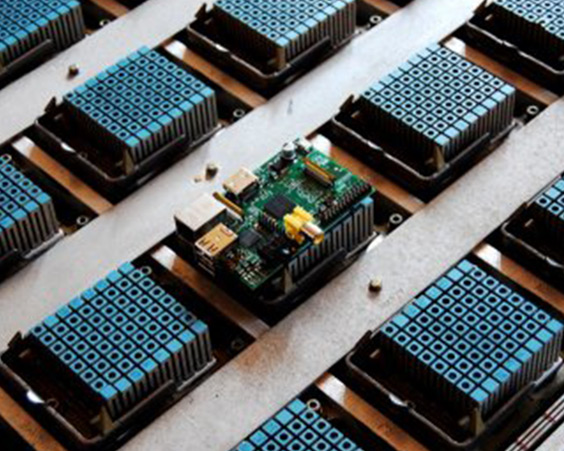
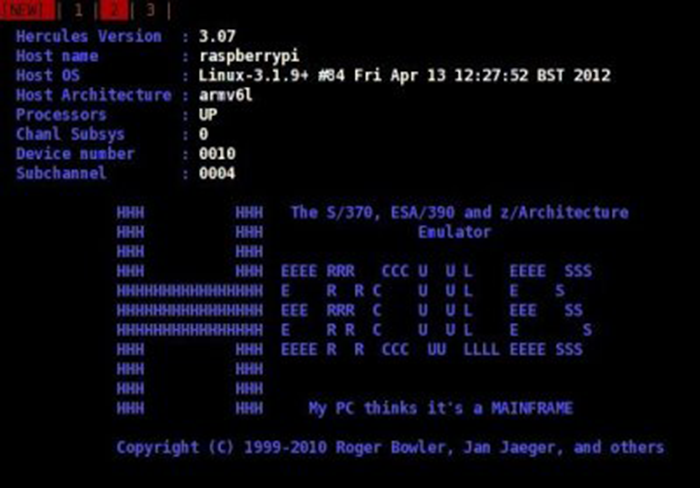
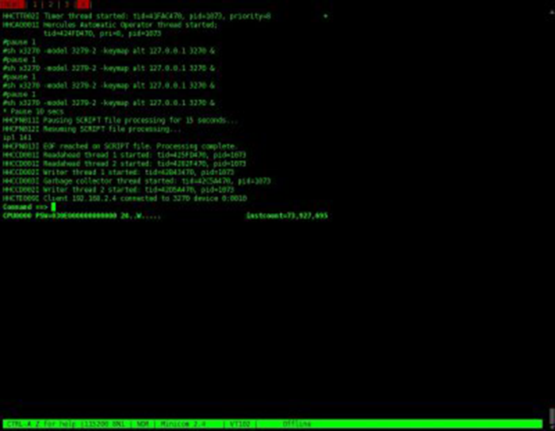
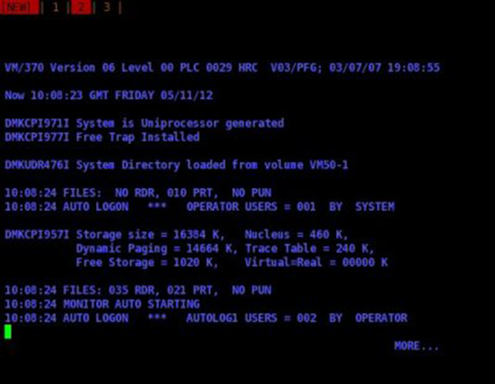
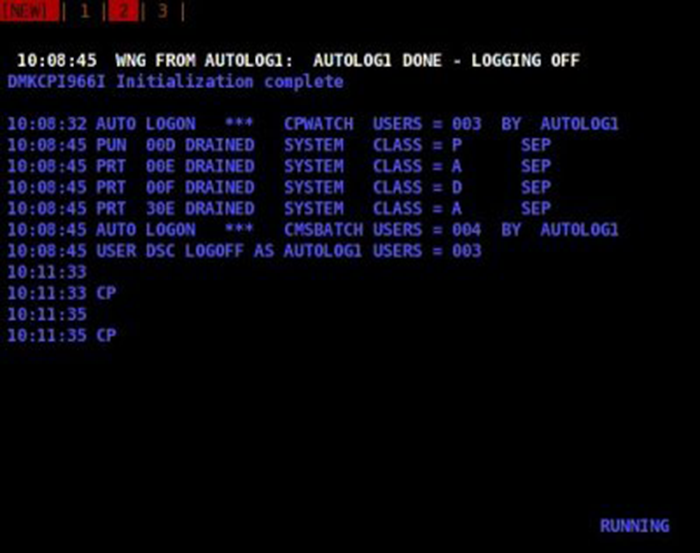
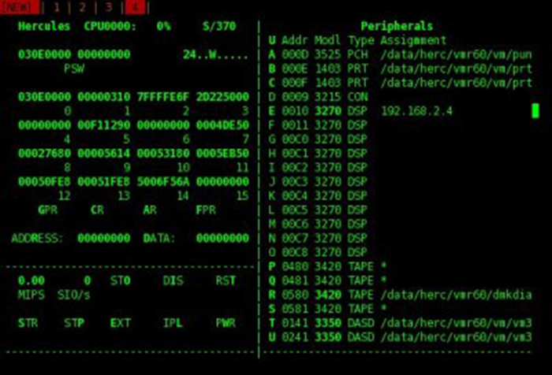
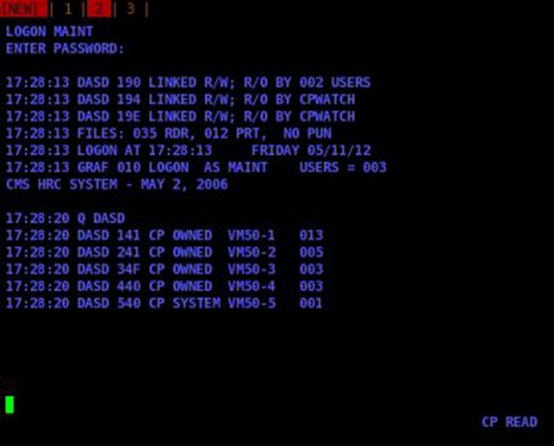
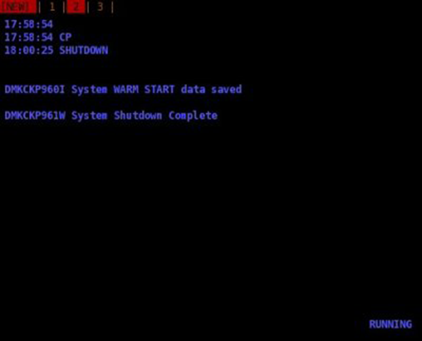
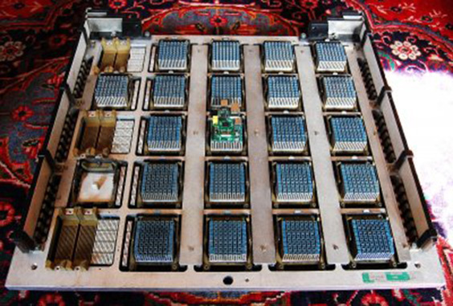

My Raspberry Pi Thinks It's a Mainframe!

# My Raspberry Pi Thinks It's a Mainframe!

**As the Raspberry Pi [(896-8660)](https://www.rs-online.com/designspark/purchase-product/8968660?cm_mmc=en-ds-_-web-_-ds%3Ainspiration%3Atechnology-hub%3Araspberry-pi%3Amy-raspberry-pi-thinks-it-s-a-mainframe_bp-_-8968660) started to ship the Sinclair ZX Spectrum turned 30 years old, and comparisons were being made between the two and their role in providing access to affordable computer hardware. Given the phenomenal advances in computing since the birth of the ZX Spectrum, I thought it might be fun to compare the Raspberry Pi with a computer that was closer to the state of the art at around that time, and to see if the Raspberry Pi could fill its shoes...

**

Introduced not long after the ZX Spectrum, the [IBM 4381 processor](http://www-03.ibm.com/ibm/history/exhibits/mainframe/mainframe_PP4381.html) was the workhorse of mainframe computer installations that could fill a data centre and support many thousands of users. Managing to do this with what may now seem to us like trivial resources:

- 2-2.7 MIPS CPU
- Optional maths co-processor
- 4-32MB RAM
- Up to 4x I/O channels running at 3MB/second

Even when compared with the pocked-sized Raspberry Pi, which manages to pack:

- 965 MIPS CPU
- FPU + 24GFLOP GPU
- 256MB RAM
- 60MB/second I/O (USB2)

Actually, this comparison is more than a little unfair, in that metrics such as MIPS ratings are not that useful when comparing dissimilar architectures. And mainframes are pretty special, with things like “assist” processors that free up the main CPU from having to do certain tasks, and terminals that manage presentation and enable efficient use of mainframe resources. But still, this does serve as a powerful indication of fundamental technological progress that has been made.

Could a Raspberry Pi replace the IBM 4381? Well, it turns out that just as it's possible to [use a Pi to emulate a ZX Spectrum](http://www.raspberrypi.org/archives/883), one can be used to emulate a somewhat larger mainframe computer. This has been made possible by a piece of open source software called [Hercules](http://www.hercules-390.org/), and next we'll cover the experience of running this under Debian Linux on a Raspberry Pi.

First we install the *hercules* package from the Debian repository, and then create a [configuration file](http://www.hercules-390.org/hercconf.html) which tells it to emulate a model 4381 machine with 16MB RAM and terminals and storage etc. attached. Hercules is then executed from the command line, and we run up an [IBM 3270 terminal emulator](http://x3270.bgp.nu/c3270-man.html#Description) from another machine on the network, providing it with the IP address of our Raspberry Pi and the port number specified in the Hercules configuration.

On connecting, Hercules prints out a few details to the remote 3270 screen.

Then if we go to back to the Raspberry Pi (connected to over its UART via a PC running minicom) we see that Hercules reports that a terminal has attached.

A computer without software wouldn't be much use, and so Hercules was configured with virtual disk drives containing a [very old public domain release](http://www.ibiblio.org/jmaynard/) of a mainframe operating system that still finds much use today, [VM](http://en.wikipedia.org/wiki/VM_(operating_system)). As the name suggests this provides virtual machines (mainframes!), in which it's possible to run applications, some other mainframe operating system, or should you wish to utterly confuse yourself, another copy of VM with a third copy of VM running inside that.

Shortly after our 3270 terminal attaches to Hercules the VM system starts to boot, or “IPL” to use the IBM parlance. With VM reporting that it has 16MB of memory available, of which 460K is being used for the operating system nucleus (kernel).

After a short period of time start-up completes and VM provides the status of attached card punches and printers. Which are, of course, virtual and represented by files under the Linux filesystem.

If we go back to the Hercules instance running on the Raspberry Pi we can hit ESC to toggle the view to a screen which displays a virtual hardware console. With register contents displayed in the left-hand side of the screen, and details of the peripherals on the right-hand side.

Now that the system has completed start-up we can go to our 3270 terminal and log on to VM as an administrator, by using the command “logon maint”. After entering the password for the *maint* account we can then use “q dasd” to show details of the configured storage ([DASD](http://en.wikipedia.org/wiki/Direct_access_storage_device) = direct access storage device).

Finally, when we are finished we tell VM to shut down before exiting the Hercules emulator.

So, a Raspberry Pi can be used to emulate a mainframe which would have filled a large computer room, and to run the same software which it would have run. Of course, the only reason you would do this is for fun, learning or perhaps as part of computer conservation efforts, e.g. in providing continued access to old computer software and/or data. A modern mainframe would massively outperform a Raspberry Pi and offer many benefits beyond simple processing power.

Having configured a mainframe on a Raspberry Pi, it was time to try out a Raspberry Pi on a mainframe! The image below shows the Pi sat on top (centre) of the CPU from an IBM 4381, which was recovered from a scrapped processor cabinet many years ago.

The 21 blue [modules](http://en.wikipedia.org/wiki/Multi-chip_module) are ZIF socketed ceramic IC packages with heatsinks, and apparently each contain a 6x6 array of chips that each dissipate up to 3.6W! The six brown multi-way connectors to the left carry signal lines and the busbars up either side supply the required power of up to ~2.7kW. The whole assembly is analogous to the processor chip in a modern PC and was located inside a cabinet roughly the size of a wardrobe, along with a PSU, powerful fan supplying forced air cooling and support electronics. The 4381 cabinet being just one of many in a mainframe installation, with others containing things such as disk drives and communications controllers.