My Twitch Live Coding Setup - Suz Hinton - Medium

# My Twitch Live Coding Setup

[Suz Hinton](https://medium.com/@suzhinton?source=post_page-----b2516672fb21----------------------)

[Feb 20, 2019](https://medium.com/@suzhinton/my-twitch-live-coding-setup-b2516672fb21?source=post_page-----b2516672fb21----------------------) · 21 min read

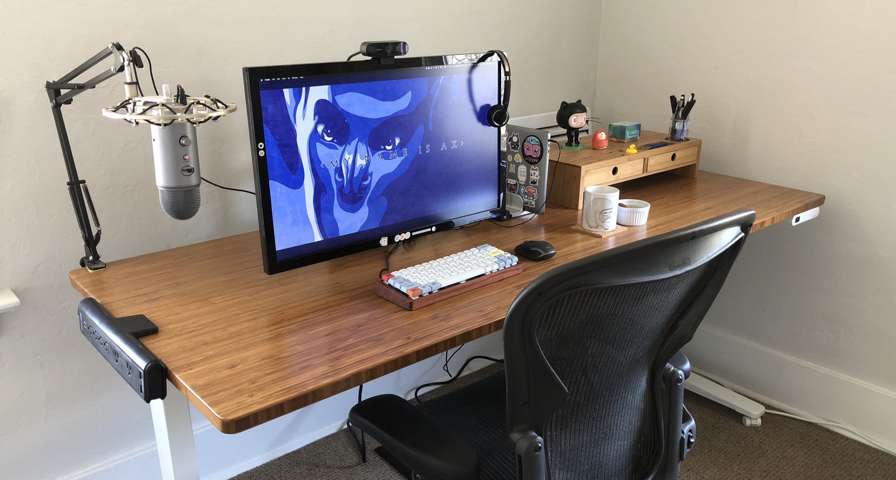

This article is an updated review of tools and software that I use to run my [live coding stream](https://www.twitch.tv/noopkat/) each Sunday. If you’re interested in the [original article](https://medium.freecodecamp.org/lessons-from-my-first-year-of-live-coding-on-twitch-41a32e2f41c1), which offers some advice outside of tools and software, feel free to read it as well! When I wrote the original post, it was intended to be a “lessons learned” post, and I didn’t expect folks to use it as a real guide. Reflecting upon that, I’m going to share my current setup with more attention to detail this time, as I still get questions on a weekly basis from folks looking for more information.

A reminder that this is not intended to be a “get started” guide, rather it’s written to share how one particular established streamer runs their show. Keep in mind that everyone runs theirs differently.

I’ll break down everything I do and use into sections for easier consumption:

- Hardware
- Stream design in OBS
- The thing where I’m not capturing all of my desktop
- Technical settings in OBS
- Twitch channel page design
- Automation

**A caveat:** I stream on macOS, so there is going to be a bias towards tools and techniques for this operating system. Most tools mentioned by gaming streamers are Windows focused, so I want to share how I stream effectively on macOS.

# Hardware

Not much has changed, but I’ll list the hardware I use below:

The decisions I made around each item are based upon finding gear that is not too expensive, but still had good reviews online when I researched. I’m simply not interested in the “best of the best”, as I believe that hardware can only do so much for your stream. You do you.

- 13" Macbook Pro 3.3 GHz i7 (late 2016)
- [Acer K272HUL](https://www.amazon.com/Acer-K272HUL-bmiidp-27-inch-Widescreen/dp/B00JB6HCIC) 27" monitor at 2560 x 1440 resolution
- [Ergotron monitor arm](https://www.amazon.com/LX-Desk-Mount-LCD-Arm/dp/B00358RIRC)
- [Perixx PERIMICE-712B](https://www.amazon.com/Perixx-PERIMICE-712B-Wireless-Mouse-Laptop/dp/B0083K9I8Y)
- [GK64 Keyboard](https://kbdfans.cn/products/gk64-mechanical-keyboard-64key) with Kailh Pro Purple switches and Godspeed DSA keycaps
- [Blue Yeti Microphone](https://www.amazon.com/Blue-Yeti-USB-Microphone-Silver/dp/B0170NWLWY) in Space Grey
- [BLUE Radius II Shock Mount for Yeti/Yeti Pro Microphone](https://www.amazon.com/Blue-Radius-II-Microphone-Improved/dp/B00TTQLA50)
- [Logitech BRIO Ultra HD webcam](https://www.amazon.com/Logitech-BRIO-Conferencing-Recording-Streaming/dp/B01N5UOYC4)
- [iQunix laptop stand](https://www.amazon.com/gp/product/B018G8E6BG/ref=oh_aui_detailpage_o04_s00?ie=UTF8&psc=1)
- [12 port powered USB hub](https://www.amazon.com/gp/product/B00HL7Z46K/ref=oh_aui_search_detailpage?ie=UTF8&psc=1)
- [XKeys 16 key programmable keypad](https://www.amazon.com/Programmable-KVM-Keypads-Keyboards-Gray/dp/B01AC6OYCG/)

This is my desk these days (I upgraded from my $30 IKEA table to an Uplift motorised standing desk):

# Stream design in OBS

I use [Open Broadcasting Software](https://obsproject.com/) to composite my audio and video for streaming to Twitch. There are other packages out there, but I started with this one and still prefer it after trying a couple of other options out briefly. OBS has been solid for me since I began streaming over two and a half years ago.

A few people have asked me about [Streamlabs OBS](https://streamlabs.com/)(SLOBS), however because I stream on macOS as an operating system SLOBS is not available to me as an option.

Let’s dig a little deeper into how I have OBS set up!

## My OBS scenes

I meticulously organise my scenes in order to make them easy to manage and update. I name everything with prefixes, and delete any sources within them that I am no longer using. I have four main scenes that I use: Standby, Self, Desktop, and Offline. I’ll detail each one.

**Standby scene**

This scene contains an image telling my stream viewers that I’m about to start. A scrolling text box was added to show that the stream is not “frozen” or buffering. A small comforting detail for those waiting. I often also ensure my music is playing in the background too. The illustration is by [Emily Griffin](https://twitter.com/emilywithcurls).

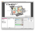
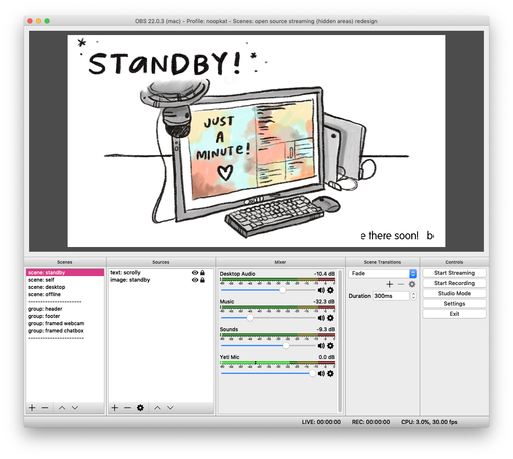
**Offline scene**

Similar to the Standby scene, this contains an image and nothing else. I switch to it when my stream is ending in a few seconds, and I’m getting ready to stop everything on the OBS side. My Twitch offline poster uses the same image, so it’s seamless on the channel when the livestream stops. The illustration is by [Emily Griffin](https://twitter.com/emilywithcurls).

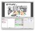
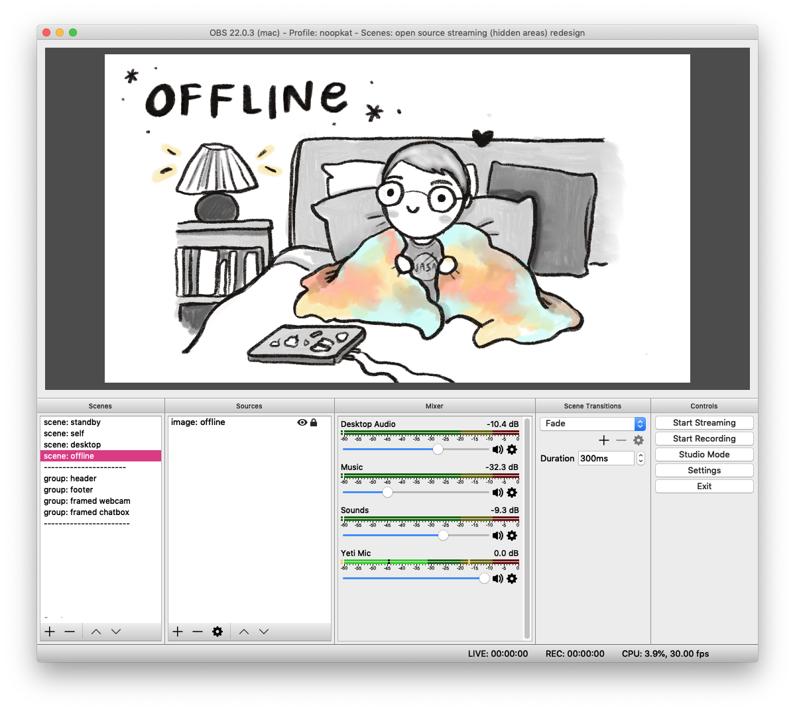
**Self scene**

I call this the “self” or “selfie” scene mostly because it shows myself in most of the video frame (right). I use this scene whenever I want to chit-chat with my viewers candidly (say if a test suite is running and we’re waiting), to open the stream, and also when I’m running through the “show and tell” segment of my stream, so that I can show items up close. I include a chat stream on the left as well, so that the conversation context is not missing should I choose to share this video somewhere other than on Twitch. The chat box is a widget offered by [Streamlabs](https://streamlabs.com/).

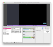
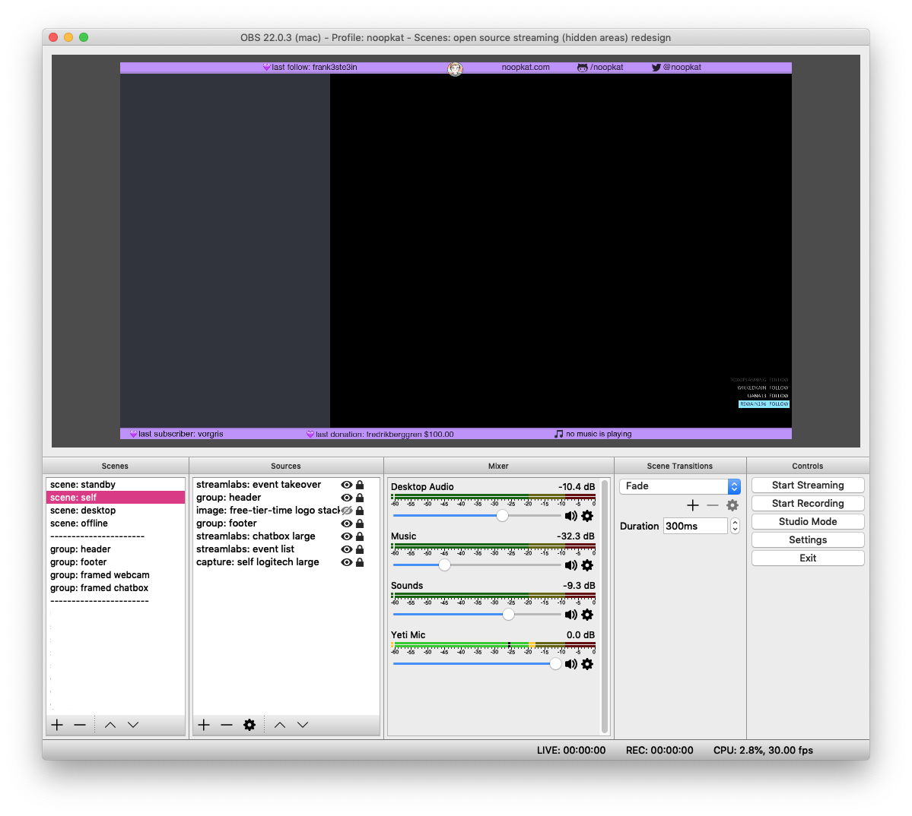
How it looks live:

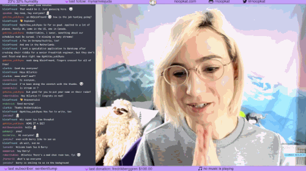
**Desktop scene**

This is by far the most involved and complicated scene I use! It’s the one that is used for the majority of each stream. It has a lot of pieces, but on a basic level it shows my desktop ie. what I’m working on, a webcam feed of me, and a chat box so that context is preserved in the videos when viewed off the Twitch platform. The chat box also serves as an indicator to folks as to the stream delay and how long it takes for me to see and respond their chat message.

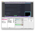
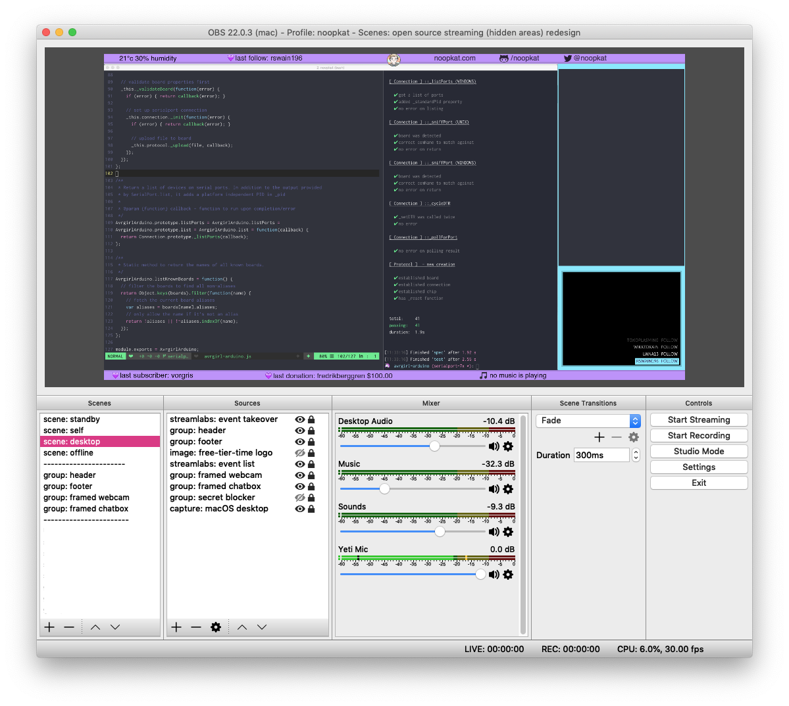
Here is a list of everything in this scene:

1. **Header and footer.** These show details about viewer interactions, the temperature of my study, what music is playing, and my social media handles. I will explain these in more detail later on.

2. **Desktop capture. **I only capture a portion of my entire screen, so that I can have private areas dedicated to managing and moderating my stream live. More on this later. I use vim on stream for my code editor as it looks nice and clean / minimal when side by side with the other parts of the scene layout. In the friendliest tone possible, I literally don’t care what code editor you use, and I don’t care what you think about my choice. If you’re interested, [my dotfiles are on Github](https://github.com/noopkat/dotfiles).

3. **Chat box.** I use an overlay widget for this, offered by [Streamlabs](https://streamlabs.com/). It’s added via a ‘browser source’ within OBS. I have taken the time to style the chat box to match the aesthetics of my stream overall. The colours and font also match my code editor theme, which is [Dracula](https://draculatheme.com/) and Inconsolata. [I wrote an article on how I did this](https://medium.com/@suzhinton/customizing-your-livestream-chat-widget-2ff9de49e83f) if you want to know more detail. I used [Pixelmator](https://www.pixelmator.com/pro/) to draw the blue frame that appears around the chat box, and then imported that as an image source into OBS.

4. **Webcam capture.** It’s fun to watch a stream featuring the person who is streaming, as it builds more intimacy with viewers. You can see me laughing at your joke, or cursing at a bug I’m encountering in my code. I used [Pixelmator](https://www.pixelmator.com/pro/) to draw the blue frame around the webcam source, and then imported that as an image source into OBS.

5. **Stream alerts.** Whenever someone follows my channel, subscribes, hosts me, or cheers Bits, I want to celebrate that moment. In order to do this, I use the [Streamlabs](https://streamlabs.com/) Alert Box overlay widget imported as a browser source within OBS. In a nutshell, it plays an animation over the top of the stream with the person’s Twitch name in it. I have this source as the very top layer within the scene so that it when it shows an alert, everyone can see it clearly.

6. **Stream Events.** The alerts mentioned above are momentary, so I have the last 5 events listed in another [Streamlabs](https://streamlabs.com/) widget called Event List. This is really not super necessary and doesn’t add much, so I’m thinking of removing it.

7. **‘Secret’ overlay.** This is an image sized and positioned to cover up the desktop capture region of this scene. I use it whenever I have to do something private on my stream, such as rotating API keys, or entering one time passwords on websites. It is set to hidden by default, and I have it linked to a keyboard shortcut to toggle its visibility.

How it looks live:

With a Streamlabs alert popping up:

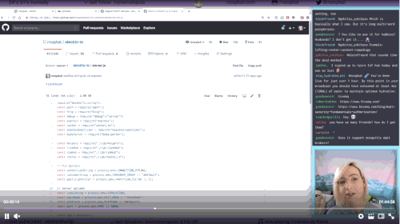
What the secret overlay looks like when visible:
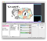
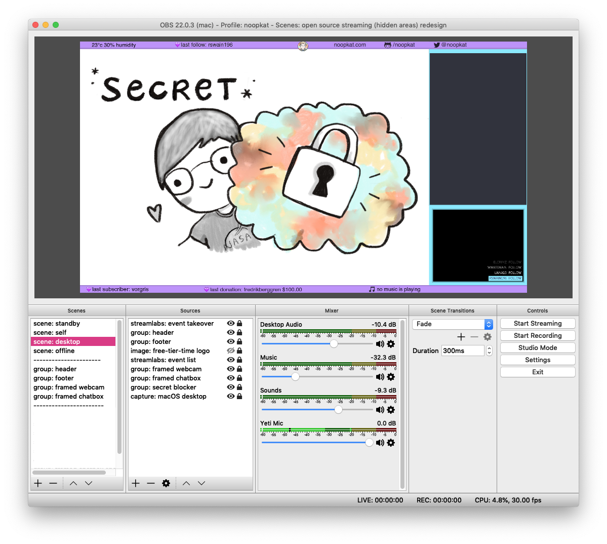

The adorable ‘secret’ illustration is by [Emily Griffin](https://twitter.com/emilywithcurls).

You might have also noticed that I have a bunch of scenes showing in the OBS screenshots I have been sharing. There is a very handy tip that I want to share with you which is to use ‘child scenes’ within your main scenes, which OBS allows you to do. Why?

There’ll be certain sources that you’ll want to group together as one unit, and the easiest method to do this is to create a new scene for them. Doing this will give you two major advantages — you can reuse the sources as a group in multiple scenes without having to duplicate individual sources one by one, and also when you update the child scene, all of your main scenes that use it will instantly get those updates at once. You can also drag and position multiple sources at once if they’re contained in a child scene together. Child scenes aren’t different from main scenes as far as OBS is concerned — I’m just calling them this to differentiate them from each other in functionality.

My header and footer child scenes look like this:
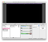
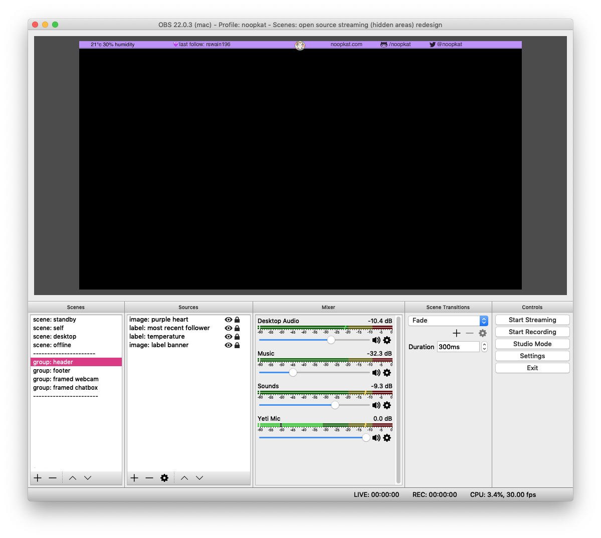
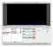
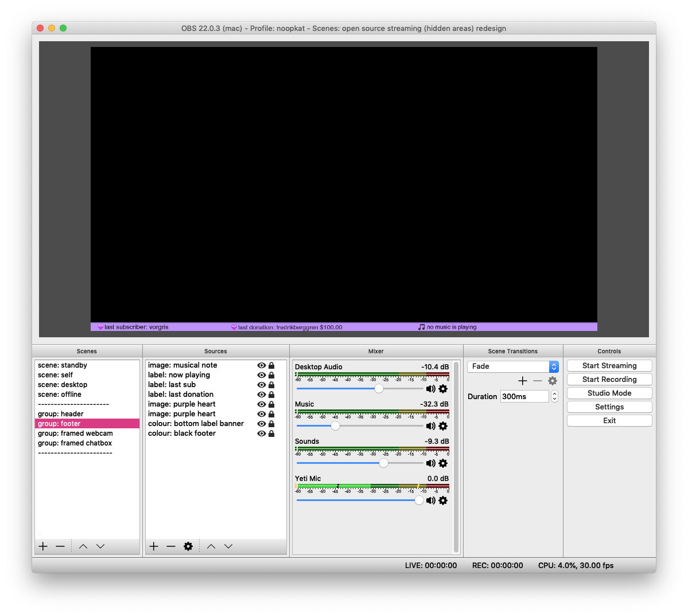
I used [Pixelmator](https://www.pixelmator.com/pro/) to design the header.

Here is a list of everything in these two scenes and how I do the magical live updating text:

1. Heart / musical note emoji png image sources for aesthetic reasons

2. Live text labels for last follower, last subscriber, and last donation. I run a desktop app from [Streamlabs](https://streamlabs.com/) called “Stream Labels”, which writes each individual stat from your stream to a text file, continually updating upon new stats. When you create a text source in OBS in your scene, you can configure the source to read (and live update) from a text file. I point OBS at the correct text file for each label I’ve chosen to show. It’s a bit tedious to set up, but doing this in a child scene makes this a set and forget endeavor if you want to show them in every scene.

3. The music playing text label is a [custom AppleScript I wrote](https://gist.github.com/noopkat/ea98f5a6ef197e636394ff7b270a16a0) to regularly dump the currently playing song in iTunes to a text file. I set it up to run as a launchd daemon. It’s shown in OBS with the same text file source method as the other stream labels explained above. If you want to know why I use iTunes or how I find and choose my music, I cover that later on in this post.

4. The study temperature text label was a joke back when my study would get really hot in the summers of NYC. I was visibly sweating and my coding ability suffered as the room would grow hotter during each stream. I did this with a [browser app that I made](https://github.com/noopkat/study-temp) that shows telemetry being sent from a micro-controller sitting on my desk. I am using this web page in OBS as a browser source, but it could also very easily just be another daemon writing to a text file. I should probably make time to convert it one day. If you want to know more about the micro-controller and sensors used, hit me up as that’s a whole other thing not relevant here.

The webcam and chat box child scenes look like this:
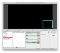
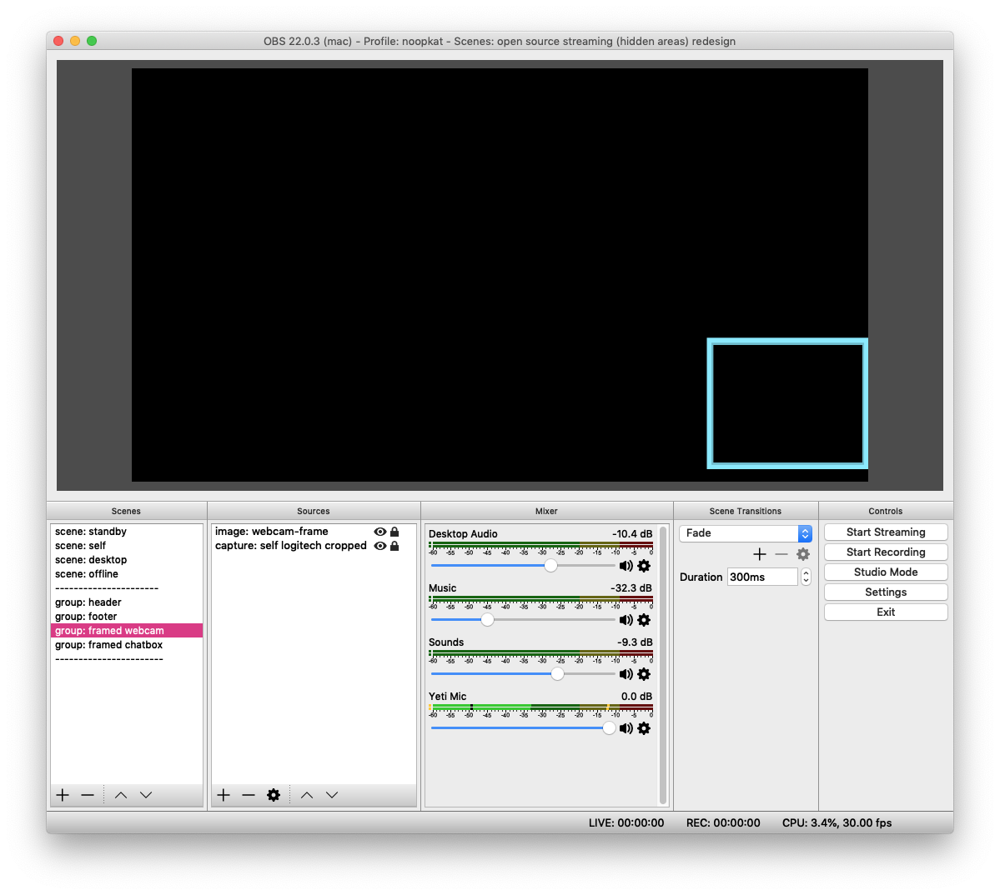
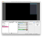
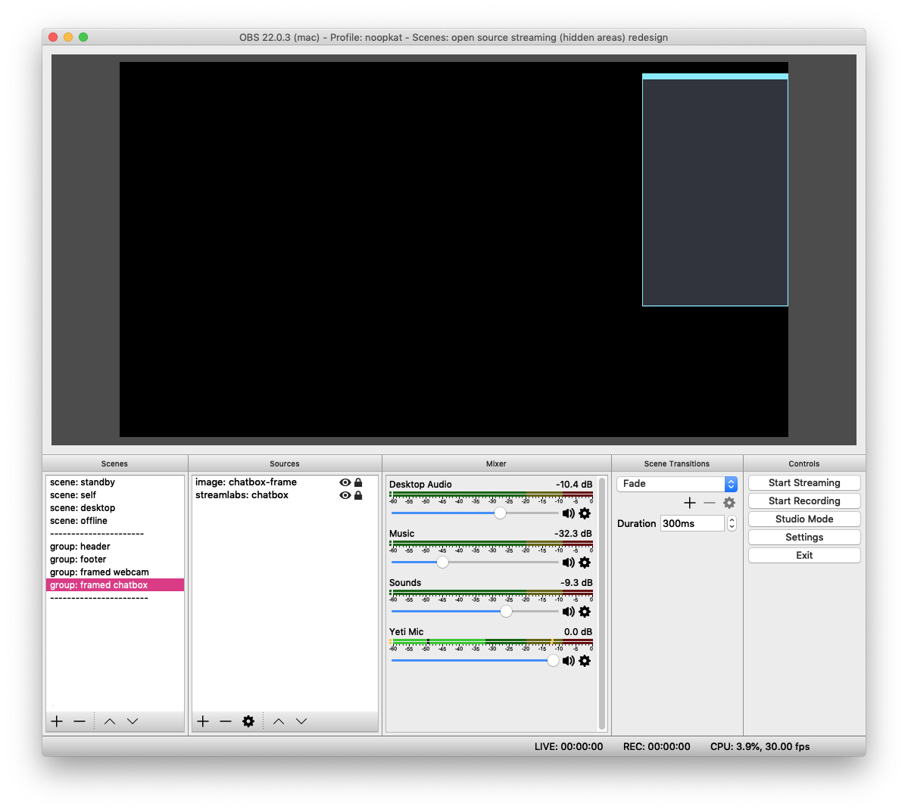

Another trick you might have noticed is I have created a couple of empty scenes named ‘ — — — — ‘ to act as separators for my scene list. It’s silly but it works really well to separate your main scenes from your child scenes. I have prefixed the names of my main scenes with ‘scene: ‘ and the child scenes are prefixed with ‘group: ‘ so that I can identify them very easily.

I have use handy prefixes on the names of all of my sources. This just makes them easier to spot by type and makes everything look neat.

This is all very optional! You don’t have to over architect your scenes in OBS. But I found that these pro tips have really helped me stay organised in OBS. It’s pretty easy to make a mess when you’re first playing around with scenes and sources. Be as organised or disorganised as you want to be — I’m not judging you.

## The thing where I’m not capturing all of my desktop

I don’t capture all of my desktop like a lot of streamers do. This is for one specific reason — I only want to use one monitor screen. Why?

For a couple of reasons, I have found it to be challenging to use an additional monitor screen to monitor Twitch chat messages, keep an eye on new follow events, etc. My peripheral vision only helps me so much, so having to remember to watch an additional screen while trying to focus on my code showing on my main monitor is a struggle. When I experimented with this setup, I just didn’t look over at the other monitor as often as I should to keep up on viewer activity. I also noticed that every time I looked over to acknowledge a new follower or a funny chat message, my face would be turned away from the webcam, which breaks the personal connection with the viewers I was talking to. It looked kinda disconnected and strange. Imagine if someone physically turned their body away from you every time they talked to you in real life. It feels awkward!

Capturing only part of my desktop did not make things feel squished, and allowed me to keep all of those viewer activity helpers close enough for me to notice and read very quickly. Your milage may vary, and almost no other streamer agrees with me on this, but this is what works really well for me.

So what do I have in the ‘secret’ area of my desktop?
1. Twitch chat, popped out into a separate browser window
2. The Streamlabs Alerts Box popped out into a browser window
3. The Streamlabs Event List popped out into a browser window
4. iTunes mini player
Here is what my entire desktop looks like when streaming:

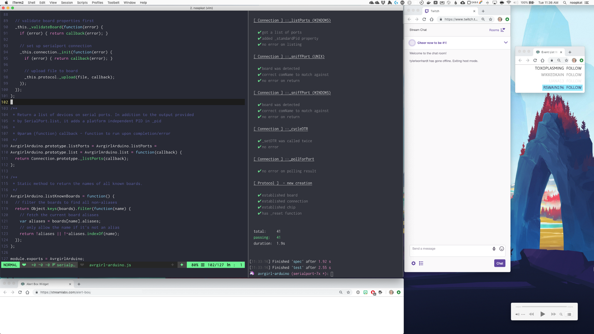

My ideal setup would use one of those ultra-Wide monitors so that I have more room in the non-capture zone, but this is fine for now. A girl can dream, and maybe even budget for a new monitor soon.

# My technical settings within OBS

I’m going to list the important video and output settings that I have found success with below.

## Video settings

- Base (Canvas) Resolution: 2560x1440
- Output (Scaled) Resolution: 1280x720
- Downscale Filter: Bicubic (16 samples)
- Common FPS Values: 30

## Output settings

- Encoder: x264 (but checked ‘enforce streaming service encoder settings’)
- Do not rescale output
- Rate Control: CBR (Twitch performs better with consistent vs. variable)
- Bitrate: 2000
- Keyframe interval: 0
- CPU usage: veryfast
- Profile: main
- Tune: (none)

So why the low output resolution and bitrate, I hear you ask? The answer is very blunt — your stream is not about you, it’s about your viewers. Some of your viewers do not have blazing fast, modern internet connections to watch you in crisp high resolution. I was born and raised in Australia, so I am painfully aware of this and remember waiting 20 minutes just to finish pushing code to a remote SVN service. As long as they can read your code on your video feed, you’re good. Keep things as low as possible in order to prevent buffering delays and intermittent dropped frames on your side as well. Your viewers will thank you by sticking around and returning each stream.

## Audio

This one is going to get complicated. I am streaming on macOS, which introduces some snags when working with audio sources in OBS. If you use Windows to stream — feel free to disregard this entire section.

The TLDR is: if you want music and other desktop sounds to play on your stream, use [Soundflower](https://rogueamoeba.com/freebies/soundflower/) for a really pared back solution to get started with. Soundflower will allow you to use a virtual device to route your desktop sounds to. OBS can then use the Soundflower device as an audio source.

I personally have a more comprehensive setup, where I route audio to several virtual devices in order to use OBS as an audio mixer for my needs. ***It is entirely optional, please do not feel that this is at all necessary.***

I use [Loopback](https://rogueamoeba.com/loopback/), which is an audio routing tool that uses software only to help you move audio through virtual devices from various sources. I use two virtual devices in Loopback; one for my music (iTunes), and another for the sound effects I sometimes play on my stream.

The music related device pipes the music playing from iTunes into a virtual device I call ‘Twitch Music’. Here is a screengrab of what it looks like in Loopback:

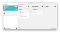
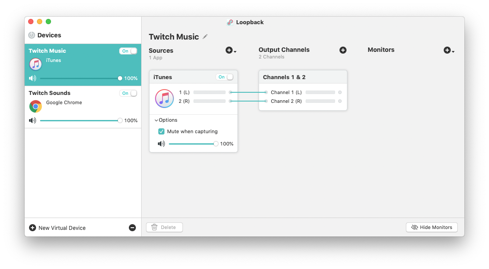

The sound effect related device captures sounds from my Chrome browser windows (Streamlabs alert sounds are the main thing I’m trying to capture) and is also a simple ‘pass-thru’ — it’ll accept any input audio you give to it. I cover how I play my sound effects via this pass-thru in the automation section of this post later on. However, here is a screengrab of what it looks like in Loopback:

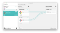
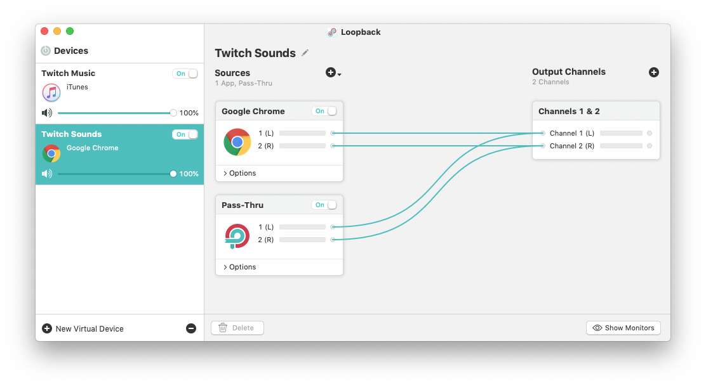

In OBS I set up an audio source for each of these virtual devices, including Soundflower. Soundflower is capturing the remaining sound that isn’t music or a sound effect (such as error sounds from my computer programs, etc).

Here is a screengrab of the audio settings in OBS:
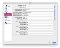
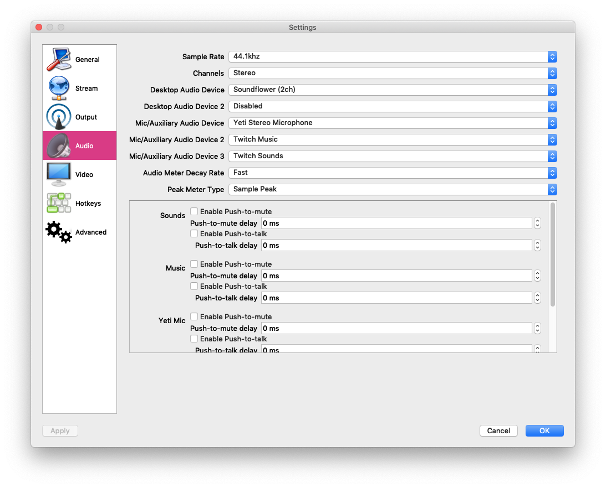

Setting up these sources separately allows me to control each one individually, just like a mixer in real life. I can individually adjust the volume of my mic, music, sound effects, and misc. desktop sounds at will, which is really handy to have as a feature when streaming.

Here’s the mixer interface in OBS to show you what I mean:

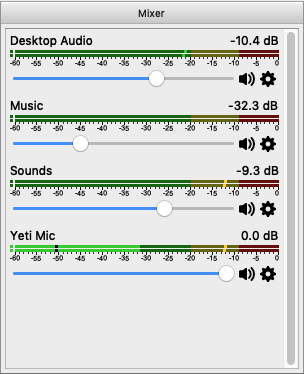

Last but not least — all of this does not help me to also hear what I need to hear while streaming. I do not want to hear the music, but I do want to hear computer error sounds, and also Streamlabs follow and subscription alerts which help me to notice them and call them out. This is where I use the Audio MIDI Setup application (built into macOS) to solve this problem. I create a multi-output device, and check the boxes to include the audio sources I do want to hear. Just before I stream, I switch to this multi-output device as the output source for my laptop’s audio. This routes the helpful sounds to me, and filters out the sounds I do not want. I call this device ‘Twitch Personal’ so that I remember it’s for my own local use.

**If you want to conduct remote video calls with fellow programmers to “pair” with them on your stream, you will absolutely need to do this, or you won’t be able to hear them speaking (only your viewers will hear them).**

Here’s what my multi-output device looks like:
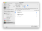
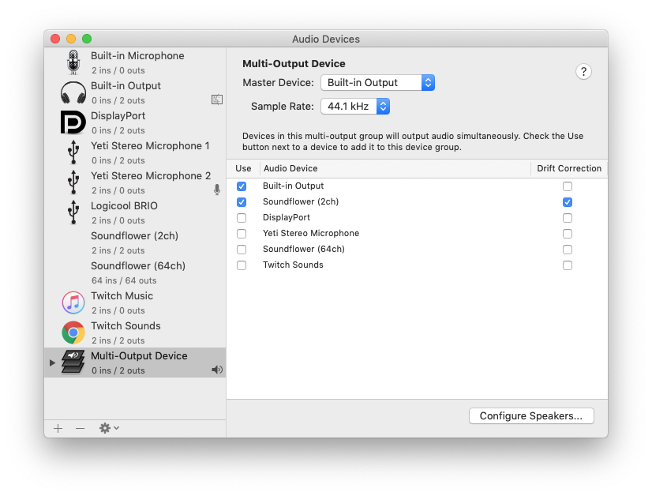

## Music

I randomly source royalty free, creative commons licensed music from sites such as [Free Music Archive](http://freemusicarchive.org/) and [Bandcamp](https://bandcamp.com/). There are services out there like [Pretzel Rocks](https://www.pretzel.rocks/), but I want a specific music type for my channel that other streaming music resources don’t offer.

I use iTunes to play the music on stream because it supports AppleScript, and I have written scripts that automate the music and the song identification.

# Twitch channel page aesthetics and emotes

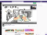
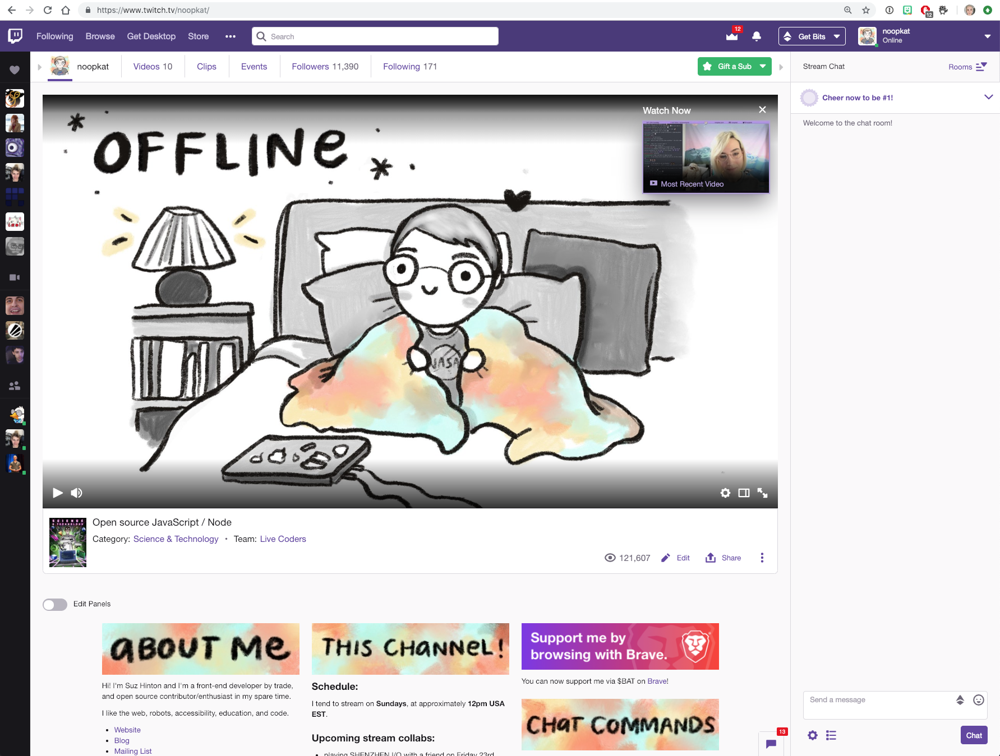

I have re-designed my Twitch channel page since I wrote my original post about streaming. The objectives were:

- Bring a more cohesive look and feel to my channel
- Include myself in some of the assets to create a personal touch
- Make the channel page look friendly and unique

I hired [Emily Griffin](https://twitter.com/emilywithcurls) to create all of the illustrations, panel banners, and emotes that you see on my twitch channel page. It was 100% worth the investment. I knew of Emily because we ran in similar social circles, and I’d also seen her work online so I was certain that her style would be a great fit for that I wanted my channel to become.

Put some effort into your panels below the channel video frame. Potential new viewers will often visit your channel’s page when you’re offline, so having a good set of panels to describe your channel and letting them know when your next stream is sets a great first impression and is generally helpful for them when deciding whether to follow up when you’re live. They also help a lot when viewers stumble upon your stream when you’re live, and are not sure what you’re working on or what your stream is about.

# Stream moderation and privacy

## AutoMod

Twitch has a feature called AutoMod, which is really helpful to have moderating your channel’s chat room. There is an entire moderation settings page on Twitch dedicated to different approaches you can use. Here are my main settings that I know to have made a positive difference to chat quality.

- I have my AutoMod set to Level 4 (ie. a lot of moderation).
- I have a 4 second chat delay instated so that my human moderators (bless them I am not worthy) have a chance to remove any nasty or inappropriate content before everyone else sees it.
- All folks wanting to leave chat messages need to have an email address registered with their account first.
- You have to have been following my channel for a minimum of 30 minutes before you’re allowed to chat in the chat room.

My chat rules are:

- Follow the Twitch Community Guidelines.
- Be kind!
- Respect other humans.
- Include everyone.
- No language bashing.
- Listen to the moderation team.

I also use [Nightbot](https://beta.nightbot.tv/) for some of their moderation features, but have turned most of them off since Twitch introduced AutoMod.

## Human Mods ❤️

I do not know what I’d do without my friendly and cherished human moderators. While not critical when first streaming, once you have built a meaningful following real people as moderators are very key. They are the backbone of the positive community that I have grown around my stream channel. I currently have 15 moderators officially. I’d hazard a guess that on average 3–5 of them are present during my streams, and it varies in numbers and the people depending on the week.

I won’t mention them here in fear of putting them on blast, but I want to thank them so much for their very hard and sometimes stressful work when weird / nasty stuff goes down (which is not super often, in all honestly and relief). My AutoMod settings are aggressively set to cut them some slack, and so they only need to step in if things get super weird ❤

## Privacy

I try to keep a pretty locked down ship privacy-wise. Inevitably, I’ll do something by accident that I shouldn’t have from time to time, but what’s most important is that I mitigate the risks as much as possible, and plan for when something goes wrong.

I use my secret blocker when needing to enter plain text secrets anywhere in my code as I mentioned earlier in this article. If I accidentally show a secret, such as running git diff or cat on a file I shouldn’t have, I immediately rotate the secret / API key and move on after having a laugh at myself.

I am also aware that there are certain techniques folks might use to phish personal information from me on stream. This can be something as innocent as sending me an Amazon product link. On that Amazon product link page, my shipping address zip code is displayed if I’m logged in. This is just one example, but there are many ways for me to be baited into showing details I did not volunteer to.

One option is to have a separate browser profile where I’m logged out of everything. In all honesty this hasn’t been a super practical option for me. So instead, I use a browser extension called [Block Site](https://chrome.google.com/webstore/detail/block-site-website-blocke/eiimnmioipafcokbfikbljfdeojpcgbh?hl=en) to schedule blocking of certain websites during the time window that I am streaming in. This extension is actually designed for productivity reasons, but it’s been helpful for me to have peace of mind. I add sites to it regularly when I think of them. I have all of the major shopping/ordering sites covered, as well as email accounts, and the settings pages of many technical tools and websites I use online.

If I’m worried about the contents of a link posted in chat, I just don’t click on it, and ask one of my mods to check it out for me.

If you want a more detailed discussion, I talked about [privacy and security while streaming with Tanya Janca on her DevSlop channel](https://www.youtube.com/watch?v=HSpFT3tZzyM).

# Automation

In truth, I don’t have a lot of automation set up to streamline the streaming process, but I’ll outline what I do have because it helps a lot. A few of these automated processes have been mentioned in previous sections of this post.

## Chat automation

I use [Nightbot](https://beta.nightbot.tv/) not just for moderation, but for setting up special chat commands that will autoreply with commonly asked questions while I’m streaming. This saves me a lot of time and distraction when folks drop in asking things such as “what are you working on?”, “what is that terminal theme you’re using?”, and “can you share your dotfiles?”. FYI, the chat commands set up for these questions are ‘!whatamidoing’, ‘!editor’, and ‘!dotfiles’ respectively.

Here is what it looks like in the chat:
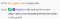
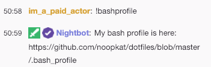

## Keyboard shortcuts

I have keyboard shortcuts set up for the following:

- Switching to specific scenes in OBS
- Toggling the ‘secret blocker’ on the desktop scene in OBS
- Playing sound effects
- Running an automated setup script before streaming

I use [Keyboard Maestro](https://www.keyboardmaestro.com/main/) for all of these shortcuts, including sending shortcuts directly to OBS because there’s a global keyboard shortcut bug in OBS on macOS so this is how I get around it.

Remember earlier where I detailed a separate virtual device for sending sound effects to? Here is an example of a macro to do that in Keyboard Maestro:

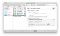
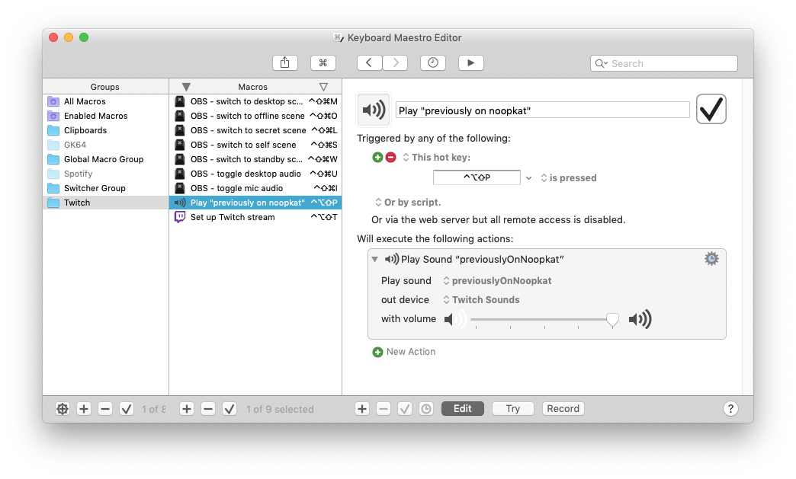

## One giant AppleScript

I recently captured the entire pre-stream setup process into one AppleScript (and some companion bash scripts). This script is a true time saver every Sunday morning since I made it. This AppleScript does the following for me:

1. Opens all of the browser windows I need (streamlabs alerts/events, Twitch chat, etc) after minimising my personal browser window with all my private tabs

2. Opens a new iTerm custom window arrangement, perfectly sized and aligned for my Twitch stream, after minimising my personal iTerm window with my day-to-day work in it.

3. Switches my audio output source to ‘Twitch Personal’

4. Starts up iTunes, positions it in the bottom right corner, and starts playing my custom Twitch playlist

5. Starts up the Stream Labels app and minimises it

6. Pops up a dialog asking to update my !whatamidoing Nighbot command reply content.

The last step which updates my Nightbot command does the following:
1. Hits the Nightbot API and gets the last command reply I used from last week

2. Pre-populates the input field on the dialog with the last reply it fetched, and if I want to change it I can

3. Once I hit ‘Save’, it hits the Nighbot API again to set the command reply to the new one I typed in

4. It’ll then show a macOS notification with the JSON of the Nightbot API response so I can check if it worked ok.

I assign a keyboard shortcut to run the AppleScript in Keyboard Maestro:
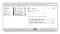
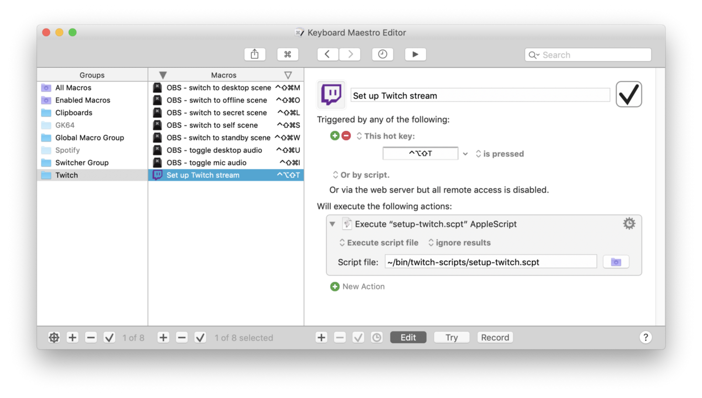
Here is the Nightbot prompt:
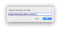
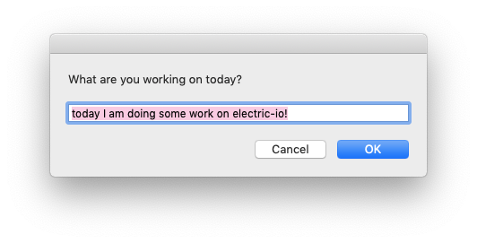
And the response:
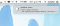
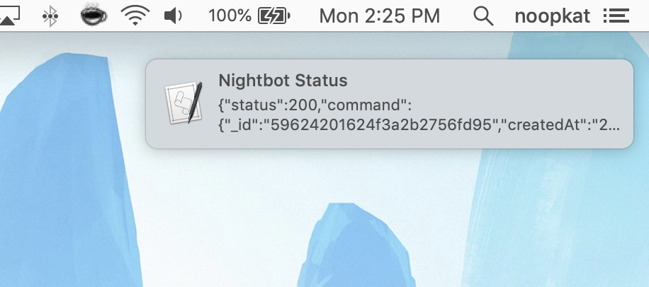

The [final AppleScript is here](https://github.com/noopkat/twitch-scripts/blob/master/setup-twitch.applescript) if you’d like to read it.

And I have hosted all of my scripts including this one in a [repository on Github](https://github.com/noopkat/twitch-scripts).

# Round Up

I have collected all of the tools and resources mentioned in this post into one big list for your convenience:

- [Open Broadcasting Software](https://obsproject.com/)
- [Emily Griffin](https://twitter.com/emilywithcurls)
- [Streamlabs](https://streamlabs.com/)
- [Dracula Theme](https://draculatheme.com/)
- [Customising chat widget article](https://medium.com/@suzhinton/customizing-your-livestream-chat-widget-2ff9de49e83f)
- [Pixelmator](https://www.pixelmator.com/pro/)
- [Soundflower](https://rogueamoeba.com/freebies/soundflower/)
- [Loopback](https://rogueamoeba.com/loopback/)
- [Free Music Archive](http://freemusicarchive.org/)
- [Bandcamp](https://bandcamp.com/)
- [Pretzel Rocks](https://www.pretzel.rocks/)
- [Nightbot](https://beta.nightbot.tv/)
- [Block Site](https://chrome.google.com/webstore/detail/block-site-website-blocke/eiimnmioipafcokbfikbljfdeojpcgbh?hl=en)
- P[rivacy and security stream with Tanya Janca on DevSlop](https://www.youtube.com/watch?v=HSpFT3tZzyM)
- [Keyboard Maestro](https://www.keyboardmaestro.com/main/)
- [AppleScript for polling current song playing in iTunes](https://gist.github.com/noopkat/ea98f5a6ef197e636394ff7b270a16a0)
- [Ultimate setup AppleScript](https://github.com/noopkat/twitch-scripts/blob/master/setup-twitch.applescript)
- [Study temperature browser app](https://github.com/noopkat/study-temp)
- [Collective Twitch scripts repository](https://github.com/noopkat/twitch-scripts)

# Conclusion

I hope this has been informative for you. I have tried to share as much detail as possible and address the most common questions I get about my setup. If you have additional questions, let me know. Just keep in mind — this is what works for me. What works for you may be entirely different. Happy streaming!