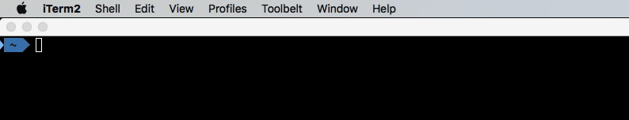
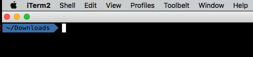
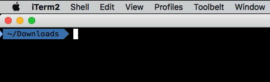

My favorite command-line utilities – Hacker Noon

# My favorite command-line utilities

## **How I stopped worrying about GUI and learned to love the terminal**

### Introduction

I’ve talked [previously](https://medium.com/@vitalyb/this-windows-developer-just-got-a-macbook-c9f703ed8abb#.u41edavka) about my initial experience with MacOS. While I still love the laptop and how well it works, my favourite applications in it have very little to do with Apple’s ecosystem — Most of them are command-line application that are shared with most of the UNIX/Linux world.

Adopting the terminal for most of my interactions allows me to be a lot more productive — I can work on multiple projects, tasks and easily switch contexts and folders.

Below are some of my currently favourite CLI applications.

### **oh-my-zsh (zsh)**

[oh-my-zsh](https://github.com/robbyrussell/oh-my-zsh) is an amazing collection of zsh configurations and it comes loaded with multiple features that enhance the general usage of the terminal. These are the ones I find myself constantly using:

- •More practical auto-complete — Visual and arrows-navigable auto-complete

- •Auto-complete directories from a single letter — Complete directories like `cd ~/d/y`**  **and take you directly to `cd ~/Downloads/YouTube`

- •Go back to your directory history with `cd -`

- •Auto complete in git— Jump between branches with a quick tab

Besides the core functionality of zsh, there are plenty of plugins to choose from.

[history-substring-search](https://github.com/zsh-users/zsh-history-substring-search) allows you to start typing a command, and then press up to search for all the commands that start that way.

If you find your colours to be too dull, install [syntax-highlighting](https://github.com/zsh-users/zsh-syntax-highlighting) plugin. Now you can spot the syntax error before running the command:

And just to make your terminal a bit prettier, there is the powerful prompt. Besides being pretty it allows you to see easily your current git status and branch. Here is what [mine](https://gist.github.com/vitalybe/9f144d0495a5c047456274a4833d2ad1) looks like:

### Copying output to clipboard (without a mouse)

Part of the advantages of using the terminal, is that you don’t need a mouse… Until you need to copy something. Here are some options for mouse-less copying.

#### yank

With [yank](https://github.com/mptre/yank) all you need to copy something is redirect its output to it, like so:

#### pbcopy (MacOS) / xclip (Linux)

Both of these commands would copy the content that was piped to them:

#### iTerm2 integration

[iTerm2](https://www.iterm2.com/) has plenty of features to make it my favorite terminal shell. Its integration feature allows you, among [many other things](https://www.iterm2.com/documentation-shell-integration.html), to easily select and copy the output of the last command:

### fasd

One of my first pains when working in the command-line was: “How do I get to my project folder? Surely writing `cd ~/my/very/long/path` will get old very quickly?”.

Luckily [fasd](https://github.com/clvv/fasd) can help with that (and more). Once installed and configured, it listens silently as you **cd** to various folders. As soon as you do, however, it remembers its path and allows you to do it much faster next time.

In the example below, I go to a directory manually. Then to go back to it, I just use fasd’s `z` command and switch back.

Beside changing directories, you can also use fasd’s shortcuts for other operations using the comma (,) command, e.g:

### lnav

I find [lnav](http://lnav.org/) to be one of the best ways to cope with log files. The fact that it is also in CLI just makes it easier to work with. It effortlessly loads a single file or a whole folder with multiple log files, and allows you to filter, search and follow it very swiftly.

Here I open a folder in lnav, with many log files, and filter to get the specific lines I want:

### peco

[peco](https://github.com/peco/peco) is used to quickly filter the output of commands. Consider it to be the interactive version of `grep`.

For example, let’s search inside my command line history to remind me syntax of `git merge-base`:

Note that peco returned the selected line — That means you can use it with other applications. For example, let’s get the pid of Evernote to the clipboard with the aforementioned `yank`:

### tig

I’ve started using git with a proper GUI client. As time progressed, however, I found the terminal to be faster and better for many of the common operations: checkout/pull/merge.

However, some of the operations do require interactivity. When I view git’s log I would like to move freely between commits and when committing, I’d like to be able to select the files I’d like to stage. Using a proper GUI client for that, however, is distracting — It breaks you out of the terminal and breaks the flow of the regular commands. [tig](https://github.com/jonas/tig) helps you with that.

#### git log

To watch the history, just run `tig` in the directory — You will be able to view each commit, affected files and the relevant diff.

#### git commit

By running `tig status`**  **it is easy to stage the files you’d like to commit, or even specific lines (chunks)

#### **git difftool**

Just because you’re in text mode and specifically tig, doesn’t mean you have to rely on text-mode diff. If you’re a fan of a proper diff/merge tool (e.g. Beyond Compare) it is easy to configure tig to open one. Simply add the following to your **.tigrc** file:

bind status <F4> !sh -c “git difftool -y \”$(git rev-parse — show-toplevel)/%(file)\”"

Now simply select a changed file and press **F4**

### ranger

Even if you’re comfortable with the terminal, some actions can still be a chore. Quickly exploring multiple directories, copying multiple by selection to another folder, etc.

As a short example, here is how I would copy some files with [ranger](https://github.com/ranger/ranger):

### realpath

What do you do if you need to provide a certain file in the terminal to an open GUI application? For example, if you want to get the path of a photo to your photo editing program?

You could do `pwd`, to get the current directory, and then append to it the name of file. But there’s an easier way.

[**realpath**](http://blog.ivansiu.com/blog/2014/05/01/os-x-get-full-path-of-file-using-realpath/) gives you the real, absolute path of any file, like so:

### mackup

So you got your applications configured. What will happen once your computer dies or gets replaced? [mackup](https://github.com/lra/mackup) (for both MacOS and Linux) is a really simple way to backup your configurations to Dropbox, or another cloud storage.

Its method is ingenious —instead of making copies and schedules, all it does is simply copies the file once to your Dropbox and replaces the original with the symlink.

The applications continue working with their configurations as usual, but they are actually modifying them on your Dropbox. Now every configuration change you do is immediately back-upped by your cloud storage.

It’s worth to emphasize — Unlike other backup applications, you only run mackup **once**.

### ncdu

This storage analyzer answers the question “What the hell is eating my drive’s space?!”. It is easy and useful and I found it much better even compared to GUI alternatives. And yes, you can delete stuff from it directly as well.

### Tell me about yours!

I would be happy to hear about your favorite command line applications and how you use them.

### From your comments

There are quite a few suggestions in the comments. I will mention the ones that I liked, but I won’t mention all of them. Sorted by how much I am likely to use them:

- •caffeinate — For MacBook users only (built-in). This simple command allows you to run a long running command without the fear of your computer going to sleep in the middle, e.g: `caffeinate sleep 5`
- •[Hub](https://hub.github.com/) — Avoid going to GitHub for pull requests and forks! Perform most of GitHub’s operations from the comfort of the command line.
- •[Tmux](https://tmux.github.io/) — A multiplexer for the terminal, [really useful](https://justin.abrah.ms/dotfiles/tmux.html) if you work on a remote computer and would like to work with multiple tabs, panes and disconnect without closing your environment and processes.
- •[scm_breeze](http://madebynathan.com/2011/10/19/git-shortcuts-like-youve-never-seen-before/) —If tig is too much UI for you, this might be a better fit — This application replaces long file paths in status with numeric shortcuts and allows you to choose files to `git add` without typing long paths.
- •[Fzf](https://github.com/junegunn/fzf) — Fuzzy finder, similiar to peco. While at it, you might also want to check [fzy](https://github.com/jhawthorn/fzy). There are quite a few others too, though, I am not sure what’s the difference.
- •[Mdlt](https://github.com/metadelta/mdlt) — A calculator for the command line that can also integrate and derive.

