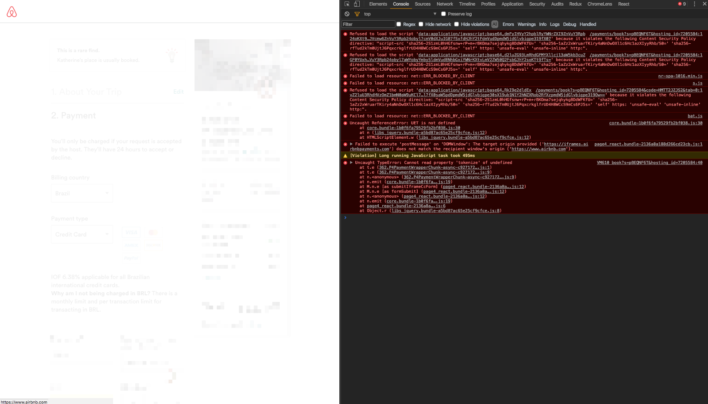

My shitty AirBnB experience – Caio Gondim – Medium

# My shitty AirBnB experience

I'm currently on the process of migrating to the US, and working remotely from Brazil in the meanwhile. On April 2017 my manager asked me to spend a month with the team in New York since we were near a major release of the project we were working on for the last months.

I took the opportunity and invited my girlfriend to spend the last 2 weeks with me, so we could better decide on where to live in NYC. The idea was to book 2 different apartments in 2 different districts to *feel the vibe *of each one*. *For that I chose AirBnb, and it was the beginning of our 💩 experience.

### 💩 Checkout process

For the first week, I decided to book an apartment in Williamsburg. The district is beautiful, full of parks, and most of my friends and coworkers live there. Since I don’t have a credit card, I asked my beloved mother to use hers.

I chose a nice apartment near Bryant Park, went through the checkout process, changed the country from Netherlands to Brazil, and started filling the credit card information.

✅ Name
✅ City
✅ State
✅ Address
Submit.
Spinning wheel.
30 seconds.
Nothings happens.
30 seconds more.
Spinning wheel still.

Maybe it’s a bug on Chrome only, let’s try on Safari: same thing. Firefox? Nay. Maybe a bug for Portuguese language only, let’s change to English: still nothing.

How come the checkout process of an e-commerce is broken? This is the equivalent of having a supermarket running without cashiers.

* * *

*...*

#### Technical note

I opened up the developer tools (if you don't know what it is, this side note won't make sense for you, skip to next paragraph) and there I see a bunch of JavaScript errors.

JavaScript errors on AirBnB checkout process
Monitoring, anyone?

* * *

*...*

I try to solve my problem (AirBnB problem, as well?) searching on Google if there is any catch about booking an apartment with a Brazilian credit card, and somebody somewhere said something about a cap of $1000. To test this piece of advice I randomly found on the interwebs, I needed to look for apartments cheaper than $1000. But there are no apartments in Williamsburg below this price.

I was told Greenpoint is an OK district and still near Williamsburg. Let's search there.

Nice. I can see a couple of available apartments for less than $1000. Oh, I like that one, let me try with this:

1. 1Proceed to checkout again
2. 2Enter credit card details
3. 3Submit
It works.

Thanks Google, for pointing me out on how to properly use someone else's system.

### 💩 1st apartment: private pero no mucho

I was already disappointed since I was eager to show Williamsburg to my girlfriend and Greenpoint is borderline Queens. Don't get me wrong, those are nice districts, but the experience delivered was far from my expectation.

The apartment on Greenpoint was nice. We both liked at first. Roomy with some hipster decoration, near the metro station, cozy, comfortable (gezellig, as the Dutch say).

On my first working day there, I woke up earlier than my girlfriend to get the commute to Manhattan since she was still jet lagged. I arrive at work, get my coffee, and turn on the computer. She calls me just after the first sip:

— I guess there is someone on the apartment.

— No, it's impossible. We booked the whole apartment.— I was confident there was no one in the apartment at that point.

— No! I can hear voices from the room upstairs.
The apartment was a loft with a room upstairs that was closed when we arrived.

— Are you sure? Maybe someone next door? The walls are thin. — I still didn't believe that could be someone there.

— No! There is someone there. I'm sure!
Ok. She convinced me.

I sent a message to the apartment owner asking if there was someone else on the apartment, and she replies:

— Yes. It's on the notes, on the apartment description. My coworkers might use the bathroom downstairs.— Replied the owner, from far away Austria, Europe.

— What? I paid for a private apartment. This is not private. And I didn't read that.

— Sorry, but it's on the contract.

I went back to the apartment page to try to find that information, and there it was. Hidden. A classic UX dark pattern.

### 💩 UX dark pattern

A dark pattern is a know trick inside the industry used in websites and apps to make you pay for things you didn't mean to. Just like the below example, which I recorded with the exact apartment I got.

Private room pero no mucho.

I searched for apartments in Greenpoint, applied the filter for private apartments, the apartment shows up on the results with filters applied, and I still had to double check if it is **really **private? Misleading and unfair, to say the least.

### 💩 2nd apartment: the one that never was

For the second apartment I just couldn't book any property in Lower Manhattan (the second region me and my girlfriend chose to spend a week) with a Brazilian credit card, so I asked for help from my manager. With his help (and credit card) we managed to get a beautiful apartment in Lower East Side.

We had to checkout on Sunday midday from the Greenpoint apartment, and the owner of the second apartment asked us for a couple more hours in order to clean the place. I called Juliana and Dave, a couple friends of mine, to have a brunch and kill some time around Williamsburg. And so we did.

After the brunch, around 2PM, I started calling the host. He doesn't pick it up. I do the same at 3PM. Nothing. Try to leave a voicemail: his mailbox is full. No worries. I will call AirBnB's customer service and they will, [for sure](https://www.youtube.com/watch?v=oT3mCybbhf0), fix this.

### 💩 Customer service

First, you just can't find AirBnB's customer service telephone number. You have to go to Twitter and basically bitch about it. And don't expect instant answers there, they clearly don't know what the I in [IM](https://en.wikipedia.org/wiki/Instant_messaging) stand for.

Sorry for the typos. I was really pissed off.

After getting their attention, I received an email with a number I should call. They said I should do it immediately and there was already someone allocated to solve my case.

30 minutes listening crappy music.

Yes. More than half an hour listening some crazy music while on hold waiting for “the guy that was already allocated to solve my case” to pick it up. After the 3rd try, someone answers the phone.

### 💩 Solving customer problems

I spoke for about an hour with AirBnB's customer service. At first I was really believing they would fix the problem. After all, I payed for this. But, minute after minute, it was becoming clear that it wouldn't happen.

The guy said that, for the price, he couldn't find any apartments on Lower Manhattan and was willing to relocate us to the Bronx. Again, I don't have a problem with the Bronx, but:

1. 1I didn't pay for that

2. 2It's far from my work and my friends, and the whole purpose of spending a week in a district is to know if we would like it or not to **live **there

Besides sending me to somewhere really far away, those were the options offered to me:

- •Cancel your reservation (and that would take 5 working days to be refunded)
- •There is no 2nd option

Wrapping up, the best AirBnB could do was to send us to a far away apartment or just cancel my reservation and good luck (they honestly wished me good luck, no bullshit).

The problems I see with that — and why it's not fair:

- •I'm just asking for something I already payed, and they can't deliver that
- •I don't have a credit card (remember?). How can I proceed?
- •The cancellation takes 5 working days to be fulfilled. Which means that, even if I had a credit card, I needed one with enough balance to accommodate booking one more apartment
- •Surge price: if you try to book for the same night, you pay more. And I planned my trip
- •Availability: Again, I planned the trip and chose carefully the apartment and district. Now I have to get something that nobody wants in a far away district?

### With a little help from my friends

Dave and Juliana, watching all the mess I was into, gently offered their credit card so we could book a A̶i̶r̶B̶n̶B̶ hotel room. And I'm really thankful for that.

We were lucky to be in a city with (amazing) friends to help us out. But this isn't true for most of my international trips (and I would imagine the same for everybody as well). So a lot of *what if*'s started popping in my head:

- •What if we were like, in Dubai, without any friends to help?
- •What if I had only one credit card, and that credit card didn't have enough balance available to book a new apartment (since it takes 5 working days to be refunded after a cancellation)?
- •What if this was a planned trip long before and we were in a tight budget?

AirBnB is totally unreliable.

Finally smiling.

We ended up booking [an awesome hotel](http://www.standardhotels.com/new-york/properties/east-village) for basically the same price — above is my girlfriend smiling in the hotel— and everything worked out just fine, with a little help from c̶u̶s̶t̶o̶m̶e̶r̶ ̶s̶e̶r̶v̶i̶c̶e̶ my friends.