My summer project: a rock-paper-scissors machine built on TensorFlow | Google Cloud Big Data and Machine Learning Blog  |  Google Cloud Platform

 

## My summer project: a rock-paper-scissors machine built on TensorFlow

Thursday, October 12, 2017

 *Posted by Kaz Sato, Developer Advocate, Google Cloud.*

After looking for a fun project to do with my son this past summer, I decided to build a rock-paper-scissors machine powered by [TensorFlow](https://www.tensorflow.org/).

[Rock-paper-scissors machine](https://www.youtube.com/watch?v=hyNruFqe1L0)

Rock-paper-scissors machine, powered by TensorFlow

As in the above video, the system uses the glove’s sensors to detect my son’s hand gesture, then selects the appropriate hand pose: rock, paper, or scissors.. Excitingly, TensorFlow is the secret ingredient. It runs a very simple machine learning (ML) algorithm that detects your hand posture through an Arduino micro controller connected to the glove. In this way, ML is used as a handy tool to build a flexible, robust and accurate motion detector in a few hours — which is great for a lazy programmer like me!

In this post, I’ll show you how we built the rock-paper-scissors machine, and teach you how to use ML as a programming tool to solve everyday problems. Almost anyone can do it with just a little programming experience and about $200 in hardware. (You can download the source code [here](https://github.com/kazunori279/ml-misc/tree/master/glove-sensor).)

Here’s how we did it.

### Step 1: Make the glove sensor

To build the hardware, we use[littleBits](http://littlebits.cc/). These kid-friendly kits include a wide variety of components like LEDs, motors, switches, sensors, and controllers, all of which can be connected via magnets — no soldering necessary. For this experiment, we used use three[bend sensors](https://shop.littlebits.cc/products/bend-sensor) which we attach to a plastic (or nitrile) glove.

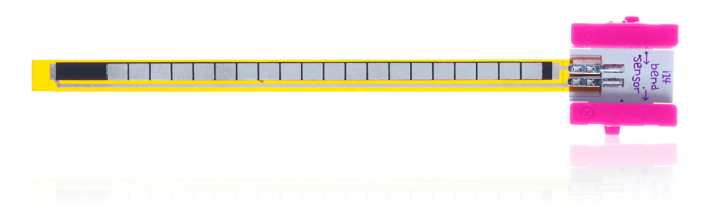
littleBits Bend sensor
(Photo by littleBits Electronics, Inc.)

When you bend your fingers while wearing the glove, the sensors output an electric signal with variable voltage ranging from 0V to 5V. If you add an input like an LED[bargraph](https://shop.littlebits.cc/products/bargraph) to the sensor's output, you should be able to see how much pressure each sensor is getting.

[Bend sensor and bargraph](https://www.youtube.com/watch?v=R2i30ebHabA)

The bend sensors output 0V - 5V signals

### Step 2: Attach an Arduino microcontroller and servo module

To read the signals from the bend sensors and control the machine’s dial, we used an[Arduino](https://shop.littlebits.cc/products/arduino-bit) and[Servo](https://shop.littlebits.cc/products/servo) module. The Arduino module has a tiny microcontroller chip inside it, and also has multiple input and output ports. You can write a Processing program (a C-like language) on your laptop, compile it, and load it into the module by connecting with a USB cable.

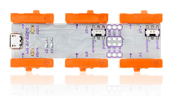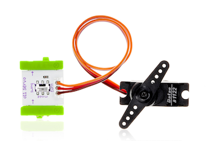
littleBits Arduino module (left) and Servo module (right)
(Photo by littleBits Electronics, Inc.)
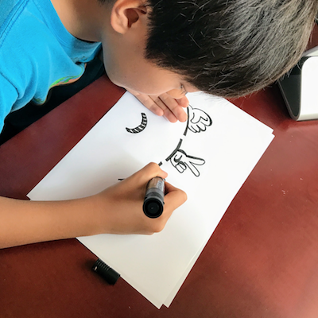
My son drawing the sign for the machine hand.

Now we have all the hardware components we need to build the rock-paper-scissors machine. Next, let’s write some code!

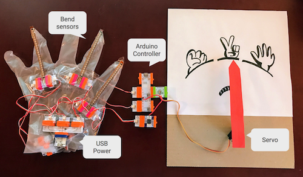
The hardware components of Rock-paper-scissors machine

### Step 3: Write a program which reads the data from the bend sensors

Now that the hardware is ready, we can start writing code on the Arduino module so that it reads data from the bend sensors. On the Arduino IDE, you can write the following code to read the sensor data at every 0.1s, then log it on the serial console.

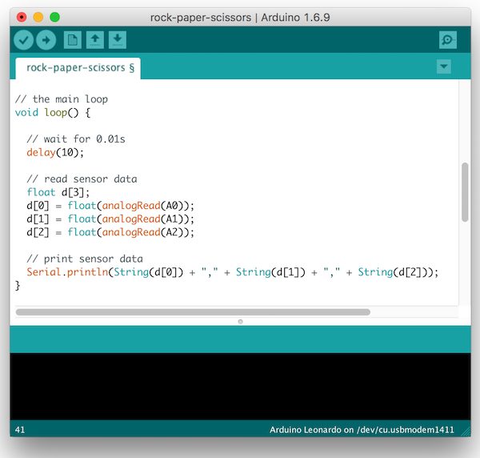
Writing a program on Arduino IDE
When you run this code, you’ll see numbers like this on the console.
hdr_strong

	1019.00, 492.00, 739.00
	1023.00, 492.00, 737.00
	1019.00, 491.00, 738.00
	1022.00, 491.00, 739.00
	1018.00, 492.00, 740.00
	1023.00, 491.00, 734.00
	1018.00, 492.00, 740.00
	...

The three numbers in each row represent the data read from the bend sensors. The Arduino module converts the input signal voltage (0V - 5V) to numbers ranging from 0 to 1023. The sample data above represents the "rock" posture, where all the sensors are bent. If you did "paper,” all the numbers would be close to zero (no bending).

### Step 4: Visualize the data with Cloud Datalab

How do we determine which combination of the three numbers represents "rock", "paper" or "scissors"? The most naive implementation would be writing IF statements with arbitrary thresholds and conditions. Such as:

- If all three numbers are below 100, the choice must be paper
- If all three numbers are above 400, the choice  must be rock
- Otherwise (else), the choice is scissors

This might pass your unit tests for now, but it's inflexible and fragile code. What if my son asks me to put more sensors on the glove to capture 10 different hand positions? Or, what about having lots of sensors attached to a bodysuit that recognizes many different body postures? The code above can't handle that level of complexity. And of course, because I'm a lazy programmer, I wanted to write more robust and flexible code that can handle spontaneous requests from a fickle customer (my son) without changing the basic design.

To find a better way to process the data, I did some quick data analytics on the glove sensor data. The tool I used was [Cloud Datalab](https://cloud.google.com/datalab/), a version of the popular [Jupyter](http://jupyter.org/) Notebook integrated with Google Cloud Platform. It’s a one stop shop for cloud-based data analytics. You can write Python code within the web UI, use standard tools like [NumPy](http://www.numpy.org/), [Scikit-learn](http://scikit-learn.org/) and [TensorFlow](https://www.tensorflow.org/), and combine them with powerful Google Cloud services such as [BigQuery](https://cloud.google.com/bigquery/), [Cloud Dataflow](https://cloud.google.com/dataflow/) and [Cloud ML Engine](https://cloud.google.com/ml-engine/).

I've saved the glove sensor data as three CSV files for each hand gesture, 800 rows each. You can read and convert them to a NumPy array (the full code is [here](https://github.com/kazunori279/ml-misc/blob/master/glove-sensor/Rock-paper-scissors.ipynb)) by writing some Python code on Cloud Datalab similar to the example below.

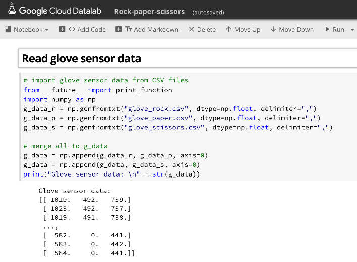
Reading CSV files as NumPy arrays with Cloud Datalab

From this point you can visualize the NumPy array using the popular [Matplotlib](https://matplotlib.org/index.html) tool. The following code draws a 3D graph with each axis mapped to a different sensor.

hdr_strong

	import matplotlib.pyplot as plt
	from mpl_toolkits.mplot3d import Axes3D
	fig = plt.figure()
	ax = Axes3D(fig)
	ax.scatter(g_data[:,0], g_data[:,1], g_data[:,2], c=g_label)
	plt.show()

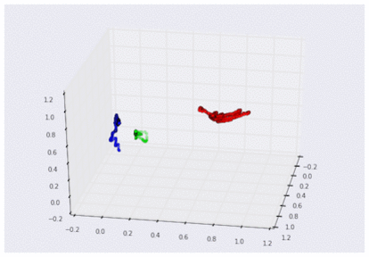
Sensor data plotted in a 3D graph
(for rock, paper, and scissors, after scaling)

By looking at the 3D graph above, you can get a much clearer perspective on the shape of your data.

### Step 5: Create a linear model

Next we need to tweak this raw sensor data to be a shape that can be classified as one of the three hand gestures. We’ll use [linear algebra, a](https://en.wikipedia.org/wiki/Linear_algebra) tool some of you learned (while others avoided) in high school or college.

Linear algebra is a category of mathematics that lets you map one set of dimensions into another set. For example, a linear mapping from a 1D space to another 1D space can be represented with the following formula.

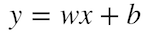

where x and y are variables in each 1D space, w is weight, and b is bias. By using this formula, you can map a 1D space of "Distance moved by taxi in NYC" to another 1D space of "[Taxi cost](http://www.nyc.gov/html/tlc/html/passenger/taxicab_rate.shtml)" by setting $2.5 (cost per mile) as weight and $3.3 (the initial cost) as bias.

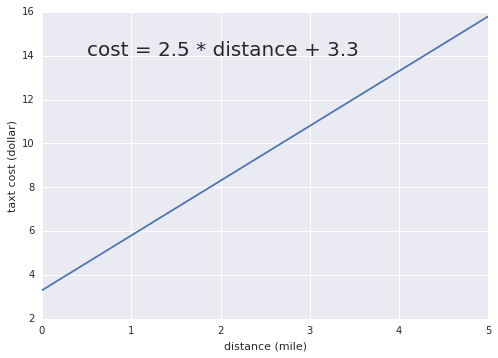
Mapping distance in NYC to taxi cost

As you can see in the graph, weight and bias (so called parameters) define the slope and position of the line respectively. By tweaking those parameters, you can create any linear mapping between a 1D space and another 1D space.

The beauty of linear algebra is that you can use the same formula for linear mapping from an arbitrary m-dimensional space to an arbitrary n-dimensional space. For example, the following formula can map a point in a 3D space (x1, x2, x3) to a point in another 3D space (y1, y2, y3).

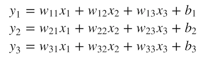

Mathematicians felt it was too tedious to write down the busy formula above, so they invented an easier way to write it: [matrix multiplication](https://en.wikipedia.org/wiki/Matrix_multiplication). The transformation above can be written in this way:

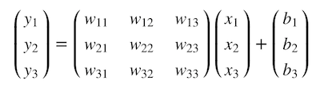
Or, more simply:
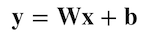

where x and y are vectors with 3 values, W is 3 x 3 matrix for weights, and b is bias vector with 3 values. Yes, it's exactly the same form as the first formula for 1D spaces. And the formula can be applied to any linear mapping between m-dimensional space and n-dimensional space. This is what we call a [linear model](https://en.wikipedia.org/wiki/Linear_model).

So, what does the linear model do for us? By using it, we can transform the 3D space of "glove sensor inputs" into a 3D space for "rock-paper-scissors," like this:

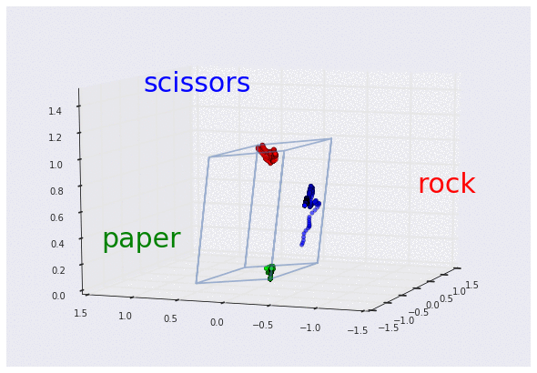
The linear model transforms "glove sensor" space to "rock-paper-scissors" space

Once we mapped the glove sensor input to the 3D space with rock-paper-scissors axes, it's so easy to write down IF statements to classify it.

- If the rock-axis value is higher than others, it must be rock.
- If the paper-axis value is higher than others, it must be paper.
- If the scissors-axis value is higher than others, it must be scissors.

A linear model can transform raw input data into [feature space](https://en.wikipedia.org/wiki/Feature_vector) where you have different axes for each feature you want to capture, so that the transformed data is much easier to handle. This is why I think linear algebra is the magic tool for lazy programmers, not just for data scientists.

Linear models can be especially useful when you have many dimensions (or many different attributes) in your input data. For example, if you have dozens of bend sensors attached to a bodysuit, a linear model could be used to map the raw data from the sensors into a feature space with axes for many different body poses (such as standing, sitting, crouching, etc). You won’t need to write many fragile `if` statements against the raw data. Linear models can also process unstructured and/or dense data with hundreds, or even thousands, of dimensions — such as images, audio, natural languages and time series data — to extract the specific features you want.

But please note that linear models are not a silver bullet. Classifying complex unstructured and/or dense data with a higher degree of accuracy may require a nonlinear model such as a[neural network](https://en.wikipedia.org/wiki/Artificial_neural_network) or[Support Vector Machine](https://en.wikipedia.org/wiki/Support_vector_machine#Nonlinear_classification). That way you can extract useful features with[a nonlinear transformation](http://colah.github.io/posts/2014-03-NN-Manifolds-Topology/) that can tweak the raw data in a much more flexible way. You may want to use a linear model as a starting point for your complex data, and if it doesn't extract your desired features to your satisfaction, you can try nonlinear models to get a better result.

### Step 6: Let TensorFlow find the parameters

Now that we've learned why linear models are so useful and powerful, you may wonder: how do you determine the weights and biases —the parameters — that do the best mapping?

The answer is machine learning. By using ML, you can let the computer calculate the best combination of parameters for the linear model based on the observed input data. With [TensorFlow](http://tensorflow.org/), it's so easy to implement. You can define the linear model’s "y = Wx + b" formula as a computation graph in TensorFlow like this.

hdr_strong

	import tensorflow as tf
	weights = tf.Variable(tf.zeros([3, 3]), dtype=tf.float32)
	biases = tf.Variable(tf.zeros([3]), dtype=tf.float32)
	glove_data = tf.placeholder(tf.float32)
	rps_data = tf.matmul(glove_data, weights) + biases

In the code above, [tf.Variable](https://www.tensorflow.org/api_docs/python/tf/Variable) creates variables for holding the 3 x 3 weight matrix and 3 dimensional bias vector, initialized with zeros. Also, [tf.placeholder](https://www.tensorflow.org/api_docs/python/tf/placeholder) creates a placeholder that receives any quantity of glove sensor data as input. [tf.matmul](https://www.tensorflow.org/api_docs/python/tf/matmul) is the method for matrix multiplication between glove sensor data and weights. (Why does the glove_data come first? Please see the appendix "tip for the tf.matmul usage" for more information.)

Please note that these methods (TensorFlow low-level APIs) do not perform any calculations when you call them. They merely build a computation graph like the one below:

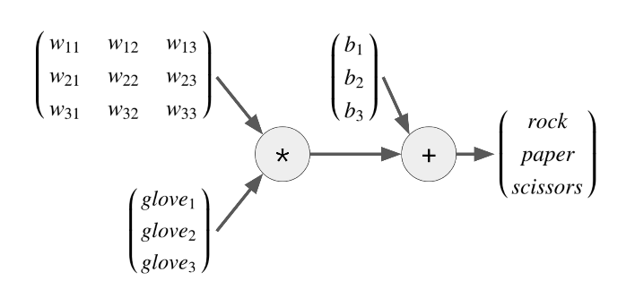

The most powerful part of ML and TensorFlow is that the computer can find the best parameters (weights and biases) for you. In the example of the graph above, we supplied glove sensor data (glove1, 2, 3) with their expected results (rock, paper or scissors). With that data,TensorFlow attempts to find the best weights and biases that will do the linear transformation you expect, by calculating them **backward** in the graph. This process is called **training** an ML model.

With ML, you just specify the input and output, then the computer generates the most important transformation in the middle. It's like automated programming! In a way, ML is like an electronic calculator for engineers in the 21st century. Anyone can use it for even trivial tasks to reduce human coding work.

### Step 7: Define a "coach" for the training

Training the linear model requires a coach. In this case, we need to write the following two lines to lead the model training in the direction of the expected result.

hdr_strong

	rps_labels = tf.placeholder(tf.float32)
	loss = tf.losses.softmax_cross_entropy(onehot_labels=rps_labels, logits=rps_data)

rps_labels is a placeholder to receive labels for each row of glove sensor data. We will pass hundreds of labels for each glove sensor data, like below:

hdr_strong

	[[1 0 0]
	[1 0 0]
	...,
	[0 1 0]
	[0 1 0]
	...,
	[0 0 1]
	[0 0 1]]

where `[1 0 0] `represents rock, `[0 1 0]` is paper, and` [0 0 1]` is scissors. This is called one-hot labels, the popular way to represent labels in ML for training a model for classification.

In the second line, we call [tf.losses.softmax_cross_entropy](https://www.tensorflow.org/api_docs/python/tf/losses/softmax_cross_entropy) to define the loss function. What are [softmax](https://en.wikipedia.org/wiki/Softmax_function), [cross entropy](https://en.wikipedia.org/wiki/Cross_entropy) and [loss function](https://en.wikipedia.org/wiki/Loss_function)? You can read detailed descriptions of each on Wikipedia if you’re not allergic to math. In the meantime, all you need to understand is that:

- **Softmax** squishes the numbers in rps_data into a range of 0.0 to 1.0 accordingly, so that we can use them as estimated probabilities for rock, paper and scissors.
- **Cross entropy** returns the difference between two probability distributions: the one-hot labels in rps_labels (the ground truth) and the estimated probabilities from the softmax.
- **Loss function** is a function that measures how much error the model has. In this case, we used the cross entropy as a loss function.

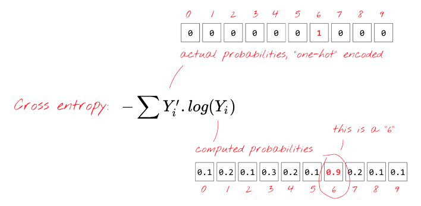

“Cross entropy tells us the difference between actual probabilities and computed probabilities.”

(Quoted from [TensorFlow and deep learning, without a PhD](https://codelabs.developers.google.com/codelabs/cloud-tensorflow-mnist/#4), Martin Gorner)

The loss function — the combination of softmax and cross entropy in this case — tells us how much error is in our linear model with the current parameters. This function will be the "coach" for TensorFlow that leads it in the right direction to find the best parameters.

By the way, the combination of the linear model and softmax is called multinomial [logistic regression](https://en.wikipedia.org/wiki/Logistic_regression), or softmax regression. It's one of the most popular algorithms for classification problems in statistics and ML.

### Step 8: Train the linear model

Now we’re ready to run TensorFlow to train the model by using an optimizer.
hdr_strong

	# define an optimizer
	**optimizer = tf.train.GradientDescentOptimizer(learning_rate=1).minimize(loss)**

	# create a Session
	sess = tf.Session()

	# init the variables
	initializer = tf.global_variables_initializer()
	sess.run(initializer)

	# train the model
	for i in range(10000):
	**  sess.run(optimizer, {glove_data: g_data, rps_labels: g_label})**

The [tf.train.GradientDescentOptimizer](https://www.tensorflow.org/api_docs/python/tf/train/GradientDescentOptimizer) is one of optimizers available in TensorFlow that uses [Gradient Descent algorithm](https://en.wikipedia.org/wiki/Gradient_descent) to modify the parameters so that it can minimize the error returned by the loss function.

To run the actual training, you need to create a Session and call its run method to pass the glove sensor data and labels to the optimizer. Since the optimizer will change the parameter values little by little (at the specified learning rate), you need to call the method thousands of times. If you look at the loss value during the training, you can see it would be reducing gradually, meaning the model is making fewer and fewer errors.

hdr_strong

	steps = 0,    loss = 0.978381
	steps = 1000, loss = 0.010096
	steps = 2000, loss = 0.005078
	steps = 3000, loss = 0.003402
	steps = 4000, loss = 0.002562
	steps = 5000, loss = 0.002057
	steps = 6000, loss = 0.001719
	steps = 7000, loss = 0.001478
	steps = 8000, loss = 0.001296
	steps = 9000, loss = 0.001154

After the training, you will have a good set of weights and biases that can map the glove sensor data into the rock-paper-scissors space with softmax probabilities. If you plot the softmax probability distribution on the original glove sensor space, it looks like the following.

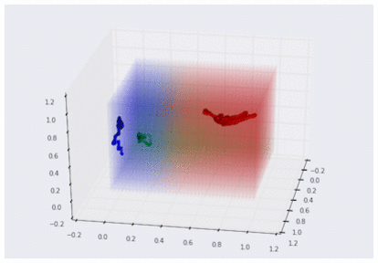
Estimated probability distribution of rock, paper and scissors

### Step 9: Use the linear model on Arduino

Now that we have a pretty solid way to classify the glove sensor data, let’s finish our Arduino coding.

By running sess.run(weights) on Datalab, you can read the trained weights. Copy and paste the weight values to write Arduino code like below. Do the same for biases, too.

hdr_strong

	float weights[3][3] = {
	  {3.007032,-9.370312,6.363242},
	  {10.726093,-0.494137,-10.231989},
	  {3.132884,-6.927588,3.794688},
	};

Finally, we can have the linear model on Arduino map the glove sensor data into the rock-paper-scissors space. You can calculate the matrix multiplication between the data, weights and biases with the Arduino code below.

hdr_strong

	float lg[3];
	lg[0] = (d[0] * weights[0][0]) + (d[1] * weights[1][0]) + (d[2] * weights[2][0])
	  + biases[0];
	lg[1] = (d[0] * weights[0][1]) + (d[1] * weights[1][1]) + (d[2] * weights[2][1])
	  + biases[1];
	lg[2] = (d[0] * weights[0][2]) + (d[1] * weights[1][2]) + (d[2] * weights[2][2])
	  + biases[2];

Then, compare those values to find which one has the highest value. Once we’ve determined the hand’s posture, the Servo can then control the machine hand to win the game. In this example, you don't have to calculate the softmax values. You can simply compare the linear transformation’s output, which corresponds to the values of the rock, paper and scissors axes.

hdr_strong

	 // control servo
	 if (lg[0] > lg[1] && lg[0] > lg[2]) {
	   analogWrite(5, 190); // rock -> paper
	 } else if (lg[1] > lg[0] && lg[1] > lg[2]) {
	   analogWrite(5, 127); // paper -> scissors
	 } else {
	   analogWrite(5, 50);  // scissors -> rock
	 }

That's it! You’ve now used ML to create your very own rock-paper-scissors machine.

### Next steps

As we've seen in this post, a linear model is a powerful tool that can map an arbitrary m-dimensional space to an n-dimensional space with a linear transformation. If you ever find that it's too tedious to write multiple `if` statements for checking raw input data with complex conditions, you might want to consider this technique. Rather than handling the raw data directly, it's much easier to handle the data mapped to a feature space (in this demo, it was the rock-paper-scissors space).

The key technology here is ML and TensorFlow. It can help you find the best parameters for building a linear model. These are not just tools for state-of-the-art deep learning and AI, they can also be used to write a robust and flexible code for garden variety programming.

### Acknowledgements

Thanks so much to Etsuji Nakai for reviewing this article and giving me valuable feedback. And thanks to my son for drawing the great rock-paper-scissors sign for the machine.

### Appendix: tip for the `tf.matmul` usage

Since we’ll receive hundreds of glove data inputs with the placeholder at once, it's simpler to flip the position of glove_data and weights like this:

Using this form, you can stack multiple glove data inputs and get all results at once in rps_data as below:

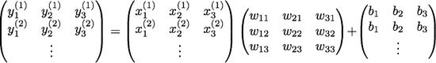

Look complicated? Don't worry, the single line in the code for `rps_data` automatically does the right thing for you.