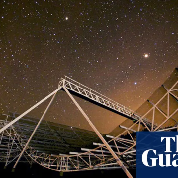

Mysterious fast radio bursts from deep space ‘could be aliens’

Mysterious fast radio bursts from deep space ‘could be aliens’

https://www.theguardian.com/science/2019/jan/09/repeating-fast-radio-bursts-from-deep-space-could-be-aliens?utm_term=RWRpdG9yaWFsX01vcm5pbmdCcmllZmluZ1VLLTE5MDExMA%3D%3D&utm_source=esp&utm_medium=Email&utm_campaign=MorningBriefingUK&CMP=morningbriefinguk_email

Repeating bursts of radio waves detected for first time since initial accidental discovery in 2007