Nautilus | Science Connected

Issue 054

# The Unspoken

After words
[Read More](http://nautil.us/issue/54/the-unspoken/the-unspoken)
[See Full Issue](http://nautil.us/issue/54/the-unspoken)
Scroll Down

## [Nautilus](http://nautil.us/)

- [*s*](http://nautil.us/#)
- [Issues](http://nautil.us/issues)
- [Topics](http://nautil.us/#)
- [Blog](http://nautil.us/blog)
- Newsletter
- [*f*](http://www.facebook.com/NautilusMag)
- [*t*](http://twitter.com/NautilusMag)

[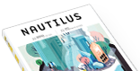](http://shop.nautil.us/nautilus-print-edition/)

- [Store](http://shop.nautil.us/)
- [Prime](http://nautil.us/primeuser)

|     |     |
| --- | --- |
| SELECT NEWSLETTERS AND SUBMIT CONTACT DETAILS… |     |
| - **New chapters**   Thursdays Nautilus publishes a new chapter of feature stories on its monthly theme, every Thursday. Sign up to this list to stay up to date on the latest and greatest. - **Editor's picks**   Sundays Read about the Nautilus stories and blogs we've been thinking about over the past week. |     |

- *l*
- *r*

- [   Issue 054 ## The Unspoken](http://nautil.us/issue/54/the-unspoken)[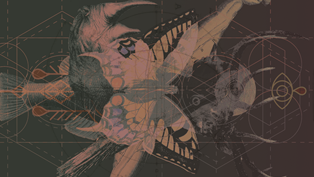   Issue 053 ## Monsters](http://nautil.us/issue/53/monsters)[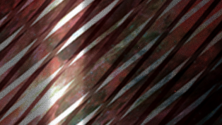   Issue 052 ## The Hive](http://nautil.us/issue/52/the-hive)[   Issue 051 ## Limits](http://nautil.us/issue/51/limits)[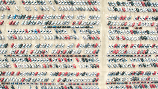   Issue 050 ## Emergence](http://nautil.us/issue/50/emergence)[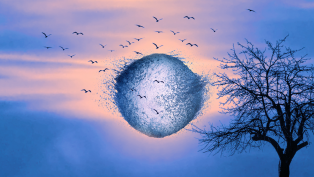   Issue 049 ## The Absurd](http://nautil.us/issue/49/the-absurd)[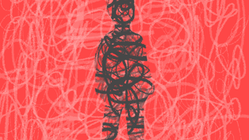   Issue 048 ## Chaos](http://nautil.us/issue/48/chaos)[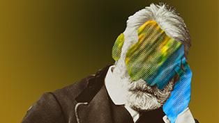   Issue 047 ## Consciousness](http://nautil.us/issue/47/consciousness)[   Issue 046 ## Balance](http://nautil.us/issue/46/balance)[   Issue 045 ## Power](http://nautil.us/issue/45/power)[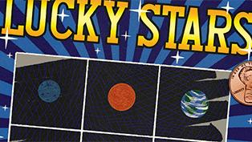   Issue 044 ## Luck](http://nautil.us/issue/44/luck)[   Issue 043 ## Heroes](http://nautil.us/issue/43/heroes)
- [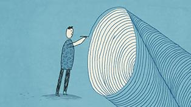   Issue 042 ## Fakes](http://nautil.us/issue/42/fakes)[   Issue 041 ## Selection](http://nautil.us/issue/41/selection)[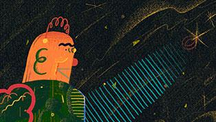   Issue 040 ## Learning](http://nautil.us/issue/40/learning)[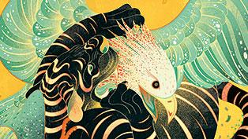   Issue 039 ## Sport](http://nautil.us/issue/39/sport)[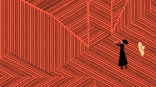   Issue 038 ## Noise](http://nautil.us/issue/38/noise)[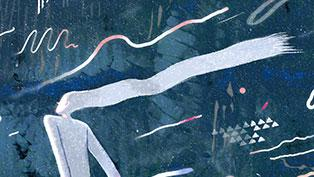   Issue 037 ## Currents](http://nautil.us/issue/37/currents)[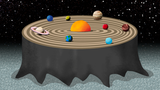   Issue 036 ## Aging](http://nautil.us/issue/36/aging)[   Issue 035 ## Boundaries](http://nautil.us/issue/35/boundaries)[   Issue 034 ## Adaptation](http://nautil.us/issue/34/adaptation)[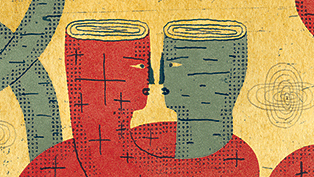   Issue 033 ## Attraction](http://nautil.us/issue/33/attraction)[   Issue 032 ## Space](http://nautil.us/issue/32/space)[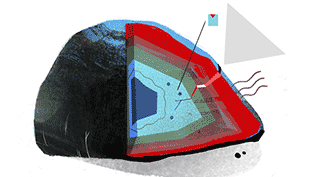   Issue 031 ## Stress](http://nautil.us/issue/31/stress)
- [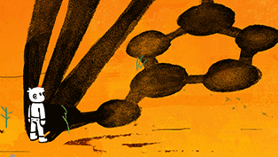   Issue 030 ## Identity](http://nautil.us/issue/30/identity)[   Issue 029 ## Scaling](http://nautil.us/issue/29/scaling)[   Issue 028 ## 2050](http://nautil.us/issue/28/2050)[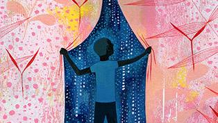   Issue 027 ## Dark Matter](http://nautil.us/issue/27/dark-matter)[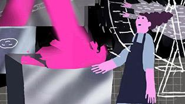   Issue 026 ## Color](http://nautil.us/issue/26/color)[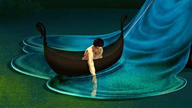   Issue 025 ## Water](http://nautil.us/issue/25/water)[   Issue 024 ## Error](http://nautil.us/issue/24/error)[   Issue 023 ## Dominoes](http://nautil.us/issue/23/dominoes)[   Issue 022 ## Slow](http://nautil.us/issue/22/slow)[   Issue 021 ## Information](http://nautil.us/issue/21/information)[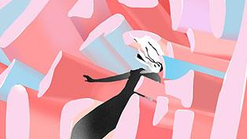   Issue 020 ## Creativity](http://nautil.us/issue/20/creativity)[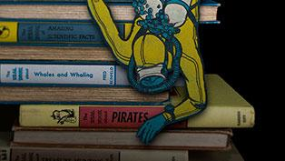   Special Issue ## In Our Nature](http://nautil.us/issue/101/in-our-nature)
- [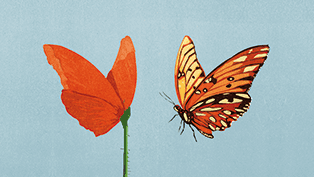   Issue 019 ## Illusions](http://nautil.us/issue/19/illusions)[   Issue 018 ## Genius](http://nautil.us/issue/18/genius)[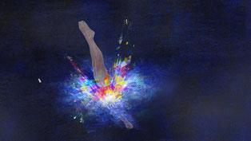   Issue 017 ## Big Bangs](http://nautil.us/issue/17/big-bangs)[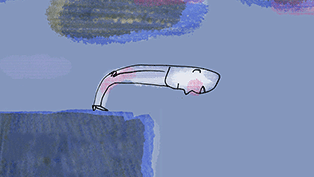   Issue 016 ## Nothingness](http://nautil.us/issue/16/nothingness)[   Issue 015 ## Turbulence](http://nautil.us/issue/15/turbulence)[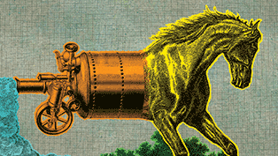   Issue 014 ## Mutation](http://nautil.us/issue/14/mutation)[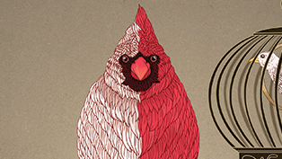   Issue 013 ## Symmetry](http://nautil.us/issue/13/symmetry)[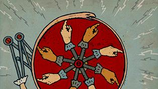   Issue 012 ## Feedback](http://nautil.us/issue/12/feedback)[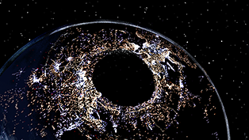   Issue 011 ## Light](http://nautil.us/issue/11/light)[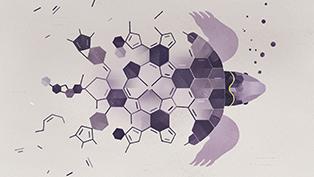   Issue 010 ## Mergers & Acquisitions](http://nautil.us/issue/10/mergers--acquisitions)[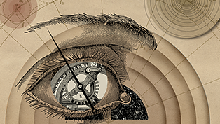   Issue 009 ## Time](http://nautil.us/issue/9/time)[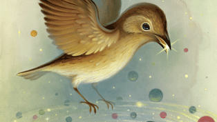   Issue 008 ## Home](http://nautil.us/issue/8/home)
- [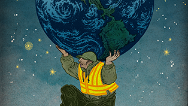   Issue 007 ## Waste](http://nautil.us/issue/7/waste)[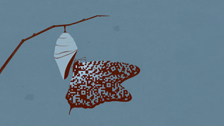   Issue 006 ## Secret Codes](http://nautil.us/issue/6/secret-codes)[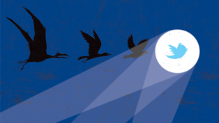   Issue 005 ## Fame](http://nautil.us/issue/5/fame)[   Issue 004 ## The Unlikely](http://nautil.us/issue/4/the-unlikely)[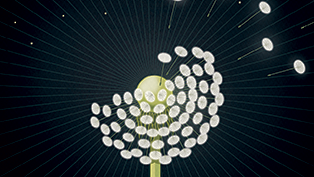   Issue 003 ## In Transit](http://nautil.us/issue/3/in-transit)[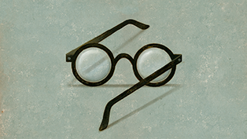   Issue 002 ## Uncertainty](http://nautil.us/issue/2/uncertainty)[   Issue 001 ## What Makes You So Special](http://nautil.us/issue/1/what-makes-you-so-special)[   PREVIEW ISSUE ## The Story of Nautilus](http://nautil.us/issue/0/the-story-of-nautilus)

[See Issue Library](http://nautil.us/issues)

Enter Search Below…

TRENDING TOPIC

[Psychology](http://nautil.us/term/f/Psychology)[ How to Tell If You’re a Jerk](http://nautil.us/issue/40/learning/how-to-tell-if-youre-a-jerk)

[Aerodynamics](http://nautil.us/term/f/Aerodynamics)
[Aliens](http://nautil.us/term/f/Aliens)
[Animals](http://nautil.us/term/f/Animals)
[Anthropology](http://nautil.us/term/f/Anthropology)
[Archaeology](http://nautil.us/term/f/Archaeology)
[Architecture](http://nautil.us/term/f/Architecture)
[Art](http://nautil.us/term/f/Art)
[Artificial Intelligence](http://nautil.us/term/f/Artificial%20Intelligence)
[Astronomy](http://nautil.us/term/f/Astronomy)
[Chemistry](http://nautil.us/term/f/Chemistry)
[Climate](http://nautil.us/term/f/Climate)
[Cognitive Science](http://nautil.us/term/f/Cognitive%20Science)

[Computer Science](http://nautil.us/term/f/Computer%20Science)
[Cryptography](http://nautil.us/term/f/Cryptography)
[Earth Science](http://nautil.us/term/f/Earth%20Science)
[Economics](http://nautil.us/term/f/Economics)
[Education](http://nautil.us/term/f/Education)
[Environment](http://nautil.us/term/f/Environment)
[Evolution](http://nautil.us/term/f/Evolution)
[Fiction](http://nautil.us/term/f/Fiction)
[Fine Art](http://nautil.us/term/f/Fine%20Art)
[Food](http://nautil.us/term/f/Food)
[Genetics](http://nautil.us/term/f/Genetics)
[Health](http://nautil.us/term/f/Health)

[History](http://nautil.us/term/f/History)
[Information Theory](http://nautil.us/term/f/Information%20Theory)
[Insects](http://nautil.us/term/f/Insects)
[Linguistics](http://nautil.us/term/f/Linguistics)
[Literature](http://nautil.us/term/f/Literature)
[Math](http://nautil.us/term/f/Math)
[Memoir](http://nautil.us/term/f/Memoir)
[Microbiology](http://nautil.us/term/f/Microbiology)
[Mortality](http://nautil.us/term/f/Mortality)
[Music](http://nautil.us/term/f/Music)
[Neuroscience](http://nautil.us/term/f/Neuroscience)
[Oceanography](http://nautil.us/term/f/Oceanography)

[Paleontology](http://nautil.us/term/f/Paleontology)
[Philosophy](http://nautil.us/term/f/Philosophy)
[Physics](http://nautil.us/term/f/Physics)
[Physiology](http://nautil.us/term/f/Physiology)
[Psychology](http://nautil.us/term/f/Psychology)
[Reproduction](http://nautil.us/term/f/Reproduction)
[Science Practice](http://nautil.us/term/f/Science%20Practice)
[Sociology](http://nautil.us/term/f/Sociology)
[Technology](http://nautil.us/term/f/Technology)
[The Web](http://nautil.us/term/f/The%20Web)

## The Nautilus Spotlight

### [Why Nuclear Power Professionals Are Serious About Joking Around](http://nautil.us/blog/why-nuclear-power-professionals-are-serious-about-joking-around)

[Read Now](http://nautil.us/blog/why-nuclear-power-professionals-are-serious-about-joking-around)

[Issue 054](http://nautil.us/issue/54/the-unspoken)

## [The Unspoken](http://nautil.us/issue/54/the-unspoken)

 [  “The philosophers knew it first  ...”](http://nautil.us/issue/54/the-unspoken/the-unspoken)

- Chapter one

### Hunches

- Chapter two

### Undefined

- Chapter three

### Landscapes

- Chapter four

### Groundwork

- Chapter five

### To Be

*Coming November 30*

[ ** Anthropology #### Love, Death, and Other Forgotten Traditions *By Dorsa Amir * ](http://nautil.us/issue/54/the-unspoken/love-death-and-other-forgotten-traditions)

[ ** Evolution #### The Mate Selection Trapdoor *By Michael J. Ryan * ](http://nautil.us/issue/54/the-unspoken/the-mate-selection-trapdoor)

[ ** Psychology #### Men Are Better At Maps Until Women Take This Course *By Andrew Curry * 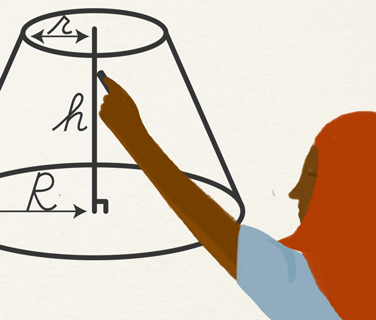](http://nautil.us/issue/54/the-unspoken/men-are-better-at-maps-until-women-take-this-course-rp)

[ ** Evolution #### Why Females Decide What’s Beautiful *By Kevin Berger * 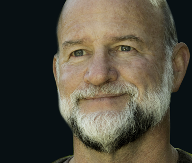](http://nautil.us/issue/54/the-unspoken/why-females-decide-whats-beautiful)

## Channels

### Tune in to *Nautilus'* deep dive portals

 [   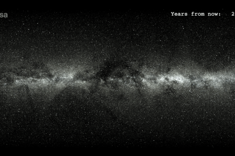   ## Deathblow Dealt to Dark Matter Disks    #### by Natalie Wolchover](http://abstractions.nautil.us/)[

 [logo_short.svg](../_resources/f96f4562d362743b1bc0396c83952b19.bin)  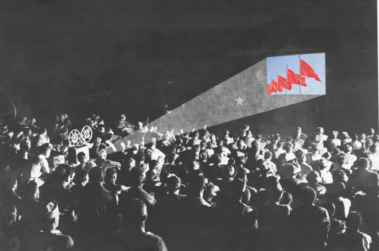   ## Ideology Is the Original Augmented Reality    #### by Slavoj Žižek](http://mitp.nautil.us/)[

 [logo_short.svg](:/d6ae83d1950e078ef974d93e8c5ec19d)  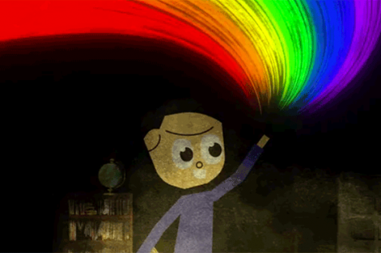

## [logo_short.svg](../_resources/a4ca487f1edc70e8f23151aaa0ccb3d1.png) Dr. Robbert Dijkgraaf    #### by Michael Segal](http://spark.nautil.us/)[

 [logo_short.svg](../_resources/e06fa6289ca1db78a78b094da989a239.bin)     ## When Cancer Treatment Re-traumatizes Survivors of Sexual Trauma    #### by Julie B. Schnur and Rachel E. Goldsmith](http://cancer.nautil.us/)[

 [logo_short.svg](../_resources/d980472c53cc1e4cf5565b8b8a3fd9d5.bin)     ## The Best Burger Place Is a Lab    #### by Thomas King](http://tlas.nautil.us/)[

 [logo_short.svg](../_resources/2eace1614bc6f27b8ca43ab7ddab91b1.bin)  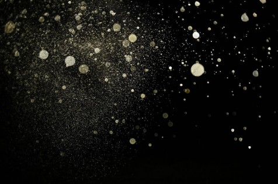   ## How Much Should Expectation Drive Science?    #### by Claudia Geib](http://cosmos.nautil.us/)[

 [logo_short.svg](../_resources/c66a7abe7d0e7cd7c1dc38224f1a27ea.bin)  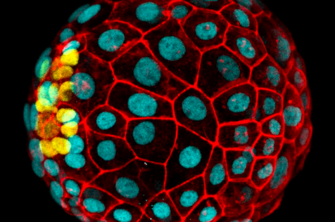   ## Obsessed With Blastocysts    #### by Brian Gallagher](http://alliance.nautil.us/)[

 [logo_short.svg](../_resources/0f81ecc15a2ac36f39d49620c9adcc30.bin)     ## Why Dementia Is a Population-Level Problem    #### by Dan Garisto](http://aging.nautil.us/)

## Popular on Nautilus

- Most Read

- Most Shared

- [(L)](http://nautil.us/issue/40/learning/how-to-tell-if-youre-a-jerk?utm_source=frontpage&utm_medium=mview&utm_campaign=how-to-tell-if-youre-a-jerk)

## **1**  [How to Tell If You’re a Jerk](http://nautil.us/issue/40/learning/how-to-tell-if-youre-a-jerk?utm_source=frontpage&utm_medium=mview&utm_campaign=how-to-tell-if-youre-a-jerk)

If you think everyone around you is terrible, the joke may be on you.
  BY Eric Schwitzgebel

- [(L)](http://nautil.us/issue/52/the-hive/modern-media-is-a-dos-attack-on-your-free-will?utm_source=frontpage&utm_medium=mview&utm_campaign=modern-media-is-a-dos-attack-on-your-free-will)

## **2**  [Modern Media Is a DoS Attack on Your Free Will](http://nautil.us/issue/52/the-hive/modern-media-is-a-dos-attack-on-your-free-will?utm_source=frontpage&utm_medium=mview&utm_campaign=modern-media-is-a-dos-attack-on-your-free-will)

How the attention economy is subverting our decision-making and our democracy.
  BY Brian Gallagher

-

### **3**  [The Rise and Fall of the English Sentence](http://nautil.us/issue/54/the-unspoken/the-rise-and-fall-of-the-english-sentence?utm_source=frontpage&utm_medium=mview&utm_campaign=the-rise-and-fall-of-the-english-sentence)

The surprising forces influencing the complexity of the language we speak and write.

  BY Julie Sedivy

-

### **4**  [Consciousness Began When the Gods Stopped Speaking](http://nautil.us/issue/24/error/consciousness-began-when-the-gods-stopped-speaking?utm_source=frontpage&utm_medium=mview&utm_campaign=consciousness-began-when-the-gods-stopped-speaking)

How Julian Jaynes’ famous 1970s theory is faring in the neuroscience age.
  BY Veronique Greenwood

-

### **5**  [How to Tell If You’re a Supertaster](http://nautil.us/issue/54/the-unspoken/how-to-tell-if-youre-a-supertaster?utm_source=frontpage&utm_medium=mview&utm_campaign=how-to-tell-if-youre-a-supertaster)

For one thing, you won’t like IPAs.
  BY Rob DeSalle

-

### **6**  [Physics Has Demoted Mass](http://nautil.us/issue/54/the-unspoken/physics-has-demoted-mass?utm_source=frontpage&utm_medium=mview&utm_campaign=physics-has-demoted-mass)

Modern physics has taught us that mass is not an intrinsic property.
  BY Jim Baggott

## Facts So Romantic

Science has a powerful voice in today’s culture.
So what is it saying?
 [See All Blog Posts](http://nautil.us/blog)

-   [Culture](http://nautil.us/term/l/Culture)

### [Why Nuclear Power Professionals Are Serious About Joking Around](http://nautil.us/blog/why-nuclear-power-professionals-are-serious-about-joking-around)

In August 2013, Finland’s young nuclear professionals, under 35-years-old, met up for the Summer Games in Mikkeli municipality, put on by the Finnish Nuclear Society’s Young Generation…

 [Read More](http://nautil.us/blog/why-nuclear-power-professionals-are-serious-about-joking-around)

- [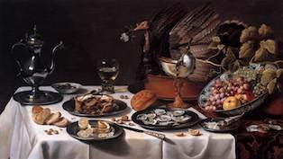](http://nautil.us/blog/a-modest-proposal-for-thanksgiving)  [Ideas](http://nautil.us/term/l/Ideas)

### [A Modest Proposal for Thanksgiving](http://nautil.us/blog/a-modest-proposal-for-thanksgiving)

Or, For Preventing the Annual Repast from Being a Burden on the Earth, and for Making It Beneficial to the Publick.*It is a melancholy object to those, who know the plight of this Planet,…

 [Read More](http://nautil.us/blog/a-modest-proposal-for-thanksgiving)

- [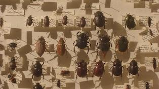](http://nautil.us/blog/darwins-lost-beetle-is-back)  [Biology](http://nautil.us/term/l/Biology)

### [Darwin’s Lost Beetle Is Back](http://nautil.us/blog/darwins-lost-beetle-is-back)

On August 24, 1832, HMS Beagle dropped anchor at Bahía Blanca, a deep natural harbor in present-day Argentina. On board was a 23-year-old naturalist, Charles Darwin. He had been at sea…

 [Read More](http://nautil.us/blog/darwins-lost-beetle-is-back)

-   [Culture](http://nautil.us/term/l/Culture)

### [Yes, It Matters What You Wear to an Exam](http://nautil.us/blog/-yes-it-matters-what-you-wear-to-an-exam)

In May 2015, an official vote was held by the Oxford University Student Union about clothing policy. It was over whether to keep “subfusc,” a traditional uniform dating back to the…

 [Read More](http://nautil.us/blog/-yes-it-matters-what-you-wear-to-an-exam)

## Listen to Nautilus

NARRATED VERSIONS OF OUR STORIES
 [All Audio Articles](http://nautil.us/audio)

-   [Ideas](http://nautil.us/term/l/Ideas)

### [The Volcano That Shrouded the Earth and Gave Birth to a Monster](http://nautil.us/audio#c_1339)

By Gillen D'Arcy Wood

-   [Culture](http://nautil.us/term/l/Culture)

### [The Moral Argument for Doping in Sports](http://nautil.us/audio#c_1213)

By Steve Paulson

-   [Ideas](http://nautil.us/term/l/Ideas)

### [Why Your Brain Hates Slowpokes](http://nautil.us/audio#c_948)

By Chelsea Wald

* * *

## Nautilus Prime

Get the full Nautilus digital experience.
 [Members Sign In](http://nautil.us/primeuser)
   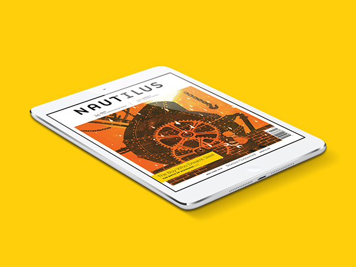

Like *Nautilus*? You’ll love *Nautilus* Prime.

**Unlimited online reading** Read it all, whenever, wherever, and however you like.

**Ad Free** Get a pristine, ad-free reading experience.

**[Tablet editions](http://nautil.us/epub)** All the content and design of our award-winning print magazine, in PDF format—perfect for reading on your tablet or desktop.

 **[eBook editions](http://nautil.us/epub/epub)** We’ve made each monthly online issue into an eBook, compatible with most e-readers.

 **Event Access** Prime members get priority access to *Nautilus* events.

- [Learn More](http://nautil.us/primeuser)

- [Join Prime](http://shop.nautil.us/prime-membership/)

 Current print subscriber?
You're already a Prime member.

- [About](http://nautil.us/about)
- [Awards and Press](http://nautil.us/awards-and-press)
- [Contact / Work with Us](http://nautil.us/contact)
- [Donate](http://www.nautilusthink.org/support)
- [FAQ](http://nautil.us/faq)
- [Media Kit](http://nautil.us/sponsorship)
- [Prime](http://nautil.us/primeuser)
- [RSS](http://nautil.us/rss/all)
- [Subscribe](http://shop.nautil.us/nautilus-quarterly/)
- [Terms of Services](http://nautil.us/terms-of-service)

### NAUTILUS: SCIENCE CONNECTED

Nautilus is a different kind of science magazine. We deliver big-picture science by reporting on a single monthly topic from multiple perspectives. Read a new chapter in the story every Thursday.

© 2017 NautilusThink Inc, All rights reserved. Matter, Biology, Numbers, Ideas, Culture, *Connected*

[Site by Code and Theory](http://www.codeandtheory.com/)

[< 1 min to Spreed]()