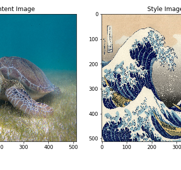

Neural Style Transfer: Creating Art with Deep Learning using tf.keras and eager execution

Neural Style Transfer: Creating Art with Deep Learning using tf.keras and eager execution

https://medium.com/tensorflow/neural-style-transfer-creating-art-with-deep-learning-using-tf-keras-and-eager-execution-7d541ac31398

By Raymond Yuan, Software Engineering Intern