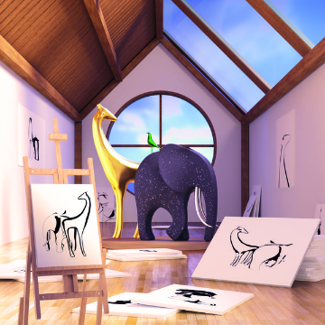

Neural scene representation and rendering | DeepMind

Neural scene representation and rendering | DeepMind

https://deepmind.com/blog/neural-scene-representation-and-rendering/

We introduce the Generative Query Network (GQN), a framework within which machines learn to perceive their surroundings by training only on data obtained by themselves as they move around scenes. Much like infants and animals, the GQN learns by trying to make sense of its observations of the world around it. In doing so, the GQN learns about plausible scenes and their geometrical properties, without any human labelling of the contents of scenes.