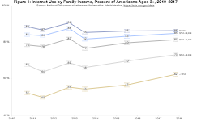

New Data Show Substantial Gains and Evolution in Internet Use | National Telecommunications and Information Administration

New Data Show Substantial Gains and Evolution in Internet Use | National Telecommunications and Information Administration

https://www.ntia.doc.gov/blog/2018/new-data-show-substantial-gains-and-evolution-internet-use

New Data Show Substantial Gains and Evolution in Internet Use June 06, 2018 by David Redl, Assistant Secretary for Communications and Information and NTIA Administrator The digital divide is showing signs of giving way as more Americans from all walks of life connect to the Internet. Several historically disadvantaged groups showed significant increases in online adoption, according to initial results from NTIA’s most recent survey on Internet use conducted by the U.S. Census Bureau. The survey, which was conducted in November 2017, reveals new contours of Americans’ Internet use. In 2017, more households had a mobile data plan than wired broadband service. Additionally, for the first time since NTIA began tracking use of different types of computing devices, tablets were more popular than desktop computers among Americans, and the number of people who used multiple types of devices also increased substantially.