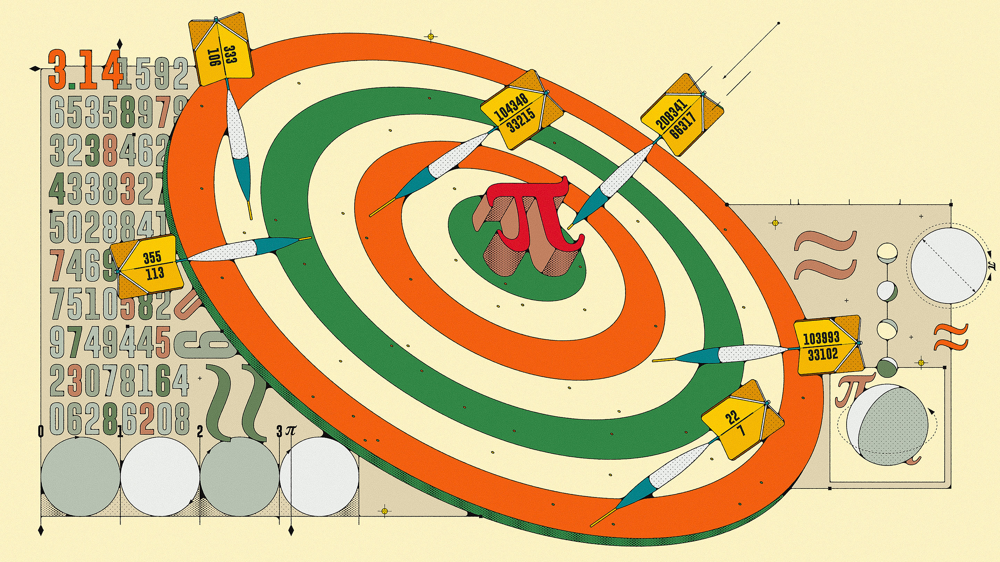
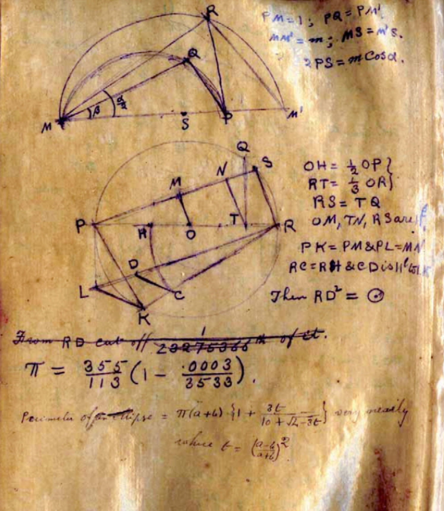
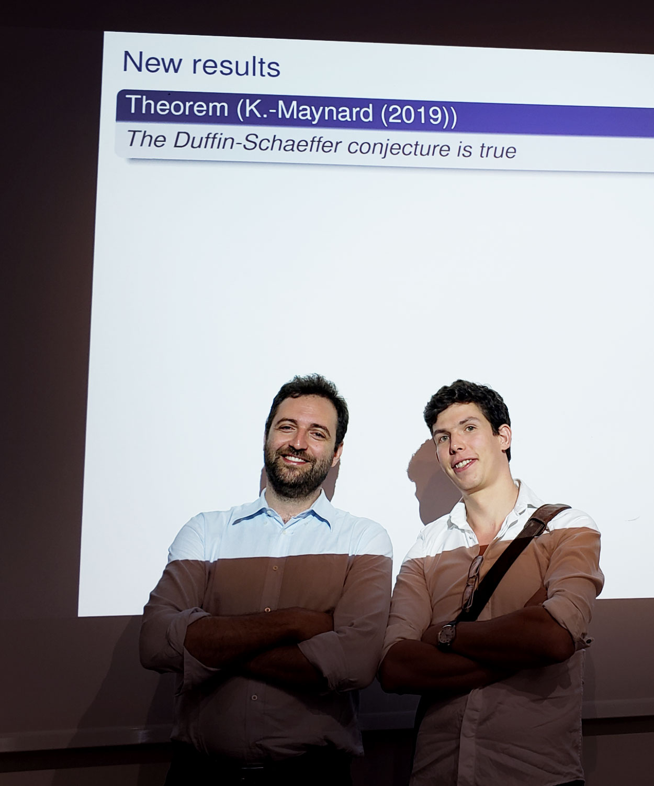
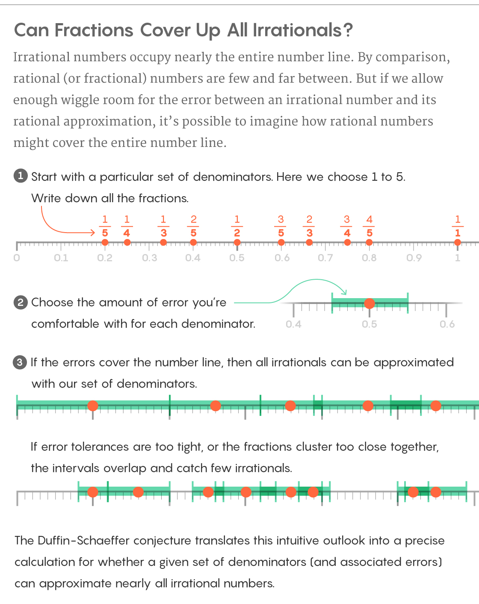
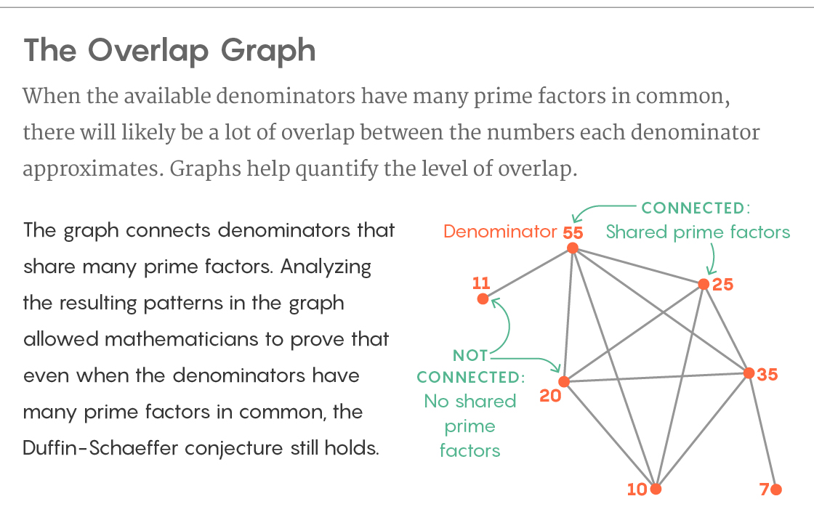

New Proof Settles How to Approximate Numbers Like Pi | Quanta Magazine

###### [number theory](https://www.quantamagazine.org/tag/number-theory/)

# New Proof Settles How to Approximate Numbers Like Pi

The ancient Greeks wondered when “irrational” numbers can be approximated by fractions. By proving the longstanding Duffin-Schaeffer conjecture, two mathematicians have provided a complete answer.

[ 8](https://www.quantamagazine.org/new-proof-settles-how-to-approximate-numbers-like-pi-20190814/#comments)

###### Read Later

The decimal expansion of pi goes on forever. But an infinite number of fractions can approximate it to ever-increasing accuracy.

[KuoCheng Liao](https://www.behance.net/KuoChengLiao) for Quanta Magazine

[     ### Kevin Hartnett  *Senior Writer*](https://www.quantamagazine.org/authors/kevin-hartnett/)

* * *

*August 14, 2019*

* * *

[View PDF/Print Mode](https://www.quantamagazine.org/new-proof-settles-how-to-approximate-numbers-like-pi-20190814/#)

[graph theory](https://www.quantamagazine.org/tag/graph-theory/)[mathematics](https://www.quantamagazine.org/tag/mathematics/)[number theory](https://www.quantamagazine.org/tag/number-theory/)[prime numbers](https://www.quantamagazine.org/tag/prime-numbers/)

The deep recesses of the number line are not as forbidding as they might seem. That’s one consequence of [a major new proof](https://arxiv.org/abs/1907.04593) about how complicated numbers yield to simple approximations.

The proof resolves a nearly 80-year-old problem known as the Duffin-Schaeffer conjecture. In doing so, it provides a final answer to a question that has preoccupied mathematicians since ancient times: Under what circumstances is it possible to represent irrational numbers that go on forever — like pi — with simple fractions, like 227? The proof establishes that the answer to this very general question turns on the outcome of a single calculation.

“There’s a simple criterion for whether you can approximate virtually every number or virtually no numbers,” said [James Maynard](https://www.maths.ox.ac.uk/people/james.maynard) of the University of Oxford, co-author of the proof with [Dimitris Koukoulopoulos](https://dms.umontreal.ca/~koukoulo/) of the University of Montreal.

Mathematicians had suspected for decades that this simple criterion was the key to understanding when good approximations are available, but they were never able to prove it. Koukoulopoulos and Maynard were able to do so only after they reimagined this problem about numbers in terms of connections between points and lines in a graph — a dramatic shift in perspective.

“They had what I’d say was a great deal of self-confidence, which was obviously justified, to go down the path they went down,” said [Jeffrey Vaaler](https://cns.utexas.edu/directory/item/15-mathematics/380-vaaler-jeffrey-d?Itemid=349) of the University of Texas, Austin, who contributed important earlier results on the Duffin-Schaeffer conjecture. “It’s a beautiful piece of work.”

## The Ether of Arithmetic

Rational numbers are the easy numbers. They include the counting numbers and all other numbers that can be written as fractions.

This amenability to being written down makes rational numbers the ones we know best. But rational numbers are [actually rare among all numbers](https://www.quantamagazine.org/why-mathematicians-cant-find-the-hay-in-a-haystack-20180917/). The vast majority are irrational numbers, never-ending decimals that cannot be written as fractions. A select few are important enough to have earned symbolic representations, such as pi, *e* and 2‾√. The rest can’t even be named. They are everywhere but untouchable, the ether of arithmetic.

So maybe it’s natural to wonder — if we can’t express irrational numbers exactly, how close can we get? This is the business of rational approximation. Ancient mathematicians, for instance, recognized that the elusive ratio of a circle’s circumference to its diameter can be well approximated by the fraction 227. Later mathematicians discovered an even better and nearly as concise approximation for pi: 355113.

“It’s hard to write down what pi is,” said [Ben Green](http://people.maths.ox.ac.uk/greenbj/) of Oxford. “What people have tried to do is to find explicit approximations to pi, and one common way of doing that is with rationals.”

In 1837 the mathematician [Gustav Lejeune Dirichlet](http://www-history.mcs.st-and.ac.uk/Biographies/Dirichlet.html) found a rule for how well irrational numbers can be approximated by rational ones. It’s easy to find approximations so long as you’re not too particular about the error. But Dirichlet proved a straightforward relationship between fractions, irrational numbers and the errors separating the two.

He proved that for every irrational number, there exist infinitely many fractions that approximate the number evermore closely. Specifically, the error of each fraction is no more than 1 divided by the square of the denominator. So the fraction 227, for example, approximates pi to within 172, or 149. The fraction 355113 gets within 11132, or 112,769. Dirichlet proved that there is an infinite number of fractions that draw closer and closer to pi as the denominator of the fraction increases.

“It’s a rather beautiful and remarkable thing that you can always approximate a real number by a fraction and the error is no more than 1 over [the denominator squared],” said [Andrew Granville](https://dms.umontreal.ca/~andrew/) of the University of Montreal.

In a 1913 manuscript, the mathematician Srinivasa Ramanujan used the fraction 355/113 as a rational approximation for pi.

Wikicommons

Dirichlet’s discovery was, in a sense, a narrow statement about rational approximation. It said that you can find infinitely many approximating fractions for each irrational number if your denominators can be any whole number, and if you’re willing to accept an error that’s 1 over the denominator squared. But what if you want your denominators to be drawn from some (still infinite) subset of the whole numbers, like all prime numbers, or all perfect squares? And what if you want your approximation error to be 0.00001, or any other values you might choose? Will you succeed at producing infinitely many approximating fractions under such specific conditions?

The Duffin-Schaeffer conjecture is an attempt to provide the most general possible framework for thinking about rational approximation. In 1941 the mathematicians R.J. Duffin and A.C. Schaeffer imagined the following scenario. First, choose an infinitely long list of denominators. This could be anything you want: all odd numbers, all numbers that are multiples of 10, or the infinite list of prime numbers.

Second, for each of the numbers in your list, choose how closely you’d like to approximate an irrational number. Intuition tells you that if you give yourself very generous error allowances, you’re more likely to be able to pull off the approximation. If you give yourself less leeway, it will be harder. “Any sequence can work provided you leave enough room,” Koukoulopoulos said.

Now, given the parameters you’ve set up — the numbers in your sequence and the defined error terms — you want to know: Can I find infinitely many fractions that approximate all irrational numbers?

The conjecture provides a mathematical function to evaluate this question. Your parameters go in as inputs. Its outcome could go one of two ways. Duffin and Schaeffer conjectured that those two outcomes correspond exactly to whether your sequence can approximate virtually all irrational numbers with the demanded precision, or virtually none. (It’s “virtually” all or none because for any set of denominators, there will always be a negligible number of outlier irrational numbers that can or can’t be well approximated.)

“You get virtually everything or you get virtually nothing. There’s no middle ground at all,” Maynard said.

It was an extremely general statement that tried to characterize the warp and weft of rational approximation. The criterion that Duffin and Schaeffer proposed felt correct to mathematicians. Yet proving that the binary outcome of this function is all you need to know whether your approximations work — that was much harder.

## Double Counting

Proving the Duffin-Schaeffer conjecture is really about understanding exactly how much mileage you’re getting out of each of your available denominators. To see this, it’s useful to think about a scaled-down version of the problem.

Imagine that you want to approximate all irrational numbers between 0 and 1. And imagine that your available denominators are the counting numbers 1 to 10. The list of possible fractions is pretty long: First 11, then 12 and 22, then 13, 23, 33 and so on up to 910 and 1010. Yet not all of these fractions are useful.

The fraction 210 is the same as 15, for example, and 510 covers the same ground as 12, 24, 36 and 48. Prior to the Duffin-Schaeffer conjecture, a mathematician named Aleksandr Khinchin had formulated a similarly sweeping statement about rational approximation. But his theorem didn’t account for the fact that equivalent fractions should only count once.

Dimitris Koukoulopoulos (left) and James Maynard announced their proof of the Duffin-Schaeffer conjecture in July in a talk at a conference in Italy.

Kevin Ford

“Usually something that’s first-grade mathematics shouldn’t make a difference to the solution,” Granville said. “But in this case surprisingly it did make a difference.”

So the Duffin-Schaeffer conjecture includes a term that calculates the number of unique fractions (also called reduced fractions) you get from each denominator. This term is called the Euler phi function after its inventor, the 18th-century mathematician Leonhard Euler. The Euler phi function of 10 is 4, since there are only four reduced fractions between 0 and 1 with 10 as a denominator: 110, 310, 710 and 910.

The next step is to figure out how many irrational numbers you can approximate with each of the reduced fractions. This depends on how much error you’re willing to accept. The Duffin-Schaeffer conjecture lets you choose an error for each of your denominators. So for fractions with denominator 7 you might set the allowable error to 0.02. With denominator 10 you might expect more and set it to 0.01.

Once you’ve identified your fractions and set your error terms, it’s time to go trawling for irrationals. Plot your fractions on the number line between 0 and 1 and picture the error terms as nets extending from either side of the fractions. You can say that all irrationals caught in the nets have been “well approximated” given the terms you set. The question — the big question — is: Just how many irrationals have you caught?

Lucy Reading-Ikkanda/Quanta Magazine

There are infinitely many irrational numbers contained in any interval on the number line, so the captured irrationals can’t be expressed as an exact number. Instead, mathematicians ask about the proportion of the total number of irrationals corralled by each fraction. They quantify these proportions using a concept called the “measure” of a set of numbers — which is like quantifying a catch of fish by total weight rather than number of fish.

The Duffin-Schaeffer conjecture has you add up the measures of the sets of irrational numbers captured by each approximating fraction. It represents this number as a large arithmetic sum. Then it makes its key prediction: If that sum goes off to infinity, then you have approximated virtually all irrational numbers; if that sum instead stops at a finite value, no matter how many measures you sum together, then you’ve approximated virtually no irrational numbers.

This question, of whether an infinite sum “diverges” to infinity or “converges” to a finite value, comes up in many areas of mathematics. The Duffin-Schaeffer conjecture’s main claim is that if you want to figure out whether you can approximate nearly all irrational numbers given a set of denominators and allowable error terms, this is the only feature you need to know: whether that infinite sum of measures diverges to infinity or converges to a finite value.

“At the end of the day, no matter how you’ve decided the degree of approximation for [each denominator], whether or not you’ve succeeded purely depends on whether the associated infinite sequence diverges or not,” Vaaler said.

## Plotting a Solution

You may be wondering: What if the numbers approximated by one fraction overlap with the numbers approximated by another fraction? In that case aren’t you double-counting when you add up the measures?

For some approximation sequences the double-counting problem isn’t significant. Mathematicians proved decades ago, for example, that the conjecture is true for approximation sequences composed of all prime numbers. But for many other approximation sequences the double-counting challenge is formidable. It’s why mathematicians were unable to solve the conjecture for 80 years.

The extent to which different denominators capture overlapping sets of irrational numbers is reflected in the number of prime factors the denominators have in common. Consider the numbers 12 and 35. The prime factors of 12 are 2 and 3. The prime factors of 35 are 5 and 7. In other words, 12 and 35 have no prime factors in common — and as a result, there isn’t much overlap in the irrational numbers that can be well approximated by fractions with 12 and 35 in the denominator.

But what about the denominators 12 and 20? The prime factors of 20 are 2 and 5, which overlap with the prime factors of 12. Likewise, the irrational numbers that can be approximated by fractions with denominator 20 overlap with the ones that can be approximated by fractions with denominator 12. The Duffin-Schaeffer conjecture is hardest to prove in situations like these — where the numbers in the approximating sequence have many small prime factors in common and there’s a lot of overlap between the sets of numbers each denominator approximates.

“When a lot of the denominators you have to choose from have a lot of small prime factors then they start to get in the way of each other,” said [Sam Chow](https://www.maths.ox.ac.uk/people/sam.chow) of Oxford.

The key to solving the conjecture has been to find a way to precisely quantify the overlap in the sets of irrational numbers approximated by denominators with many small prime factors in common. For 80 years no one could do it. Koukoulopoulos and Maynard got there by finding a completely different way to look at the problem.

Lucy Reading-Ikkanda/Quanta Magazine; source: James Maynard

In their new proof, they create a graph out of their denominators — plotting them as points and connecting the points with a line if they share a lot of prime factors. The structure of this graph encodes the overlap between the irrational numbers approximated by each denominator. And while that overlap is hard to assay directly, Koukoulopoulos and Maynard found a way to analyze the structure of the graph using techniques from graph theory — and the information they cared about fell out from there.

“The graph is a visual aid, it’s a very beautiful language in which to think about the problem,” Koukoulopoulos said.

### Related:

* * *

1. 1.

##### [Together and Alone, Closing the Prime Gap](https://www.quantamagazine.org/mathematicians-team-up-on-twin-primes-conjecture-20131119/)

2. 2.

##### [In the Universe of Equations, Virtually All Are Prime](https://www.quantamagazine.org/in-the-universe-of-equations-virtually-all-are-prime-20181210/)

3. 3.

##### [New Number Systems Seek Their Lost Primes](https://www.quantamagazine.org/ideal-numbers-seek-their-lost-primes-20170302/)

Koukoulopoulos and Maynard proved that the Duffin-Schaeffer conjecture is indeed true: If you’re handed a list of denominators with allowable error terms, you can determine whether you can approximate virtually all irrational numbers or virtually none just by checking whether the corresponding sum of the measures around each fraction diverges to infinity or converges to a finite value.

It’s an elegant test that takes a vast question about the nature of rational approximation and boils it down to a single calculable value. By proving that the test holds universally, Koukoulopoulos and Maynard have achieved one of the rarest feats in mathematics: They’ve given a final answer to a foundational concern in their field.

“Their proof is a necessary and sufficient result,” Green said. “I suppose this marks the end of a chapter.”

*This article was reprinted on *[*Wired.com*](https://www.wired.com/story/a-major-proof-shows-how-to-approximate-numbers-like-pi/)*.*

### Share this article

[ ![](data:image/svg+xml,%3csvg xmlns='http://www.w3.org/2000/svg' class='absolute fit-x mxa c-1a1a1a js-evernote-checked' x='0px' y='0px' viewBox='0 0 50 50' enable-background='new 0 0 50 50' xml:space='preserve' data-reactid='317' data-evernote-id='209'%3e%3cg data-reactid='318' data-evernote-id='1313' class='js-evernote-checked'%3e%3c!-- react-text: 319 --%3e %3c!-- /react-text --%3e%3cpath fill='currentColor' d='M20.6%2c38.5c-0.8%2c0-1.6%2c0.3-2.2%2c0.8L16%2c41.9c-1.1%2c1-2.4%2c1.6-3.9%2c1.6c-1.5%2c0-2.8-0.5-3.9-1.6c-0.5-0.5-0.9-1.1-1.2-1.8 c-0.3-0.7-0.4-1.4-0.4-2.1c0-0.7%2c0.1-1.4%2c0.4-2.1c0.3-0.7%2c0.7-1.2%2c1.2-1.8l9.1-9c1-0.9%2c2.2-1.8%2c3.8-2.7s3-0.7%2c4.3%2c0.7 c0.6%2c0.6%2c1.3%2c0.8%2c2.2%2c0.8s1.5-0.3%2c2.1-0.9c0.6-0.6%2c0.9-1.3%2c0.9-2.2s-0.3-1.6-0.9-2.2c-2.2-2.2-4.8-3.1-7.8-2.7 c-3%2c0.4-5.9%2c2-8.8%2c4.8l-9.2%2c9c-1.1%2c1.1-1.9%2c2.4-2.5%2c3.8C0.7%2c35%2c0.4%2c36.5%2c0.4%2c38c0%2c1.6%2c0.3%2c3%2c0.9%2c4.4c0.6%2c1.4%2c1.4%2c2.7%2c2.5%2c3.8 c1.1%2c1.1%2c2.4%2c2%2c3.8%2c2.5c1.4%2c0.6%2c2.9%2c0.8%2c4.4%2c0.8s2.9-0.3%2c4.3-0.8c1.4-0.6%2c2.7-1.4%2c3.8-2.5l2.5-2.5c0.6-0.6%2c0.9-1.3%2c0.9-2.1 s-0.3-1.6-0.9-2.2C22.1%2c38.8%2c21.4%2c38.5%2c20.6%2c38.5z' data-reactid='320' data-evernote-id='1314' class='js-evernote-checked'%3e%3c/path%3e%3c!-- react-text: 321 --%3e %3c!-- /react-text --%3e%3cpath fill='currentColor' d='M48.7%2c7.9c-0.6-1.4-1.4-2.7-2.5-3.8c-2.4-2.4-5.1-3.6-8-3.7c-3-0.1-5.5%2c0.9-7.7%2c3.1l-3.1%2c3.1c-0.6%2c0.6-0.9%2c1.3-0.9%2c2.1 s0.3%2c1.6%2c0.9%2c2.2s1.3%2c0.9%2c2.2%2c0.9s1.6-0.3%2c2.2-0.8l3.1-3.1c1.2-1.1%2c2.4-1.5%2c3.7-1.3c1.3%2c0.3%2c2.5%2c0.9%2c3.4%2c1.9 c0.5%2c0.5%2c0.9%2c1.1%2c1.2%2c1.8c0.3%2c0.7%2c0.4%2c1.4%2c0.4%2c2.1c0%2c0.7-0.1%2c1.4-0.4%2c2.1c-0.3%2c0.7-0.7%2c1.2-1.2%2c1.8l-9.7%2c9.6 c-2.2%2c2.2-3.9%2c3.1-5.1%2c2.7s-2-0.8-2.4-1.3c-0.6-0.6-1.3-0.8-2.2-0.8s-1.5%2c0.3-2.1%2c0.9c-0.6%2c0.6-0.9%2c1.3-0.9%2c2.2s0.3%2c1.5%2c0.9%2c2.1 c1%2c1%2c2.1%2c1.8%2c3.2%2c2.3s2.4%2c0.7%2c3.6%2c0.7c1.5%2c0%2c3-0.4%2c4.6-1.1c1.6-0.7%2c3.1-1.9%2c4.6-3.4l9.8-9.6c1.1-1.1%2c1.9-2.4%2c2.5-3.8 c0.6-1.4%2c0.9-2.9%2c0.9-4.4C49.6%2c10.8%2c49.3%2c9.3%2c48.7%2c7.9z' data-reactid='322' data-evernote-id='1315' class='js-evernote-checked'%3e%3c/path%3e%3c!-- react-text: 323 --%3e %3c!-- /react-text --%3e%3c/g%3e%3c/svg%3e)](https://www.quantamagazine.org/new-proof-settles-how-to-approximate-numbers-like-pi-20190814/#0)

###### Copied!

[ ](https://www.quantamagazine.org/new-proof-settles-how-to-approximate-numbers-like-pi-20190814/mailto:?subject=New%20Proof%20Settles%20How%20to%20Approximate%20Numbers%20Like%20Pi&body=The%20ancient%20Greeks%20wondered%20when%20%E2%80%9Cirrational%E2%80%9D%20numbers%20can%20be%20approximated%20by%20fractions.%20By%20proving%20the%20longstanding%20Duffin-Schaeffer%20conjecture,%20two%20mathematicians%20have%20provided%20a%20complete%20answer.%0A%0Ahttps://www.quantamagazine.org/new-proof-settles-how-to-approximate-numbers-like-pi-20190814/)

[ ![](data:image/svg+xml,%3csvg xmlns='http://www.w3.org/2000/svg' class='absolute fit-x mxa c-1a1a1a js-evernote-checked' viewBox='0 0 30 30' enable-background='new 0 0 30 30' data-reactid='344' data-evernote-id='212'%3e%3cpath fill='currentColor' d='M9.1%2c11v9.4h2.5c0.2%2c0%2c0.3-0.1%2c0.3-0.3c0%2c0%2c0%2c0%2c0%2c0v-9.2H9.3C9.2%2c10.8%2c9.1%2c10.9%2c9.1%2c11z' data-reactid='345' data-evernote-id='1331' class='js-evernote-checked'%3e%3c/path%3e%3cpath fill='currentColor' d='M11.9%2c8.8V7.1H9.3C9.2%2c7.1%2c9%2c7.2%2c9%2c7.4c0%2c0%2c0%2c0%2c0%2c0v1.7h2.5c0.2%2c0%2c0.3-0.1%2c0.4-0.3C11.9%2c8.9%2c11.9%2c8.9%2c11.9%2c8.8 z' data-reactid='346' data-evernote-id='1332' class='js-evernote-checked'%3e%3c/path%3e%3cpath fill='currentColor' d='M13.4%2c11v9.3h4.8v1.3h-4.4c-0.2%2c0-0.3%2c0.1-0.3%2c0.3c0%2c0%2c0%2c0%2c0%2c0v1.7h7.2c0.2%2c0%2c0.3-0.1%2c0.3-0.3c0%2c0%2c0%2c0%2c0-0.1 V10.7h-7.2C13.5%2c10.7%2c13.4%2c10.8%2c13.4%2c11C13.4%2c11%2c13.4%2c11%2c13.4%2c11z M16.1%2c13.1c0-0.2%2c0.1-0.3%2c0.3-0.3c0%2c0%2c0%2c0%2c0%2c0h1.7V18 c0%2c0.2-0.1%2c0.3-0.3%2c0.3c0%2c0%2c0%2c0%2c0%2c0h-1.7V13.1z' data-reactid='347' data-evernote-id='1333' class='js-evernote-checked'%3e%3c/path%3e%3cpath fill='currentColor' d='M22.7%2c10.7c-0.2%2c0-0.3%2c0.1-0.3%2c0.3c0%2c0%2c0%2c0%2c0%2c0v9.3h4.8v1.3h-4.5c-0.2%2c0-0.3%2c0.1-0.3%2c0.3c0%2c0%2c0%2c0%2c0%2c0v1.7h7.3 c0.2%2c0%2c0.3-0.1%2c0.3-0.3c0%2c0%2c0%2c0%2c0%2c0V10.7H22.7z M27.2%2c18c0%2c0.2-0.1%2c0.3-0.3%2c0.4c0%2c0%2c0%2c0%2c0%2c0h-1.7v-5.2c0-0.2%2c0.1-0.3%2c0.3-0.3 c0%2c0%2c0%2c0%2c0%2c0h1.7V18z' data-reactid='348' data-evernote-id='1334' class='js-evernote-checked'%3e%3c/path%3e%3cpath fill='currentColor' d='M5.1%2c7.1c-0.2%2c0-0.3%2c0.1-0.3%2c0.3c0%2c0%2c0%2c0%2c0%2c0v3.3H0.3C0.1%2c10.7%2c0%2c10.8%2c0%2c11c0%2c0%2c0%2c0%2c0%2c0v9.3h7.2 c0.2%2c0%2c0.3-0.1%2c0.3-0.3c0%2c0%2c0%2c0%2c0%2c0V7.1L5.1%2c7.1z M4.8%2c18c0%2c0.2-0.1%2c0.3-0.3%2c0.3c0%2c0%2c0%2c0%2c0%2c0H2.7v-5.2c0-0.2%2c0.1-0.3%2c0.3-0.3 c0%2c0%2c0%2c0%2c0%2c0h1.7L4.8%2c18z' data-reactid='349' data-evernote-id='1335' class='js-evernote-checked'%3e%3c/path%3e%3c/svg%3e)](http://digg.com/submit?url=https://www.quantamagazine.org/new-proof-settles-how-to-approximate-numbers-like-pi-20190814/)

* * *

### Newsletter

*Get Quanta Magazine delivered to your inbox*

[(L)](https://www.quantamagazine.org/new-proof-settles-how-to-approximate-numbers-like-pi-20190814/#newsletter)

[Most recent newsletter](http://us1.campaign-archive2.com/home/?u=0d6ddf7dc1a0b7297c8e06618&id=f0cb61321c)