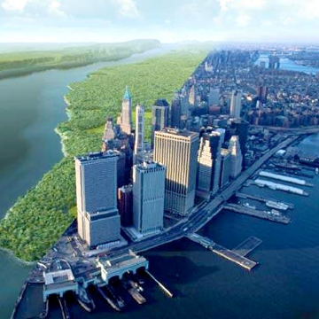

New York — before the City

New York — before the City

https://www.ted.com/talks/eric_sanderson_pictures_new_york_before_the_city#t-130596

400 years after Hudson found New York harbor, Eric Sanderson shares how he made a 3D map of Mannahatta's fascinating pre-city ecology of hills, rivers, wildlife -- accurate down to the block -- when Times Square was a wetland and you couldn't get delivery.