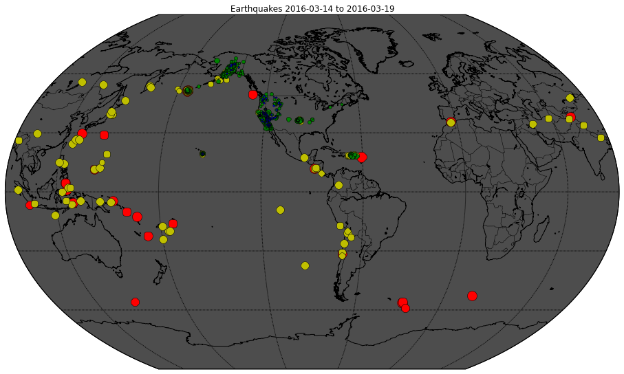
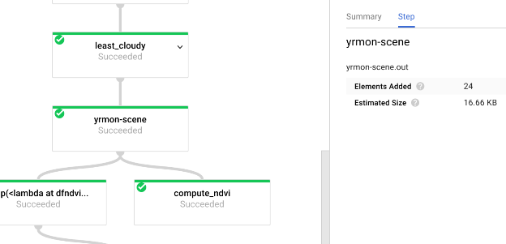
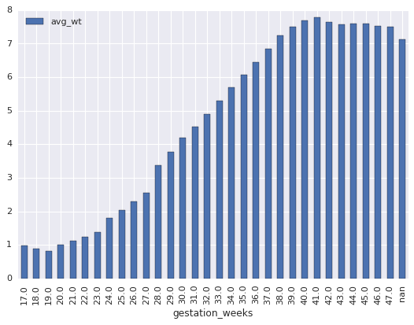
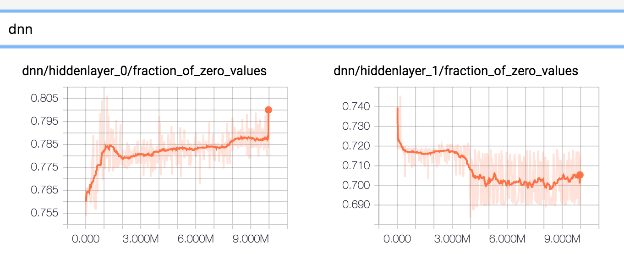

New hands-on labs for scientific data processing on Google Cloud Platform | Google Cloud Big Data and Machine Learning Blog  |  Google Cloud Platform

 

## [New hands-on labs for scientific data processing on Google Cloud Platform](https://cloud.google.com/blog/big-data/2017/07/new-hands-on-labs-for-scientific-data-processing-on-google-cloud-platform.html)

Monday, July 24, 2017

 *By Lak Lakshmanan, Tech Lead, Data and ML Professional Services​*

When I worked at a weather research laboratory a few years ago, I was often asked why my colleagues and I seemed to know so much about computing. The answer, of course, is that computers are among the most powerful tools a scientist has. That said, staying informed about storage area networks, worker nodes, and other IT-related esoterica is a distraction for scientists, just as it is for users in the commercial world. Fortunately, today, they can forget all about infrastructure, instead letting Google Cloud automatically provision and manage the computing resources needed to support their scientific goals.

Being part of the Professional Services organization in Google Cloud, I spend time on training and enablement for a variety of customers and prospects, with a fair number of scientific organizations among them. Because hands-on experiences are the best way to learn, I recently designed some [labs](https://codelabs.developers.google.com/cloud-quest-scientific-data) that lead scientist-users through the various ways to process, explore, and learn from data on [Google Cloud Platform](https://cloud.google.com/).

In this blog post, I’ll walk you through each lab, step by step. (Whether you’re a scientist or not, I’m confident you’ll find them valuable.) If you don’t already have a GCP account, sign up for the [free GCP trial](https://cloud.google.com/free/) ($300 credit over 12 months) and follow along. Alternately, you can also use [Qwiklabs](https://google.qwiklabs.com/quests/28).

So, let’s get started!

### Lab 1: Rent a virtual machine to plot recent earthquake activity

In the first (and simplest) lab, you will use GCP in a manner similar to the way you likely use scientific clusters today: spin up a virtual machine, install software on it, and use it for data processing. The task is to ingest earthquake data from USGS, plot a map of recent earthquake activity, and publish that data to the web as static web pages.

Spinning up a VM and running your jobs on it is the most basic example of using the public cloud as “easy-to-rent” infrastructure. But keep in mind that this low-level approach doesn’t offer the main benefit of GCP: the ability to forget all about infrastructure and focus instead on solving your scientific computation problems.

### Lab 2: Analyze municipal complaints and weather data in Google BigQuery

In this lab, you'll use two public datasets — weather data from NOAA and citizen complaints data from New York City — to find correlations between various types of citizen complaints and weather variables. Here we'll be using [BigQuery](https://cloud.google.com/bigquery/), GCP’s petabyte-scale, fully-managed data warehouse solution.

This lab demonstrates several benefits GCP offers scientists:

1. **It’s serverless. **No need to download data to your machine to work with it. GCP will store and manage your dataset in the cloud transparently.

2. **It’s easy to use.** You’ll run ad-hoc SQL queries on your dataset without having to prepare the data beforehand (in other words, no indexes, etc.). This advantage is invaluable for data exploration.

3. **It scales.** You can explore data on extremely large datasets interactively; no need to sample the data for latency reasons.

4. **You can share your work.** BigQuery is a convenient way to share datasets so you can run queries on data from different datasets without issues. Of course, you can also choose to keep your data private or share it only with specific people.

### Lab 3: Build a simple image-processing app using Apache Spark

In Lab 2, you used BigQuery to analyze structured datasets. Not all scientific datasets are nicely tabular, though, so how can you process unstructured data? One common solution to processing large datasets in a distributed way is to use Apache Spark. Traditionally, using Spark requires you to set up and manage a dedicated cluster. On GCP, however, the [Cloud Dataproc](https://cloud.google.com/dataproc/) service gives you the ability to scale-out computational jobs without having to own and maintain a “permanent” cluster. Instead, you can spin up a Spark cluster in 90 seconds or less, execute the job, and then delete the cluster when done (paying only for the resources you use on a per-minute basis). In other words, you can [create, customize, and run job-specific clusters](https://cloud.google.com/blog/big-data/2017/06/fastest-track-to-apache-hadoop-and-spark-success-using-job-scoped-clusters-on-cloud-native-architecture) for short periods of time.

In Lab 3, you'll use [OpenCV](http://opencv.org/) to write image-processing code in order to detect human faces at scale using Spark. (Note however that [Cloud Vision API](https://cloud.google.com/vision/) is a potentially better solution here because, unlike OpenCV, it can identify key facial landmarks like eyebrows, noses, eyes, and so on.)

### Lab 4: Process geo-imagery on GCP

Like Spark on Cloud Dataproc, Apache Beam, which is the SDK for the [Cloud Dataflow](https://cloud.google.com/dataflow/) data processing service, provides a way to distribute arbitrary code. The difference is that Cloud Dataflow will autoscale your pipelines, and the same code can be used for both historical (batch) and real-time (stream) processing.

In this lab, the goal is to create monthly images of vegetation over Reunion Island from Landsat images. Read [this blog post](https://cloud.google.com/blog/big-data/2016/11/how-to-do-distributed-processing-of-landsat-data-in-python) on what this pipeline does, why it does it that way, and what the results look like.

### Lab 5: Explore data in Cloud Datalab and BigQuery

This lab illustrates how you can explore large datasets while continuing to use familiar tools like Pandas and Juypter. The trick is to do the first part of your aggregation in BigQuery, get back a Pandas dataset, and then work with the smaller Pandas dataset locally. [Cloud Datalab](https://cloud.google.com/datalab/), GCP’s data scientist workbench, provides a managed Jupyter experience so that you don’t need to run notebook servers yourself.

In this lab, you'll explore data to find features to use as predictors in a machine-learning model for predicting baby weight. The data in the graph above is one of those features. As you can probably guess, preemie newborns often weigh less than full term infants at birth, so the number of gestation weeks is a useful predictor.

### Lab 6: Build a machine-learning model to predict newborn weight

This lab shows you how to how to train, evaluate, and deploy a TensorFlow machine learning model. Even though image and sequence models get all the press, the most common type of machine-learning models (even at Google) involve structured data.

In this lab, you'll do structured data prediction using a state-of-the-art, wide-and-deep model, and learn how to embed categorical features.

In addition to how easy it is to train models (just send a training job to the service), one cool thing about machine learning on GCP is how easy it is to deploy the trained model as a microservice. So, this lab concludes with you deploying the model to predict the weight of a newborn given some information about the mother and the pregnancy. You then send requests to the model to make online predictions.

### Lab 7: Build a machine-learning model to classify coastline images

This lab shows you how to train a model to classify images. Usually, image classification will require hundreds of thousands of labeled images and considerable machine-learning expertise. But, what if you have only a few hundred images and are not a machine-learning expert?

Consider using *transfer learning*. An image classifier consists of two parts: a feature extraction part that is many layers deep and a classifier part that is quite simple. In transfer learning, when you build a new model to classify your dataset, you reuse the feature extraction part from an already trained image classifier (we'll use the [Inception model](https://research.googleblog.com/2016/03/train-your-own-image-classifier-with.html)) and re-train the classification part with your dataset. Since you don't have to train the feature extraction part (which is the most complex part of the model), you can train the model far more quickly with fewer images and less computational resources.

*Aerial image of coastline (courtesy Texas A&M University, Corpus Christi)*

Here, the objective is to classify coastline images captured using drones based on their potential for flood damage. For example, the image above shows a scarp (steep slope) in clay, a landform that is subject to landslides. Imagine how much faster it would be classify shorelines if it could be done from aerial imagery instead of requiring feet on the ground!

### Next steps

This series of labs gave you an introduction to everything from data processing to data exploration to machine learning —​ without needing to manage any infrastructure! Are we living in exciting times, or what?

Remember, as next steps:

- Do the labs by following the instructions in these [codelabs](https://codelabs.developers.google.com/cloud-quest-scientific-data).
- Alternately, you can do the labs on [Qwiklabs](https://google.qwiklabs.com/quests/28) where you'll get a temporary GCP account and a completion badge.

I’d love to hear your feedback on these labs. Use the feedback form within the instructions, or tweet to me (@lak_gcp) with the hashtag #gcp-scientific-data.