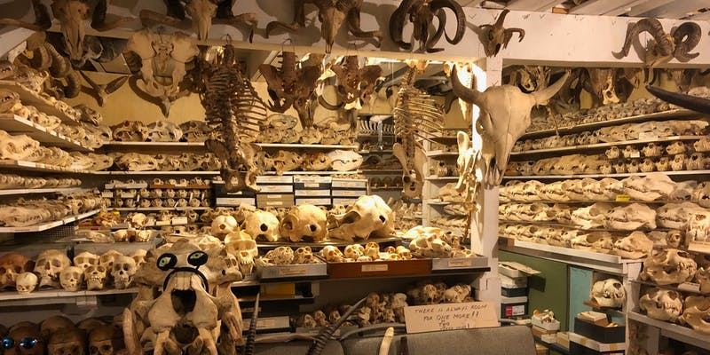
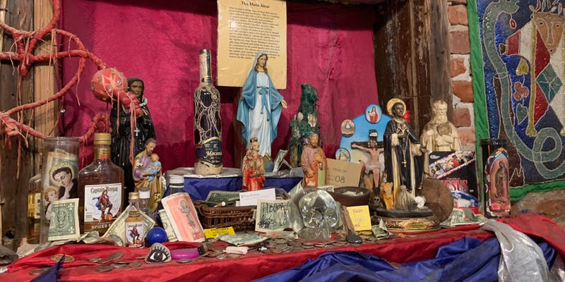
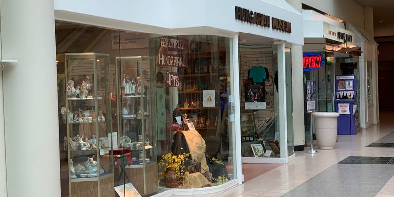
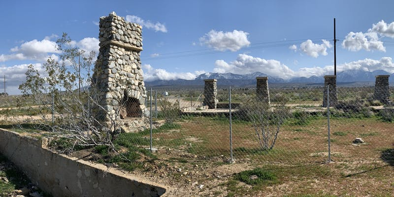
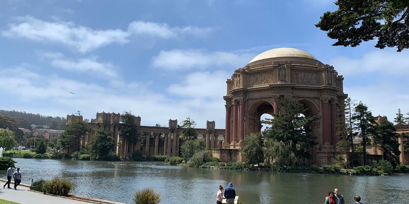
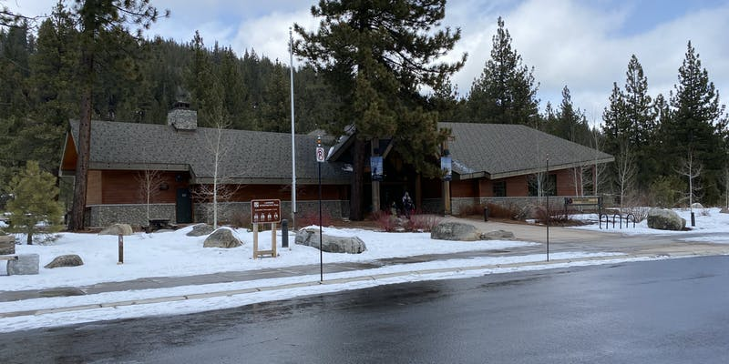
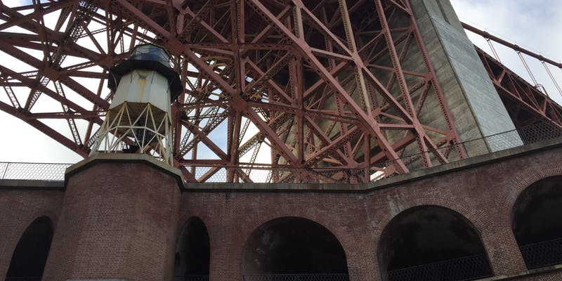
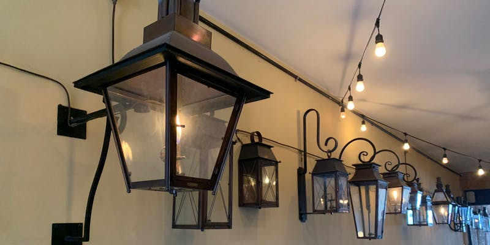
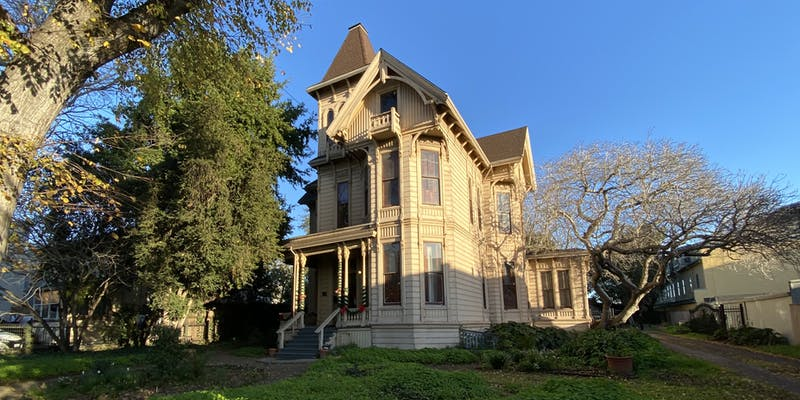
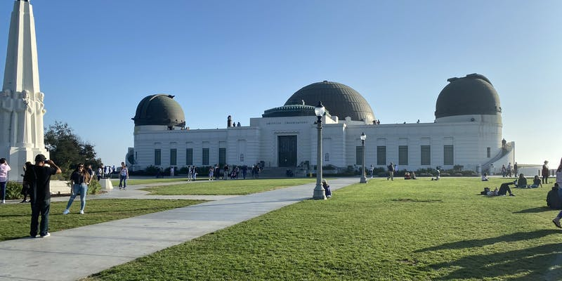

Niche Museums: Find tiny museums near you

#  Niche Museums

##  Find tiny museums near you  [![](data:image/svg+xml,%3csvg xmlns='http://www.w3.org/2000/svg' width='14px' height='14px' viewBox='0 0 256 256' data-evernote-id='209' class='js-evernote-checked'%3e %3cdefs data-evernote-id='210' class='js-evernote-checked'%3e %3clinearGradient id='a' x1='.1' x2='.9' y1='.1' y2='.9' data-evernote-id='211' class='js-evernote-checked'%3e %3cstop offset='0' stop-color='%23E3702D' data-evernote-id='212' class='js-evernote-checked'%3e%3c/stop%3e %3cstop offset='.1' stop-color='%23EA7D31' data-evernote-id='213' class='js-evernote-checked'%3e%3c/stop%3e %3cstop offset='.4' stop-color='%23F69537' data-evernote-id='214' class='js-evernote-checked'%3e%3c/stop%3e %3cstop offset='.5' stop-color='%23FB9E3A' data-evernote-id='215' class='js-evernote-checked'%3e%3c/stop%3e %3cstop offset='.7' stop-color='%23EA7C31' data-evernote-id='216' class='js-evernote-checked'%3e%3c/stop%3e %3cstop offset='.9' stop-color='%23DE642B' data-evernote-id='217' class='js-evernote-checked'%3e%3c/stop%3e %3cstop offset='1' stop-color='%23D95B29' data-evernote-id='218' class='js-evernote-checked'%3e%3c/stop%3e %3c/linearGradient%3e %3c/defs%3e %3crect width='256' height='256' fill='%23CC5D15' rx='55' ry='55' data-evernote-id='219' class='js-evernote-checked'%3e%3c/rect%3e %3crect width='246' height='246' x='5' y='5' fill='%23F49C52' rx='50' ry='50' data-evernote-id='220' class='js-evernote-checked'%3e%3c/rect%3e %3crect width='236' height='236' x='10' y='10' fill='url(%23a)' rx='47' ry='47' data-evernote-id='221' class='js-evernote-checked'%3e%3c/rect%3e %3ccircle cx='68' cy='189' r='24' fill='%23FFF' data-evernote-id='222' class='js-evernote-checked'%3e%3c/circle%3e %3cpath fill='%23FFF' d='M160 213h-34a82 82 0 0 0-82-82V97a116 116 0 0 1 116 116z' data-evernote-id='223' class='js-evernote-checked'%3e%3c/path%3e %3cpath fill='%23FFF' d='M184 213A140 140 0 0 0 44 73V38a175 175 0 0 1 175 175z' data-evernote-id='224' class='js-evernote-checked'%3e%3c/path%3e %3c/svg%3e)](https://www.niche-museums.com/browse/feed.atom?_feed_title=Niche+Museums)    [About  this site](https://www.niche-museums.com/about)

 [View Map](https://www.niche-museums.com/map)

## [Hearst Castle](https://www.niche-museums.com/browse/museums/102)

In 1919 press baron William Randolph Hearst commissioned architect Julia Morgan to design a modest bungalow for his estate in San Simeon on the Californian Central Coast. His ambitions for the project grew rapidly over time, and they would end up working together on the project for the next 28 years.

Although never completed, by 1947 Hearst Castle had 42 bedrooms, 61 bathrooms, 127 acres of gardens, its own airfield and both indoor and outdoor swimming pools.

William Randolph Hearst got his start in publishing in 1887 when his father George gave him control of the The San Francisco Examiner, which he had acquired as payment for a gambling debt in 1880. The newspaper formed the starting point of the largest media empire in the United States - at peak, Hearst owned 18 magazines and 28 newspapers which reached an audience of 20 million Americans.

Julia Morgan was the first woman architect to be licensed in California, and the first to be admitted to l'École nationale supérieure des Beaux-Arts in Paris. She designed more than 700 buildings during her career, but Hearst Castle was her longest and most acclaimed project. She was an early proponent of reinforced concrete, used extensively in the construction of Hearst Castle.

During the roaring twenties and the thirties Hearst hosted a constant chain of guests at San Simeon - up to thirty guests a night - including actors, writers and politicians. Guests would gather for drinks and dinner every evening, and Hearst would seat the most influential new guests at his head of the table. As guests wore out their welcome they were seated further and further towards the fire at the other end - causing Harpo Marx to coin the term “on the hot seat” to signify being on the way out.

Hearst Castle was home to Hearst’s enormous collection of art, much of it purchased from cash-strapped Europeans in the interwar period. Entire medieval rooms were bought from historic buildings, shipped to California and installed in the castle. The collection of Spanish and Italian ceilings from the 14th to 18th centuries is particularly impressive.

Hearst died in 1951 and the estate was donated to the State of California by the Hearst family in 1957. Today it operates as a State Historical Monument and is open daily for tours. The tour of the upstairs is particularly worthwhile as it provides access to the Gothic Suite, Hearst’s study and private apartment.

[Website](http://hearstcastle.org/) | [Wikipedia](https://en.wikipedia.org/wiki/Hearst_Castle)

 [12 photos and 3 links](https://www.niche-museums.com/browse/museums/102#photos)

750 Hearst Castle Road, San Simeon, CA 93452 - [Map](https://www.google.com/maps/?q=35.685,-121.1686)

1 February 2020

## [The Marine Mammal Center](https://www.niche-museums.com/browse/museums/101)

The Marine Mammal Center in Sausalito, CA is the largest hospital for marine mammals in the world. Established in 1973, today the center is responsible for rescues along 600 miles of California coastline, from the edge of Humboldt county in Northern California down to San Luis Obispo county in the south.

The center’s current headquarters opened in 1975 on the site of an old Nike missile site (see [Nike Missile Site SF-88]() nearby). The underground silos now house the center’s water filtration system.

In 2018 the center treated 802 marine mammals with the help of more than 1,200 volunteers. Patients include elephant seals, California sea lions, Guadalupe and northern fur seals, harbor seals and the occasional sea otter.

Weekend guided tours are offered at 11am, 1pm and 3pm, and the animals tend to be fed between 1:30 and 2:30pm which makes that an excellent time to watch from the viewing deck.

[Wikipedia](https://en.wikipedia.org/wiki/The_Marine_Mammal_Center)
 [9 photos and 1 link](https://www.niche-museums.com/browse/museums/101#photos)

2000 Bunker Road, Fort Cronkhite, Sausalito, CA 94965 - [Map](https://www.google.com/maps/?q=37.8351,-122.5316)

24 January 2020

 Permanently closed

## [Ray Bandar's Bone Palace](https://www.niche-museums.com/browse/museums/100)

Ray Bandar collected his first skull in 1953, on Baker Beach in San Francisco. He would spend the next sixty years adding to his collection. When Ray died at the age of 90 in December 2017 he left a collection of over 7,000 animal skulls, most of which were on display on the four floors of his house in San Francisco.

In 1958 Ray was given the title of field associate by the California Academy of Sciences. They sponsored many of his bone collecting expeditions to countries that included Mexico and Australia. He grew his collection under a scientific collection permit issued by the state of California for his work with the academy.

Ray taught biology at Fremont High School in Oakland for 32 years, until he retired from teaching in 1990 to dedicate himself full time to bone collecting. He was the first person called by Bay Area zoos when an animal died, enabling him to add species that including hippopotamuses, tigers, and chimpanzees to his collection.

Ray's artist wife Alkmene was a vital part of the process. It was Alkmene who encouraged the couple to collect a horse skull from the side of the road during their cross country honeymoon driving trip in 1954. She worked with Ray on many of his collecting adventures, though she did credit the survival of their marriage to her weak sense of smell!

We visited Ray's Bone Palace (as he called it) in February of 2018, a few weeks before the collection was permanently relocated to the California Academy of Sciences. Ray's great nephew Jacob gave us the tour.

It was the most incredibly place I have ever experienced.

Ray treated skulls as art, and Ray and his wife Alkmene were both keen artists. The living room displayed art and a number of skulls, but these merely hinted at what was to come.

As we descended deeper into the house Jacob explained that Ray had won the "grossest dead thing" halloween contest so many times that they competition had to forbid him from entering to give other contestants a chance. "Puss in Boots", a mummified cat wearing boots, was one of the winning entrants.

The concentration of skulls on display continued to increase, but nothing could prepare us for Ray's basement.

Around 7,000 animal skulls greeted us, populating every inch of the two basement rooms. The skulls were accompanied by beautiful hand-written labels (which the California Academy of Sciences are determined to keep as part of the collection).

More than a thousand sea mammals, dozens of breeds of dog, bears, leopards, rhinos, hippopotamuses, giraffes and so many more.

My personal favourites were the walruses, the box full of beaver skulls and an amazing Narwhal tusk, which had been given to Ray by a friend who had asked him if there was anything he hadn't been able to collect himself.

Ray also kept snakes, and used to leave them free to roam the basement.

A sign in the middle of the basement read "There is always room for one more!! or two or three more." Words to live by. What an inspiring life.

[Wikipedia](https://en.wikipedia.org/wiki/Ray_Bandar)

 [54 photos and 6 links](https://www.niche-museums.com/browse/museums/100#photos)

Marietta Drive, San Francisco, CA 94127 - [Map](https://www.google.com/maps/?q=37.7421,-122.4495)

17 January 2020

## [New Orleans Historic Voodoo Museum](https://www.niche-museums.com/browse/museums/99)

Voodoo first came to Louisiana with West African slaves in the early 1700s. It combined cultural practices and beliefs from multiple African groups, most prominently the Fon people from what is now Benin.

Louisiana Voodoo ended up syncretizing aspects of Catholicism. Themes that are distinctive to Louisiana Voodoo include gris-gris (protective amulets) and Voodoo queens, of which Marie Laveau is the most famous, active for much of the 19th century.

Local artist Charles Massicot Gandolfo created the New Orleans Historic Voodoo Museum museum in the French Quarter in 1972. He founded the museum along with his younger brother Jerry Gandolfo who still owns it today.

The museum’s collection is displayed in two small rooms connected by a cramped corridor. It includes antique voodoo dolls, talismans, taxidermy and multiple altars, some of which are used by Voodoo practitioners today. The museum also has a kneeling bench that belonged to Marie Laveau.

[Website](https://voodoomuseum.com/) | [Wikipedia](https://en.wikipedia.org/wiki/New_Orleans_Historic_Voodoo_Museum)

 [5 photos and 1 link](https://www.niche-museums.com/browse/museums/99#photos)

724 Dumaine Street, New Orleans, LA 70116 - [Map](https://www.google.com/maps/?q=29.9599,-90.064)

16 January 2020

## [Cleveland Hungarian Museum](https://www.niche-museums.com/browse/museums/98)

Cleveland Ohio is home to over 100,000 Hungarians, and has at times been the city with the second largest population of Hungarians after Budapest.

They arrived in three separate waves of immigrants: just before the First World War, directly after the Second World War and during the aftermath of the Hungarian revolution of 1956.

The Cleveland Hungarian Museum was founded in 1985 to present Hungarian culture and highlight the contributions of Cleveland Hungarians. It started life in St. Elizabeth Church, then moved to Richmond Mall in 1996, then Euclid Square Mall in 1999 and finally the Galleria at Erieview Mall in downtown Cleveland in 2003.

Today the museum acts as a center for Hungarian-American life in a Cleveland. It hosts regular events and has both permanent and temporary exhibits.

[Wikipedia](https://en.wikipedia.org/wiki/Cleveland_Hungarian_Museum)
 [3 photos](https://www.niche-museums.com/browse/museums/98#photos)

Galleria at Erieview, 1301 East 9th Street, Cleveland, OH 44114 - [Map](https://www.google.com/maps/?q=41.5048,-81.6895)

15 January 2020

## [The ruins of Llano del Rio](https://www.niche-museums.com/browse/museums/97)

Job Harriman was the most prominent Californian socialist of the early 1900s. In 1900 he ran as Vice President on the Socialist Party of America ticket. In 1911 and 1913 he made competitive runs on the Socialist ticket for Mayor of Los Angeles.

Following his second mayoral defeat he switched to a different path: he purchased a 2,000 acre patch of land in the Mojave Desert with the intention of building a self-sufficient commune that could embody socialist principles.

The colony officially opened in May 1914 with just five residents. By early 1915 it had grown to 150, and the population peaked at 1100 in summer 1917. The colony only admitted caucasians - a thoroughly racist policy that was excused as being “not due to race prejudice but because it is not deemed expedient to mix the races in these communities”.

Designs for the colony were prepared by Alice Constance Austin, a feminist architect and city planner who later wrote an influential book about city planning. She envisioned a community where the kitchens and laundry were centralized via a network of underground rail tunnels, freeing each household from maintaining their own kitchens and cooking their own meals.

Alice’s designs were never implemented. By 1918 the colony had been abandoned - political dissent within the commune and California’s refusal to permit the construction of a water-providing dam led to a torrent of departures, and the Llano Del Rio Company declared bankruptcy in 1918.

200 members relocated to Louisiana, where they established the town of New Llano and operated it as a socialist commune until 1937. That town still exists today.

100 years later the ruins of Llano del Rio can still be found along California Highway 138. A Google Maps review warned us that it's only home to rattlesnakes today, but sadly we were unable to find any.

[Wikipedia](https://en.wikipedia.org/wiki/Llano_del_Rio)
 [6 photos and 3 links](https://www.niche-museums.com/browse/museums/97#photos)

Llano, CA 93544 - [Map](https://www.google.com/maps/?q=34.5065,-117.8272)

14 January 2020

## [Palace of Fine Arts](https://www.niche-museums.com/browse/museums/96)

The Panama–Pacific International Exposition of 1915 was a world's fair that celebrated the completion of the Panama canal - but also served to showcase San Francisco's recovery from the 1906 earthquake.

Eleven palaces were built for the exposition. All but one of them were torn down afterwards when the exposition site became San Francisco's residental Marina District.

The Palace of Fine Arts was the survivor, thanks to a campaign by the Palace Preservation League founded by Phoebe Apperson Hearst (mother of William Randolph Hearst).

The palace was designed by Bernard Ralph Maybeck, who created it as a fictional Roman and Ancient Greek ruin constructed around a small artificial lagoon.

The weeping women who top the colonnade were sculpted by Ulric Ellerhusen, modeled after Audrey Munson. Audrey served as the model for an enormous number of sculptures, initially in New York and then across the United States. She earned the nickname "Panama–Pacific Girl" after posing for three-fifths of the sculptures created for the 1915 Expo.

The palace was not built to last, and the wood and plaster structure seriously degraded over time. In 1964 it was entirely replaced by a direct copy, built using steel beams and light-weight concrete. This was further seismically retrofitted in 2010.

[Website](https://palaceoffinearts.com/) | [Wikipedia](https://en.wikipedia.org/wiki/Palace_of_Fine_Arts)

 [3 photos and 1 link](https://www.niche-museums.com/browse/museums/96#photos)

3601 Lyon St, San Francisco, CA 94123 - [Map](https://www.google.com/maps/?q=37.8029,-122.449)

13 January 2020

## [Anja Community Reserve](https://www.niche-museums.com/browse/museums/95)

Anja Community Reserve is home to the world's highest concentration of ring-tailed lemurs - roughly 350 individuals divided into troops that range in size up to 30 members.

Development of the reserve started in 1996 when the government enacted legislation to transfer responsibility for land management to local communities. A group of twenty youths from the Anja area worked to create a reserve, and the reserve received formal recognition in 1999.

In 2001 the Anja Miray Association was formed to manage the reserve and nearby land, and by 2011 the reserve had created more than 450 jobs and had become one of the most-visited community managed sites in all of Madagascar. Today it serves as a model for other community-based tourism projects throughout Madagascar and the world.

Visitors must be accompanied by a local guide. The lemurs are plentiful and extremely photogenic.

[Website](http://anjareserve.angelfire.com/) | [Wikipedia](https://en.wikipedia.org/wiki/Anja_Community_Reserve)

 [10 photos and 2 links](https://www.niche-museums.com/browse/museums/95#photos)

Manambolo, Madagascar - [Map](https://www.google.com/maps/?q=-21.855,46.8549)

12 January 2020

## [Donner Memorial State Park Visitor Center](https://www.niche-museums.com/browse/museums/94)

The Donner Party is notorious as the single greatest tragedy to occur during the American westward migration of the early 19th century.

32 members of the Donner and Reed families, plus their employees, set out west from Independence Missouri on the 12th of May 1846, in nine wagons at the rear of a train of almost 500.

On July 19, 1846 their group made the fateful decision to form the Donner Party under the leadership of George Donner, and split off to take the newly declared Hastings Cutoff. This new route promised to shave 350 miles off the journey to California.

Unexpected delays on the route caused them to miss the short window of time for an easy crossing of the Sierra mountains, and the party (now numbering 89) was trapped snowbound around Truckee Lake (now Donner Lake).

Most of the Californian military were involved in the Mexican–American War at the time, which greatly hampered relief efforts. Of several attempted rescues, the first arrived four months after the party had become trapped. It took three relief efforts to complete the rescue.

Of the 89 people trapped near Donner Lake, 41 died and 48 survived.

Did the survivors turn to cannibalism? Although some denied it, consensus among historians is that up to 19 of the party were indeed cannibalized.

The Donner Memorial State Park was established in 1928, around the original Pioneer Monument which was constructed between 1901 and 1918.

The visitor center has numerous well designed displays explaining the story of the Donner Party and the context of westbound migration in the 19th century.

The state park has some excellent hiking trails. We found something’s spine on one of them!

[Website](http://www.parks.ca.gov/?page_id=503) | [Wikipedia](https://en.wikipedia.org/wiki/Donner_Party)

 [4 photos](https://www.niche-museums.com/browse/museums/94#photos)

12593 Donner Pass Road, Truckee, CA 96161 - [Map](https://www.google.com/maps/?q=39.3241,-120.2322)

11 January 2020

## [Fort Point](https://www.niche-museums.com/browse/museums/93)

Constructed by the US Army Corp of Engineers between 1853 and 1861 at the height of the gold rush, Fort Point was designed to protect the San Francisco Bay from foreign attack.

Cannons were mounted close to the waterline so that cannonballs could ricochet off the water and hit enemy ships hear the waterline.

The fort has never seen battle, but is historically significant due to its military architecture. It is the only "Third System" fort to be constructed west of the Mississippi.

Following the civil war, the fort's cannons became obsolete. It was used intermittently by the army, mainly as barracks, and then served as defense against potential submarine attacks during the Second World War.

A campaign in the 1930s saved the fort from demolition during the construction of the Golden Gate Bridge, which was redesigned to arch over the fort instead. It became a National Historic Site in 1970.

[Website](https://www.nps.gov/fopo/) | [Wikipedia](https://en.wikipedia.org/wiki/Fort_Point,_San_Francisco)

 [1 link](https://www.niche-museums.com/browse/museums/93#press)

Long Avenue & Marine Drive, San Francisco, CA 94129 - [Map](https://www.google.com/maps/?q=37.8105,-122.4769)

10 January 2020

## [Museo de las Misiones de Baja California](https://www.niche-museums.com/browse/museums/92)

The town of Loreto was founded in 1697 at the Monqui Native American settlement of Conchó. Jesuit missionaries founded the town as the first Spanish colonial settlement on the Baja California Peninsula.

The Mission of our Lady of Loreto that they built there formed the start of El Camino Real ("The Royal Road"), a historic chain of missions that stretched all the way up to Sonoma in California, 1069 miles to the North.

The Museo de las Misiones is a small museum that documents the history of the missions. It includes archeological remains, weapons, paintings and historic sacred documents. It also features a church bell that fell into the sea in 1875 and was retrieved by fishermen a hundred years later.

The museum celebrates the Jesuits as "men of extraordinary intellectual and moral character", but in places it does hint at their contribution to the demise of indigenous cultures.

[Wikipedia](https://es.wikipedia.org/wiki/Museo_de_las_Misiones_Jesu%C3%ADticas_de_Loreto)

 [6 photos and 1 link](https://www.niche-museums.com/browse/museums/92#photos)

Salvatierra 16, Centro, 23880 Loreto, Mexico - [Map](https://www.google.com/maps/?q=26.0102,-111.3436)

9 January 2020

## [Bevolo Gas Light Museum](https://www.niche-museums.com/browse/museums/91)

Bevolo is a family business founded in 1945 in the New Orleans French Quarter who today are the largest manufacturer of handmade copper lanterns in the United States.

Their lamps are hand-riveted (as opposed to soldered) which they claim gives them improved longevity.

Their workshop and museum offers the chance to watch the lamp makers in action, and see examples of historic street lamps from the French Quarter.

[Website](https://bevolo.com/) | [Wikipedia](https://en.wikipedia.org/wiki/Bevolo_Gas_and_Electric_Lights)

 [6 photos and 1 link](https://www.niche-museums.com/browse/museums/91#photos)

521 Conti Street, New Orleans, LA 70130 - [Map](https://www.google.com/maps/?q=29.955,-90.0674)

8 January 2020

## [Jelly Belly Factory](https://www.niche-museums.com/browse/museums/90)

The Jelly Belly factory in Fairfield, California has an extensive collection of Ronald Reagan memorabilia. Most impressive are their portraits of Reagan constructed entirely from jelly beans. Why so much love for the Gipper?

In 1965 the Herman Goelitz Candy Company created a new, small and flavorful jelly bean. In 1966, having switched to candy as an alternative to cigarettes, California governor Ronald Reagan first tried one and became a massive fan.

In 1974 Reagan wrote to a letter to the company stating "They have become such a tradition of this administration that it has gotten to the point where we can hardly start a meeting or make a decision without passing around a jar of jelly beans."

The product was rebranded Jelly Belly in 1976, and in 1980 a Time photographer snapped a photo during Reagan's presidential campaign that revealed his preference to the public. Sales doubled over the next year and the company shipped 3.5 tons of red, white and blue jelly beans to Washington DC for the inauguration. Reagan even had a standing order of 720 bags per month during his presidency.

The factory tour is worthwhile: you get to see how jelly beans are made, and there are several exciting robot arms. But the highlight are the jelly bean portraits, covering Reagan and many other historical figures.

[Website](https://www.jellybelly.com/california-factory-tours)
 [14 photos and 1 link](https://www.niche-museums.com/browse/museums/90#photos)

1 Jelly Belly Lane, Fairfield, CA 94533 - [Map](https://www.google.com/maps/?q=38.2392,-122.0788)

7 January 2020

## [Cohen Bray House](https://www.niche-museums.com/browse/museums/89)

The Cohen Bray House in Oakland was built in 1882-1884 as a wedding present for Emma Bray and Alfred H. Cohen. The house is a relatively rare example of the Stick-Eastlake style of the late 19th century, but what really sets it apart is its interior, which maintains the aesthetic style popular when it was built. The house has remained in the same family for its entire history, and today that family preserve it as an Oakland Historical Landmark with the assistance of volunteers.

Tours are offered on the fourth Sunday of every month, and twice a year the house offers a tour with High Tea in the formal dining room. We did this in January 2020 and the tea was most excellent.

[Website](https://www.cohenbrayhouse.org/)
 [12 photos](https://www.niche-museums.com/browse/museums/89#photos)

1440 29th Ave, Oakland, CA 94601 - [Map](https://www.google.com/maps/?q=37.7798,-122.2283)

6 January 2020

## [Griffith Observatory](https://www.niche-museums.com/browse/museums/88)

The Griffith Observatory opened in 1935 using funds bequeathed to the city of Los Angeles for the purpose of making astronomy accessible to the public.

Griffith Jenkins Griffith was a Welsh-American who made money through mining syndicates during the California gold rush, trading on his expertise as a journalist covering mining for the Alta California newspaper.

After moving to Los Angeles in 1882 he married Tina Mesmer, the air to the quarter million dollar Briswalter fortune... but only after ensuring that the entire fortune would be transferred to his name.

He used his wife's money to climb the ranks of LA society, building a reputation as a philanthropist through the donation in 1896 of 3,015 acres of ranch land to the city for use as a public park - Griffith Park.

A teetotaler in public, Griffith was secretly a drunk. He grew increasingly paranoid and in 1903 forced his wife Tina at gunpoint to swear on a prayer book that she was faithful to the marriage and was not involved in a perceived attempt to poison him.

Despite her attestations, he shot her in the head. She survived but was blinded in her right eye. Griffith was arrested three days later and was sentenced to just two years in San Quentin. His lawyer had blamed the incident on “alcoholic insanity”.

In 1908, upon visiting Mount Wilson Observatory Griffith declared "If all mankind could look through that telescope, it would change the world." He offered the city money to build an observatory in 1912, but they refused, wary of further association with an attempted murderer.

Griffith died in 1919 and the city accepted the money he left in trust for both the observatory and the nearby Greek Theater. They have since become respected landmarks of Los Angeles.

Today the observatory hosts several exhibit areas, an astronomical telescope and a Tesla coil. Their Zeiss 12-inch refracting telescope has been looked through by 8 million people - more people than any other telescope on earth.

[Website](http://www.griffithobservatory.org/) | [Wikipedia](https://en.wikipedia.org/wiki/Griffith_Observatory)

 [6 photos and 1 link](https://www.niche-museums.com/browse/museums/88#photos)

2800 East Observatory Road, Los Angeles, CA 90027 - [Map](https://www.google.com/maps/?q=34.1182,-118.3005)

5 January 2020

 [Next page](https://www.niche-museums.com/?next=88)