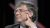
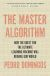
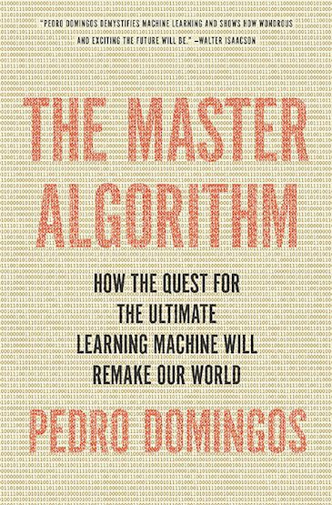

Nick Bostrom: "Superintelligence" | Talks at Google

# Bill Gates says these are the two books we should all read to understand AI

Learning about machine-learning.

The tech world’s [book-nerd-in-chief](https://qz.com/565381/these-are-the-best-books-bill-gates-read-in-2015/) wants you to add two books to your [list of summer science reads](https://qz.com/686200/your-summer-reading-list-provided-by-bill-gates/). To get up to speed on artificial intelligence, Microsoft cofounder and philanthropist Bill Gates recommends Nick Bostrom’s *Superintelligence* and Pedro Domingos’s *The Master Algorithm*.

Gates never misses an opportunity to plug books he likes, and yesterday (June 1) at Code Conference he [took a detour](http://www.recode.net/2016/6/1/11833340/bill-gates-ai-artificial-intelligence) from his and Melinda Gates’s [talk of philanthropy](https://www.youtube.com/watch?list=PLKof9YSAshgya-W5OUu2H_I5rc6ZMrP8a&v=pEKU82bXQ5s) to recommend these two titles.

“Certainly it’s the most exciting thing going on,” he said of artificial intelligence. “It’s the holy grail, it’s the big dream that anybody who’s ever been in computer science has been thinking about.”

His wife confirmed that he’s has been focusing on AI. “I can always tell what’s on his mind by what’s in his bag of books,” said Melinda Gates. “And there have been a lot of AI books.”

(Courtesy Basic Books)

Domingos’s book, released last year by Basic Books, is an introduction to machine learning—”the scientific method on steroids”—and how it relates to everyday life. What we’re really searching for with all this AI tech, argues Domingos, is an ultimate “master” algorithm. He writes: “If it exists, the Master Algorithm can derive all knowledge in the world—past, present, and future—from data. Inventing it would be one of the greatest advances in the history of science.”

Bostrom’s book has been much buzzed about since its 2014 release by Oxford University Press. Here’s a talk he gave at Google in 2014:

After reading *Superintelligence*, [Elon Musk tweeted](https://qz.com/244334/here-are-some-of-the-terrifying-possibilities-that-have-elon-musk-worried-about-artificial-intelligence/) that he echoed Bostrom’s concerns over a world in which machine brains surpassed human intelligence. The following year the tech giant wrote an [open letter](http://futureoflife.org/ai-open-letter/) expressing this concern to AI researchers, signed by Bostrom, Stephen Hawking, and dozens of others. Though Gates has not signed the letter, he [has publicly agreed](https://qz.com/335768/bill-gates-joins-elon-musk-and-stephen-hawking-in-saying-artificial-intelligence-is-scary/) with Musk that super-intelligent machines are a cause for concern.

#### Most Popular

### [If you want to stay successful, learn to think like Leonardo da Vinci](https://qz.com/1229090/if-you-want-to-stay-successful-learn-to-think-like-leonardo-da-vinci/)