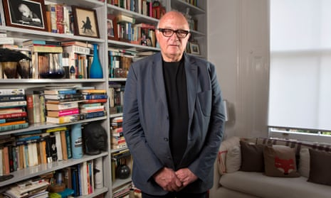
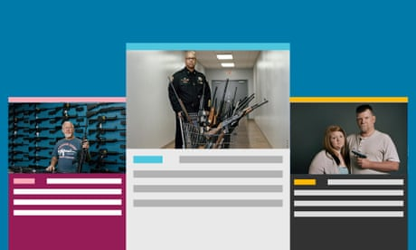
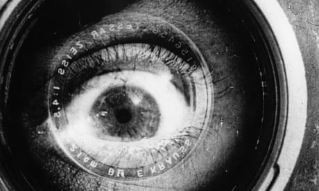

Nick Fraser: ‘Documentaries can change the world’

[Books interview](https://www.theguardian.com/books/series/books-interview)
[Film books](https://www.theguardian.com/books/film)
Interview

# Nick Fraser: ‘Documentaries can change the world’

*[Tim Lewis*](https://www.theguardian.com/profile/timlewis)

As his book on the history of factual film is published, the former Storyville editor reveals his favourite docs and books

Sat 27 Jul 2019 18.00 BST

- 
- 
- 

Shares

270

‘Having a stroke is really weird. You can read, but can’t really understand’: Nick Fraser at his home in west London. Photograph: Richard Saker/The Observer

When 71-year-old Nick Fraser first encountered documentaries in the 1960s, he admits he found them “not very interesting”. That changed, partly because of a cultural shift – Fraser cites DA Pennebaker in the US and Nick Broomfield here as pioneers – and Fraser played his own part as well. From the late 1990s, for 17 years, he was editor of the BBC strand Storyville and worked on films such as *Man on Wire* and *One Day in September*, which both won Oscars. Fraser’s new book, *Say What Happened: A Story of Documentaries*, traces the history of documentary film-making.

Shortly after finishing the first draft, Fraser was giving a talk in London and had just shown a clip of one of his favourite Storyville docs, the 2007 film *The English Surgeon**,* about the [British neurologist Henry Marsh](https://www.theguardian.com/profile/henry-marsh), when he had to sit down; his thinking was muddled, he couldn’t speak. Fraser had, extraordinarily, had a stroke just as he was talking about the otherworldly impact of brain injuries. The book was finished in his recovery, which is going well. He lives in west London and is creative director of the documentary streaming service and production house [Docsville](https://www.docsville.com/).

***Say What Happened***** suggests that documentaries are more important than ever. Why is that?**

People don’t really read newspapers, alas. They do read the *Guardian* or the *New York Times* online, but I think a lot of important issues are discovered through documentaries. People like Alex Gibney, and a lot of directors in Britain as well, are covering huge issues through their films. In a way, a really good documentary is more powerful than most written pieces. I found this out quickly after a few years in journalism. I always read papers and nonfiction, but really good documentaries have more punch and power than journalism. If you get the right audiences, they’ll remember the subject and they can change the world.

> The Storyville budget has gone from £2m a year to £1m, which is pathetic when you think about the impact of these films

**What’s a good example of the impact documentaries can have?**

*India’s Daughter*, a film I did with the BBC, was viewed all over the world, and in India millions of people watched it. It had a huge effect in bringing to light [the issue of rape in India](https://www.theguardian.com/society/2017/dec/03/five-years-after-gang-murder-jyoti-singh-how-has-delhi-changed). Another example is [the 1990 documentary] *[Paris Is Burning](https://www.theguardian.com/film/filmblog/2015/jan/29/sundance-2015-paris-is-burning-restored-jennie-livingston)*: it’s about gay balls in Harlem and New York. Many of the people died of Aids, but you watch it and in two hours you understand a bit more about their lives.

 

##   [Sign up for the Guardian documentaries update]()

   

Read more

 [(L)](https://www.theguardian.com/info/2016/sep/02/sign-up-for-the-guardian-documentaries-update)

**How did you work on the book after your stroke?**

The plan was to deliver it in spring 2017, but I had to stop for about eight months after the stroke that February. I had to learn to read and write properly again. My colleague India Woods helped me finish the draft after the stroke – it was really quite difficult. Also, I wanted to include in the book the films that I started watching about hospitals – which I suddenly understood well.

Advertisement

**What do you recall of the stroke?**

It’s really weird. You don’t really have any concept of who you are or where you are. You are in the hospital and you can read, but you can’t really understand. And my poor family: my poor wife and daughter, I was so exhausting every day. Some of the bits of your brain have disappeared; but then it gets better, somehow your brain works slightly better.

**Reading was a big part of your rehab. Did it feel like you were learning from scratch?**

It was quite difficult so I reread George Orwell and John le Carré – they write very well, and they write very simple ideas. Also, I read a lot of the *Guardian* and the *Times*. I was obsessed with being able to write and read again.

[  Facebook](https://www.facebook.com/dialog/share?app_id=180444840287&href=http%3A%2F%2Fwww.youtube.com%2Fwatch%3Fv%3DJoGtGv2KS48&picture=)[  Twitter](https://twitter.com/intent/tweet?text=&url=http%3A%2F%2Fwww.youtube.com%2Fwatch%3Fv%3DJoGtGv2KS48)[  Pinterest](http://www.pinterest.com/pin/create/button/?description=&url=http%3A%2F%2Fwww.youtube.com%2Fwatch%3Fv%3DJoGtGv2KS48&media=)

[Watch a trailer for the Storyville documentary India’s Daughter.](https://www.youtube.com/watch?v=JoGtGv2KS48)

**Which of your own documentary projects and commissions are you especially proud of?**

*Man on Wire* [which follows [Philippe Petit’s 1974 high-wire walk](https://www.theguardian.com/culture/gallery/2015/oct/01/philippe-petit-walk-between-twin-towers) between the twin towers of New York’s World Trade Center] was so easy, because James Marsh writes films perfectly.He knew exactly what he wanted to do and the film was wonderful. I was amazed that people cried at Sundance when they watched it. I think it was because of the image of New York, which has now been lost. The disaster of 9/11 has been one of the most sad, awful things about our era.

*The English Surgeon,* also, was special. Henry Marsh is a very English person: he is like Alec Guinness, the Man in the White Suit. And Marsh is a magician: he is able to help people’s brains that have been damaged.

**You left the BBC in ****2016**** after 17 years – why****?**

I’d done it for almost 20 years and I had this friend who wanted to do streaming with Docsville, and I was interested in that. It is an astonishing place, the BBC, but it has its own culture. In the past, the BBC had a really internationalist idea of the world. At the moment, this is disappearing. It’s always a problem about money, and the BBC’s own worries about its prestige. The cost of one programme on the BBC is equivalent to the budget of Storyville for one year. Documentaries all over the world are so important. The [Storyville] budget has gone from £2m a year down to £1m, which is so pathetic when you think about the impact and enduring legacy of these films.

**What have you watched recently that you enjoyed?**

*[Chernobyl](https://www.theguardian.com/tv-and-radio/chernobyl)*’s a masterpiece. I loved *Fleabag**. *I thought it was astonishingly funny and as good as Shakespeare – in fact, his comedies aren’t as funny as Phoebe Waller-Bridge’s writing. And yesterday I watched Florian Henckel von Donnersmarck’s new film, *[Never Look Away](https://www.theguardian.com/film/2019/jul/07/never-look-away-review-gerhard-richter-florian-henckel-von-donnersmarck)*, which is amazing. Subtitles are actually very helpful to me. I’m really bad with radio. If people talk for five minutes or 10 minutes on the radio, I can’t understand what they are talking about. I don’t know if I’ll ever get better, but I can still get on with film.

Advertisement

**What****’s ****on your bedside table?**

Robert Macfarlane’s book on tunnels, *[Underland](https://www.theguardian.com/books/2019/apr/30/underland-a-deep-journey-by-robert-macfarlane-review)*. What a crazy idea. Partly I thought: you could make a really good film about it.

**What’s the last really great book you read?**

That’s terribly difficult. It’s so boring to say *[Life and Fate](https://guardianbookshop.com/life-and-fate-2.html)*, isn’t it? It’s just the best book ever. Yes, I think Vasily Grossman is the best.

 

##   [Streaming: next stop Docsville]()

   

Read more

 [(L)](https://www.theguardian.com/film/2019/jan/07/streaming-docsville-nick-fraser-storyville)

**What kind of reader were you as a child?**

Oh, I used to read all the time. My mother is French, so I’d read in English and French. I read Proust, Flaubert’s *Madame Bovary* – astonishing book. I need to have another go at French.

**Which book would you give to a young person?**

When I was in hospital, a friend gave me the graphic novel *[Maus](https://www.theguardian.com/books/2003/oct/18/fiction.art)*[, by Art Spiegelman](https://www.theguardian.com/books/2003/oct/18/fiction.art). That’s remarkable.

**What book did you last put down without finishing?**
I’ve never finished *Ulysses*; I thought it was too boring.

*• Say What Happened: A Story of Documentaries* by Nick Fraser is published by Faber (£20). To order a copy go to [guardianbookshop.com](https://guardianbookshop.com/say-what-happened-9780571329564.html) or call 0330 333 6846. Free UK p&p over £15, online orders only. Phone orders min p&p of £1.99

##  Since you’re here…

… we have a small favour to ask. More people are reading and supporting The Guardian’s independent, investigative journalism than ever before. And unlike many news organisations, we have chosen an approach that allows us to keep our journalism accessible to all, regardless of where they live or what they can afford. But we need your ongoing support to keep working as we do.

The Guardian will engage with the most critical issues of our time – from the escalating climate catastrophe to widespread inequality to the influence of big tech on our lives. At a time when factual information is a necessity, we believe that each of us, around the world, deserves access to accurate reporting with integrity at its heart.

Our editorial independence means we set our own agenda and voice our own opinions. Guardian journalism is free from commercial and political bias and not influenced by billionaire owners or shareholders. This means we can give a voice to those less heard, explore where others turn away, and rigorously challenge those in power.

We need your support to keep delivering quality journalism, to maintain our openness and to protect our precious independence. Every reader contribution, big or small, is so valuable. **Support The Guardian from as little as £1 – and it only takes a minute. Thank you.**

 [Support The Guardian](https://support.theguardian.com/uk/contribute?REFPVID=jyoihi430lhjxdd7sjal&INTCMP=gdnwb_copts_memco_2019-07-25_contribs_UKUS_Epic_little_control&acquisitionData=%7B%22source%22%3A%22GUARDIAN_WEB%22%2C%22componentId%22%3A%22gdnwb_copts_memco_2019-07-25_contribs_UKUS_Epic_little_control%22%2C%22componentType%22%3A%22ACQUISITIONS_EPIC%22%2C%22campaignCode%22%3A%22gdnwb_copts_memco_2019-07-25_contribs_UKUS_Epic_little_control%22%2C%22abTest%22%3A%7B%22name%22%3A%222019-07-25_contribs_UKUS_Epic_little%22%2C%22variant%22%3A%22control%22%7D%2C%22referrerPageviewId%22%3A%22jyoihi430lhjxdd7sjal%22%2C%22referrerUrl%22%3A%22https%3A%2F%2Fwww.theguardian.com%2Fbooks%2F2019%2Fjul%2F27%2Fnick-fraser-documentaries-storyville-say-what-happened-interview%22%7D)

 

Topics

- [Film books/](https://www.theguardian.com/books/film)
- [Books interview/](https://www.theguardian.com/books/series/books-interview)
- [Documentary films/](https://www.theguardian.com/film/documentary)
- [TV and radio books/](https://www.theguardian.com/books/tvandradio)
- [Documentary/](https://www.theguardian.com/tv-and-radio/documentary)
- [Factual TV/](https://www.theguardian.com/tv-and-radio/factual-tv)
- [Television/](https://www.theguardian.com/culture/television)
- [interviews/](https://www.theguardian.com/tone/interview)
- 
- 
- 
- [Share on LinkedIn](http://www.linkedin.com/shareArticle?mini=true&title=Nick%20Fraser%3A%20%E2%80%98Documentaries%20can%20change%20the%20world%E2%80%99&url=https%3A%2F%2Fwww.theguardian.com%2Fbooks%2F2019%2Fjul%2F27%2Fnick-fraser-documentaries-storyville-say-what-happened-interview)
- [Share on Pinterest](http://www.pinterest.com/pin/find/?url=https%3A%2F%2Fwww.theguardian.com%2Fbooks%2F2019%2Fjul%2F27%2Fnick-fraser-documentaries-storyville-say-what-happened-interview)
- [Reuse this content](https://syndication.theguardian.com/automation/?url=https%3A%2F%2Fwww.theguardian.com%2Fbooks%2F2019%2Fjul%2F27%2Fnick-fraser-documentaries-storyville-say-what-happened-interview&type=article&internalpagecode=6403542)