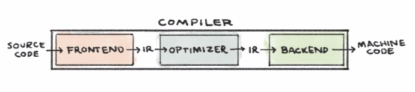
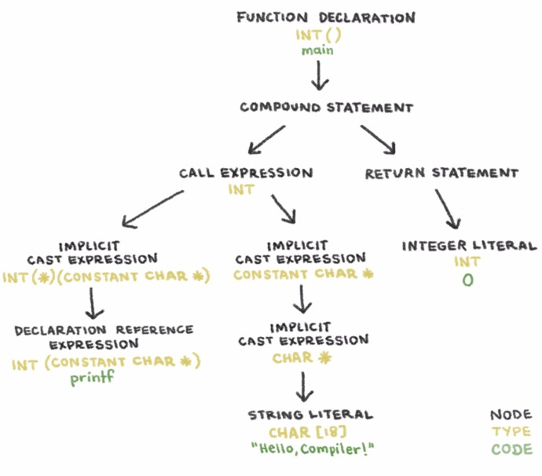

Nicole Orchard

# An Intro to Compilers

### How to Speak to Computers, Pre-Siri

August 13, 2017

* * *

**tl;dr:**  [Learning new meanings for front-end and back-end](https://twitter.com/norchard/status/864246049266958336).

A compiler is just a program that translates other programs. Traditional compilers translate source code into executable machine code that your computer understands. (Some compilers translate source code into another programming language. These compilers are called source-to-source translators or transpilers.) [LLVM](http://llvm.org/) is a widely used compiler project, consisting of many modular compiler tools.

Traditional compiler design comprises three parts:

- **The Frontend** translates source code into an intermediate representation (IR)*. [`clang`](http://clang.llvm.org/) is LLVM’s frontend for the C family of languages.

- **The Optimizer** analyzes the IR and translates it into a more efficient form. [`opt`](http://llvm.org/docs/CommandGuide/opt.html) is the LLVM optimizer tool.

- **The Backend** generates machine code by mapping the IR to the target hardware instruction set. [`llc`](http://llvm.org/docs/CommandGuide/llc.html) is the LLVM backend tool.

* **LLVM IR** is a low-level language that is similar to assembly. However, it abstracts away hardware-specific information.

## Hello, Compiler 👋

Below is a simple C program that prints “Hello, Compiler!” to stdout. The C syntax is human-readable, but my computer wouldn’t know what to do with it. I’m going to walk through the three compilation phases to make this program machine-executable.

	*// compile_me.c
	// Wave to the compiler. The world can wait.
	*
	*#include <stdio.h>
	*
	int main() {
	  printf("Hello, Compiler!\n");
	  return 0;
	}

### The Frontend

As I mentioned above, `clang` is LLVM’s frontend for the C family of languages. Clang consists of a C preprocessor, lexer, parser, semantic analyzer, and IR generator.

- **The C Preprocessor** modifies the source code before beginning the translation to IR. The preprocessor handles including external files, like `#include <stdio.h>` above. It will replace that line with the entire contents of the `stdio.h` C standard library file, which will include the declaration of the `printf` function.

*See the output of the preprocessor step by running:*

	clang -E compile_me.c -o preprocessed.i

- **The Lexer** (or scanner or tokenizer) converts a string of characters to a string of words. Each word, or token, is assigned to one of five syntactic categories: punctuation, keyword, identifier, literal, or comment.

*Tokenization of compile_me.c*

- **The Parser** determines whether or not the stream of words consists of valid sentences in the source language. After analyzing the grammar of the token stream, it outputs an abstract syntax tree (AST). Nodes in a Clang AST represent declarations, statements, and types.

*The AST of compile_me.c*

- **The Semantic Analyzer** traverses the AST, determining if code sentences have valid meaning. This phase checks for type errors. If the main function in compile_me.c returned `"zero"` instead of `0`, the semantic analyzer would throw an error because `"zero"` is not of type `int`.

- **The IR Generator** translates the AST to IR.

*Run the clang frontend on compile_me.c to generate LLVM IR:*

	clang -S -emit-llvm -o llvm_ir.ll compile_me.c

*The main function in llvm_ir.ll*

`[object Object]`

### The Optimizer

The job of the optimizer is to improve code efficiency based on its understanding of the program’s runtime behavior. The optimizer takes IR as input and produces improved IR as output. LLVM’s optimizer tool, `opt`, will optimize for processor speed with the flag `-O2` (capital o, two) and for size with the flag `-Os` (capital o, s).

Take a look at the difference between the LLVM IR code our frontend generated above and the result of running:

	opt -O2 -S llvm_ir.ll -o optimized.ll

*The main function in optimized.ll*
`[object Object]`

In the optimized version, main doesn’t allocate memory on the stack, since it doesn’t use any memory. The optimized code also calls `puts` instead of `printf` because none of `printf`’s formatting functionality was used.

Of course, the optimizer does more than just know when to use `puts` in lieu of `printf`. The optimizer also unrolls loops and inlines the results of simple calculations. Consider the program below, which adds two integers and prints the result.

	*// add.c
	**#include <stdio.h>
	*
	int main() {
	  int a = 5, b = 10, c = a + b;
	  printf("%i + %i = %i\n", a, b, c);
	}

*Here is the unoptimized LLVM IR:*
`[object Object]`
*Here is the optimized LLVM IR:*
`[object Object]`

Our optimized main function is essentially lines 17 and 18 of the unoptimized version, with the variable values inlined. `opt` calculated the addition because all of the variables were constant. Pretty cool, huh?

### The Backend

LLVM’s backend tool is `llc`. It generates machine code from LLVM IR input in three phases:

- **Instruction selection** is the mapping of IR instructions to the instruction-set of the target machine. This step uses an infinite namespace of virtual registers.

- **Register allocation** is the mapping of virtual registers to actual registers on your target architecture. My CPU has an x86 architecture, which is limited to 16 registers. However, the compiler will use as few registers as possible.

- **Instruction scheduling** is the reordering of operations to reflect the target machine’s performance constraints.

*Running this command will produce some machine code!*

	llc -o compiled-assembly.s optimized.ll

	_main:
		pushq	%rbp
		movq	%rsp, %rbp
		leaq	L_str(%rip), %rdi
		callq	_puts
		xorl	%eax, %eax
		popq	%rbp
		retq
	L_str:
		.asciz	"Hello, Compiler!"

This program is x86 assembly language, which is the human readable syntax for the language my computer speaks. Someone finally understands me 🙌

* * *

**Resources**

1. [Engineering a compiler](https://www.amazon.com/Engineering-Compiler-Second-Keith-Cooper/dp/012088478X)

2. [Getting Started with LLVM Core Libraries](https://www.amazon.com/Getting-Started-LLVM-Core-Libraries/dp/1782166920)