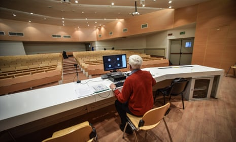
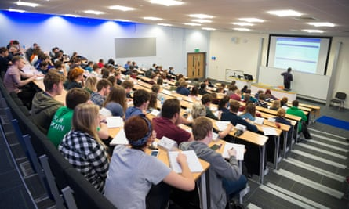
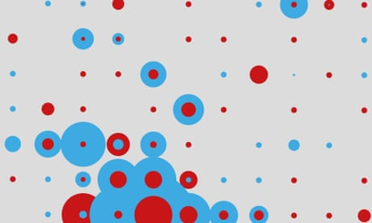

No campus lectures and shut student bars: UK universities' £1bn struggle to move online | Education | The Guardian

[The Observer](https://www.theguardian.com/observer)
[Universities](https://www.theguardian.com/education/universities)

# No campus lectures and shut student bars: UK universities' £1bn struggle to move online

A potential £1bn bill now faces the sector, but the real problem will be maintaining quality for students in a radically altered world this September

- [Coronavirus – latest updates](https://www.theguardian.com/world/series/coronavirus-live/latest)
- [See all our coronavirus coverage](https://www.theguardian.com/world/coronavirus-outbreak)

[David Batty](https://www.theguardian.com/profile/davidbatty) and [Rachel Hall](https://www.theguardian.com/profile/rachel-hall)

Sat 25 Apr 2020 13.35 BSTLast modified on Sat 25 Apr 2020 17.34 BST

- 
- 
- 

Shares

311

A college professor holds online lecture from an empty classroom in Milan. Photograph: Matteo Corner/EPA

UK universities need to spend hundreds of millions of pounds to deliver degrees online, with warnings that many are unprepared to deal with the impact of the coronavirus pandemic on students’ education.

Only around 20 universities are in a good position to provide a range of high-quality online courses by the start of the new academic year in September, according to Prof Sir Tim O’Shea, the former vice-chancellor of Edinburgh University. Some of the country’s top-ranked Russell Group institutions, including Oxford and Cambridge, were not in that category, he added.

 

##   [Harassment fears as students post extreme pornography in online lectures]()

   

Read more

 [(L)](https://www.theguardian.com/education/2020/apr/22/students-zoombomb-online-lectures-with-extreme-pornography)

The warning comes as the sector seeks to expand online education in a bid to offset huge losses from tens of thousands of [international students cancelling their studies](https://www.theguardian.com/education/2020/apr/11/universities-brace-for-huge-losses-as-foreign-students-drop-out) due to Covid-19. [Prolonged social distancing](https://www.theguardian.com/world/2020/apr/22/uk-will-need-social-distancing-until-at-least-end-of-year-says-whitty) also mean freshers could face a radically different university experience, with no lectures on campus and bars closed.

Most universities would face costs of at least £10m to create five or six new online degrees in different faculties, said O’Shea, a leading expert on computer-based learning. This would total well over £1bn across the sector.

The costs will add to the financial pressures facing universities, with a report from the University and College Union (UCU) forecastingthat the sector could [lose around £2.5bn next year in tuition fees alone](https://www.theguardian.com/education/2020/apr/23/coronavirus-uk-universities-face-25bn-tuition-fee-loss-next-year) if the pandemic continues.

O’Shea recommended that universities focus on providing the first-year courses for up to five faculties, at a cost of £3m to £7.5 m.

His stark assessment came as Durham University [stalled controversial plans](https://www.theguardian.com/education/2020/apr/25/durham-university-retracts-controversial-plan-to-provide-online-only-degrees) to provide online-only degrees and significantly reduce face-to-face lecturing next year. The proposals, drawn up by senior managers and private provider [Cambridge Education Group Digital](https://www.cegdigital.co.uk/), said lecturers would only need six hours of training, and could create online degree modules in six to 12 weeks.

[  Facebook](https://www.facebook.com/dialog/share?app_id=180444840287&href=https%3A%2F%2Fwww.theguardian.com%2Feducation%2F2020%2Fapr%2F25%2Fdegrees-of-separation-can-universities-adapt-in-the-rush-to-online-learning%3FCMP%3Dshare_btn_fb%26page%3Dwith%3Aimg-2%23img-2&picture=https%3A%2F%2Fmedia.guim.co.uk%2Fa3766b9d303332d4a77d09b7fa3a29e5104d41c4%2F0_273_4920_2952%2F4920.jpg)[  Twitter](https://twitter.com/intent/tweet?text=No%20campus%20lectures%20and%20shut%20student%20bars%3A%20UK%20universities%27%20%C2%A31bn%20struggle%20to%20move%20online&url=https%3A%2F%2Fwww.theguardian.com%2Feducation%2F2020%2Fapr%2F25%2Fdegrees-of-separation-can-universities-adapt-in-the-rush-to-online-learning%3FCMP%3Dshare_btn_tw%26page%3Dwith%3Aimg-2%23img-2)[  Pinterest](http://www.pinterest.com/pin/create/button/?description=No%20campus%20lectures%20and%20shut%20student%20bars%3A%20UK%20universities%27%20%C2%A31bn%20struggle%20to%20move%20online&url=https%3A%2F%2Fwww.theguardian.com%2Feducation%2F2020%2Fapr%2F25%2Fdegrees-of-separation-can-universities-adapt-in-the-rush-to-online-learning%3Fpage%3Dwith%3Aimg-2%23img-2&media=https%3A%2F%2Fmedia.guim.co.uk%2Fa3766b9d303332d4a77d09b7fa3a29e5104d41c4%2F0_273_4920_2952%2F4920.jpg)

   Students at a lecture at Aberystwyth University before the pandemic. Photograph: Alamy

Advertisement

O’Shea described Durham’s proposals as “hopelessly unrealistic”, adding that it was “quite impossible” for universities to deliver new online courses for this September unless they were already running successfully elsewhere. Even those universities with existing online provision would need 12 to 18 months to deliver new courses, he added.

 

##   [Coronavirus: the week explained - sign up for our email newsletter]()

   

Read more

 [(L)](https://www.theguardian.com/world/2020/mar/18/coronavirus-the-week-explained-sign-up-for-our-email-newsletter)

Private education firms said they have been inundated with requests from universities to help them deliver online education next year. Online learning platform [Coursera](https://www.coursera.org/) has received at least 29,000 inquiries from more than 6,000 universities in 120 countries since the pandemic began.

“We’re hearing from lots of universities that are facing major budget cuts, so even if they are planning to move all teaching online, they don’t have the core infrastructure to do this,” said Coursera’s chief enterprise officer, Leah Belsky.

Professor Neil Morris, dean of digital education at Leeds University, said lower-ranked UK universities would struggle to attract private partners to help them deliver online courses. “The companies only go to the top universities, because they want to use their brand to attract high fee-paying students [to] generate more money,” he said.

[  Facebook](https://www.facebook.com/dialog/share?app_id=180444840287&href=https%3A%2F%2Fwww.theguardian.com%2Feducation%2F2020%2Fapr%2F25%2Fdegrees-of-separation-can-universities-adapt-in-the-rush-to-online-learning%3FCMP%3Dshare_btn_fb%26page%3Dwith%3Aimg-3%23img-3&picture=https%3A%2F%2Fmedia.guim.co.uk%2Ff563ce191b906d6cd15207e8f03a1ddc84a238fe%2F0_447_6708_4025%2F6708.jpg)[  Twitter](https://twitter.com/intent/tweet?text=No%20campus%20lectures%20and%20shut%20student%20bars%3A%20UK%20universities%27%20%C2%A31bn%20struggle%20to%20move%20online&url=https%3A%2F%2Fwww.theguardian.com%2Feducation%2F2020%2Fapr%2F25%2Fdegrees-of-separation-can-universities-adapt-in-the-rush-to-online-learning%3FCMP%3Dshare_btn_tw%26page%3Dwith%3Aimg-3%23img-3)[  Pinterest](http://www.pinterest.com/pin/create/button/?description=No%20campus%20lectures%20and%20shut%20student%20bars%3A%20UK%20universities%27%20%C2%A31bn%20struggle%20to%20move%20online&url=https%3A%2F%2Fwww.theguardian.com%2Feducation%2F2020%2Fapr%2F25%2Fdegrees-of-separation-can-universities-adapt-in-the-rush-to-online-learning%3Fpage%3Dwith%3Aimg-3%23img-3&media=https%3A%2F%2Fmedia.guim.co.uk%2Ff563ce191b906d6cd15207e8f03a1ddc84a238fe%2F0_447_6708_4025%2F6708.jpg)

   Students outside a pub in Liverpool last year. Photograph: Paul Quayle/Alamy

Many universities would also balk at sharing student fee revenue with private firms, Morris added. But the costs to universities of developing digital education in-house are huge. The deputy vice-chancellor of Coventry University, Ian Dunn, said it took two years and “tens of millions of pounds” to deliver 19 fully online degrees since 2017.

Advertisement

Replay

O’Shea divided the UK universities into four categories: those with the capacity and will to develop high-quality online education, including the Open University, King’s College London, Edinburgh, Liverpool, Leeds and Coventry; those with the capacity but not the will, such as Oxford and Cambridge; those with the will but not the capacity, such as Durham; and those with neither the will nor the capacity, such as art schools and music conservatoires.

Some subjects, such as the sciences, would be particularly difficult to shift online. The Open University launched its [OpenSTEM Labs](http://stem.open.ac.uk/study/theopenstemlabs/about-us) in 2015, providing students with remote access to laboratories and observatories via remotely-operated robotic instruments. But experts noted that no other UK university has comparable provision.

Aris Katzourakis, co-president of the UCU branch at Oxford University, said staff would in many cases not be able to replicate laboratory classes online. The zoology professor added that “these elements will not be taught to students to the same level”.

> It is obvious that online learning simply cannot replicate the laboratory-based or practical learning of many courses

> NUS spokeswoman

In a blog this month on[the impact of the coronavirus on higher education](https://www.kcl.ac.uk/news/what-will-higher-education-look-like-after-coronavirus), the former universities minister, Jo Johnson, wrote that the crisis has exposed how many UK universities lagged behind their international competitors in developing online learning and were “clearly scrambling to provide anything resembling a coherent online offering”.

Advertisement

Martin Weller, professor of educational technology at the Open University, said there was a danger that university senior managers underestimated the difficulty of delivering learning online.

Weller said lecturers have told him they have been given a week’s notice to put their course online, and a fortnight to develop a digital strategy. He said: “A danger might be that we see a backlash against online learning because people rush to do it and it’s done badly.”

Diana Laurillard, [professor of learning with digital technologies at University College London’s Institute of Education](https://www.researchcghe.org/about/profile/diana-laurillard/), said the shift to online learning required a complete overhaul of traditional higher education. One-hour lectures and workshops would need to be broken up into smaller 10-20 minute webinars, interspersed with practical exercises, question-and-answer sessions and discussion groups.

#### Share your story

####  Share your stories

If you have been affected or have any information, we'd like to hear from you. You can get in touch by filling in the form below, anonymously if you wish or contact us [via WhatsApp](https://www.theguardian.com/info/2015/aug/12/whatsapp-sharing-stories-with-the-guardian) by [clicking here ](https://api.whatsapp.com/send?phone=447867825056)or adding the contact +44(0)7867825056. Only the Guardian can see your contributions and one of our journalists may contact you to discuss further.

      Tell us

  Share your experiences here (Please include as much detail as possible )  *

  Name (You do not need to use your full name)  *

  Where do you live? (Town or area is fine)  *

  Can we publish your response? *

  Yes, entirely    Yes, but please keep me anonymous    Yes, but please contact me first    No, this is information only

  Email address (Your contact details are helpful so we can contact you for more information. They will only be seen by the Guardian.)  *

  Phone number (Your contact details are helpful so we can contact you for more information. They will only be seen by the Guardian.)

  You can add any extra information here

 [Terms and conditions](https://www.theguardian.com/help/terms-of-service)

Staff also needed to provide more pastoral care for students studying on their own. “There’s much more guidance involved when you’re not [physically] there,” she added.

A spokeswoman for the National Union of [Students](https://www.theguardian.com/education/students) said: “It is obvious that, regardless of quality, online learning simply cannot replicate the laboratory-based or practical learning of many courses.”

An Oxford University spokeswoman said its staff have rapidly “bought into the idea that we can deliver teaching and assessment entirely remotely”.

Prof Graham Virgo, senior pro-vice-chancellor of education at Cambridge University, said it had taken steps to increase online learning, including a partnership with private education firm edX. He added: “The university is developing ambitious plans to expand its online provision.”

Prof Stuart Corbridge, vice-chancellor of Durham University, said it was preparing to teach all courses on campus in September “while also ensuring that teaching can go online if there is a lockdown later in the year or in 2021”.

A Department for Education spokeswoman said it was “delighted to see so many providers developing innovative ways of providing quality education, online and remotely”.

## Case study

##

   Marcus Matthews, a final-year history student at the University of Southampton. Photograph: Marion Matthews

Marcus Matthews, a final-year history student at the University of Southampton.

“It has been quite disappointing, specifically from my faculty, the extent of the response to this crisis, although my degree has limited contact time anyway – it is mainly discussions in the two two-hour sessions we have per week.

“In order to replace this, all we are now doing is posting at least three comments on an online discussion board per session. It is now a case of ‘do the reading, post your comments’. There appears to be no form of moderation.

“This decision was made without consultation with students, and also the faculty stressed in an email to bear with the staff as they are having to deal with new technology such as ‘phone, Skype and Microsoft Teams’.

“This is at a Russell Group uni. There is effectively no incentive to partake in this online learning, as it is in such a simple and condescending format with no consequence if we do it or not. As of this week, only one student has contributed, with one comment. It has effectively ruined the last five weeks of learning of what otherwise would have been an interesting module.” **Rachel Hall**

Topics

- [Universities/](https://www.theguardian.com/education/universities)
- [The Observer/](https://www.theguardian.com/observer)
- [Online learning/](https://www.theguardian.com/education/online-learning)
- [Higher education/](https://www.theguardian.com/education/higher-education)
- [Coronavirus outbreak/](https://www.theguardian.com/world/coronavirus-outbreak)
- [Student experience/](https://www.theguardian.com/education/student-experience)
- [Students/](https://www.theguardian.com/education/students)
- [news/](https://www.theguardian.com/tone/news)
- 
- 
- 
- [Share on LinkedIn](http://www.linkedin.com/shareArticle?mini=true&title=No%20campus%20lectures%20and%20shut%20student%20bars%3A%20UK%20universities%27%20%C2%A31bn%20struggle%20to%20move%20online&url=https%3A%2F%2Fwww.theguardian.com%2Feducation%2F2020%2Fapr%2F25%2Fdegrees-of-separation-can-universities-adapt-in-the-rush-to-online-learning)
- [Share on Pinterest](http://www.pinterest.com/pin/find/?url=https%3A%2F%2Fwww.theguardian.com%2Feducation%2F2020%2Fapr%2F25%2Fdegrees-of-separation-can-universities-adapt-in-the-rush-to-online-learning)
- [Reuse this content](https://syndication.theguardian.com/automation/?url=https%3A%2F%2Fwww.theguardian.com%2Feducation%2F2020%2Fapr%2F25%2Fdegrees-of-separation-can-universities-adapt-in-the-rush-to-online-learning&type=article&internalpagecode=7340640)