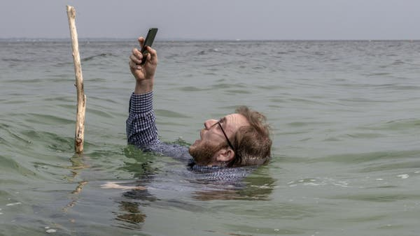
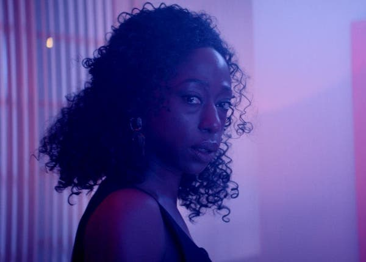

Now Playing: The South by Southwest Film Festival, Sort of - The New York Times

 [At Home](https://www.nytimes.com/spotlight/at-home?action=click&pgtype=Article&state=default&module=STORY_MAPS_ATH_promo&variant=show&region=TOP_BANNER&context=at_home_menu)  ›

- [Cook: Snickerdoodle Loaf](https://www.nytimes.com/2020/05/01/dining/snickerdoodle-poundcake-recipe-coronavirus.html?action=click&pgtype=Article&state=default&module=STORY_MAPS_ATH_promo&variant=show&region=TOP_BANNER&context=at_home_menu)

- [Play: The Paperback Game](https://www.nytimes.com/2020/05/02/smarter-living/the-paperback-game.html?action=click&pgtype=Article&state=default&module=STORY_MAPS_ATH_promo&variant=show&region=TOP_BANNER&context=at_home_menu)

- [Get: A ‘Credibility Bookcase’](https://www.nytimes.com/2020/05/01/arts/quarantine-bookcase-coronavirus.html?action=click&pgtype=Article&state=default&module=STORY_MAPS_ATH_promo&variant=show&region=TOP_BANNER&context=at_home_menu)

- [Watch: Some Film Noir](https://www.nytimes.com/2020/04/30/movies/film-noir-criterion.html?action=click&pgtype=Article&state=default&module=STORY_MAPS_ATH_promo&variant=show&region=TOP_BANNER&context=at_home_menu)

# Now Playing: The South by Southwest Film Festival, Sort of

Two critics look at highlights from the SXSW 2020 Film Festival Collection, available to view on Amazon Prime Video.

Sébastien Chassagne in “Selfie,” one of the films screening in the SXSW 2020 Film Festival Collection.Credit...Tristan Aurouet

By Amy Nicholson and [Jason Bailey](https://www.nytimes.com/by/jason-bailey)

- April 28, 2020

-

    - 
    - 
    - [](https://www.nytimes.com/2020/04/28/movies/sxsw-film-festival-amazon-prime.html?action=click&module=Well&pgtype=Homepage&section=Moviesmailto:?subject=NYTimes.com%3A%20Now%20Playing%3A%20The%20South%20by%20Southwest%20Film%20Festival%2C%20Sort%20of&body=From%20The%20New%20York%20Times%3A%0A%0ANow%20Playing%3A%20The%20South%20by%20Southwest%20Film%20Festival%2C%20Sort%20of%0A%0ATwo%20critics%20look%20at%20highlights%20from%20the%20SXSW%202020%20Film%20Festival%20Collection%2C%20available%20to%20view%20on%20Amazon%20Prime%20Video.%0A%0Ahttps%3A%2F%2Fwww.nytimes.com%2F2020%2F04%2F28%2Fmovies%2Fsxsw-film-festival-amazon-prime.html%3Fsmid%3Dem-share)

    -
    -

*When the South by Southwest Film Festival announced it would screen *[*a selection of its movies on Amazon Prime Video*](https://www.amazon.com/adlp/sxsw)*, we asked two critics who are veterans of the event to recommend some highlights and reflect on their past SXSW experience. Here are excerpts from their conversation.*

**AMY NICHOLSON: **We film critics use festivals to mark time. [Sundance](https://www.sundance.org/2020-sundance-film-festival-program-guide) hails a fresh year of movies, [Cannes ignites controversies](https://www.nytimes.com/2019/05/24/movies/cannes-almodovar-kechiche.html) that burn all summer, and [Toronto’s autumnal red carpets](https://www.nytimes.com/2019/09/13/movies/joker-toronto-film-festival.html) usher in Oscar season. It’s paganesque, particularly the spring migration to Austin, Tex. for SXSW, the puckish fest that’s as apt to premiere an indie upstart (it’s where Greta Gerwig, [Lena Dunham](https://www.nytimes.com/2010/03/20/movies/20tiny.html) and Joe Swanberg made major debuts) as it is a risky studio flick that needs exuberant buzz, like “Bridesmaids,” “Sausage Party” [and “Us.”](https://www.nytimes.com/2019/03/09/movies/jordan-peele-us-premiere.html) Dazed and amused attendees can feel like they’ve partied the length of Sixth Street without even cracking a beer. (Though at most theaters, you can do that, too.)

This March, however, when SXSW became the first high-profile North American event [to cancel because of the pandemic](https://www.nytimes.com/2020/03/06/arts/music/sxsw-cancelled.html), it had the misfortune of time-stamping the moment Covid-19 scrambled the calendar. With festivals on pause until at least fall, what’s next for movies that were about to make their big bow? I’m curious to see the filmmaker and audience response [to Amazon’s partnership with SXSW to stream a selection of their scuttled picks](https://www.amazon.com/adlp/sxsw) for free from now until May 6 — a trial balloon, it turns out, for YouTube’s 10-day showcase [We Are One: A Global Film Festival](https://deadline.com/2020/04/tribeca-youtube-cannes-venice-toronto-we-are-one-streaming-film-festival-1202918493/), which will feature movies programmed by Berlin, Cannes, Tribeca and others later next month. Are online film festivals the first sprouts of our new normal?

Image

Nikki Amuka-Bird in “Vert.”Credit...Kate Cox

**JASON BAILEY:** It’s all a matter of coincidental timing, but it does strike me as especially poignant that SXSW was the first film fest casualty of Covid-19 — since it is, far and away, [the most interactive of festivals](https://www.sxsw.com/category/interactive/). I’ve gone every year since 2012, which was also the first year I attended Sundance, and while there was never a question which festival was more “important,” SXSW was always the one I looked forward to the most. And it wasn’t just about the festival, but the combined experience: films, beer, BBQ, music and, most of all, fellow filmgoers. I’ve made new friends in those lines and auditoriums, and turned online friendships into IRL ones, putting faces to Twitter handles, sharing a handshake or a hug, and then watching something together. That’s the part of every festival, but this one in particular, that an online avatar can’t replicate.

Advertisement

[Continue reading the main story](https://www.nytimes.com/2020/04/28/movies/sxsw-film-festival-amazon-prime.html?action=click&module=Well&pgtype=Homepage&section=Movies#after-story-ad-1)

**NICHOLSON**: But let’s attempt to do so, with homemade queso to get us in the vibe. (As a Texan myself, I sanction simply melting a can of Ro-tel tomatoes and chilies into a block of Velveeta.) Roughly a tenth of the scheduled films agreed to stream online, an international mix of narratives, docs, and shorts. (Every domestic feature passed on participating, clutching to the hope of a proper debut.) Let’s get into what’s good.

I’ll start by singling out [“Selfie,”](https://www.amazon.com/gp/video/detail/B087K29L8S/ref=atv_me_sxs_c_kSmseq_brws_2_8) a cyber-comedy about social media. Five French directors teamed up to assemble the film’s interconnected stories about online dating, targeted ads, Twitter trolls, data leaks and would-be influencers. Each segment takes a wild turn (seriously, I failed to predict a single ending!) so it could get waved off as a “Black Mirror” clone. But “Selfie” has more empathy. Its subtitle stresses it’s about “the influence of new media on *good* people” — emphasis mine — and its mischievous wit won me over.

 [  ## Ideas from The Times on what to read, cook, watch, play and listen to while staying safe At Home.                            ](https://www.nytimes.com/spotlight/at-home?pgtype=Article&action=click&pgtype=Article&state=default&module=STORY_MAPS_ATH_promo&variant=show&region=MID_MAIN_CONTENT&context=at_home_story_promo&region=MID_MAIN_CONTENT&contentCollection=AtHome)

“Selfie” pairs well with [Kate Cox’s “Vert,”](https://www.amazon.com/gp/video/detail/B087FSSKBZ/ref=atv_me_sxs_c_Q1HrAf_brws_3_28) a short about a couple (Nikki Amuka-Bird and Nick Frost) celebrating their 20th anniversary with virtual reality glasses that reveal their subconscious desires. “Vert’s” twist is underdeveloped, but its gossamery goodness is anchored by Amuka-Bird’s incredible performance. Her expressive face radiates a dozen conflicting emotions behind one smile. I’d like to see an emoji do *that*.

What’s electrified your life?

Advertisement

[Continue reading the main story](https://www.nytimes.com/2020/04/28/movies/sxsw-film-festival-amazon-prime.html?action=click&module=Well&pgtype=Homepage&section=Movies#after-story-ad-2)

**BAILEY: **My favorite short films are similarly prescient, though admittedly, *every* movie I see these days seems an accidental commentary on our new normal. But Izzy Shill’s cringey-funny [“Face to Face Time”](https://www.amazon.com/gp/video/detail/B087G3BGCM/ref=atv_me_sxs_c_Q1HrAf_brws_3_12) certainly hits differently than intended — focusing, as it does, on an online sexual encounter gone awry, complete with the kind of pre-call primping and prepping, long-distance awkwardness, and unfortunate accidents that have already become the norms of digital dating.

Chelsea Devantez’s [brisk, clever “Basic”](https://www.amazon.com/gp/video/detail/B087J58D8N/ref=atv_me_sxs_c_Q1HrAf_brws_3_3) is likewise concerned with presentation and authenticity in the digital age, this time via the careful curation and choreography of the Instagram feed. As we try to put our best faces forward on social media, “Basic” ingeniously reminds us how often our assumptions are wildly inaccurate. Karen Bernstein’s moving documentary feature [“I’m Gonna Make You Love Me”](https://www.amazon.com/gp/video/detail/B087FXZT4F/ref=atv_me_sxs_c_kSmseq_brws_2_4) asks similarly probing questions of identity, telling (in candid and sometimes heartbreaking detail) the story of Brian Belovitch’s attempts to become “something other than myself,” first as a trans woman in the ’80s East Village drag scene, then as a gay man in contemporary New York.

Anything else strike your fancy?

**NICHOLSON**: Bring on debates about [Alex Lee Moyer’s “TFW NO GF,”](https://www.amazon.com/gp/video/detail/B087N4LPS3/ref=atv_me_sxs_c_kSmseq_brws_2_10) a polarizing documentary about bored young men who write online posts about suicide, misogyny and violence for attention. Moyer spent two years interviewing her disaffected loners, during which one of them, the 23-year-old Charels Donnelly, [became a headline in this newspaper](https://www.nytimes.com/2019/11/18/us/gun-seizures.html) for tweeting a picture of himself brandishing two AK-47s with the line “one ticket for joker please.” Donnelly insists it was a joke and the film seems to believe him. Moyer’s compassion allows these pranksters steeped in 4chan irony to be sincere for the first time in their public lives. Caveat: the trade-off is she doesn’t prod their genuine darkness, letting it go unmentioned that one kid sports two pins of the Confederate flag.

Let me close out on a joy-bomb: [Olivia Loomis Merrion’s short doc “Quilt Fever”](https://www.amazon.com/gp/video/detail/B087JSJRVQ/ref=atv_me_sxs_c_Q1HrAf_brws_3_20) travels to Paducah, Ky., for QuiltWeek, when the town’s population doubles for a weekend of “pure, unadulterated chaos,” according to the clerk of the local vape store. Quilters might be the happiest people on earth. Yet they, too, delight in self-deprecating humor. One dubs her new quilt “My Checkered Past,” while Eleanor Burns, the Queen of Stripping — an introductory technique — struts onstage in a feather boa hooting, “We are strippers, and everybody’s proud of it!” Here’s hoping their annual bacchanal takes place in September as scheduled. As for us, I hope we’re spilling Shiner Bocks on each other next year at the Paramount Theater.

**BAILEY:** Indeed. I have mixed feelings overall about the effort to SXSW-in-place; though I certainly admire the festival and Amazon for trying to Scotch-tape together a solution, this one [doesn’t seem](https://www.hollywoodreporter.com/news/no-easy-solution-filmmakers-weigh-risks-sxsws-amazon-offer-1289163?utm_source=twitter&utm_medium=social) to benefit filmmakers much. More pressingly, if understandably, it removes what makes this festival special. The types of movies that go over big at SXSW — raucous comedies, energetic action movies, and far-out genre flicks — do so because of the roaring response of Austin’s famously spirited audiences. Without that component, is “The SXSW 2020 Film Festival Collection” really SXSW at all?

Advertisement

[Continue reading the main story](https://www.nytimes.com/2020/04/28/movies/sxsw-film-festival-amazon-prime.html?action=click&module=Well&pgtype=Homepage&section=Movies#after-bottom)