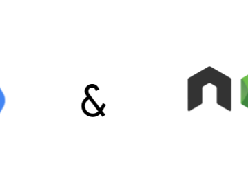

Now, you can deploy your Node.js app to App Engine standard environment

Now, you can deploy your Node.js app to App Engine standard environment

https://cloudplatform.googleblog.com/2018/06/Now-you-can-deploy-your-Node-js-app-to-App-Engine-standard-environment.html

By Steren Giannini, Product Manager, Google Cloud Platform Developers love Google App Engine ’s zero-config deployments, zero server manag...