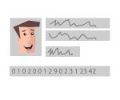

OAuth that just works.

YOUR APP

# Forget OAuth complexity.

[Go to my Dashboard](https://oauth.io/dashboard)

## Features

[OAuth Integration](https://oauth.io/home/api_integration)

[User Management](https://oauth.io/home/user_management)

[OAuth Providing](https://oauth.io/home/oauth_server)

### OAuth Integration

#### Access your user's resources in 5 lines

**
 Integrate OAuth in **90 seconds**
**
 **100+ API** providers available
**

 SDKs available for **JavaScript**, **NodeJS**,**PHP**, **iOS**, **Android**, **Phonegap**

**
 Easy integration management in your **OAuth.io dashboard**
OAuth.popup('facebook').then((facebook) => {
return facebook.me()
}).then((me) => {
console.log('Your name is ' + me.name)
}).catch((error) => {
console.error(error)
})

[^ Back to top ^](https://oauth.io/home)

### User Management

#### Simplified User Management

**
 Simplified **social signin / signup** with our SDK
**
 Use any of our **100+ providers** for your user management
**
 Your user base safely curated by **StormPath**
User.signin(email, password).done((user) => {
console.log(user.data.firstname);
}).fail((err) => {
// email/password incorrect.
});

[^ Back to top ^](https://oauth.io/home)

### OAuth Server

#### Become the provider

**
 Easily add an **OAuth 2.0 layer** on your existing API
**
 **Become a platform** and let developers build apps over your service
**
 Either choose **OAuth.io as your developer portal** or create your own
**
 Your service **automatically available in OAuth.io**
app.get('/me', **OAuthProvider.OAuth2.check()**, (req, res, next) => {
let user = req.session.user,
response
delete user.password
if (**req.OAuth2.scope['user_info']**) {
response = user
}
else {
response = {
error: 'Access not permitted by user'
}
}
res.send(response)
});

[^ Back to top ^](https://oauth.io/home)

### Subscription & Pricing

####

No credit card required to signup

### OAuth Integration & User Management plans

$ 19
/mth
**20,000** API calls / mth
Support type: Emails
$ 99
/mth
**400,000** API calls / mth
Support type: Priority emails
$ 299
/mth
**8,000,000** API calls / mth
Support type: Priority emails

### OAuth Server - Become an OAuth Provider

##### Try it for free, [contact us](https://oauth.io/mailto:support@oauth.io) for more.

[Manage my plans](https://oauth.io/dashboard/my-plans)[Go to my dashboard](https://oauth.io/dashboard)