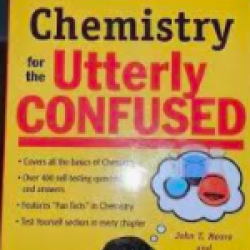
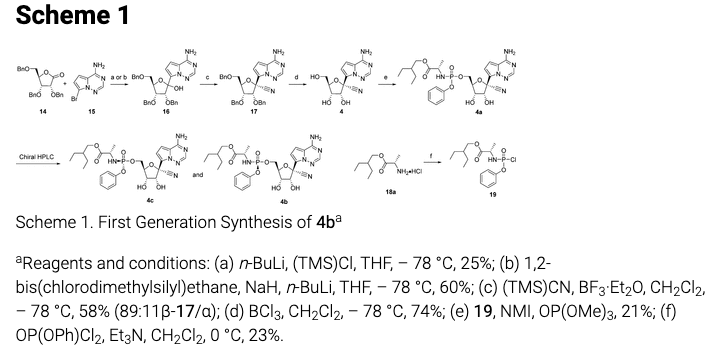
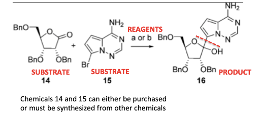
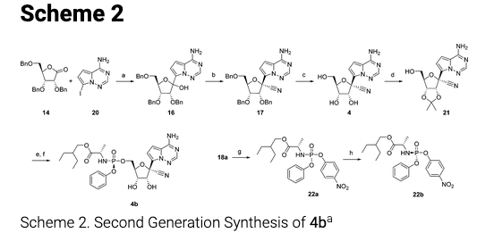

OMG! We Made One Gram of Remdesivir! | American Council on Science and Health

# OMG! We Made One Gram of Remdesivir!

- [email](https://www.acsh.org/news/2020/03/26/problem-remdesivir-making-it-14665mailto:?subject=OMG%21%20We%20Made%20One%20Gram%20of%20Remdesivir%21&body=https%3A%2F%2Fwww.acsh.org%2Fnews%2F2020%2F03%2F26%2Fproblem-remdesivir-making-it-14665)
- [facebook](https://www.facebook.com/sharer/sharer.php?u=https%3A%2F%2Fwww.acsh.org%2Fnews%2F2020%2F03%2F26%2Fproblem-remdesivir-making-it-14665)
- [linkedin](http://www.linkedin.com/shareArticle?mini=true&url=https%3A%2F%2Fwww.acsh.org%2Fnews%2F2020%2F03%2F26%2Fproblem-remdesivir-making-it-14665&title=OMG%21%20We%20Made%20One%20Gram%20of%20Remdesivir%21)
- [twitter](https://twitter.com/intent/tweet?text=OMG%21%20We%20Made%20One%20Gram%20of%20Remdesivir%21&url=https%3A%2F%2Fwww.acsh.org%2Fnews%2F2020%2F03%2F26%2Fproblem-remdesivir-making-it-14665)
- [reddit](http://www.reddit.com/submit?url=https%3A%2F%2Fwww.acsh.org%2Fnews%2F2020%2F03%2F26%2Fproblem-remdesivir-making-it-14665&title=OMG%21%20We%20Made%20One%20Gram%20of%20Remdesivir%21)
- [print](#)

### Related articles

 [In Making Some Antibiotics, Bacteria Put Organic Chemists To Shame](https://www.acsh.org/news/2018/07/22/bacteria-put-organic-chemists-shame-making-antibiotics-13218)

 [Semisynthetic: A *Real* Word That Saves Lives](https://www.acsh.org/news/2016/12/28/semisynthetic-real-word-saves-lives-10605)

 [CBD and THC - The Only Difference Is One Chemical Bond](https://www.acsh.org/news/2019/04/08/cbd-and-thc-only-difference-one-chemical-bond-13937)

 [If You Think Fentanyl Is Bad...](https://www.acsh.org/news/2017/01/17/if-you-think-fentanyl-bad-10663)

 [Why Sudafed Is Behind The Counter: A Meth Chemistry Lesson](https://www.acsh.org/news/2017/09/12/why-sudafed-behind-counter-meth-chemistry-lesson-11812)

    By [Josh Bloom](https://www.acsh.org/profile/josh-bloom) — March 30, 2020

*

Two of the experimental coronavirus drugs, chloroquine, and hydroxychloroquine are a breeze to synthesize. But remdesivir, possibly the most promising candidate, is anything but. It's a royal pain. Here's why.

*

[Image: Gumtree](https://www.gumtree.com.au/s-ad/pasadena/textbooks/chemistry-for-the-utterly-confused/1242672980)

Q: What's worse than being in the middle of a coronavirus pandemic?

A: Being in the middle of a coronavirus pandemic *and* having to read about synthetic organic chemistry.

Yet, here we are, so pay attention.

I [recently wrote about](https://www.acsh.org/news/2020/03/12/does-gileads-remdesivir-have-what-it-takes-treat-coronavirus-infections-14632) Gilead's remdesivir, during which time I (foolishly) went out on a limb, predicting that it *looked* like the most promising of the coronavirus drug candidates at that time. But remdesivir has one problem that chloroquine and hydroxychloroquine do not. It is a royal pain to make.

There can hardly be better evidence of this than [an article](https://www.taiwannews.com.tw/en/news/3900947) in Taiwan News (emphasis mine).

> Meanwhile, on Feb. 26, **> Taiwan's****>  leading academic institution**> , Academia Sinica, announced on Facebook that a team of**>  [seven] scientists**>  had managed to synthesize **> one gram**>  of remdesivir at a 99 percent level of purity. The institute stated the purpose of synthesizing the drug is not to rush to production but to test and prevent problems before manufacturing begins.

> Taiwan News, March 20, 2020

As a (former) synthetic organic, and medicinal chemist **(1),** I broke out into a sweat when I read this. Most drugs are relatively easy to synthesize. They'd better be, because depending on the dose and number of patients who will be needing the drug, thousands of pounds of highly pure active pharmaceutical ingredient (API) may be needed. This is usually not a serious issue because modern organic synthesis has become so sophisticated and powerful that with some notable exceptions, chemists can usually figure out a synthetic route that can be scaled up to the point where sufficient API can be efficiently produced in a factory.

So, why did it take a group of seven chemists [an undetermined number of] weeks to make what I estimate to be **one **dose of remdesivir that will be enough for **one** person for **one** day **(2)**?

This...

*Scheme 1. Gilead's first generation synthetic scheme for remdesivir. Don't worry, it's worse than it looks.*

Since I've been cooped up in a glorified Port-a-Potty for 4 weeks I think it's perfectly fair to spread the misery and subject the rest of you to a similar dose of agony – a lesson about organic synthesis. Now, I don't expect these spidery-looking things above (molecules) to mean much, but there are few lessons here that should be sufficiently coherent to at least temporarily take your mind off how sucky your life has become. Two different syntheses of remdesivir are reported in a [2017 paper](https://pubs.acs.org/doi/10.1021/acs.jmedchem.6b01594#) **(3)** in the *Journal of Medicinal Chemistry*. It has 35 authors. God help them.

**1. ORGANIC REAGENTS CAN BE NASTY**

A reagent is a chemical (solid, liquid, gas, or mineral) that is used to transform one chemical substance into another. Let's use step #1 (below) as an example (the chemical undergoing the transformation is called a substrate).

In this case, chemical compounds 14 and 15 (you don't want to know their chemical names) are combined to form compound 16, which is the desired product. The letters (a,b) above the arrow show the reagents used to make the reaction work. In this case, it means that either reagent a or b may be used for this particular reaction. Let's just stick to** reagent (a):**

(a)*  **n*-BuLi, (TMS)Cl, THF, – 78 °C, 25%

What does this gibberish mean? *n*-BuLi is short for n-butyllithium, which bursts into flame if exposed to oxygen or water. (TMS)Cl is short for trimethylsilyl chloride, another charmer, which also reacts like a madman with water and will cheerfully eat your skin. THF is short for the tetrahydrofuran, the solvent used. The -78ºC is the temperature (-108° F) at which the reaction is run. **(4)**

Some reactions have to be run at very low temperatures. This is one of them. If you mix this stuff together at room temperature your internal organs would be found in several time zones. 25% is the yield of the reaction – the weight of the product obtained from the reaction divided by the expected weight if the reaction went perfectly. Clearly, this one is very far from perfect; you're losing 75% of your material. **(5)**

This might not be so awful if you could purchase **14** and **15**, but this may or may not be possible. It could be that it took you a month to make them, in which case life begins to suck.

**REACTIONS IN ORGANIC CHEMISTRY CAN BE MESSY AND INEFFICIENT**

But if you're the person who has to make a bunch of remdesivir (compound 4b in Scheme 1) your life is going to *doubly* suck because one lousy yielding reaction is bad enough in a synthetic sequence, and this one has *three* of them. To give you an idea of how bad this is you need to know that to calculate the overall yield of the final product in any synthetic sequence you have to *multiply* all the yields in that sequence. The remdesivir sequence consists of five reactions. Let's assume that the yield of each is 90%, which is excellent. By the time you are done, you will have (0.9)5, or a 59% overall yield, meaning that you have thrown away 41% of the material.

No such luck here.

Here are the real numbers for the reactions in Scheme 1: 0.25 x 0.58 x 0.74 x 0.21 x 0.23  = .005 (0.5%)

The average yield of the five steps is 36%, making the overall yield a god-awful 0.5%. Yes, you're getting about 1/200th of the theoretical amount! So, to get one stinking gram of pure remdesivir you would need to start with about 200 grams of starting material that may have taken weeks, or maybe months, to make.

Well, that's not very good, is it?
**IMPROVING THE CHEMISTRY**

Fortunately, discovery chemists (guys like me) only need to make enough material (usually ~10-20 grams) so that a potential drug can be tested in all of the *in vitro *tests, and enough animal tests, to indicate whether the drug has promise. If so, it will be further evaluated in larger animal studies to see if it has the properties to move to Phase I trials in people. To make 20 grams of something where 99.5% of the material is thrown away means you need to start with 4 kilos (8.8 pounds) and enough chemists to replace the ones that have hurled themselves out of the window.

Fortunately, there are creatures called "process chemists" – guys who laugh at the discovery synthesis, insult as many of us as possible, and then make it better so that the yields are higher and some of the most dangerous chemical reagents and solvents – ones you really don't want to use on a large scale – are replaced by others. They are generally a bunch of mutants, but they do a great job in "fixing" the synthesis used by the discovery chemists.

**THE IMPROVEMENT CAN BE DRAMATIC**
So, it is not surprising to see that the same paper has...

Without further torturing you with details, the second-generation synthesis consists of six reactions instead of five, but overall, life is much better. The yields of the six steps (not shown) are 40%, 85%, 86%, 90%, 70%, and 69% – an average of 73% per step. This makes the overall yield:

0.40 x 0.85 x 0.86 x 0.90 x 0.70 x 0.69 = 12.7% (25-times more efficient than Scheme 1. That's a VERY big difference.

**THIS STILL DOESN'T MEAN THAT IT'S EASY**

Not all steps are equal, especially regarding the method needed to purify the product. Many, if not most, organic compounds are crystalline and can be purified by dissolving the crude reaction mixture in a hot solvent and letting it cool. Upon cooling, the desired product (and a little luck) will selectively crystallize while the impurities stay in solution. The purified solid can be collected by filtration (this technique is called recrystallization. It is usually the best way to purify chemical compounds).

On the other hand, some compounds are not crystalline (they may be liquids or oils) so another method, usually [liquid chromatography](https://www.chemicool.com/definition/liquid_chromatography_lc.html), is frequently used. On a small scale this is fine, but when kilograms of material are required the process becomes unwieldy. Process chemists try to minimize the use of chromatography.

Nonetheless, the technique was used multiple times. In the procedure section of the paper, I counted six procedures where compounds were purified by chromatography. The weight of the isolated product that was obtained in this way ranged from 10-61 mg (!).

Talk about a pain in the rear.

So, if you made it through this atrocious article without ordering cyanide (and a funnel) from Amazon Prime it should be clear that making a bunch of remdesivir is anything but easy. But if the drug works that will be a pleasant problem to have. Unless you're told to make 100 grams of the stuff. **(6)**

NOTES:

(1) Synthetic organic chemistry (aka organic synthesis) is a branch of organic chemistry that involves the transformation of one chemical compound into another by the use of chemical reactions. Medicinal chemistry also involves organic synthesis but is focused on drug discovery. One must be trained in organic synthesis to be able to be a medicinal chemist.

(2) The one-gram dose is a guess based on the doses of other antiviral medicines.

(3)**  **Remdesivir was originally developed as an Ebola drug. It didn't work very well. This is why this paper appeared four years ago.

(4) The fact that we see a reaction temperature of -78° C is not a coincidence. This is the temperature of a dry ice and acetone bath – a very common method of running cold temperature reactions. The reaction flask is immersed in a big dish containing the dry ice-acetone. Sticking your fingers into the cold bath is not recommended.

(5)**  **The primary reason that chemical reactions have low yields is the formation of byproducts (impurities). In other words, the molecule will be converted into the desired product but other, undesired reactions happen. This is the nature of organic synthesis. Some reactions are "clean" and others are "dirty."

(6) To be fair, there are drugs that are FAR worse than remdesivir to make. The first total synthesis of the cancer drug Taxol involved 46 steps with an overall yield of 0.03%. As you might expect, it's not even remotely possible to make enough drug by this process.

Tags:
[coronavirus](https://www.acsh.org/tags/coronavirus)
[remdesivir](https://www.acsh.org/tags/remdesivir)
[organic synthesis](https://www.acsh.org/tags/organic-synthesis)
[chemical reactions](https://www.acsh.org/tags/chemical-reactions)

American Council on Science and Health Comment Policy

Comments are moderated. Constructive feedback is welcome. Pseudoscience, insults, or mischaracterizations are not.

**

- [5 comments]()
- [**American Council on Science and Health**](https://disqus.com/home/forums/american-council-on-science-and-health/)
- [** Disqus' Privacy Policy](https://help.disqus.com/customer/portal/articles/466259-privacy-policy)
- [Marc Cohen](https://disqus.com/embed/comments/?base=default&f=american-council-on-science-and-health&t_i=node%2F14665&t_u=https%3A%2F%2Fwww.acsh.org%2Fnews%2F2020%2F03%2F26%2Fproblem-remdesivir-making-it-14665&t_e=OMG!%20We%20Made%20One%20Gram%20of%20Remdesivir!&t_d=OMG!%20We%20Made%20One%20Gram%20of%20Remdesivir!%20%7C%20American%20Council%20on%20Science%20and%20Health&t_t=OMG!%20We%20Made%20One%20Gram%20of%20Remdesivir!&s_o=default#)
- [](https://disqus.com/home/inbox/)
- [ Recommend](https://disqus.com/embed/comments/?base=default&f=american-council-on-science-and-health&t_i=node%2F14665&t_u=https%3A%2F%2Fwww.acsh.org%2Fnews%2F2020%2F03%2F26%2Fproblem-remdesivir-making-it-14665&t_e=OMG!%20We%20Made%20One%20Gram%20of%20Remdesivir!&t_d=OMG!%20We%20Made%20One%20Gram%20of%20Remdesivir!%20%7C%20American%20Council%20on%20Science%20and%20Health&t_t=OMG!%20We%20Made%20One%20Gram%20of%20Remdesivir!&s_o=default#)
- tTweetfShare
- [Sort by Oldest](https://disqus.com/embed/comments/?base=default&f=american-council-on-science-and-health&t_i=node%2F14665&t_u=https%3A%2F%2Fwww.acsh.org%2Fnews%2F2020%2F03%2F26%2Fproblem-remdesivir-making-it-14665&t_e=OMG!%20We%20Made%20One%20Gram%20of%20Remdesivir!&t_d=OMG!%20We%20Made%20One%20Gram%20of%20Remdesivir!%20%7C%20American%20Council%20on%20Science%20and%20Health&t_t=OMG!%20We%20Made%20One%20Gram%20of%20Remdesivir!&s_o=default#)

Join the discussion…

[(L)](https://disqus.com/embed/comments/?base=default&f=american-council-on-science-and-health&t_i=node%2F14665&t_u=https%3A%2F%2Fwww.acsh.org%2Fnews%2F2020%2F03%2F26%2Fproblem-remdesivir-making-it-14665&t_e=OMG!%20We%20Made%20One%20Gram%20of%20Remdesivir!&t_d=OMG!%20We%20Made%20One%20Gram%20of%20Remdesivir!%20%7C%20American%20Council%20on%20Science%20and%20Health&t_t=OMG!%20We%20Made%20One%20Gram%20of%20Remdesivir!&s_o=default#)

-

    - [−](https://disqus.com/embed/comments/?base=default&f=american-council-on-science-and-health&t_i=node%2F14665&t_u=https%3A%2F%2Fwww.acsh.org%2Fnews%2F2020%2F03%2F26%2Fproblem-remdesivir-making-it-14665&t_e=OMG!%20We%20Made%20One%20Gram%20of%20Remdesivir!&t_d=OMG!%20We%20Made%20One%20Gram%20of%20Remdesivir!%20%7C%20American%20Council%20on%20Science%20and%20Health&t_t=OMG!%20We%20Made%20One%20Gram%20of%20Remdesivir!&s_o=default#)
    - [****](https://disqus.com/embed/comments/?base=default&f=american-council-on-science-and-health&t_i=node%2F14665&t_u=https%3A%2F%2Fwww.acsh.org%2Fnews%2F2020%2F03%2F26%2Fproblem-remdesivir-making-it-14665&t_e=OMG!%20We%20Made%20One%20Gram%20of%20Remdesivir!&t_d=OMG!%20We%20Made%20One%20Gram%20of%20Remdesivir!%20%7C%20American%20Council%20on%20Science%20and%20Health&t_t=OMG!%20We%20Made%20One%20Gram%20of%20Remdesivir!&s_o=default#)

 [Notasheep](https://disqus.com/by/disqus_iToyJTOLKk/)    •  [5 days ago](https://www.acsh.org/news/2020/03/26/problem-remdesivir-making-it-14665#comment-4855327667)

Wow. How could enough be made to make a difference?

    -

        - [−](https://disqus.com/embed/comments/?base=default&f=american-council-on-science-and-health&t_i=node%2F14665&t_u=https%3A%2F%2Fwww.acsh.org%2Fnews%2F2020%2F03%2F26%2Fproblem-remdesivir-making-it-14665&t_e=OMG!%20We%20Made%20One%20Gram%20of%20Remdesivir!&t_d=OMG!%20We%20Made%20One%20Gram%20of%20Remdesivir!%20%7C%20American%20Council%20on%20Science%20and%20Health&t_t=OMG!%20We%20Made%20One%20Gram%20of%20Remdesivir!&s_o=default#)
        - [****](https://disqus.com/embed/comments/?base=default&f=american-council-on-science-and-health&t_i=node%2F14665&t_u=https%3A%2F%2Fwww.acsh.org%2Fnews%2F2020%2F03%2F26%2Fproblem-remdesivir-making-it-14665&t_e=OMG!%20We%20Made%20One%20Gram%20of%20Remdesivir!&t_d=OMG!%20We%20Made%20One%20Gram%20of%20Remdesivir!%20%7C%20American%20Council%20on%20Science%20and%20Health&t_t=OMG!%20We%20Made%20One%20Gram%20of%20Remdesivir!&s_o=default#)

 [Josh Bloom](https://disqus.com/by/Josh_Bloom/)  Mod  [*>* Notasheep](https://www.acsh.org/news/2020/03/26/problem-remdesivir-making-it-14665#comment-4855327667)  •  [5 days ago](https://www.acsh.org/news/2020/03/26/problem-remdesivir-making-it-14665#comment-4855502372)

Not sure. I don’t see any obvious ways to improve the synthesis but don’t sell Gilead short. They didn’t get to be the #1 antiviral company in the world by accident. If the drug really works they’ll either figure something out or work with other companies to increase capacity.

        -

            - [−](https://disqus.com/embed/comments/?base=default&f=american-council-on-science-and-health&t_i=node%2F14665&t_u=https%3A%2F%2Fwww.acsh.org%2Fnews%2F2020%2F03%2F26%2Fproblem-remdesivir-making-it-14665&t_e=OMG!%20We%20Made%20One%20Gram%20of%20Remdesivir!&t_d=OMG!%20We%20Made%20One%20Gram%20of%20Remdesivir!%20%7C%20American%20Council%20on%20Science%20and%20Health&t_t=OMG!%20We%20Made%20One%20Gram%20of%20Remdesivir!&s_o=default#)
            - [****](https://disqus.com/embed/comments/?base=default&f=american-council-on-science-and-health&t_i=node%2F14665&t_u=https%3A%2F%2Fwww.acsh.org%2Fnews%2F2020%2F03%2F26%2Fproblem-remdesivir-making-it-14665&t_e=OMG!%20We%20Made%20One%20Gram%20of%20Remdesivir!&t_d=OMG!%20We%20Made%20One%20Gram%20of%20Remdesivir!%20%7C%20American%20Council%20on%20Science%20and%20Health&t_t=OMG!%20We%20Made%20One%20Gram%20of%20Remdesivir!&s_o=default#)

 [Notasheep](https://disqus.com/by/disqus_iToyJTOLKk/)    [*>* Josh Bloom](https://www.acsh.org/news/2020/03/26/problem-remdesivir-making-it-14665#comment-4855502372)  •  [5 days ago](https://www.acsh.org/news/2020/03/26/problem-remdesivir-making-it-14665#comment-4855608465)

One can only hope!

-

    - [−](https://disqus.com/embed/comments/?base=default&f=american-council-on-science-and-health&t_i=node%2F14665&t_u=https%3A%2F%2Fwww.acsh.org%2Fnews%2F2020%2F03%2F26%2Fproblem-remdesivir-making-it-14665&t_e=OMG!%20We%20Made%20One%20Gram%20of%20Remdesivir!&t_d=OMG!%20We%20Made%20One%20Gram%20of%20Remdesivir!%20%7C%20American%20Council%20on%20Science%20and%20Health&t_t=OMG!%20We%20Made%20One%20Gram%20of%20Remdesivir!&s_o=default#)
    - [****](https://disqus.com/embed/comments/?base=default&f=american-council-on-science-and-health&t_i=node%2F14665&t_u=https%3A%2F%2Fwww.acsh.org%2Fnews%2F2020%2F03%2F26%2Fproblem-remdesivir-making-it-14665&t_e=OMG!%20We%20Made%20One%20Gram%20of%20Remdesivir!&t_d=OMG!%20We%20Made%20One%20Gram%20of%20Remdesivir!%20%7C%20American%20Council%20on%20Science%20and%20Health&t_t=OMG!%20We%20Made%20One%20Gram%20of%20Remdesivir!&s_o=default#)

 [Andrew Ku](https://disqus.com/by/disqus_pC5iKxOoYe/)    •  [5 hours ago](https://www.acsh.org/news/2020/03/26/problem-remdesivir-making-it-14665#comment-4861551362)

Sorry to be nitpicky, but I think I see an error here: I think you write "0.25 x 0.58 x 0.74 x 0.21 x 0.23 = .005 (0.05%)"

Shouldn't the end be 0.5%, as you write in the line right after?

    -

        - [−](https://disqus.com/embed/comments/?base=default&f=american-council-on-science-and-health&t_i=node%2F14665&t_u=https%3A%2F%2Fwww.acsh.org%2Fnews%2F2020%2F03%2F26%2Fproblem-remdesivir-making-it-14665&t_e=OMG!%20We%20Made%20One%20Gram%20of%20Remdesivir!&t_d=OMG!%20We%20Made%20One%20Gram%20of%20Remdesivir!%20%7C%20American%20Council%20on%20Science%20and%20Health&t_t=OMG!%20We%20Made%20One%20Gram%20of%20Remdesivir!&s_o=default#)
        - [****](https://disqus.com/embed/comments/?base=default&f=american-council-on-science-and-health&t_i=node%2F14665&t_u=https%3A%2F%2Fwww.acsh.org%2Fnews%2F2020%2F03%2F26%2Fproblem-remdesivir-making-it-14665&t_e=OMG!%20We%20Made%20One%20Gram%20of%20Remdesivir!&t_d=OMG!%20We%20Made%20One%20Gram%20of%20Remdesivir!%20%7C%20American%20Council%20on%20Science%20and%20Health&t_t=OMG!%20We%20Made%20One%20Gram%20of%20Remdesivir!&s_o=default#)

 [Josh Bloom](https://disqus.com/by/Josh_Bloom/)  Mod  [*>* Andrew Ku](https://www.acsh.org/news/2020/03/26/problem-remdesivir-making-it-14665#comment-4861551362)  •  [4 hours ago](https://www.acsh.org/news/2020/03/26/problem-remdesivir-making-it-14665#comment-4861573218)

Andrew

That’s only the 400th consecutive time I’ve made a 7th grade math error in an article where I dare use math. As usual a reader picks up the error. At least I was within one order of magnitude this time. Thanks. Will fix.

- [Powered by Disqus](https://disqus.com/)
- [*✉*Subscribe*✔*](https://disqus.com/embed/comments/?base=default&f=american-council-on-science-and-health&t_i=node%2F14665&t_u=https%3A%2F%2Fwww.acsh.org%2Fnews%2F2020%2F03%2F26%2Fproblem-remdesivir-making-it-14665&t_e=OMG!%20We%20Made%20One%20Gram%20of%20Remdesivir!&t_d=OMG!%20We%20Made%20One%20Gram%20of%20Remdesivir!%20%7C%20American%20Council%20on%20Science%20and%20Health&t_t=OMG!%20We%20Made%20One%20Gram%20of%20Remdesivir!&s_o=default#)
- [*d*Add Disqus to your site](https://publishers.disqus.com/engage?utm_source=american-council-on-science-and-health&utm_medium=Disqus-Footer)
- [*⚠*Do Not Sell My Data](https://disqus.com/data-sharing-settings/)

-

- [PDF version](https://www.acsh.org/printpdf/14665)

*  *  

By [Josh Bloom](https://www.acsh.org/profile/josh-bloom)

*Executive Vice President and the Director of Chemical and Pharmaceutical Science*

Dr. Josh Bloom, Executive Vice President and the Director of Chemical and Pharmaceutical Science, comes from the world of drug discovery, where he did research for more than 20 years. He holds a Ph.D. in chemistry.

 *  *

#### Latest from [Josh Bloom](https://www.acsh.org/profile/josh-bloom):

 [Drowning in Morons: Coronavirus Edition](https://www.acsh.org/news/2020/04/03/drowning-morons-coronavirus-edition-14686)

 [Will Remdesivir Work in Humans? Monkey Data Suggest Yes](https://www.acsh.org/news/2020/03/31/will-remdesivir-work-humans-monkey-data-suggest-yes-14677)

 [OMG! We Made One Gram of Remdesivir!](https://www.acsh.org/news/2020/03/26/problem-remdesivir-making-it-14665)

 [Coronavirus: Hydroxychloroquine Probably Isn't the Answer](https://www.acsh.org/news/2020/03/25/will-hydroxychloroquine-chloroquines-safer-cousin-make-coronavirus-cut-14663)

 [Chloroquine for Coronavirus? Not So Fast](https://www.acsh.org/news/2020/03/20/chloroquine-coronavirus-not-so-fast-14650)

 [More **](https://www.acsh.org/profile/josh-bloom)