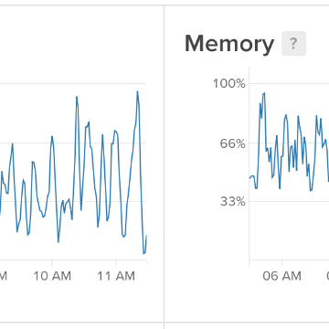

Observations running 2 million headless sessions · browserless

Observations running 2 million headless sessions · browserless

https://docs.browserless.io/blog/2018/06/04/puppeteer-best-practices.html

We're excited to announce that we've recently just crossed over **2 million sessions served**! That's _millions_ of screenshots generated, PDF's printed, and websites tested. We've done just about everything you can think of with a headless browser.