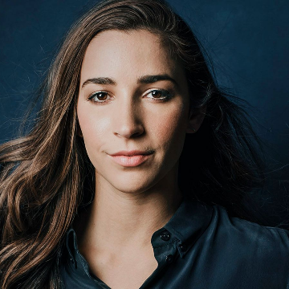

Olympian Aly Raisman -- 'We have to change the way our society views women'

Olympian Aly Raisman -- 'We have to change the way our society views women'

http://www.espn.com/espnw/feature/24078028/olympian-aly-raisman-change-way-our-society-views-women?utm_source=nextdraft&utm_medium=email

In her fight to end sexual abuse, the Olympic champion is challenging the very institutions she led to glory.