On a Georgia Island, a Lot of Good Food and Plenty of Nothing

 Cover Photo
 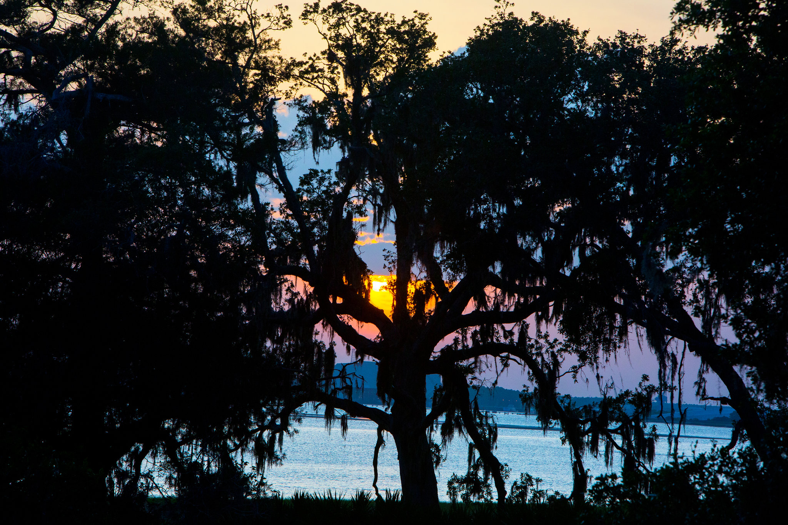

 The sun sets behind an oak tree on Cumberland, Georgia’s largest and wildest barrier island.    Credit Hunter McRae for The New York Times

# On a Georgia Island,

a Lot of Good Food
and Plenty of Nothing

Cumberland Island offers memorable meals, fine
fishing, wild horses, empty beaches and a rich history.

By [KIM SEVERSON](https://www.nytimes.com/by/kim-severson)JUNE 6, 2017

*This week’s U.S. Islands special package celebrates the charming, often dreamy life to be found off American coasts and within its lakes. Below, Kim Severson writes about [Cumberland Island](http://travel.nytimes.com/travel/guides/north-america/united-states/georgia/cumberland-island/overview.html?inline=nyt-geo), Ga., full of charm but not easy to get to. [Padre Island, in Texas](http://www.nytimes.com/2017/06/06/travel/padre-island-texas-national-seashore-culture.html), offers soft sand and seclusion. The [islands of Lake Champlain](http://www.nytimes.com/2017/06/06/travel/lake-champlain-islands-vermont-culture.html), in Vermont, are filled with history and legend. [Wisconsin’s Apostle I](http://www.nytimes.com/2017/06/06/travel/sand-island-wisconsin-apostle-lake-superior-culture.html)[slands, in Lake Superior](http://www.nytimes.com/2017/06/06/travel/sand-island-wisconsin-apostle-lake-superior-culture.html), offer stunning sea caves and plenty of creature comforts.*

Jamie Ferguson hiked up a leg of his wet swim trunks.
“It’s not that bad,” he said.

I had never seen a scar from a shark bite before, so I had no way to gauge if the pale patch the size of a paperback on his thigh was indeed not that bad.

Mr. Ferguson, 59, got the shark bite doing exactly what we were doing now, which was pulling a wide strip of netting attached to a couple of pieces of wood through the murky Atlantic surf in an attempt to catch dinner.

He grew up fishing this wide, empty beach on Cumberland Island, a stretch of land about four miles longer than Manhattan that sits just off the southern curve of [Georgia](http://travel.nytimes.com/travel/guides/north-america/united-states/georgia/overview.html?inline=nyt-geo)’s 100-mile coastline.

 [Continue reading the main story](https://www.nytimes.com/2017/06/06/travel/cumberland-island-georgia-national-seashore.html?emc=edit_ne_20170608&nl=evening-briefing&nlid=72982178&te=1&_r=0#story-continues-1)

## Related Coverage

- [              ### U.S. ISLANDS     ##   The Pastoral Isles of Lake Champlain  JUNE 6, 2017](https://www.nytimes.com/2017/06/06/travel/lake-champlain-islands-vermont-culture.html)

- [              ### U.S. ISLANDS     ##   On Padre in Texas, Soft Sand, Shells and Seclusion  JUNE 6, 2017](https://www.nytimes.com/2017/06/06/travel/padre-island-texas-national-seashore-culture.html)

- [ 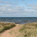             ### U.S. ISLANDS     ##   On Wisconsin Islands, a Warm Welcome and Brisk Waters  JUNE 6, 2017](https://www.nytimes.com/2017/06/06/travel/sand-island-wisconsin-apostle-lake-superior-culture.html)

ADVERTISEMENT

 [Continue reading the main story](https://www.nytimes.com/2017/06/06/travel/cumberland-island-georgia-national-seashore.html?emc=edit_ne_20170608&nl=evening-briefing&nlid=72982178&te=1&_r=0#story-continues-2)

 © 2017 Universal Pictures. All Rights Reserved.

[(L)](http://radiumone.com/oba/)

A lifetime on Georgia’s largest and wildest barrier island has rewarded him with impressive fishing skills. He has amassed an equally remarkable collection of Indian arrowheads and clay pipes. And man, can he tell stories. He has the recall of a history professor and the frank wit honed by someone who grew up in a famous family.

 [Continue reading the main story](https://www.nytimes.com/2017/06/06/travel/cumberland-island-georgia-national-seashore.html?emc=edit_ne_20170608&nl=evening-briefing&nlid=72982178&te=1&_r=0#story-continues-3)

 Photo
 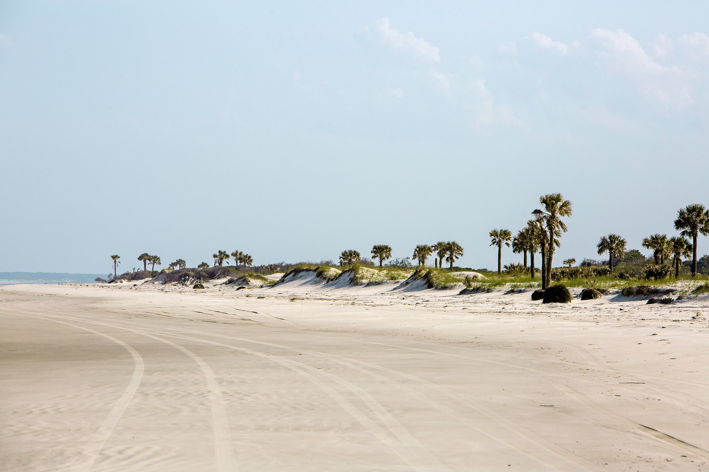
**

 The beach and sand dunes on Cumberland Island.    Credit Hunter McRae for The New York Times

Mr. Ferguson is a descendant of the Carnegies, who once owned almost the entire island. Thomas Carnegie, considered the better-looking and more amiable younger brother of the industrialist Andrew Carnegie, was one of his great-great-grandfathers. The two men made their fortunes from iron and steel. At the turn of the 20th century, they were as rich and powerful as the digital barons are now.

In the way that the Facebook co-founder Mark Zuckerberg and the Oracle billionaire [Larry Ellison](https://www.nytimes.com/2014/09/28/magazine/larry-ellison-island-hawaii.html) have bought up large chunks of Hawaii, the barons of the Gilded Age took control of Georgia’s barrier islands. [Jekyll Island](http://www.goldenisles.com/jekyll-island), just to the north, was the most popular. Today, it has 63 holes of golf and a water park.

Cumberland had a different fate. Andrew Carnegie married late and gave most of his fortune away, building the performance hall in New York that bears his name, along with thousands of public libraries and several universities. Thomas Carnegie was a family man who had nine children. He and his wife, Lucy, invested in Cumberland, building a winter playground so elaborate it took 200 people just to maintain it.

When their era faded, more than one developer tried to get a toehold on Cumberland. County officials entertained plans for a bridge. Neither happened.

In a deal forged by determined heirs, Cumberland was turned into [a national seashore](https://www.nps.gov/cuis/index.htm) and came under control of the National Park Service during the Nixon administration. Only the descendants of certain lines of the Carnegie family and the Candler family, among the founders of the Coca-Cola Company, have been allowed to stay. In all, about 900 acres are privately held.

 Photo
 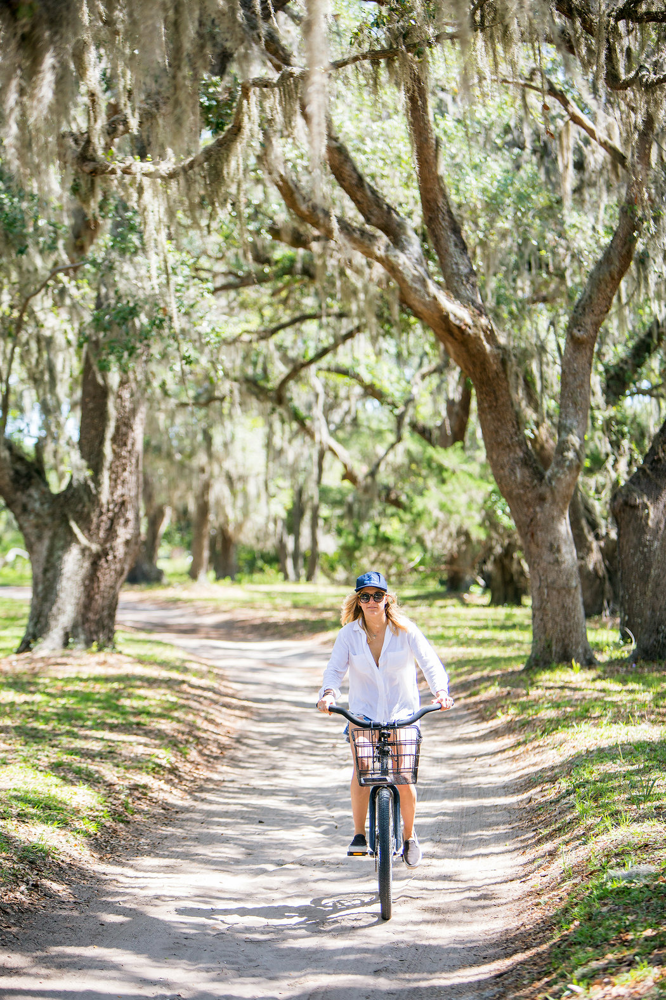
**

 Hadley Ferguson rides her bike through oaks dripping with the Spanish moss.    Credit Hunter McRae for The New York Times

“To us, it’s still just home,” Mr. Ferguson said.

To get there, I flew to the airport at Jacksonville, Fla., and spent about 45 minutes in a cab to the private ferry at Fernandina Beach that serves [the Greyfield Inn](http://greyfieldinn.com/), one of four glorious houses Lucy Carnegie had built on the island for her children.

Only one, Greyfield, has been turned into an inn. Rooms top out at $635 a night with all meals included. Lately, with a revived kitchen garden and a hotshot young chef named Whitney Otawka, the meals have become one of the best parts of a stay.

Without a reservation for one of the inn’s 10 rooms or the six rooms in its cottages, visitors to the island have to take a park service ferry from the small village of St. Mary’s, Ga. Only 300 people a day are allowed to visit, including a small number of adventurous campers who receive permits to pitch a tent on one of five rustic campsites.

Of course, if you are one of the Carnegies, you can land a small plane on the meadow that serves as an airstrip. But buzz it first to make sure no wild horses are lingering on the grass.

The horses are part of the charm of the place, and also part of the problem. Last year’s census counted 174, a Greyfield naturalist told me. In the morning, they come so close to the inn you’re tempted to ask them to breakfast. Although horses running on a wide, empty beach is a spectacular sight, the animals are damaging the island.

 Photo
 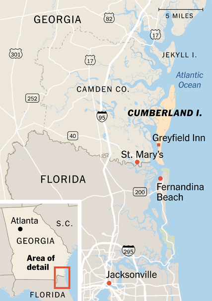
**

They eat the smooth cord grass that pokes up in the marshes and sea oats that protect the dunes. They trample turtle beds.

Whether the horses do more damage than the feral pigs on the island remains up for debate. Some say the horses came with Spanish or British settlers. Others connect them to the enslaved Africans who picked Sea Island cotton here. The Confederate cavalry requisitioned them during the Civil War, and the Carnegies bred them with Tennessee walkers and Arabians to improve the stock.

Still, they are a lovely aspect of Cumberland Island, where there is plenty to do and nothing to do. Hikers seek solitude. Historians look for stories. I came to eat and to learn about a family that helped save the place from golf courses and condominiums.

Before I could eat, I was going to have to fish. Only certain residents and the Park Service are allowed to have vehicles on the island, and I found myself bouncing along in a truck along a soft sand road with the chef and a few Carnegie descendants.

We stopped first to poke around for clams, hunting for tiny holes that promised a clam an inch or two under the sand. Mr. Ferguson and a few other men headed over to chop long, thin oysters from the big muddy clumps that grow wild at the tide line. With two big blue baskets full of shellfish in the back of the truck, we headed south to try our luck with a seine net.

 [Continue reading the main story](https://www.nytimes.com/2017/06/06/travel/cumberland-island-georgia-national-seashore.html?emc=edit_ne_20170608&nl=evening-briefing&nlid=72982178&te=1&_r=0#story-continues-12)

## **Recent Comments

## Steve Cone

3 hours ago
Beautiful pictures. Thanks for a great article.

## E.J. Fleming

17 hours ago
The place was full of biting bugs, and snakes. Of course, I was there in 1865.

## Bill Kearns

1 day ago

When will Donnie Dollars build a golf course there to complete the island rejuvenation? That would be merely logical, given its recent...

- See All Comments
- Write a comment

 Photo
 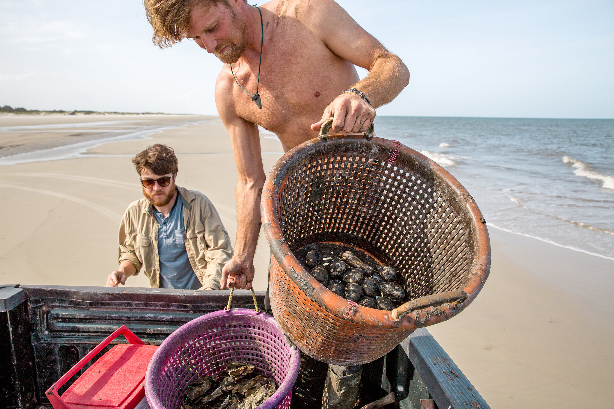
**

 Corey Hunter, left, and Justin Conway gather clams and oysters and clean off the mud with ocean water. Only certain residents and the park service are allowed to have vehicles on the island.    Credit Hunter McRae for The New York Times

Fishing this way requires walking into the cold surf until the water hits you about midchest.

One person holds a pole attached to a long piece of net fixed with floats at the top and lead weights at the bottom. Someone else stands maybe 150 feet away, holding another pole to which the other end of the net is secured. You jerk up the net at the same time and walk toward the shore, capturing whatever happens to be swimming in front of you.

We pulled in some drum and red fish, tossing back the ones too big to legally keep. A little lemon shark went back into the water, too, along with some horseshoe crabs. Then we headed to the Greyfield, where Ms. Otawka, 36, a former “Top Chef” contestant, was to help her crew get dinner ready.

I first tasted her food when she was putting out regional Mexican dishes at a restaurant in Athens, Ga., owned by the chef Hugh Acheson. When Mr. Acheson pulled the plug on that place, she bounced around a little, sometimes cooking at pop-ups in Atlanta and other food events.

She picked up her first cooking job at a French restaurant in Oakland, Calif., while she was a student at the University of California, Berkeley. She also worked at a tattoo shop there, which helps explain all her ink.

Ms. Otawka landed at the Greyfield nearly two years ago, welcomed by Mitty and Mary Ferguson, Jamie’s brother and sister-in-law. The couple manage the inn. They wanted to breathe new life into the food, and Ms. Otawka wanted an adventure.

 Photo
 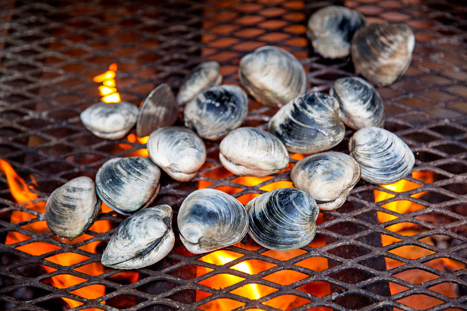
**

 Clams from the day’s harvest roast on the open fire at the Greyfield Inn.    Credit Hunter McRae for The New York Times

“Chefs live such unbalanced lives,” she said. “This is all about balance. You get to live in a beautiful place and cook good food. It was a chance and I took it.”

Life here can be isolating. Cellphone service is unreliable, the inn isn’t wired for Wi-Fi and a ferry is the only way to and from the island. For company, Ms. Otawka has her husband and her elderly pit bull.

Ben Wheatley, 30, is also a chef at the inn. He and Ms. Otawka fell in love cooking at one of Mr. Acheson’s restaurants and married in Mexico late last year. They have dedicated themselves, at least for the moment, to cooking on an island that is right out of a Wes Anderson movie. (He scouted the island as a location for his film “Moonrise Kingdom.”)

Greyfield was built in 1900 as a gift to one of Lucy and Thomas Carnegie’s daughters. It has been an inn only since the 1960s, when Jamie’s grandmother realized that their slice of the Carnegie fortune was dwindling while taxes and the cost of Greyfield’s upkeep grew.

The grandmother, Lucy Ferguson, had long been a fierce champion of the island. She was a collector of animal bones and Indian artifacts, a protector of the wild horses and a cattle rancher who never made much money from the 500 head she tended.

 Photo
 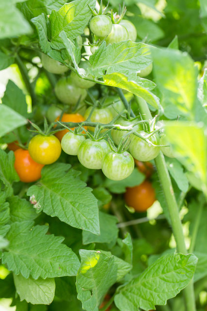
**

 Cherry tomatoes at the inn’s garden.    Credit Hunter McRae for The New York Times

She taught her children and grandchildren how to use grits and Pond’s cold cream to preserve a snakeskin, among other skills. Along with some of the other women from prominent families connected to the island, she helped strike the deal that allowed the family to stay on even after the park service took it over.

Her portrait hangs in the mansion’s drawing room, a scarf around her head and a dagger at her side. I slept in her childhood bedroom, a windowpane still bearing her name and the little picture she etched there in 1915.

For years, the inn was the kind of place where people had to dress formally for a dinner that was often prime rib, with crème de menthe over ice cream for dessert. Since Ms. Otawka came, things have changed.

Boxed lunches are still free to any guests who want to pack one along as they explore the island, but instead of fried chicken, the offering might be poached chicken over snap pea salad dressed up with anchovies and Calabrian peppers. Jacques Pepin, who spends winter vacations nearby, visited the island recently, and Ms. Otawka cooked lunch for him. “He said I cooked like his grandmother and mother,” she said.

Before dinner, guests order a cocktail and mark their purchases on a pad. On the patio, oysters are roasted over a wood fire and tossed into a metal bucket at the end of a table set with oyster knives and saltines. Guests can shuck all they want, dipping warm nuggets of meat into melted butter.

 Photo
 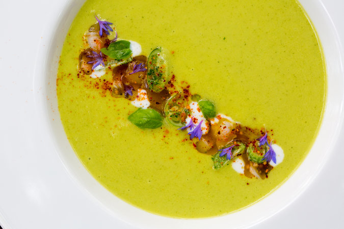
**

 A soup at the Greyfield Inn.    Credit Hunter McRae for The New York Times

At 7:30 on the dot, Christopher Becerra, whom Ms. Otawka talked into moving to the island to expand the wine program and sharpen the front of the house, struck four notes on a set of chimes.

We all headed to the dining room, arranging ourselves around the dining table where the Carnegie family had shared their meals. The guest mix was eclectic. We sat with an archivist for Coca-Cola, some newlyweds who had saved up for a honeymoon night and a retired surgeon in his 80s who was having an improbable romance with a younger novelist. “She’s left of Marx and I’m right of Mussolini,” the surgeon said, reaching for her hand.

At another table, a family of four were dressed like Connecticut, the two small boys a Ralph Lauren ad in blue blazers and khakis. Earlier in the evening, one of the future captains of industry had offered to shuck oysters for me at a nickel a shell.

By the end of the weekend, we were all camp buddies.

“We have a brilliant spring dinner planned for you,” Mr. Becerra said, launching into the wines he had selected from the inn’s 90-bottle collection. A pinot blanc, he said, had “this sea breeze quality I just love with the ham.”

The pairings that night cost $37, one of the few additional costs beyond the price of the room.

We ate sweet English snap peas and burrata dressed up with pea shoots and Benton’s bacon, and fat Georgia shrimp grilled over oak and piled atop cranberry beans moistened with smoky tomato broth spiked with chilies.

 [Continue reading the main story](https://www.nytimes.com/2017/06/06/travel/cumberland-island-georgia-national-seashore.html?emc=edit_ne_20170608&nl=evening-briefing&nlid=72982178&te=1&_r=0#story-continues-24)

 

Click for legals

**£20 standard set –up fee for new Sky TV customers. Sky TV from £22 – 80 pm. Subject to status. Sky Atlantic also available on NOW TV.** 18 month minimum subscription. Content depends on Sky Q subscription. All Sky Q kit is loaned to you by Sky at no cost and must be returned at the end of your subscription. Further terms apply. Prices may go up during your contract. Billions © 2016 CBS Studios Inc. Lucky Man Series 2 © 2017 Carnival Films. Game of Thrones® Series 1 – 6 © 2016 Home Box Office, Inc. All rights reserved. HBO® and all related programs are the property of Home Box Office, Inc. Scandal Series 6 © ABC Studios. All rights reserved.

 Produced  by  Sky Works  for Sky

 Photo
 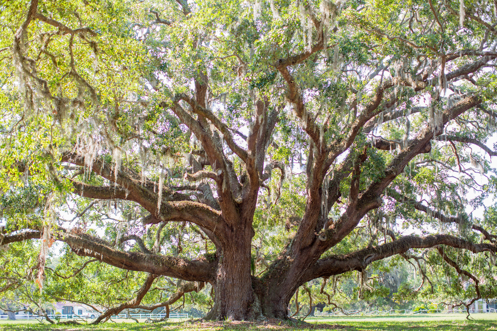
**

 The island has many large oak trees with Spanish moss.    Credit Hunter McRae for The New York Times

Just as a chocolate tart with a swirl of toasted meringue arrived, Mr. Becerra rang his chimes again to announce the first of three nature and history tours scheduled for the next day, a birding outing. It was to begin at 7 a.m., which would get everyone back to the inn in time for breakfast.

“It’s the start of hummingbird season!” he announced cheerfully.

I slept past the hummingbirds and got to breakfast at 8:30. Citrus salad was waiting, followed by a frittata with asparagus and spinach that oozed Cheddar. I ate it as well as two slices of apple-wood smoked bacon.

The inn sets out fishing poles and bikes with fat tires to navigate the sandy paths to the beach or the ruins of the 50-room mansion Lucy and Thomas Carnegie built. It was largely abandoned by the 1930s, a victim of dwindling family interest, increased taxes and the Depression. Arsonists burned it to the ground in 1959 in what is believed to have been a dispute between poachers and a caretaker that involved a shooting.

North of the mansion’s ruins are two dozen chimneys, the remains of cabins that housed enslaved Africans decades before the Carnegies discovered the island.

I wandered over to meet Janet Ferguson, Jamie and Middy’s sister and the last of the three Carnegie siblings who all live in houses they built a short walk from the Greyfield.

 [Continue reading the main story](https://www.nytimes.com/2017/06/06/travel/cumberland-island-georgia-national-seashore.html?emc=edit_ne_20170608&nl=evening-briefing&nlid=72982178&te=1&_r=0#story-continues-29)

 Photo
 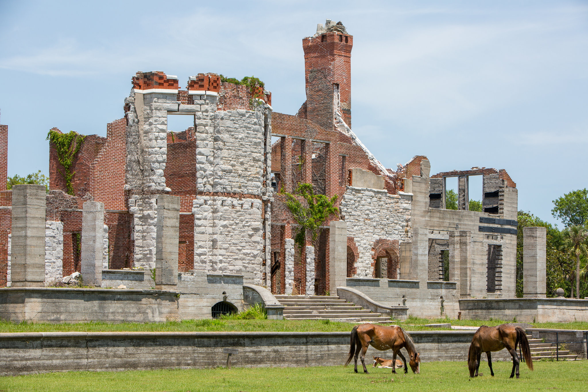
**

 Wild horses graze in the lawn of Dungeness, a mansion built by Lucy and Thomas Carnegie that was largely abandoned by the 1930s.    Credit Hunter McRae for The New York Times

[Gog](http://www.atlantamagazine.com/news-culture-articles/a-conversation-with-georgia-artist-gogo-fergu/)[o](http://www.atlantamagazine.com/news-culture-articles/a-conversation-with-georgia-artist-gogo-fergu/), which is what everyone calls her, is an artist who turns the teeth, bones and plants she finds combing the island into gold and silver [jewelry](http://www.gogojewelry.com/). Where someone else might see a raccoon penis, she sees earrings. Snake ribs become a ring, kelp a wall sculpture. She has a photograph of Hillary Clinton wearing a necklace she molded from armadillo scales.

At first it’s hard to believe that she is as connected as she says she is, and that her jewelry is as in demand. Mikhail Baryshnikov really liked to eat raw clams and drink beer here? Then you see the snapshot of him, barefoot and grinning on the beach, and read the introduction he wrote to the book published when an exhibition of her work was at the [High Museum](http://www.high.org/)[of Art](http://www.high.org/) in Atlanta.

“I was walking on the beach with my dog, Penny,” Ms. Otawka said. “Gogo’s truck goes rolling by and she stops and she’s like, ‘This is my friend Bill.’ And Bill Murray is in the front seat.”

Gogo offered to drive me to the small wooden First African Baptist Church, which was established in 1893 as part of a settlement designed so that the African-Americans who worked on the island could begin to own land.

Her friend John F. Kennedy Jr. was so enchanted with it and with Cumberland that he asked Gogo to help him and Carolyn Bessette [hold their wedding here](http://www.nytimes.com/1996/09/26/us/the-island-that-kept-a-wedding-a-secret.html). She managed to do it in secrecy, shuttling 50 guests on and off the island without a word leaking to the press. She even designed their rings.

The Kennedy clan, she said, was just lovely. “Teddy got up and said I cannot believe this place and I know how proud your parents would be that you picked this place to get married,” she said.

John called her a few days later from Istanbul, where the newlyweds were honeymooning. The paparazzi were relentless.

“Why the hell did I ever leave Cumberland?” she said he told her.

I headed back to Gogo’s place with Ms. Otawka after dinner. The tequila came out, and so did more stories.

They talked about a private spaceport Camden County officials want to build just west of Cumberland Island, complained about a zealous new park ranger and worried about a plan to rezone a small slice of the island for private development.

But pressure to change the island is nothing new, and neither is their response to it.

“What we have is more valuable than money,” Jamie Ferguson said.

“The money is gone anyway,” Gogo added. “This has been handed down to us momentarily to take care of and pass on. What’s wrong with leaving it the way it is?”

Kim Severson is a food correspondent for The New York Times based in Atlanta.

A version of this article appears in print on June 11, 2017, on Page TR1 of the New York edition with the headline: Almost Out of Reach.   [Order Reprints](http://www.nytreprints.com/)|  [Today's Paper](http://www.nytimes.com/pages/todayspaper/index.html)|[Subscribe](http://www.nytimes.com/subscriptions/Multiproduct/lp839RF.html?campaignId=48JQY)

 [Continue reading the main story](https://www.nytimes.com/2017/06/06/travel/cumberland-island-georgia-national-seashore.html?emc=edit_ne_20170608&nl=evening-briefing&nlid=72982178&te=1&_r=0#whats-next)