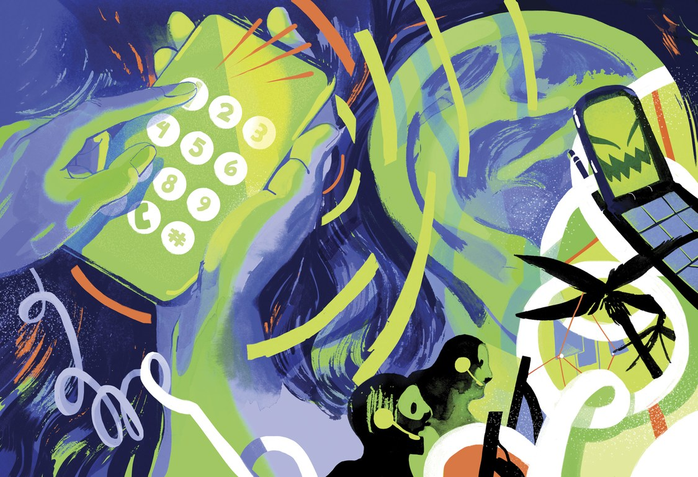

On the Trail of the Robocall King

An investigator set out to discover the source of one scammy robocall. Turns out, his target made them by the millions.

**Molly Mendoza

- Author: Alex W. Palmer[Alex W. Palmer](https://www.wired.com/author/alex-w-palmer)
- [security](https://www.wired.com/category/security/)
- 03.25.19
- 06:00 am

# On the Trail of the Robocall King

#### Share

- [**](https://www.facebook.com/sharer/sharer.php?t=On%20the%20Trail%20of%20the%20Robocall%20King&u=https%3A%2F%2Fwww.wired.com%2Fstory%2Fon-the-trail-of-the-robocall-king%2F?mbid=social_fb_onsiteshare)
- [**](https://twitter.com/intent/tweet?text=On%20the%20Trail%20of%20the%20Robocall%20King&url=https%3A%2F%2Fwww.wired.com%2Fstory%2Fon-the-trail-of-the-robocall-king%2F?mbid=social_twitter_onsiteshare&via=WIRED)
- [**](https://www.wired.com/story/on-the-trail-of-the-robocall-king/#comments)
- [**](https://www.wired.com/story/on-the-trail-of-the-robocall-king/mailto:?subject=WIRED%3A%20On%20the%20Trail%20of%20the%20Robocall%20King&body=Check%20out%20this%20great%20article%20I%20read%20on%20WIRED%3A%20%22On%20the%20Trail%20of%20the%20Robocall%20King%22%0D%0A%0D%0Ahttps%3A%2F%2Fwww.wired.com%2Fstory%2Fon-the-trail-of-the-robocall-king%2F?mbid=email_onsiteshare%22%0D%0A%0D%0AFor%20unlimited%20access%20to%20stories%20like%20this%20on%20WIRED.com,%20subscribe%20with%20the%20following%20link:%0D%0Ahttps%3A%2F%2Fsubscribe.wired.com%2Fsubscribe%2Fsplits%2Fwired%2FWIR_Edit_Hardcoded%3Fsource%3DEDT_WIR_ARTICLE_SHARE_LINK_0_SUB_AD_ZZ)

## PART ONE

Brad Young, a lawyer at TripAdvisor, arrived at the company’s offices in Needham, Massachusetts, on October 12, 2015, to find an email from his boss, Seth Kalvert, the company’s general counsel. In itself that wasn’t strange. As a travel site built on crowdsourced wisdom, where hundreds of millions of ordinary people post reviews and rate businesses, TripAdvisor is susceptible to fakery meant to inflate the ranking of a so-so restaurant or stain the reputation of a storied hotel. Young oversaw a group responsible for fending off these efforts, so he frequently got questions from Kalvert about con artists, cunning new deceits, and other shady corners of the law.

But this email was different. Kalvert’s wife had received a robocall offering an exclusive vacation deal as a reward for her loyal accumulation of “Trip­Advisor credits.” That would have been nice if TripAdvisor credits were a thing, but they weren’t. The call was also odd because TripAdvisor didn’t engage in telemarketing, much less robocalling. Kalvert wanted Young to look into it.

#### Related Stories

- [     Lily Hay Newman  The Robocall Nightmare Is Only Getting Worse—But Help Is Here](https://www.wired.com/story/robocall-getting-worse-but-help-is-here/)
- [     Lily Hay Newman  Nigerian Email Scammers Are More Effective Than Ever](https://www.wired.com/story/nigerian-email-scammers-more-effective-than-ever/)
- [     Elizabeth Weil  The Curse of the Bahia Emerald, a Giant Green Rock That Ruins Lives](https://www.wired.com/2017/03/curse-bahia-emerald-giant-green-rock-wreaks-havoc-ruins-lives/)

The anti-fraud team was, in Young’s words, “the company’s secret sauce,” adept at tackling every deception the internet had to offer. But the hustle meant to entice Kalvert’s wife relied on old-school telephony. Cracking it would require an unusual set of skills. Luckily, Young knew just the person to turn to.

Fred Garvin had joined TripAdvisor’s anti-fraud team eight years earlier. He’d been employed in a series of short-term jobs: mechanic, audio editor, anything that seemed interesting enough to hold his attention for a while. He was out of work when a friend saw an opening for a content moderator at TripAdvisor and urged Garvin to apply. He worked at home for a while, under the radar, but pretty soon managers started noticing his obsessive streak and a knack for what he called “research.” As a kid growing up in a small New England town in the pre-internet era, he’d tracked down the addresses of celebrities so that he could request an autograph; he got a postcard signed by the B-52s and one from Mr. Bill, a famous *Saturday Night Live* character from the 1970s. (The name “Fred Garvin” is another *SNL* reference, one of several professional aliases he adopted to protect his identity from the scammers and [fraudsters](https://www.wired.com/tag/fraud/) he chases. It comes from an old sketch with Dan Aykroyd as [Fred Garvin, male prostitute](https://www.nbc.com/saturday-night-live/video/fred-garvin-male-prostitute/n8669).) Garvin’s manager recommended him for a position with the anti-fraud team. “He’s the most cynical person I’ve ever met,” she said. “He will question everything.” He was a perfect fit.

0:00 / 33:45

- Audio: Listen to this article.
- To hear more, [download Audm for iPhone or Android](https://www.audm.com/?utm_source=wired&utm_medium=playerembed&utm_campaign=robocall-king&utm_content=default).

Young asked Garvin to look into the suspicious phone call. He said he figured it was probably the work of “some two-bit hustler” and wouldn’t take long to sort out. Garvin, though, had only one phone call to go on, and a simple question: Who was on the other end of the line?

**Molly Mendoza

## PART TWO

Before Young tasked him with running down the robocaller, Garvin had not taken much interest in the practice. Robocalls have been around since at least the 1980s, when someone first thought to attach a tape deck to a phone. In the analog age, the hardware was clunky, expensive, and difficult to operate. The tapes had to be rewound, and they eventually wore out. Still, the technology improved, and telemarketers kept promoting their wares. By the early 1990s, Americans were so sick of telemarketers and prerecorded messages that when US senator Fritz Hollings lamented on the Senate floor that the calls were “the scourge of modern civilization,” few challenged the assertion, despite the competing scourges of war, say, or the spread of [AIDS](https://www.wired.com/tag/aids/).

Hollings was the sponsor of the Telephone Consumer Protection Act, and he seemed to draw upon personal experience during the legislative debate on the bill: Automated calls “wake us up in the morning, they interrupt our dinner at night, they force the sick and elderly out of bed, they hound us until we want to rip the telephone right out of the wall.” The law was signed by George H. W. Bush in 1991 and limited how and when telemarketers could place calls, focusing mostly on landlines, the dominant technology of the time. Cell phones, still relatively new, were treated like emergency lines and bestowed with special protection.

Then over the next two decades came the internet, cheap data, voice-over-internet protocol, and the deregulation of the telecommunications industry—all a boon to consumers and robocallers alike. Even big, well-known companies got in on it, launching robocall campaigns as a form of mass marketing on the cheap.

Not surprisingly, people complained about being inundated with calls, and in 2009 the [Federal Trade Commission](https://www.wired.com/tag/ftc/) enacted the “robocall rule,” which banned most pre­recorded telemarketing calls. There were exceptions, though, for things like political campaigns, charities, and debt collection, meaning your bank can still pester you about unpaid bills and candidates can beg for your vote.

But the law was quickly outpaced and overshadowed by the rapid evolution in technology. Today, a single person in a modestly equipped office can make millions of calls a day by renting some server space, installing off-the-shelf autodialing software, and paying a VoIP provider to transmit calls. Some of the software is open source, and VoIP carriers often advertise a month of free service as a way to entice potential customers. Software companies offer everything you need in one package—a robocall starter kit, available for anyone to buy.

Best of all, it’s cheap: VoIP services cost three-fifths of a penny per minute, and that’s only if the call is answered. Unscrupulous carriers openly advertise their services to those looking to make “dialer/short duration termination calls”—the jargony euphemism for robocalls—and databases of consumer phone numbers are easy to buy. “The technology has gotten so inexpensive that any person can become a robocaller overnight,” says Ian Barlow, who coordinates the FTC’s Do Not Call program. “It’s easy, it’s accessible, and there are no barriers to entry.” Once the software has been programmed to control who to call and when, the robocaller doesn’t even need to press a button to start making calls each morning. The same technology also makes scammers hard to identify and track down.

Little wonder, then, that the United States is [awash in robocalls](https://www.wired.com/story/robocall-getting-worse-but-help-is-here/). According to YouMail, a maker of robocall-blocking software, Americans received a record-breaking 47.8 billion robocalls in 2018. That works out to nearly 200 per year for every adult. Unwanted calls are the most common consumer complaint lodged with the [Federal Communications Commission](https://www.wired.com/tag/fcc/), and the trend shows no signs of slowing, despite the pile-on of laws and regulations—the Telemarketing Sales Rule, the Truth in Caller ID Act, and the Telephone Consumer Protection Act, among others—outlawing the vast majority of auto­dialed calls or prerecorded messages, at least those used for marketing purposes. With more than 100 million calls placed every day, robocalling might well be the most ubiquitous, most hated, and least punished crime in the country.

Garvin set up shop in a quiet corner on the third floor of TripAdvisor’s headquarters, flanked by whiteboards and a bay of screens, preparing to track down the mystery robocaller. Garvin is in his early forties, with dark, spiky hair, a soft face, and darting eyes. In conversation, he is calm and self-possessed, even formal, but he buzzes with a tightly wound energy.

Garvin scoured the web, looking through blogs, forums, and social media for any mention of a similar call. He didn’t have to look very far. Dozens of people were grumbling—or worse—on TripAdvisor’s own forums. “IF I EVER GET A CALL LIKE THAT AGAIN, I WILL CONTACT THE FCC AND I WILL OPEN THE GATES OF HELL ON TRIP ADVISORS,” one person wrote. “NEVER NEVER NEVER NEVER CALL ME LIKE THAT AGAIN. EVER. GOT IT.”

One of his early gambits was simply calling a number that had placed a robocall. When he tried that, though, he found a human on the other end of the line, perplexed as to how their phone number had been used for prerecorded marketing. Eventually he figured out that the robocaller was engaging in a practice called neighbor spoofing—making the calls look as if they were coming from someone living near the intended recipient. For Garvin, it was a dead end.

Hoping he might get lucky and receive one of the robocalls himself, Garvin began answering every suspicious call and spoofed number that lit up his cell phone. He heard dubious alerts about student loan forgiveness, unclaimed lottery windfalls, and tax debt. “I was the only person you will ever meet who was excited to receive a robocall,” he says. He was getting several a day and answering as many as he could, all the while hoping for one that would lead back to the TripAdvisor scam.

The irate stories on TripAdvisor forums seemed like promising leads, except that the details didn’t line up. People who got the same prerecorded pitch on the same day were transferred to live operators who offered different vacation packages at different prices. Garvin and Young felt as if they were “chasing ghosts,” Young said.

#### SIGN UP TODAY

##### Sign up for the [Daily newsletter](https://www.wired.com/newsletter/?name=daily&sourceCode=CarveLeft) and never miss the best of WIRED.

Those posts did offer a few clues: The calls came over VoIP and seemed to be a classic bait and switch. If you were on the line, you’d hear a recorded female voice saying that you’d received TripAdvisor credits that could be redeemed for a vacation. The “credits” might be for $999 or $2,000—the amounts differed—but you’d be instructed to press 1 to take advantage of the *incredible offer* and then be transferred to a live operator. Neither the credits nor the name Trip­Advisor would be mentioned again. Instead, the operator would pitch an unrelated offer: a cruise, a resort, an all-inclusive stay at a beachfront hotel.

Drawing from angry postings and tips on the TripAdvisor forums, Garvin put together a list of all the companies pitching their wares through the fraudulent robocall. He checked the domain registrations and IP addresses of their websites and realized that they all had identical content, shared web hosting servers, and listed the same contact information. They all showed the same white sand beaches and featured images of the same beautiful, sun-dappled tourists. And they all traced back to the Yucatán. Cutting and pasting in Google Translate, Garvin trawled through Mexican business registration documents, time-share websites, and social media postings, mapping out an ecosystem of companies—some legitimate, some less so—that he had never known existed. Now, he thought, he was getting somewhere.

His internet wanderings led to a booming call-center industry in Cancún and surrounding areas connecting American customers with local time-share and resort companies. If these centers were involved in the robocall trade, Garvin wanted to learn as much about them as he could.

Facebook proved a useful investigative tool. One employee posted a photograph of himself posing in the call center. On the wall behind him was a piece of paper listing some sort of information. Garvin zoomed in and could just make out the business name and website address that the center’s operators were to use that day—a lead for observing the scammers in real time. Over the following months, Garvin watched on Facebook as the man in the photo transitioned from employee to manager to entrepreneur, posting ads soliciting staff for his own newly opened call center. Garvin was down the rabbit hole now, snooping from afar on individual employees as they went about their business. He wasn’t sure if these call centers were the ones responsible for the TripAdvisor scam, but the only way to find out was to keep tracking them.

Garvin picked up another clue: TripAdvisor was not the only brand being flogged. The calls also touted exclusive deals for loyal customers of Marriott, Hilton, and Expedia—a “who’s-who of travel companies,” Young says, none of which were actually offering the deals. In his conversations with jilted customers, Garvin found that the trips on offer were probably real but difficult to redeem. When someone tried to book a trip they had purchased, suddenly there were no dates available, or the contact information the business had provided was invalid. The customers who made it through that gauntlet were welcomed to their vacation destinations with long sales pitches for expensive local time-shares. The brand names had drawn people in. “They couldn’t just say, ‘Hey, you interested in a very questionable Mexican time-share situation?’ ” Garvin says.

Garvin managed to recruit some of the irate customers into his army of amateur sleuths. One woman, a nurse from Massachusetts named Kim, was getting 10 or more calls a day for months on end. “I was, oh, I was beyond, beyond irritated,” she says. Finally, fed up, she found the phone number for TripAdvisor’s president and CEO and called to complain. He called right back. “This is not us,” he explained. “This is somebody pretending to be us.” Then he put her in touch with Garvin, so he could debrief her and add the phone numbers she’d collected to his own burgeoning database.

The investigation was moving along. Young and Garvin, along with Amy Rubin, an attorney who was the third constant member of the investigation team, were starting to see where the calls ended up and how people were getting scammed. But they still didn’t know who was making the robocalls—or how to stop them. After more than three months of digging, they decided to ask for help.

**Molly Mendoza

## PART THREE

In April of 2016, Young flew to Washington, DC, to meet with Kristi Thompson, deputy chief of the Enforcement Bureau at the FCC’s Telecommunications Consumers Division. Young had pulled together the information that he and Garvin had been gathering, hoping to persuade the FCC to get involved in the hunt. He was surprised when, almost as soon as he began speaking, he says, “there was visible excitement throughout the room.”

The FCC was chasing the same scammers. A few months earlier a medical paging company called Spok had come to the agency for help; a sudden influx of robocalls was flooding the company’s network. Pagers may seem like an anachronism, but they are still used by more than 80 percent of hospitals. Whoever was behind the TripAdvisor robocall campaign had inadvertently debilitated Spok’s networks by flooding pagers with digital messages they weren’t equipped to handle. Emergency room doctors, nurses, and first responders were getting delayed alerts. This was not just an annoyance; it was a matter of life and death.

Thompson’s team already had an idea where the calls were coming from. TripAdvisor “gave us the content of the messages, and the ‘why,’ ” an FCC official who worked on the case says. “We knew the ‘what,’ but we couldn’t see inside the messages like they could.”

Young returned to TripAdvisor headquarters feeling buoyed. Garvin soon came to him with another reason to celebrate. On July 29 he had driven to his sister-in-law’s house and was chatting in the front yard about dinner plans when his phone rang. Garvin saw a spoofed number and had an intuition. His sister-in-law was midsentence when Garvin blurted, “I have to go.” He sprinted to his car, grabbed a notebook, and picked up the call.

“This is TripAdvisor,” a chipper automated female voice said, and today was Garvin’s lucky day: He’d been awarded thousands of TripAdvisor credits for an exclusive vacation to the sunny Caribbean!

It *was* Garvin’s lucky day. He’d been collecting information for more than nine months, but everything he knew was secondhand. He had never heard the messages himself or been able to tie the Mexican resorts directly to the call centers and the fraudulent use of TripAdvisor’s name. Earlier in the summer, the complaints seemed to have stopped, and Garvin worried that the scammers had gone dark before he could pin them down. Now they were calling his cell phone.

Following the prompts, Garvin was transferred to a live agent, who asked his age range and if he made at least $60,000 a year. He passed the test and was quickly put on the line with a second live agent—the charmer. “You’ve won an all-inclusive trip to one of our fabulous resorts,” the agent said. “What do you like to do on vacation, Mr. Garvin?”

Garvin played along. “I like to hang out by the pool and have a few cocktails,” he said. Garvin did his best to maintain his composure as he sat in his car scribbling and trying to eke out company names and information from the agent. His sister-in-law had long since given up and gone inside.

When the agent sensed that the hook was in, he went in for the close: “This trip is valued at $4,000, but today it’s only $999. We accept Visa, Mastercard, or American Express. Which card would you like to use today?”

Garvin deflected. “If I make this purchase without asking my wife, I’m in the doghouse,” he told the agent. “It’s better to ask for forgiveness than permission,” the operator replied. Still, he gave Garvin a callback number and other information. When Garvin hung up, he drove home as fast as he could. Armed with new websites and names, he spent all night at his laptop. By the next morning, after sleuthing through social media and Mexican phone databases, he knew the real name of the call center agent and found the Facebook page of the call center’s CEO—people he could tie directly to the TripAdvisor scam. Now they had the evidence they needed to bring a full dossier to the FCC.

As Garvin gathered information about call centers in Mexico, Young began sending them cease and desist letters, explaining that TripAdvisor had learned of their ploy and threatening to turn them in to Mexican authorities. Most just ignored him or pleaded ignorance. Finally, one company—seeking to demonstrate its good intentions (or avoid a lawsuit)—offered up a key piece of information. Garvin and Young had assumed that the Mexican call centers were making the robocalls themselves. But they weren’t. They paid someone in the US to do that. Best of all, the newly solicitous Mexican company knew the first name and phone number of their American robocaller.

Young contacted Thompson at the FCC again. “Let’s have another meeting,” he said. With the first name, phone number, and some googling they had found their man: Adrian Abramovich.

## PART FOUR

On April 18, 2018, Adrian Abramovich appeared before the US Senate Committee on Commerce, Science and Transportation. Ten months earlier, with help from Garvin and Young, the FCC had accused him of a “massive caller ID spoofing operation” and slapped him with a proposed $120 million fine, then the largest in the history of the FCC. The agency identified Abramovich as the source of 96,758,223 illegal robocalls. The laws governing robocalls are complex and sometimes contradictory, enforced by multiple agencies, and with layers of exceptions and loopholes. But the gist is simple enough: no calling cell phones, no using automated or prerecorded messages, and no using fake names or numbers. According to the FCC, Abramovich had broken all of these rules.

Abramovich arrived at the Russell Senate Office Building looking bewildered, as you might expect of someone compelled by congressional subpoena. In the past few years, there hadn’t been much that Democrats and Republicans in Congress could agree on. Health care, immigration, taxes, deficits—every debate, every topic and idea was us vs. them. Here, finally, was an issue that perfectly bridged the partisan divide: a burning hatred of robo­calls. As soon as the hearing began, the senators pounced, clearly relishing the chance to lay into the stout man at the witness table. Abramovich, wearing a suit and glasses and with his hair pulled back into a neat man bun, looked trapped. Senator Richard Blumenthal kicked things off. Abramovich, Blumenthal said, had assembled a “phenomenal record of consumer abuse.” Looking directly at him, he declared: “You have become the face of this problem.”

Though Abramovich refused to talk about his own actions, he insisted that all of the vacation packages were on the up-and-up and that no consumers were misled. Sure, the calls were actually just the entrée to find customers for expensive time-shares, but it was all there in the fine print of the deals. (The FCC was only interested in the robocalling violations, not whether the trips themselves were scams.) Besides, he was just the middleman, connecting American consumers to Mexican companies. As the questioning continued, Abramovich took great care to distinguish the “good guy” robocallers like himself, who were offering “legitimate services or products,” from the true scam artists. “I receive four or five robocalls a day,” he added, as if to give his Everyman bona fides. “I never answer the phone.” These replies elicited little sympathy from the senators. “The efficiency and the magnitude of your robocall campaign is truly historic,” said Senator Ed Markey, who pointed out that he had written the Telephone Consumer Protection Act, one of the laws that Abramovich was accused of violating. “Do you understand why it irritates people? Do you understand why they don’t want these unwanted calls, Mr. Abramovich?”

It went on like that: 45 minutes of US senators scolding the seemingly baffled kingpin of robocalling.

**Molly Mendoza

## PART FIVE

I found Abramovich the same way he probably found the people he autodialed: through a public database listing his name, phone number, and home address. He lives in a posh Miami neighborhood in a gated oceanside community with the requisite pool, tennis courts, and security guards. The large stone-and-brick villas are organized around handsome courtyards with palm trees planted in the middle.

I knocked on the door, unannounced. Abramovich answered in a tight Lacoste T-shirt and skinny distressed jeans, and I thrust my hand out before he could shut the door. We stood in the doorway talking for half an hour until Abramovich’s wife joined us and invited me in.

Abramovich has a thing for bad guys. His man cave, which doubles as a home office, is decorated with figurines, paintings, and memorabilia depicting infamous movie villains like Scarface, the mobsters from *Goodfellas*, and Freddy Krueger. A record collection lines one wall, and an 80-inch TV is positioned in front of a set of plush black chairs and a black couch. Beside the record collection is his desk. Here it was: the compact headquarters of an alleged robocall empire from which Abramovich was said to place millions of calls a day. Off-the-shelf software can run automatically, moving through lists of phone numbers and other personal data available for purchase. The only limit to a robocall business is the amount of bandwidth you’re willing to pay for; the potential number of calls Abramovich could have made was unlimited.

As we toured the house, Abramovich’s wife pointed to their collection of South American art, while her husband described his current predicament with a sullen, dejected air, all sighs and slow head shakes. Despite the surroundings, he protested that his work had not made him rich—there was no way he could pay the $120 million fine or even a fraction of it. “I’m on monthly payment plans for everything,” he told me. “They’re not going to find a boat or five condos anywhere.” His wife, while keeping the family’s three small dogs at bay, noted, unprompted, that the Ferrari in the garage had been purchased in 2010 and was paid off in installments over five years.

Abramovich talked about a lot of things: Senator John Thune’s height (shorter than you’d think from TV), infamous [pharma bro Martin Shkreli](https://www.wired.com/story/martin-shkreli-guilty-securities-fraud/). (“He was laughing in front of the Senate. I was scared. I was really scared.”) But he mostly wanted to vent. After the FCC’s citation, his home had been inundated with hate mail and angry phone calls; his bank had closed his account without explanation and refused to let him open a new one. Family members had stopped talking to him.

#### LEARN MORE

##### The WIRED Guide to [Personal Data](https://www.wired.com/story/wired-guide-personal-data-collection/?GuideCarveLeft)

The humiliating spotlight of national condemnation came as a shock to him. He had immigrated to the US from Argentina—he still speaks with a thick accent—and over the past two decades, he has formed and led at least 12 corporations in Florida, according to the FCC, most of them dedicated to telemarketing and travel deals.

For all those years, calling maybe billions of people, he had been hidden from consumer anger and opprobrium. His prolific telemarketing got him into trouble in 2007 when AT&T Mobility got a consent judgment and injunction against him for unlawful telemarketing, but it wasn’t big news. The FCC ordeal was something entirely new and unpleasant.

The worst part, he said, was being served the Senate subpoena. It was Good Friday, and he was at his lawyer’s office talking about the case. His youngest daughter, barely a teenager, answered the door before his wife intervened. When a US marshal tried to hand Abramovich’s wife the subpoena, she let the papers drop to the ground. “You haven’t served me anything,” she said. The following Tuesday, three cars came screeching into their home’s shared courtyard, sirens blazing, and five marshals came to the door with the subpoena, Abramovich said. The neighbors came out to gawk. (The US Marshals Service said the subpoena was served “in a lawful manner.”)

People didn’t know his side of the story, Abramovich protested, but they had already decided that he was the bad guy. Abramovich told me that his lawyer had advised him not to talk to anyone, and he wavered as we spoke, alternating between brash defiance and victimhood. The case was now in the hands of the local US attorney, who was responsible for collecting the FCC’s judgment. The prosecutor hadn’t filed a complaint yet, but Abramovich, who has denied any intent to defraud customers, was planning to defend himself in court and then plead down to a lesser settle­ment based on his inability to pay the full fine. No matter what amount the settlement reached, though, he still felt wronged. “People don’t want to know,” he told me. “They don’t care.” Then he asked me to leave.

**Molly Mendoza

## PART SIX

Even with Abramovich out of the game, the number of robocalls continues to explode. Many calls are from big companies doing what’s allowed (like dunning their customers), and some are from big companies doing what’s not (Dish Network was ordered to pay $280 million in 2017 for making calls to numbers on the Do Not Call Registry). And the netherworld of scammers keeps growing. Shady new kingpins are always popping up, eager to make their fortune. The FCC acknowledges that it is fighting a losing battle. By the end of this year, according to First Orion, a maker of caller ID and call-blocking software, nearly half of all telephone traffic in the US will be spam calls. “Going after a single bad actor is like emptying the ocean with a teaspoon,” one FCC commissioner wrote in her opinion commending the fine against Abramovich. “And right now we’re all wet.”

More than three years on, Garvin is still tracking robocalls. His methods now include fake credit card numbers, burner email addresses, even tricks for inducing a call center operator to text him from a personal number. He still trawls the TripAdvisor forums for complaints. Sometimes the work relates to an ongoing investigation for TripAdvisor; more often, it’s just to scratch his own itch.

One of the jobs that Garvin held before Trip­Advisor was editing audio for a *SpongeBob SquarePants* videogame. Listening to hours of dialog, he developed a knack for recognizing voices. Garvin thinks he has identified five or six voices that pop up again and again on the robocalls he’s listened to—and he’s listened to thousands. He has a new idea: What if he could figure out the identities of those people and uncover the marketplace where robocallers find and hire voice actors? Could he nip a campaign in the bud? Better yet, what if, rather than ignoring robocalls, every American answered every call? If enough people pressed through to the call-center agents and toyed with them for hours, the enterprises would be deprived of sales and the robocallers driven into oblivion!

That’s a crazy idea. Even Garvin knows it. And it directly contradicts one of the FTC’s recommendations to consumers: When you receive a robocall, just hang up; do not engage. But the idea appeals to Garvin’s mischievous side, his fondness for turning the tables on scammers. For the time being, he is content finding angry customers, getting as much information from them as he can, and forwarding it all to the FCC for follow-up and prosecution. Recently, he bought four phones for the exclusive purpose of receiving robocalls. They are still ringing.

* * *

**Alex W. Palmer**  *is a freelance writer whose work has appeared in* The New York Times Magazine, GQ, *and* Smithsonian *magazine.*

*This article appears in the April issue. [Subscribe now](https://subscribe.wired.com/subscribe/splits/wired/WIR_Edit_Hardcoded?source=ArticleEnd_CMlink).*

*Let us know what you think about this article. Submit a letter to the editor at [mail@wired.com](https://www.wired.com/story/on-the-trail-of-the-robocall-king/mailto:mail@wired.com).*

Sign up for our daily newsletter and get the best of WIRED.

Email address

Will be used in accordance with our
[Privacy Policy](http://www.condenast.com/privacy-policy/)

* * *

### More Great WIRED Stories

- Coders’ primal urge to [kill inefficiency](https://www.wired.com/story/coders-efficiency-is-beautiful/?BottomRelatedStories_Sections_1)—everywhere
- A more humane livestock industry, [thanks to Crispr](https://www.wired.com/story/crispr-gene-editing-humane-livestock/?BottomRelatedStories_Sections_1)
- For gig workers, client interactions [can get … weird](https://www.wired.com/story/book-excerpt-gig-economy-weirdness/?BottomRelatedStories_Sections_1)
- For avalanche safety, [data is as important](https://www.wired.com/story/avalanche-snow-gear/?BottomRelatedStories_Sections_1) as proper gear
- How hackers pulled off a $20 million [Mexican bank heist](https://www.wired.com/story/mexico-bank-hack/?BottomRelatedStories_Sections_1)
- Looking for the latest gadgets? Check out our latest [buying guides](https://www.wired.com/tag/buying-guides/?BottomRelatedStories) and [best deals](https://www.wired.com/tag/deals/?BottomRelatedStories) all year round
- Get even more of our inside scoops with our weekly [Backchannel newsletter](https://www.wired.com/newsletter/?name=backchannel&sourceCode=BottomStories)

####  Related Video

Security

##### Phishing Scams Aren't Just for Gullible Grandparents Anymore

Phishing scams are getting more and more sophisticated, to the point where they’re fooling even security experts. Here's how to avoid them.

- [#Magazine-27.04](https://www.wired.com/tag/magazine-27.04/)
- [#longreads](https://www.wired.com/tag/longreads/)
- [#FCC](https://www.wired.com/tag/fcc/)
- [#fraud](https://www.wired.com/tag/fraud/)

#### Most Popular

- [        science ##### Why a Promising, Potent Cancer Therapy Isn't Used in the US  Author: Michele Cohen MarillMichele Cohen Marill](https://www.wired.com/story/why-a-promising-potent-cancer-therapy-isnt-used-in-the-us/)
- [        business ##### Three Years of Misery Inside Google, the Happiest Company in Tech  Author: Nitasha TikuNitasha Tiku](https://www.wired.com/story/inside-google-three-years-misery-happiest-company-tech/)

-

 [                 Sponsor Content   ##### Three Cities We Have Our Eyes On      Omni Hotels & Resorts](https://www.cntraveler.com/branded/article/cnt/three-cities-we-have-our-eye-on-this-year?intcid=polar&utm_source=polar&utm_medium=nativetile)

- [        gear ##### Samsung Galaxy Note10+ Review: It's Too Much Phone, But We Love It  Author: Lauren GoodeLauren Goode](https://www.wired.com/review/samsung-galaxy-note10plus/)

[**More Stories](https://www.wired.com/most-popular)

[**View Comments](https://www.wired.com/story/on-the-trail-of-the-robocall-king/#)

#### Sponsored Stories

- [[eyJpdSI6IjNhYTFhYWNlNzJkNzkzYTc4MjcwNGNiNzZiZDhlY2ZkNjU4Y2I4NWJjNzVkMTE2NTVlZjhiNTYzMTZiODA1ZDYiLCJ3IjoxNTAsImgiOjE1MCwiZCI6MS41LCJjcyI6MCwiZiI6NH0.webp](../_resources/d3ccb9d41aa3a7024b6ced8054d93ffa.webp) automotive.trendysearches.com ##### These New Electric Cars Will Blow Your Mind. Search For Best Electric Vehicle Range](https://paid.outbrain.com/network/redir?p=zqBqVZZNSUSZeHnrq7vIJYL40lrjXmyo3Cdxsawx3oqheF3-AHozWxsXCD74PKQl5hgMgxNkm5J3sd7JrPmuT4NtswEceTyTcbwCtU2Z7cnM-9cFFg42kVAif5OnQSLlsZnZ1StMoaLVMMbLdQfzD_dOxGMgZ9AChDQtbG2c4LoWImZd6jri0GnAwgZ1fLtyHhmMTtJ3NnJ56ATBUK_flQMt58bfqCAl8qWUNCW0Y-sWCbQ6DXWxFDEr-OvDR8eEIDuxhbDirwK9Pbgvc348ni9Dr2DWTqWmKCqqlXx2u1ZjnbiJpI7ikFC4aLOYXV98-vFOpvgsZbWl_xA-deqfjW_bftWiiJhuxG8Q7QTYQeS8shjoHnH0JtPUvh5oBuQuJ2S4gnsdtskoRGEOD5CveQTsMVHsqvOKO6QAJY8PYC1P0-qGgO40jOdtxY_r-_E8EaX1kO1ew2ZzKIU6PrOcE0YbrFRiclKzjGXKX9wG35MHEDIvtf2KxpbOa5PWdyiC62MAmrCVqeEvxPTesOF5ADqadzrHXVGhTOB0Sck-V-xhzGY-5aVooJOnSh_cIzUiaPlkDihpBptaBSicvPUYzEUfIz-dyhGewmy9RZLn5PYjXVWhjFhcIZnP59RLIfVS_qupqqNNGvv8rcn4cW220A7kJSsJJ9OFoDfWz8ytQsWtMwE1gUfnjneQ0C1Z4b81AVTwa9sS0BvxkhfvD7agCsMO9NQZaei-9xL39PKvARH7op7d5OcN--QYi2leP11reo-y6ZQ1LJA8uUn8yTJfORUIk_ks60uxcnVH8buGcPcoXAr-giYR5wzxfHejbyUzp38rSipR64ex6Ezcui3zndYTAyPWI9EyMxnSmWqOjEjtDti7ZxZfMVHKztJTpqto39hlZGMU2MHZoTMSwnufIrE_C-I0JD6GhnwHCj0xLO9UfIPup7sCI8uRPKvzIXwFqH7nqxJ2luAsbiALgj_R9l4sRsbLpFrKU-GNzjPO7usF1_-ZWTc_esUfP8Na286zhDZwsEW2KSgE147YWeWJ5Y22tAKgpfQA3Bn38BcjUVBx372bQw_JF2iJsv4OEv7zaoXXSp50oJ8XQWjMNWXKrCYPTm0QODL0fhRIcDPwSPCyUIuSCZxj66RTs86iAUE8xICip-nXHxNPaswgG-Bu_Uydj1qjCptX51nmHYHA4RI&c=e561dfb7&v=3)
- [[eyJpdSI6ImM1ZTk3ZWJlYTA2MWRlYzk0ZWQxYmM3NzM0MGJmYmMxMTYyNzA1OWFjMDI4YmRmODk0MTE3OGYyMjA3MzE3YmYiLCJ3IjoxMjAsImgiOjg4LCJkIjoxLjUsImNzIjowLCJmIjo0fQ.webp](../_resources/948289503570edf8492f5f5c5036097c.webp) Antivirus Best 10 - The Best Antivirus Products Reviewed ##### Do You Have A Mac or Apple Computer? Get Your Devices Protected For Free Today.](https://paid.outbrain.com/network/redir?p=qwZ37NEgqJwZHE4RvPsZKWZ7vA0EmLQ5pmMKDS1V-VyA5WLRKsdWZNOimTSvtuYcw7EvNOtyUr1m_mP7s9755nFbUymH4KAOrBOTTXDiMh2Sg8Uf8V_QOZ003oWsA-zEelbSzLT6_PbxMEq6iYpWX7oZR4Q7Oaa6DRq2DdDbG9IDhhoAW6tDd0XlwFywckwd3Rrjpt6oSqcToe1Wh4XMbWZ_fuAottypoj-I5HM5QqOxN3SLqdjvSUjEGEjXzUgoUbuMAXPdzQMATWo22rQxc3n-6qkofFJ9D2MiXHfstegc57pHbZTPxrhjGLBxz5fhWUQETnVGFQeKz-dLJQrFT3sgujiY3nEqsyjxziQ-3U5OgIfYzeh_jZZPtAnxlyTLIojIAsH92iKMl7jtEQ04ZtLyPFtq-3QYUlFolyllX2UHO0U8-U-VeVhw6F0SCQGeMP_rvGrKEYVd8UFOsktXJEirbetb3vrzvCFyPLIDuO6MjPb6b8jY2xHss-xH6WsD7HMIJJZ5qqgWQpA_v1AoartHyVd6weR4hLDW58LQtdTgtaXog6F-VujLl5i_r2G-p9_d6OKR4rc2jIjyF37HCi8-_GEk1dw92Rf9kLKTO6j6xqS_E4-qAfiVdoelpBt7WCDqwInkPFYmDUQia4-nmGBIWg1YggsQZHqclY0xGLu6VXwPqb-FrsjTbHrZjVOGRisGKPnZofc-dAYIwNljQ3Dr1qscY_aB2_fwB5syMDDNnp0ZgSMcN43k9XasPAcT9X_euOYN2qLDzw8yJN57pi1nNzjQJA7QWzWQ0c7JLpMoRsCNwBWBJuXphb41u_F1NAHNqT4eFjVGXMz_K8MmeVfRhWDxi44NRI4gHJ92nh3LUhwEGnT-LmuMOwCiSuMqB4s6zC7u89UhLmhZb8jY-6OUhuYq8TcTFnD_43dW63KNIUz3UjcxvEPhaQ-quK74ZmZ6QG5LWjmDCycERO-Nrg58NK_BoDsAiGGF8HGf791Xh09DDO8fl1ebKPsnxoLF9d-QFsXsIfoFfou4snE2yPLHzGvLdZwebdXIzbuKJgvD7A1-fRRXxrgW8eqiH1SYZBBsw1e7uQXki4hQLeU1PAHuN2xLyEx1AtEMmuJMhqlK5qH5d9hhGmGXe63ARFosiJsqbsC_EIv4B2uWfTFifw&c=98938a11&v=3)
- [[eyJpdSI6ImZkY2VlNmQ5OTUzNmEzZmU2ZWI3Zjc5MWFmODQzZmU4NGZmMWViMjg2ZTNhNWE0OGU2YzEyYjM4ZWRlNzhlNjAiLCJ3IjoxNTAsImgiOjE1MCwiZCI6MS41LCJjcyI6MCwiZiI6NH0.webp](../_resources/355efd18483c64cc3573c18d89ab4aad.webp) Age Partnership via This is Money ##### Is equity release right for me?](https://paid.outbrain.com/network/redir?p=v1otaLDxPdcFkCMMVdB-guwd-rgRollfnUYY9J7RTR7grIQUB7q6KvdMqlbwcP5XQgbLnbRFIyC0YiICue7FybVqeMpJUPfhxMEJpQ9N99BLl_2KzvInEBj3Kx2t0x8m3AHOhAz61bUCYzUDyuyfrPfWNKqM2bxKRUSJCfbv17KtHKhW4kHOAg7K2S22_-i8RyydyzQbPDUx41mLdd1MDRwWfsLSr9qMNsP6cp3Wm1jop-5QhgsHWC0yFcEUZc_qWLYwD-dOcXHYuIPTUF7M5Nnoq4LvmKIojTkk7FQyZSy7CyFizS9yjZ1O-1SnEcV4aCFnD40itNQ_WswfQusRzEHJfJen0Wab84F5nbROthALlB3QaBu1IBWDs9wjuyj7x90vB48U6XVXI3Bi1j3qrqgIZcsQuStMrQ-jCb19RN6bNY0PVsXSrWSJIsPqB6Iy8RD699jRCsJsYPW7vFoxIh1HCOtMGMUIrUT27xY-gJ_1vD9bp1EK_93WipY-wX08pWNdx0r1mHADQD3kNg-SM5Z-znxT2XV-pV6xgJB8wRsyaRCNr7yneh9RXi9aTwR0rBIlOgmh8EvFbq08Gg3VOh9V8Pj3VtBOGe7W9RarSkIxWErjj5FTQ2gd5Pzaq1EP0bjgx4okN5zWLP6ZhHvy8fqCip3uValCHibN9CAaYnhAW33exAohCcJAa3eDLzaoeyzuF4T3DICmmTr7NjXlB3sg1AkvjVkdT7HjDZHvZJ4adJAZriuDjwMrXujQL6782JutclnEhzyRb7ZUzkwYeWJirnA2wISAcZTbF0lgdFuBkc_AJme-gXw4p7cf23cy9QvzxLKUkS0hd8ICfgCETEla5mawEfQpCOr7oFpQ5LnVt5f88Xofipvhlc7vwU254SVTOcHjEkXl4qH2upK87fzayanfp0SQBWmOpUVHBHzROaqtVeva71Bn4mzLuX7hatuokFm2LZ4AAyDzwCAfPDYTnBxMiKwTrOUVzIg38H1_05QyWWXlKAvH8USKRnBkQZhrAD3iy74lTk2hf4r1I9zweLKXMYJfDa58yyH9GuDeqg79xu0-0bQl5HvBj41vrCuivfQKUi7pWhn4DrOlQzXfa4oPQsXpPusbKJPluvxXSsOvs1Kc2Qfag4w6xnN4NvxLmyXKd33aOGeYuZgLan9KHFCIdNaV_KTSoafvqos&c=c20bfa6b&v=3)
- [[eyJpdSI6ImYyODlkYTMyMmI0N2FjNmRhYTVkZTg0YzRiM2IzNzRiMmRlODIwMDM0YTg4ZWFjNDQ1ZjVlZjczYWQwMWEyZWEiLCJ3IjoxNTAsImgiOjE1MCwiZCI6MS41LCJjcyI6MCwiZiI6NH0.webp](../_resources/6e47ebfac470623ab25175f1e29ae33c.webp) techdiscountdeals.com ##### High Speed Wifi Booster Is Flying Off Shelves In United Kingdom](https://paid.outbrain.com/network/redir?p=7OKZ0m83rjC7wVRbR44A2IVb_Wyu5Uj5h9Dr-OFl0vAIEgDk9hWngGPg4_dmTm2PNjVGPyZoAEkl1VtNBT1AHkU0d_f6cCeu7EilHhqbVCgwXb7bxSTqGyEWVleoeWyZwMCeoIP9zzCIWT6J_S4Pbzh77S0SB8Ec_7EJ_hVRHt_ygdzUR8pimOu6sN30Z3kODO7OPnBslJL5fV8EFhk68XFfsCyqArUPvwjEoChmJDrDYn-QU5DSetrNkNd12DAuoLp608RfUJfEu42UZoBEOihfgEx_4jfipbmhUXnKBkBaxO7-7L5qVtkTt4vAFqsWff8sLxOCu6OuJNusVrywtZVvMHSUeq_dIVZcALn8t5AOruhFkDrRAxchQ06aaJUXH902XLQrHeVr8IhH7Yev56glYBSkzhtR2FO5lNj-L-52SaEYjyMVb6l-2WZlqCe9luliGmUHnM95RkIZJJyqm_IAEBEMHIsK0k5d7pLTz3gXFyoLTQh-bJmQfbWFaUz5j_dvCvHuWSCzEIbfuaNvcoIu5rPjDJgTyyl-zVn-WkOMMc4kkAb8LEVnKaEUJt3x-pEusbQhv6yPcyrgYgcpYSpJqaIniqLYpXyhg1SuWnhWe4Voqx7LPZ3tBb4vRoX-I2dzMRciuDzgS8x_b6R0lqtEUaZKc2CNVeP8acNOK4BtLl6H9grI21t69ULzKuB9DQvf5J31OCQ8DWXqwrxFx7AKUNolXNyhMo9SbDvCqAh0DrBG3MXuKenbGDu7o9Zr_9BH48NReN8oZnvHqaDYYzyKjaXZ3zhw6vzm7RewILla8pH4O6RxBmVgeYkD1uMbMPxq4Q_IYWxiMAseDNCygBffR83GfNNoUPa-0C0BBKE0-KFQMsF2vXMyqSx88kvUk20xeQ53LWAmVYFQrQIXotJ5cI8s2SHSW5mTV3Hhz1aGAyu0Bbl6kK8aUc2axhu7SlscErDOV-lvqgXv5ZYiII8WBgqHp9UKvZ29H6dJz4Sd6WaCsKnGhuZiVQBdsiFU3uXPqDLBnIM-xrc3EVPUddAWkb-UvvQ-xpUwMrMw5eu1ER3wFXzWKQxdjQhypv-R6nFj-E-1_1Yiu0gBBdB5yhMzk32WGZbFs3-gk4KP9npysil6LNBOm9VK6HjHkrzTbYSoA3tH-Q6RtOL_i6m0W9LqItykZYrND15cMSnNUA1KsA7AZ3sCc96Y4QcEEIPG&c=87970515&v=3)
- [[eyJpdSI6IjJhMGZjYTFmYjE2NzM0OWY1MDQyNjY2MTAyODhjNDY5ZmExNzZkNjdiYjg1NmM2ZDA1ZDhmNzM4ODY1YzBhOGEiLCJ3IjoxMjAsImgiOjg4LCJkIjoxLjUsImNzIjowLCJmIjo0fQ.webp](../_resources/95f785e98094354d174865b822dd7027.webp) The Health Reports 24 ##### This Easy Tip Could Relieve Years Of Joint Pain (Do This)](https://paid.outbrain.com/network/redir?p=oi8hAnQnZl3Pel81BJWqALJ1GGrCTLR25J3dJeRvwgmcO2gQ8Tq6G0egF8SleRHR0DCY7K4Q3H6pqW7mDFYWuICLnOBsNiQkoI_kNCFdz97HfQe6opyJuUY4dcbliijpaGEq11n9iidlT-Bn_6IKIevS0_dT9HUv5aWUwB12Rblt5o06fEsmSE1qZ3hf1ppIRv0b-W8IJ4cVzIDItB43V9IezUz5FdE0o5S7H1gHJ_i-7AsWioG2QeSz9zIiHlSkkOn9p9QCvtQ6H3pL3mtYPcFYKzsHJTWUJ2n5UN9Acv7ddoOly6HukE7tLbJ4Bc0lLsasBRFHFe5ZzHiQmFSyOsiFjryetpwsJhiXraHTX4nszRK96hKeET6sP33YXsfCdnldMWmmT9VnfbHufeWlSwDbWnMbCVIKnc_ykSUueD9tFkLDBCv0HHdP9hvGtMiaBICifSxZkIGOJM_i_oq_zReYbNyLLdr_ptzR0FTqOXao8St7ElNkfLUMZHGGgmS7OXNOTE9PswMMN6BDcSY2LFWvkbmRhWIdfSk6dSMPk2rF532h5_A6e1CKIQ8pJ-PmoU_32KSUEjUHo1uND75zJf-GfF8jGZJud-zHNiBfsBOFi-icuuoqi_zBiHkDtTICIryHA99U7qPcA2lDYAm1warbm4lSRhrIR_zwQNo-3M95f8umBBdxQLYUKqV6iPA2NZJ4K5GjbIVnGbOaPD_XZCLJ_4o_dnVZZ5Cq6CX3-xbYTgtcR8w2EllouA_JTN7rnIBp3N_ppKsTJF3GtRHa3nlaThR8HP341rnIMFo6EvLFDDEPFkygd8xlzbyBdMgojkmMDkIQ68ROqshoOtd0n0lQ2lrsKYV3EZ6P83iudngdNUH6k9bfJzW4HjKir3SBPLOcpiZngvdw6kG27sl6ZQaG0-quBH9nO1fs5wNxRGkL4uCG4mtK1hpyPpURyceAGYLRH_G1XIxozPn35GQsEbrhpZAZa66qtmPFat6ftRunc6HhAIdFq1wcOo25RLJJexZ1-HIhPrXmokb44k6s2g-nEAeQv6BQ4arSoLEROkGivgMumQ0UY5OxL8DkjWpoJkg7un6jra3SjL7Z62ZpEpJNRy6ppqiHWlzLRT6mc6ah0VBDFkIULejXeSOnwVEe2_yaNNDpKGuDVoYnpFeuknEDXqSVk-ztMJ0l4drzUmY&c=b20a93c3&v=3)
- [(L)](https://www.wired.com/story/android-10-privacy-security-features/)
- [google](https://www.wired.com/story/android-10-privacy-security-features/)[## The Android 10 Privacy and Security Upgrades You Should Know](https://www.wired.com/story/android-10-privacy-security-features/)

Author: Lily Hay Newman[Lily Hay Newman](https://www.wired.com/author/lily-hay-newman/)

- [(L)](https://www.wired.com/story/shh-no-hacking-the-census-in-the-library/)
- [Opinion](https://www.wired.com/story/shh-no-hacking-the-census-in-the-library/)[## Shh! No Hacking the Census in the Library](https://www.wired.com/story/shh-no-hacking-the-census-in-the-library/)

Author: Leeza Garber[Leeza Garber](https://www.wired.com/author/leeza-garber/)

- [(L)](https://www.wired.com/story/chrome-firefox-kazakhstan-surveillance/)
- [surveillance](https://www.wired.com/story/chrome-firefox-kazakhstan-surveillance/)[## Firefox and Chrome Fight Back Against Kazakhstan's Spying](https://www.wired.com/story/chrome-firefox-kazakhstan-surveillance/)

Author: Lily Hay Newman[Lily Hay Newman](https://www.wired.com/author/lily-hay-newman/)

- [(L)](https://www.wired.com/story/off-facebook-activity-privacy/)
- [Clear History](https://www.wired.com/story/off-facebook-activity-privacy/)[## Facebook’s New Privacy Feature Comes With a Loophole](https://www.wired.com/story/off-facebook-activity-privacy/)

Author: Louise Matsakis[Louise Matsakis](https://www.wired.com/author/louise-matsakis/)

- [(L)](https://www.wired.com/story/ransomware-strike-local-texas-government-agencies/)
- [Life Hacked](https://www.wired.com/story/ransomware-strike-local-texas-government-agencies/)[## A Huge Ransomware Attack Messes With Texas](https://www.wired.com/story/ransomware-strike-local-texas-government-agencies/)

Author: Sean Gallagher, Ars Technica[Sean Gallagher, Ars Technica](https://www.wired.com/author/sean-gallagher-ars-technica/)

- [ios](https://www.wired.com/story/ios-yubikey-password-authentication/)[## A Lightning Yubikey Is Here to Kill Passwords on Your iPhone](https://www.wired.com/story/ios-yubikey-password-authentication/)

Author: Lily Hay Newman[Lily Hay Newman](https://www.wired.com/author/lily-hay-newman/)

#### We Recommend

- [[eyJpdSI6Ijk4YWYwNWRhNjNiY2EyMWYzNzgyMDA3NzYyMzFmZjc4MDcwNWM4NzYxZTM5ZTU4OTgwZWFkMTZhYjkxOTY4MjMiLCJ3IjoxMjAsImgiOjg4LCJkIjoxLjUsImNzIjowLCJmIjo0fQ.webp](../_resources/d2d4aced4678531d630aad7b6702bede.webp) Sponsored ##### How to open a can without a can opener Tips-and-tricks.co](https://paid.outbrain.com/network/redir?p=Bu5Y5R8gUXAOntopR-rLiFByHRE4MS-qf_EUjkKcZ39wozSjx2mZBN5stkCHpzaEIh7K8v3PMPSfidOolq4ZVbT0kGcTRZU6u_gdDB-eJtE7tahjqqe2OuFj6qotitimdAG-oCiMcrxKN-qHGzA9XGeRpvyzVNFxJ7HY2y9cJEBmma9qL4bKQzy7qHeked4ohJQy4fuLviv93n79n97JTVpm934Y7igNsP1oKi8BXyljMclTSkEQ1rfy2k4TAHFEQCQu8VNyjfC-JYLalguumVIA89beqOuBfye038e31wk6G31kqU4CNe2TZc8CLN1ZwWmM2awAsFhpNjm_vRk_2gwBKiKIqFJJC_n7SqCOv2H3CMbjPJJU1XAqusKc9AMhsYMX04fyUNOk48SVU1CMkoJ_9Abl466SgNXf_6BPeqQN1PRKhNj9sO0uXyzM8KwQIuPH6LTEsfrKXl8TIsB1_QMywY1J-mrqrIrIS75NTBS-jC-6bU-h5G8ONPK2fv1_YJLqu2RJkav_KHr7fQaXiwPvU8EEaS2Ty8dNjEMjCM3eVrYC68mCaS_w1Dm7pmkil0XatK2Xb6WnQYTGHln_CCUko--DPVLRzi_rfttgVddCW494qnkzVqmvgk50MmX8-oeFuU80jz0XMp08WGd91FCHxZI-fL0ueZ9l1mraldO8exSykulEMQ0t1QxVmFmWDP_UlHs5sCSdQX5hbKa88JJGvH-i6AyHnJI1vCHkghkD-r2rTDVB49uJ3II1xW89IG2y9IC-QTbUN3lvIArVvqSsCU5LhXOr1Q2XXMc6xh90P8Tr3RPT58v_OOKV0LTyV2uwxnRCcVaB70ezZz0i99bkD1ktCw0N2asletrqZimLjOTaQk6EDahM4A-OZ9CZUtdBKUWXWP4-orKM6IrBVhAcI_omCE8XZriMyMEU-1VGs0_oqa80r9DwJYLuHH2KXFvZOY8gS9NEfTMoefH_B2SMjlkn8c6_6NGEFmfBeB48zaIt6vRMWrk4AbLr-7E_kuvvf6CNfGJ8QhGWQYsvDegtuY6voCBexPmBZR0c7iYKELWqWas6ptv93qWP2GsD37hCiwVcxLPH8PsOVNwDu5iX5ieCq06agZVk_qTPvJccbtg9YZXBfldFPyNCkgDAwKuRB_o4mkyHw8qIVjPDpB19UWxDJO7BMdKgamg4-dQ&c=10fbaf2a&v=3)
- [[eyJpdSI6IjljMDllNGUwMWRlZDg5ZTRlNmVkNzQ3N2E2ZmIzMDliNzkyZDVlODMzODUxMDA5MGQwYzQ4ZGI3ZjJiMzk2MzgiLCJ3IjoxNTAsImgiOjE1MCwiZCI6MS41LCJjcyI6MCwiZiI6NH0.webp](../_resources/f9fa979ba2de5c50cff88b9d66e62cf4.webp) Sponsored ##### Over 60? Own Your Home? Find Out The Truth About Equity Release Reader's Digest](https://paid.outbrain.com/network/redir?p=NryIcJ3Dcuhv25M_w_R_BBXW0KL7xP0Y6mvauvckcjKYYunYtTG0FQYY_19mzxpUawNvYFJ_U6Epbqp0YUk7g5jvn5BPvXFzEh-WJ2kwCMkxQbxeIJ-J7tmC2vjaPdoO2Sx5JRuEljXsUchBau3JR0zEtq6csTgTa7YO5ikcGuiXwkNwFqAIS_PddDOiH3DbPMovi-B2M4jqM-Y1FiI2OzAcd7CyAHREFE4w7uVR2hPzmQtWsY_kXy4sFRTryCG7Okr_0apE1JxKPSkzwTHs_rqtbMkASFY4scmZDpts0dxJXSXg--fJGJa0yyeyqLHyJyeWaVSA24ArelCCgZNKcG7HmCeixklhmnQAkPdUhc1bWVT8ptn4x4JTaBnhPCjqVgsLa_2HFYjTl-NGutT-VzQnPDO7_ty8XCgFu6WxjqfPVDqWE-av3s40VyuYz0EYaihDtpuV7m3axECGqEo8heDbB-JD_ddGZz3J1KijJYZM34R6AnPtj8RIUVllTwtvZOwKg6KMo5v72rYdEtkVaS5U03EC49ItmBpoJKrQUm28nTL5ft9WBLU2Wx-sq1gkCXZyFBf_15TWSLkCzuHQ5meYrvtDeeTFVGghfX1iEHWBNJRudU5hAZA4ucdZC7vOdbkNWYLbM3cDVVjQWPMjZslhRoPGWZ1UNY8MKCpilSluicIBmlb9SMscM9tNVXeAkMVeSv9vG8PEZBywa-3Rc4enRJl5ADLLNqHkK27Mz7zu0_5H2dNEB68PkycAfAvY9udppgc0LVU3D3pdKGcogptAIDlEkLZIniPm8JHVMP6vUtlBhhTiUHzlf_KnFcycKCr7QO7RJwxfdeGUQ2jXS__fKu3P6FP8L1CAs1WLkn5gh1HrFQyaJCOVpf4Klwhn6WL9X9OurR1q0PVjo2dXfxpFV6R9PcMPGMgAikB-Fnf17NBhuIx0nAIYLQtXgyiYc0hwopBVEFkZlwGU5TI7n2pQryBG2eNU6fSOsSfj3BY01p3J9_Bhn7fxqRpv8Zvow8dTGuW_iFivGCgkM_ytIGJYuGW68HbHxrpp5PI9FaixR2lN_aZyqjfZQEj3U-fpBYMqZezkqAnLaqw4zk8iLoiTMCMmFdvR7w2s5gWAq-3TTkeKvqeJvthS4jVBorI5Iz0kUkRcBn4CDD4InGkdzoHiMryuTHeR_1GvnW5vFjeQTU5u5qYQIMOJNLlONgqs&c=aaeb097b&v=3)
- [[eyJpdSI6ImVlMDI5ODIzYTBkYjk5MTI2NzA5YjYwOGY0ODYwMWNiZTlmYmU4MzkyYjRjMGNmMmY2MWY0MjAzYTY3YjUwMDAiLCJ3IjoxMjAsImgiOjg4LCJkIjoxLjUsImNzIjowLCJmIjo0fQ.webp](../_resources/55436e229dd69928df8d42b846a79419.webp) Sponsored ##### The Only Antivirus Providers Mac Users Should Consider Using (2019) My Antivirus Review](https://paid.outbrain.com/network/redir?p=fIigfmEqENKBMv8x2i9zx5FTpJP9DQ2SQisG5t-CMS9mF_k6NoJWqAd0RiKE3-n280q65j7fJ5ktS4T8I-3l1eyramhTEvbWvsYuXNfG-BlLAnHaOY9wju0aYdtTMyJLGh9I-dsCenB5IwcoH-QNtDC4ToT2LouDxY29Zg2_bSCCYdQ1LYqPyQv8QGvGLneu9HwoSVxlFHStSH7VUPjTNJ8yvSTGCFmBB7GJxDmodB1zYZKhPxz3X2ajnneGyHdBFAi2TAfWZ_MCx1hgW8841hyoA7SWju1fnaGTx6yhDTqVrDWJ4WKu1VSJlNacOTOvVyVLbaft18k1d6eMc_oSM1LY462-L35MQKiCq8AyT99G91bTxQOHuehvK_PuOTkIQsQ_q7r3s2pJnFiYp-4voS7dzBpArhkQKMympSezFY1DEU9fQPRz5FW7X6Y1vu_zwP0EvdysGtBjb_7GxhUyW7PJud3xEJoAT1qPSlgTYW_cNjNuXs0wVB9I8pqyNhknk5Ac55limsT1AZZsvl9Vw_Ay56omX2z7z4xUbj_gyhpdB6Q3kJE__1ta0Loo9elRYomlrnJ_JT2AALBDFZzB6NsJQwj8ZNyF7tvqbySOZDIqODnEu_RU6EAasSMQ8W0wawVqXAjbmpHFbGte2SWVK0oNJHRc7FY_D_h1tp_sevavD6SJUW2djPtFxBUt4eImrjHAPuMvPNgyWPEZiMywWY12CimCgC3bDpGFMYRpRtZwy1WtrOCR8wkdxnNTMRhIZ5HoYsEW9uWhODzPd_Z3vZbr_5eTPZlxrOUhbZPpW8rPO7pGg1FnVV25qcHvZF3DI-nmmrU9CnmdAz9tKsv2UJMv8y2DalCmY9lIPlFVt2NELs3e4REjjnzfXLAuFP5SS3_5Qj9eh3HfyYIyxkeoE8wAGmFYba9lBITcW4QcgAYiUWDI8qwELhdfdqJKQcdac-hZ_IdeebNvexOZqehJiOZ_qvBgap3FwGsWePI-Wau46oJoDyYD_VUpoQwN1kD5zzzVUABN38VIhqKz-YRDUnt3dCACyjnYcAPDIZiF2NNb9uosTkVwXPnSOueMAX_lBAhlo9e7f2Y_BP6Ds9GxjtgcvIKhmdaXg_Q7J7RH09jQPnFZo8T8fZ16UKqxwCgoQ3Mly00I-ab4mHb5o3qFtw&c=d893c9c3&v=3)
- [[eyJpdSI6ImNkNTFkMjU2ZGI4ZDk3Y2I2ZjJiMGNjYmQ0OWM2N2ZmNWVhZWFjY2E2ZDA1MzFkNzk2MDg5MTcwMWUzMTNjYzUiLCJ3IjoxNTAsImgiOjE1MCwiZCI6MS41LCJjcyI6MCwiZiI6NH0.webp](../_resources/61465954bcb0777088b6b34b96f4f952.webp) Sponsored ##### Mac Users Guide (2019) - Which #1 Antivirus Does Your Mac Need? My Antivirus Review](https://paid.outbrain.com/network/redir?p=IkqERW6zRP3YM6XyQdGG8ll0FSLGygKFdDeutQWGk3r6tidwGhWfe4Vc8AjfAWzf67BWvWxnAobxWToDTspIXMeanUaRgu8agA_2WE8ucO4y51qcvGuNx_63ypes8ysSw40QTwYmMTtZe0AOhz0A5wOh9jW4Ad-EYtZEgtGD0pEwLR5bUtenMna5Q9eg42spvGEJyiBTmIKru1B64dpxmnW-mqvinVromfa5jPc5vge-xel78iAfOGN8507SzPFpEotGzTsda4pdl5lpLAfUOwhGPpgOxQFO6NFWqMeGNCABBBPjr0djWZT4dcwXVkM6JmhS1idXKYvs0o-UPufr2SjlxwiV6czB1vnpQgybi2nJaYw4vJi1Ez30hgAvJmf1NFmFmcUNZPCdqpQsVpYE5urkM3x8QRU42zSvdTzjtEwWV_M59GBgZ2WoIC9zrZ3XStPbmv5QmcPntqOWvJhQESz403_U4SyVEFo4cgRl6azMOlU5wwCxwBReF_8pEHIpjHvHSzFtpdLKUgN7wq90WLzj44008fgHkbR1XucFsHBXpV1Bgcy7lSj38GJckcXtsdr_qaepH0c0vToaWiTsl64xuVpYTbOEvYk8-hYqL_DMH3dSGU-Lu7U0xGWKlf2_spjHcJxXtXmqX-GvjkQ6xD2aTSyoaNXHkARSVULw-xpmIKMqeNjCKdeza8KZ-j4rGAsYvdGfYn2o7G3y-iaCRFNj1et6H1lNt5brGSp75zPKorJPIijcdn8yiSf5VaSf4GucrQLTPHHdlbLZDA_RdGkXuE3fh4OKAEpk0h3NGr06q_YF5J9XAfm-4eu-5J5818PWyPD0NHgi1qGHtvo0Fc_HW18f2hjB-Ntqk346lt8AZzz444ATOaSqHmSsqZWusNGYcKmwSSGLw5cg3GY4-Xvd_amqlfA1bRPb6mQ86N8Yn9SckfLHTn23p-YdZjP6eG_gI4zbLMigJbUjjKaipyHLeyVOA6RU3yMobBg6Iyhatxhq-c4jbNe09cSC9kMIeHbZeVNzWnSdhaQnJUwKGDj1MJkQ1nXlqZf388hrXK2u2mJSsQER1rzi6y7VLBMSMC40qgilWWvsZGVmmwjsdt7sKmBxn5gQ5ZnXthVU-91NP0AN2DREI0qr2nElwJHAxvnObYe1RaRloPji_YQ2Kw&c=6abb87ae&v=3)
- [[eyJpdSI6ImQ5NzFhYTQwYTZkNDQxOWUwYWQyNzEyMmJhZmI5YjRjNGU5Y2ZmYWQ1MTJjYjlmNmE1NGE4ZmIwYjExZmIzMzkiLCJ3IjoxMjAsImgiOjg4LCJkIjoxLjUsImNzIjowLCJmIjo0fQ.webp](../_resources/3868a8d811829f3568b2ad865d73da89.webp) Sponsored ##### 4 Metrics for Measuring Your Service Level Agreements blog.paessler.com](https://paid.outbrain.com/network/redir?p=VaCbGVdm70CopUFq1q7L3ws4sGELJDe4PB9yHGSVLswV9C8dFgjdSAzICaAeCYZrMgHmlkBhaH8mtyCQVKThd_SPm8uC2pj6fveUFZTzHXw0TAUjEymbqmewI-NQHiL3mJX3ThPq97yeTcPeb03oOZsMloCfESQxPP-nH5M_yQ0QcYV48gH0gkgx5oyCy-8PouLktfcNnZHvgbvo2m6cruDyQmreJGaW2u_f5xGc-yvc6qNtcfQHvYseyx4And9ulEi-ADMBWvXUOMB0gaDTzBkFcT8pwDBde-nPwQN7Tchzo1ib3TU-DAnX01IZI-q87VB7cYFfFRrI9RH1myYYx6qd-Ucn1fCwVqQPMb6_Ya4d1tgE8P4tLQ3OytElGkBMC08nxOpSJ8VDIMEIKUCv9JhVW9eblhAjEBO9dRPHfvhNEY_5qvb2Ha84tzZd_b3dtRUOfDFopJNMRSxv_OweXE-LVYnQD-s3K710cF2QmCifoc8nJoaAkv-r-WL-NGIeAwySqGUztpUn9TmANgyeB5GI3qcf9WYjXnBHU1RMpQKGTvDn5cOynqqa7IXgDDuVgHPdv8ykFA__iCXWGMrU3BtTMBqan-Hy23-2txcctiyRqHeA4YeXxlrL2QpFBa4sjqTHwNZrqvO9S8MLgr1OSArmhq7wZr62hqgGr0qCD6huW9pHGDg6YeeuqOcNA3DADX_4Zv8q6HVUS3NE3l7XoraGOZFPtTu7nKqq4FXQPIKazTSWx19O4XnFkeD564xS2dlY9cqIvi4z5yd31lIcqVHAo8bS2AIQCfebkcesZG4wTDEs48EK3-vdaV1Fm8QY5oseO6Jp5gTr9BbFZ2gQxgbNtNz0PUO1eVbnD8gO7Psg4fs4c4vEN2685bomrN-NMyVtJkaBjWTUiRb8vJL0vOjvtEN_lKnMWtKGudsavQ7r88mkgG_DOIzzZndur1SoRAiZPAWYWjcpJ5lIQfkQfnD8f7AchL9_Zvvk94379mz44sdGXUZK-0gFN9Szi3NPfPjoCm1CGxHoFSrPQT2LxAV12Ox687sAnc23bIAr7z26Y3cworPIqCIfU6sp24piJtDVQktCcBy2AOR8OgJxuL1N4i6TIBzS1M8m12O9wsjDj51dz0RAk4NWsQbBVytywH81WPg13i7exUtx9yvpRxMFxU_kLnPYM6-8MfKk8kU&c=a95d50d&v=3)

#### [Get Our Newsletter](https://www.wired.com/newsletter)

##### [WIRED’s biggest stories delivered to your inbox.](https://www.wired.com/newsletter)

[**submit](https://www.wired.com/story/on-the-trail-of-the-robocall-king/#)

##### This site is protected by reCAPTCHA and the Google  [Privacy Policy](https://policies.google.com/privacy)  and  [Terms of Service](https://policies.google.com/terms)  apply.

#### [Follow Us On Facebook](https://www.facebook.com/wired)

##### [Don't miss our latest news, features and videos.](https://www.facebook.com/wired)

[**Follow](https://www.facebook.com/wired)
[**](https://www.wired.com/)

- [**](https://www.facebook.com/wired)
- [**](http://www.twitter.com/wired)
- [**](https://pinterest.com/wired)
- [**](http://www.youtube.com/wired)
- [**](https://instagram.com/wired)
- [Subscribe](https://www.wired.com/subscribe/)
- [Advertise](https://www.wired.com/wired-advertising/)
- [Site Map](https://www.wired.com/sitemap/)
- [Press Center](https://www.wired.com/about/press/)
- [FAQ](https://www.wired.com/about/faq/)
- [Accessibility Help](https://www.wired.com/about/accessibility-help/)
- [Customer Care](https://subscriptions.wired.com/pubs/N3/WIR/Register.jsp?cds_page_id=175371&amp;cds_mag_code=WIR&amp;id=1423757547774&amp;lsid=50431012277019467&amp;vid=1)
- [Contact Us](https://www.wired.com/about/feedback/)
- [Securedrop](https://www.wired.com/securedrop/)
- [Coupons](https://wired.com/coupons)
- [Newsletter](https://www.wired.com/services/newsletters/demographics/)
- [Wired Staff](https://www.wired.com/wired-staff/)
- [Jobs](https://www.wired.com/about/wired-jobs/)
- [RSS](https://www.wired.com/about/rss_feeds/)

CNMN Collection
© 2018 Condé Nast. All rights reserved.

Use of and/or registration on any portion of this site constitutes acceptance of our [User Agreement](https://www.condenast.com/user-agreement/) (updated 5/25/18) and [Privacy Policy and Cookie Statement](http://www.condenast.com/privacy-policy#privacypolicy) (updated 5/25/18). [Your California Privacy Rights](http://www.condenast.com/privacy-policy#privacypolicy-california). The material on this site may not be reproduced, distributed, transmitted, cached or otherwise used, except with the prior written permission of Condé Nast. [Ad Choices](http://www.condenast.com/online-behavioral-advertising-oba-and-how-to-opt-out-of-oba/#clickheretoreadmoreaboutonlinebehavioraladvertising(oba)).